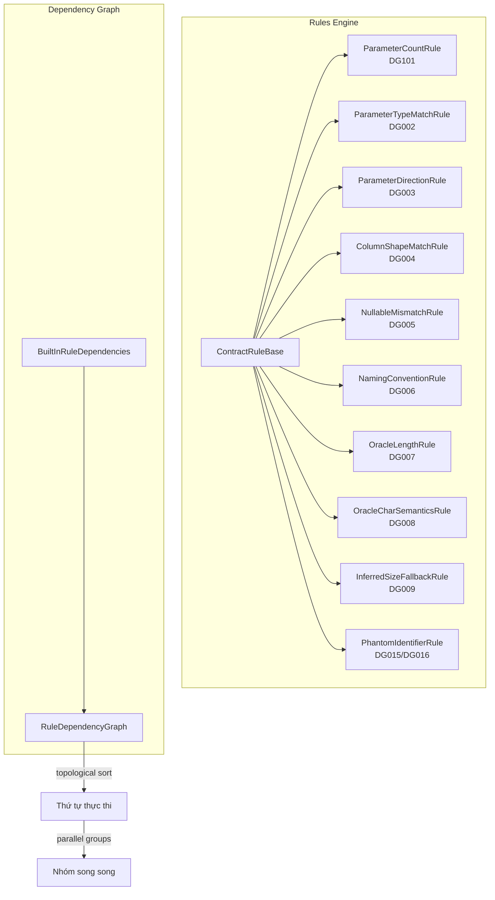
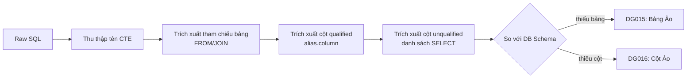
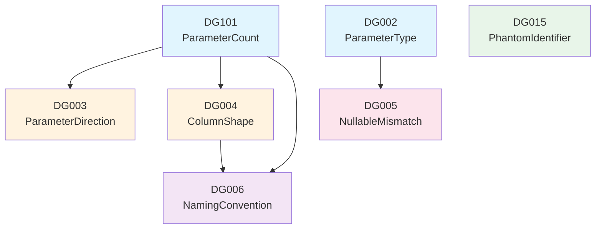

# Rules Engine

> Nguồn: `src/DataGuard.Core/Rules/ContractRules.cs`, `PhantomIdentifierRule.cs`, `RuleDependencyGraph.cs`

Rules engine là trái tim của DataGuard. Nó chứa 11 rules tích hợp (DG001–DG009, DG015–DG016), đồ thị phụ thuộc để tối ưu thứ tự thực thi, và lớp trừu tượng mà mọi rules kế thừa.

## Kiến Trúc



## ContractRuleBase

Lớp trừu tượng cơ sở implement `IContractRule`. Cung cấp template method pattern: `ValidateAsync` công khai ủy quyền cho `ValidateCoreAsync` protected.

```csharp
public abstract class ContractRuleBase : IContractRule
{
    public abstract string RuleId { get; }
    public abstract string Name { get; }
    public abstract DiagnosticSeverity Severity { get; }
    public abstract string Description { get; }

    public virtual async Task<IReadOnlyList<ContractViolation>> ValidateAsync(
        ContractDescriptor contract,
        IReadOnlyList<ContractDescriptor> allContracts,
        CancellationToken cancellationToken = default)
    {
        var violations = new List<ContractViolation>();
        await ValidateCoreAsync(contract, allContracts, violations, cancellationToken);
        return violations;
    }

    protected abstract Task ValidateCoreAsync(
        ContractDescriptor contract,
        IReadOnlyList<ContractDescriptor> allContracts,
        List<ContractViolation> violations,
        CancellationToken cancellationToken);
}
```

Lớp cơ sở cũng cung cấp helper tĩnh `CreateViolation` để tạo violation nhất quán.

## Các Rules Tích Hợp

### DG101 — ParameterCountRule

**Mức độ:** Error
**Phạm vi:** `RawSqlDescriptor`

Kiểm tra rằng các lệnh gọi stored procedure có đúng số lượng tham số. Đối với văn bản SQL bắt đầu bằng `EXEC`/`EXECUTE`, nó đếm các token tham số tiền tố `@` và cảnh báo khi phát hiện 0 tham số.

### DG002 — ParameterTypeMatchRule

**Mức độ:** Error
**Phạm vi:** `RawSqlDescriptor`

Kiểm tra tính tương thích CLR type ↔ database type. Duy trì hai bảng ánh xạ kiểu tĩnh:

| Kiểu CLR | Kiểu SQL Server | Kiểu Oracle |
|----------|----------------|-------------|
| `int` | `int` | `NUMBER`, `INTEGER`, `INT` |
| `string` | `nvarchar`, `varchar`, `nchar`, `char` | `VARCHAR2`, `NVARCHAR2`, `CHAR`, `NCHAR`, `CLOB` |
| `DateTime` | `datetime`, `datetime2`, `date`, `time` | `DATE`, `TIMESTAMP` |
| `decimal` | `decimal`, `numeric`, `money` | `NUMBER`, `DECIMAL`, `NUMERIC` |
| `Guid` | `uniqueidentifier` | `RAW(16)` |
| `byte[]` | `varbinary`, `binary`, `image` | `RAW`, `BLOB` |

Sử dụng khớp token chính xác (không bao giờ substring) để tránh dương tính giả.

### DG003 — ParameterDirectionRule

**Mức độ:** Error
**Phạm vi:** `RawSqlDescriptor`

Cảnh báo khi stored procedure yêu cầu `OUT`/`INOUT`/`ReturnValue` nhưng call site truyền tham số chỉ là `Input`. Chỉ kiểm tra khi `CallSiteDirection` đã biết.

### DG004 — ColumnShapeMatchRule

**Mức độ:** Error
**Phạm vi:** `EntityDescriptor` + `RawSqlDescriptor`

So sánh các cột result set trích xuất từ mệnh đề `SELECT` với các thuộc tính entity. Báo cáo:
- Thiếu cột bắt buộc (thuộc tính entity không tìm thấy trong result set)
- Quá nhiều cột thừa (nhiều cột không ánh xạ hơn một nửa số thuộc tính entity)

### DG005 — NullableMismatchRule

**Mức độ:** Warning
**Phạm vi:** `EntityDescriptor` + `DatabaseSchemaDescriptor`

So sánh annotation nullability của thuộc tính entity với nullability cột database:
- Thuộc tính `[Required]` + cột DB nullable → violation
- Thuộc tính tùy chọn + cột DB `NOT NULL` → violation

### DG006 — NamingConventionRule

**Mức độ:** Info
**Phạm vi:** `EntityDescriptor`

Kiểm tra rằng tên cột database tuân theo quy ước đặt tên mong đợi so với tên thuộc tính C#. Hỗ trợ `SnakeCaseToPascalCase`, `PascalCaseToSnakeCase`, và `ExactMatch`.

### DG007/DG008 — Oracle Length Rules

**Mức độ:** Error/Warning
**Phạm vi:** `DatabaseSchemaDescriptor` + `EntityDescriptor`

Rules đặc thù Oracle kiểm tra length semantics `VARCHAR2`/`NVARCHAR2`:
- DG007: Sai lệch MaxLength giữa annotation entity và cột database
- DG008: Sai lệch semantics CHAR vs BYTE

### DG009 — InferredSizeFallbackRule

**Mức độ:** Warning
**Phạm vi:** `EntityDescriptor`

Cảnh báo các thuộc tính mà `MaxLength` được suy ra từ giá trị mặc định CLR type thay vì được cấu hình rõ ràng — nguồn phổ biến lỗi cắt ngắn khi cột database nhỏ hơn giá trị mặc định.

### DG015/DG016 — PhantomIdentifierRule

**Mức độ:** Error
**Phạm vi:** `RawSqlDescriptor` + `DatabaseSchemaDescriptor`

Phát hiện tham chiếu bảng/cột trong SQL không tồn tại trong schema database — một **chế độ lỗi ảo giác AI** phổ biến khi LLM tạo câu lệnh SQL.



**Chiến lược phát hiện:**
1. Thu thập tên CTE (`WITH X AS (...)`) để loại trừ khỏi kiểm tra phantom
2. Trích xuất tham chiếu bảng từ mệnh đề `FROM`/`JOIN` (loại bỏ schema qualifier)
3. Kiểm tra tham chiếu cột qualified (`alias.column`) với các cột bảng đã biết
4. Kiểm tra cột unqualified trong danh sách `SELECT` với bảng chính

## RuleDependencyGraph

Đồ thị có hướng không chu trình (DAG) xác định thứ tự thực thi rule tối ưu bằng sắp xếp tô-pô.



### Tính Năng Chính

| Tính năng | Mô tả |
|-----------|-------|
| **Sắp xếp tô-pô** | `GetExecutionOrder()` trả về rules theo thứ tự phụ thuộc |
| **Nhóm song song** | `GetParallelGroups()` trả về rules có thể chạy đồng thời tại mỗi cấp |
| **Phát hiện chu trình** | `Validate()` phát hiện phụ thuộc tuần hoàn |
| **Truy vấn bắc cầu** | `GetTransitiveDependents()` / `GetTransitiveDependencies()` cho phân tích tác động |
| **Nút giữ chỗ** | Phụ thuộc vào rules chưa đăng ký tạo nút giữ chỗ |

### BuiltInRuleDependencies

Đồ thị phụ thuộc cấu hình sẵn cho tất cả rules tích hợp:

```csharp
public static RuleDependencyGraph CreateDefault()
{
    var graph = new RuleDependencyGraph();

    // Level 1: Kiểm tra tham số cơ bản (không phụ thuộc)
    graph.AddRule(new ParameterCountRule());        // DG101
    graph.AddRule(new ParameterTypeMatchRule());    // DG002

    // Level 2: Hướng tham số (phụ thuộc vào sự tồn tại tham số)
    graph.AddRule(new ParameterDirectionRule(), "DG101");

    // Level 3: Shape cột (phụ thuộc vào sự tồn tại tham số)
    graph.AddRule(new ColumnShapeMatchRule(), "DG101");

    // Level 4: Nullable và khớp kiểu (phụ thuộc thông tin kiểu tham số)
    graph.AddRule(new NullableMismatchRule(), "DG002");

    // Level 5: Quy ước đặt tên (phụ thuộc tên tham số/cột)
    graph.AddRule(new NamingConventionRule(), "DG101", "DG004");

    // Level 6: Phantom identifiers (schema ground truth)
    graph.AddRule(new PhantomIdentifierRule());

    return graph;
}
```

### Fluent API

```csharp
var graph = new RuleDependencyGraph()
    .AddRule(new ParameterCountRule())
    .AddRule(new ParameterDirectionRule(), "DG101")
    .WithDependency("DG006", "DG101", "DG004");
```

## Bảng Tổng Hợp Rules

| Rule ID | Tên | Mức độ | Phạm vi | Mô tả |
|---------|-----|--------|---------|-------|
| DG101 | Parameter Count Match | Error | RawSql | Số tham số SP phải khớp call site |
| DG002 | Parameter Type Match | Error | RawSql | Kiểu CLR phải khớp kiểu database |
| DG003 | Parameter Direction | Error | RawSql | Hướng phải khớp (IN/OUT/INOUT) |
| DG004 | Column Shape Match | Error | Entity+RawSql | Cột result phải khớp thuộc tính entity |
| DG005 | Nullable Match | Warning | Entity+Schema | Nullability phải khớp giữa DB và entity |
| DG006 | Naming Convention | Info | Entity | Tên cột phải tuân quy ước đặt tên |
| DG007 | Oracle Length | Error | Entity+Schema | Sai lệch MaxLength cho kiểu Oracle |
| DG008 | Oracle Char Semantics | Warning | Entity+Schema | Sai lệch semantics CHAR vs BYTE |
| DG009 | Inferred Size Fallback | Warning | Entity | MaxLength suy ra từ mặc định |
| DG015 | Phantom Table | Error | RawSql+Schema | SQL tham chiếu bảng không tồn tại |
| DG016 | Phantom Column | Error | RawSql+Schema | SQL tham chiếu cột không tồn tại |
