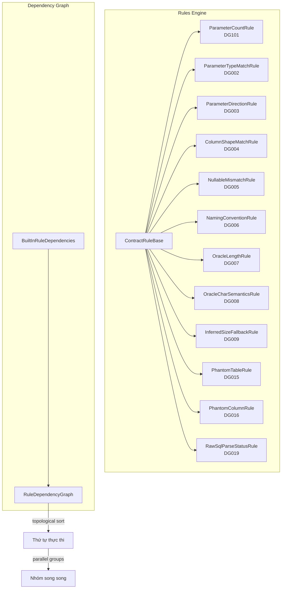
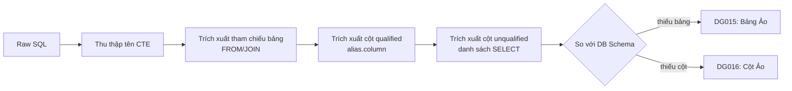
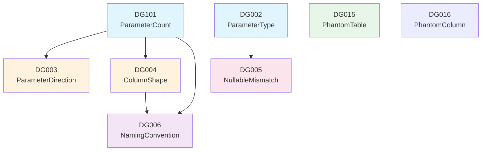

# Rules Engine

> Nguồn: `src/DataGuard.Core/Rules/ContractRules.cs`, `PhantomTableRule.cs`, `PhantomColumnRule.cs`, `Sql/`, `RuleDependencyGraph.cs`

Rules engine là trái tim của DataGuard. Nó chứa 11 rules tích hợp (DG001–DG009, DG015–DG016), đồ thị phụ thuộc để tối ưu thứ tự thực thi, và lớp trừu tượng mà mọi rules kế thừa.

## Kiến Trúc


```mermaid
flowchart TB
    subgraph Rules Engine
        CRB[ContractRuleBase]
        CRB --> PCR[ParameterCountRule<br/>DG101]
        CRB --> PTR[ParameterTypeMatchRule<br/>DG002]
        CRB --> PDR[ParameterDirectionRule<br/>DG003]
        CRB --> CSM[ColumnShapeMatchRule<br/>DG004]
        CRB --> NMR[NullableMismatchRule<br/>DG005]
        CRB --> NCR[NamingConventionRule<br/>DG006]
        CRB --> OLR1[OracleLengthRule<br/>DG007]
        CRB --> OLR2[OracleCharSemanticsRule<br/>DG008]
        CRB --> ISF[InferredSizeFallbackRule<br/>DG009]
        CRB --> PTB[PhantomTableRule<br/>DG015]
        CRB --> PCL[PhantomColumnRule<br/>DG016]
        CRB --> RPS[RawSqlParseStatusRule<br/>DG019]
    end

    subgraph Dependency Graph
        RDG[RuleDependencyGraph]
        BRD[BuiltInRuleDependencies]
        BRD --> RDG
    end

    RDG --> |topological sort| EXEC[Thứ tự thực thi]
    EXEC --> |parallel groups| PAR[Nhóm song song]
```

## ContractRuleBase

Lớp trừu tượng cơ sở implement `IContractRule`. Cung cấp template method pattern: `ValidateAsync` công khai ủy quyền cho `ValidateCoreAsync` protected.

```csharp
public abstract class ContractRuleBase : IContractRule
{
    public abstract string RuleId { get; }
    public abstract string Name { get; }
    public abstract DiagnosticSeverity Severity { get; }
    public abstract string Description { get; }

    public virtual async Task<IReadOnlyList<ContractViolation>> ValidateAsync(
        ContractDescriptor contract,
        IReadOnlyList<ContractDescriptor> allContracts,
        CancellationToken cancellationToken = default)
    {
        var violations = new List<ContractViolation>();
        await ValidateCoreAsync(contract, allContracts, violations, cancellationToken);
        return violations;
    }

    protected abstract Task ValidateCoreAsync(
        ContractDescriptor contract,
        IReadOnlyList<ContractDescriptor> allContracts,
        List<ContractViolation> violations,
        CancellationToken cancellationToken);
}
```

Lớp cơ sở cũng cung cấp helper tĩnh `CreateViolation` để tạo violation nhất quán.

## Các Rules Tích Hợp

### DG101 — ParameterCountRule

**Mức độ:** Error
**Phạm vi:** `RawSqlDescriptor`

Kiểm tra rằng các lệnh gọi stored procedure có đúng số lượng tham số. Đối với văn bản SQL bắt đầu bằng `EXEC`/`EXECUTE`, nó đếm các token tham số tiền tố `@` và cảnh báo khi phát hiện 0 tham số.

**Xử lý Stored Procedure:**
- Khi một descriptor đại diện cho lệnh gọi stored procedure rõ ràng (`RawSqlDescriptor.IsStoredProcedure == true`), các tham số được truyền qua đối tượng riêng (out-of-band, vd: qua Dapper parameters hoặc `DbParameterCollection` trong ADO.NET) thay vì các inline token `@`.
- `DG101` được chủ động bỏ qua (suppressed) đối với các descriptor có `IsStoredProcedure == true` nhằm loại trừ cảnh báo sai (false positive).
### DG002 — ParameterTypeMatchRule

**Mức độ:** Error
**Phạm vi:** `RawSqlDescriptor`

Kiểm tra tính tương thích CLR type ↔ database type. Duy trì hai bảng ánh xạ kiểu tĩnh:

| Kiểu CLR | Kiểu SQL Server | Kiểu Oracle |
|----------|----------------|-------------|
| `int` | `int` | `NUMBER`, `INTEGER`, `INT` |
| `string` | `nvarchar`, `varchar`, `nchar`, `char` | `VARCHAR2`, `NVARCHAR2`, `CHAR`, `NCHAR`, `CLOB` |
| `DateTime` | `datetime`, `datetime2`, `date`, `time` | `DATE`, `TIMESTAMP` |
| `decimal` | `decimal`, `numeric`, `money` | `NUMBER`, `DECIMAL`, `NUMERIC` |
| `Guid` | `uniqueidentifier` | `RAW(16)` |
| `byte[]` | `varbinary`, `binary`, `image` | `RAW`, `BLOB` |

Sử dụng khớp token chính xác (không bao giờ substring) để tránh dương tính giả.

### DG003 — ParameterDirectionRule

**Mức độ:** Error
**Phạm vi:** `RawSqlDescriptor`

Cảnh báo khi stored procedure yêu cầu `OUT`/`INOUT`/`ReturnValue` nhưng call site truyền tham số chỉ là `Input`. Chỉ kiểm tra khi `CallSiteDirection` đã biết.

### DG004 — ColumnShapeMatchRule

**Mức độ:** Error
**Phạm vi:** `EntityDescriptor` + `RawSqlDescriptor`

So sánh các cột result set trích xuất từ mệnh đề `SELECT` với các thuộc tính entity. Báo cáo:
- Thiếu cột bắt buộc (thuộc tính entity không tìm thấy trong result set)
- Quá nhiều cột thừa (nhiều cột không ánh xạ hơn một nửa số thuộc tính entity)

### DG005 — NullableMismatchRule

**Mức độ:** Warning
**Phạm vi:** `EntityDescriptor` + `DatabaseSchemaDescriptor`

So sánh `PropertyDescriptor.IsNullable` (annotation `Required` ép thành non-nullable) với nullability của cột được resolve theo `(entity.TableName, property.ColumnName)`. Tên entity dạng `SCHEMA.TABLE` được resolve theo key đầy đủ trước, sau đó theo tên trần; tên trần trùng ở nhiều schema, bảng hoặc cột không tồn tại thì không có finding. Không bao giờ gộp cột giữa các bảng. Cả hai chiều là Warning với message riêng và `Properties` `{entity, property, table, column}`:
- Thuộc tính non-nullable + cột DB nullable → violation (đọc NULL lỗi lúc runtime)
- Thuộc tính nullable + cột DB `NOT NULL` → violation (ghi null lỗi constraint)

### DG006 — NamingConventionRule

**Mức độ:** Info
**Phạm vi:** `EntityDescriptor`

Kiểm tra rằng tên cột database tuân theo quy ước đặt tên mong đợi so với tên thuộc tính C#. Hỗ trợ `SnakeCaseToPascalCase`, `PascalCaseToSnakeCase`, và `ExactMatch`.

### DG007/DG008 — Oracle Length Rules

**Mức độ:** Error/Warning
**Phạm vi:** `DatabaseSchemaDescriptor` + `EntityDescriptor`

Rules đặc thù Oracle kiểm tra length semantics `VARCHAR2`/`NVARCHAR2`:
- DG007: Sai lệch MaxLength giữa annotation entity và cột database
- DG008: Sai lệch semantics CHAR vs BYTE

### DG009 — InferredSizeFallbackRule

**Mức độ:** Warning
**Phạm vi:** `EntityDescriptor`

Cảnh báo các thuộc tính mà `MaxLength` được suy ra từ giá trị mặc định CLR type thay vì được cấu hình rõ ràng — nguồn phổ biến lỗi cắt ngắn khi cột database nhỏ hơn giá trị mặc định.

### DG015 — PhantomTableRule / DG016 — PhantomColumnRule

**Mức độ:** Error
**Phạm vi:** `RawSqlDescriptor` + `DatabaseSchemaDescriptor`
**Nguồn:** `PhantomTableRule.cs`, `PhantomColumnRule.cs`, hợp đồng analyzer `Sql/IPhantomReferenceAnalyzer.cs`, analyzer tokenizer mặc định `Sql/PhantomSqlAnalyzer.cs` (tokenizer `Sql/SqlTokenizer.cs`, tra cứu catalog `Sql/SchemaTableIndex.cs`, tên `Sql/SqlIdentifier.cs`); analyzer AST cho SQL Server `src/DataGuard.SqlServer.Adapter/TSqlPhantomAnalyzer.cs` + `TSqlPhantomScopeVisitor.cs`

Phát hiện tham chiếu bảng/cột trong SQL không tồn tại trong schema database — một **chế độ lỗi ảo giác AI** phổ biến khi LLM tạo câu lệnh SQL. Hai ID là hai rule riêng, nên `--skip-rules DG015` hoặc `--skip-rules DG016` tắt đúng một loại finding. Lỗi parse raw SQL là rule khác, **DG019** (`RawSqlParseStatusRule`): với `sqlserver` rule parse từng contract raw SQL (không gồm lời gọi stored procedure) bằng `TSqlStatementParser` (ScriptDOM) của adapter SQL Server (điểm nối Core `Sql/ISqlStatementParser.cs`, được `ProviderRuleCatalog` inject); provider khác chỉ báo trạng thái parse đặt lúc thu thập.


```mermaid
flowchart LR
    SQL[Raw SQL] --> CTE[Thu thập tên CTE]
    CTE --> TREF[Trích xuất tham chiếu bảng<br/>FROM/JOIN]
    TREF --> QCOL[Trích xuất cột qualified<br/>alias.column]
    QCOL --> UCOL[Trích xuất cột unqualified<br/>danh sách SELECT]
    UCOL --> CHECK{So với DB Schema}
    CHECK --> |thiếu bảng| DG015[DG015: Bảng Ảo]
    CHECK --> |thiếu cột| DG016[DG016: Cột Ảo]
```

**Chiến lược phát hiện (dựa trên token, không regex):**
1. Tokenize với comment (`--`, `/* */`) và string literal bị che, nên `FROM`/identifier bên trong không bao giờ được quét
2. Đánh index bảng catalog theo cả `(schema, name)` và `name` trần (key catalog như `dbo.Orders` được tách bằng `SchemaObjectName.Parse`); tham chiếu được resolve theo key đầy đủ trước, sau đó theo tên trần
3. Thu thập mọi tên CTE của `WITH [RECURSIVE] a AS (...), b AS (...)`
4. Trích xuất tham chiếu bảng từ `FROM`/`JOIN`, bỏ qua `FROM` trong `EXTRACT(`, `TRIM(`, `SUBSTRING(`, `OVERLAY(` và `IS [NOT] DISTINCT FROM`
5. Coi là không xác định (không bao giờ phantom, không kiểm tra cột): CTE, derived table, table-valued function (`name(`), `#temp`, biến `@table`, tên ba phần cross-database, `table@dblink`, `DUAL`, `sys.*`, `INFORMATION_SCHEMA.*`, `pg_catalog.*`
6. Kiểm tra `alias.column` qualified với tham chiếu bảng gần nhất trong scope (subquery trong cùng trước, nên alias dùng lại trong subquery resolve về bảng của subquery)
7. Kiểm tra các item một identifier của từng danh sách `SELECT` (tách theo ngoặc) với hợp cột của mọi bảng mà `SELECT` đó tham chiếu; `AS alias` và alias ngầm phía sau là tên output, không bao giờ là tham chiếu cột

Cả hai rule nhận `IPhantomReferenceAnalyzer` tùy chọn (mặc định: tokenizer ở trên); một kết quả cho mỗi raw SQL contract được cache và dùng chung cho DG015 và DG016. `ProviderRuleCatalog` truyền `TSqlPhantomAnalyzer` cho `--provider sqlserver`; mọi provider khác giữ tokenizer (parse AST cho dialect không phải T-SQL nằm ngoài phạm vi).

**SQL Server (`TSqlPhantomAnalyzer`, ScriptDOM `TSql160Parser`, bật quoted identifier):**
1. Placeholder phía client không phải T-SQL (`:name`, `{0}`, `?`) được đổi thành biến `@` ngoài literal/comment; còn lỗi parse ⇒ `ParseFailed`, không DG015/DG016 (DG019 báo lỗi parse)
2. Một scope cho mỗi query specification và mỗi câu DML. Bảng gốc: `NamedTableReference` và đích DML (`INSERT INTO t`, `UPDATE t`, `DELETE FROM t`, `MERGE INTO t`; `UPDATE o … FROM dbo.Orders o` resolve `o` về nguồn trong FROM). Tên không qualified mặc định schema `dbo`; tra cứu theo `(schema, name)` rồi tên trần như tokenizer
3. Nguồn mờ (không bao giờ báo; không kiểm tra cột): tên CTE trong `WITH` của câu lệnh (kể cả trong thân CTE đệ quy), derived table và bảng `VALUES`, TVF (`dbo.fn_X(@id)`, `STRING_SPLIT`), `OPENJSON`/`OPENROWSET`/`OPENQUERY`, output của `PIVOT`/`UNPIVOT`, `#temp`/`##temp`, biến `@table`, tên ba/bốn phần, `sys.*`, `INFORMATION_SCHEMA.*`, view cũ kiểu `sysobjects`. Synonym và view được kiểm tra như bảng trừ khi catalog chứa chúng
4. `alias.column` / `schema.table.column` resolve qua chuỗi scope, trong cùng trước; qualifier không biết (`inserted`, `deleted`) được bỏ qua
5. Cột không qualified: bỏ qua khi bất kỳ scope có nguồn nào trên chuỗi chứa nguồn mờ; ngược lại tìm trong bảng của scope trong cùng (hợp cột khi JOIN) hoặc scope ngoài (subquery tương quan), không thấy thì báo theo bảng của scope trong cùng. Alias output (`AS x`, `x = expr`, alias không `AS`), `SELECT *`/`o.*`, đối số date-part và `ORDER BY` của `UNION` không bao giờ là tham chiếu cột

## RuleDependencyGraph

Đồ thị có hướng không chu trình (DAG) xác định thứ tự thực thi rule tối ưu bằng sắp xếp tô-pô.


```mermaid
graph TD
    DG101[DG101<br/>ParameterCount] --> DG003[DG003<br/>ParameterDirection]
    DG101 --> DG004[DG004<br/>ColumnShape]
    DG002[DG002<br/>ParameterType] --> DG005[DG005<br/>NullableMismatch]
    DG101 --> DG006[DG006<br/>NamingConvention]
    DG004 --> DG006
    DG015[DG015<br/>PhantomTable]
    DG016[DG016<br/>PhantomColumn]

    style DG101 fill:#e1f5fe
    style DG002 fill:#e1f5fe
    style DG003 fill:#fff3e0
    style DG004 fill:#fff3e0
    style DG005 fill:#fce4ec
    style DG006 fill:#f3e5f5
    style DG015 fill:#e8f5e9
```

### Tính Năng Chính

| Tính năng | Mô tả |
|-----------|-------|
| **Sắp xếp tô-pô** | `GetExecutionOrder()` trả về rules theo thứ tự phụ thuộc |
| **Nhóm song song** | `GetParallelGroups()` trả về rules có thể chạy đồng thời tại mỗi cấp |
| **Phát hiện chu trình** | `Validate()` phát hiện phụ thuộc tuần hoàn |
| **Truy vấn bắc cầu** | `GetTransitiveDependents()` / `GetTransitiveDependencies()` cho phân tích tác động |
| **Nút giữ chỗ** | Phụ thuộc vào rules chưa đăng ký tạo nút giữ chỗ |

### BuiltInRuleDependencies

Đồ thị phụ thuộc cấu hình sẵn cho tất cả rules tích hợp:

```csharp
public static RuleDependencyGraph CreateDefault()
{
    var graph = new RuleDependencyGraph();

    // Level 1: Kiểm tra tham số cơ bản (không phụ thuộc)
    graph.AddRule(new ParameterCountRule());        // DG101
    graph.AddRule(new ParameterTypeMatchRule());    // DG002

    // Level 2: Hướng tham số (phụ thuộc vào sự tồn tại tham số)
    graph.AddRule(new ParameterDirectionRule(), "DG101");

    // Level 3: Shape cột (phụ thuộc vào sự tồn tại tham số)
    graph.AddRule(new ColumnShapeMatchRule(), "DG101");

    // Level 4: Nullable và khớp kiểu (phụ thuộc thông tin kiểu tham số)
    graph.AddRule(new NullableMismatchRule(), "DG002");

    // Level 5: Quy ước đặt tên (phụ thuộc tên tham số/cột)
    graph.AddRule(new NamingConventionRule(), "DG101", "DG004");

    // Level 6: Phantom identifiers (schema ground truth)
    graph.AddRule(new PhantomTableRule());       // DG015
    graph.AddRule(new PhantomColumnRule());      // DG016
    graph.AddRule(new RawSqlParseStatusRule());  // DG019
    graph.AddRule(new SelectStarUsageRule());    // DG017

    return graph;
}
```

### Fluent API

```csharp
var graph = new RuleDependencyGraph()
    .AddRule(new ParameterCountRule())
    .AddRule(new ParameterDirectionRule(), "DG101")
    .WithDependency("DG006", "DG101", "DG004");
```

## Bảng Tổng Hợp Rules

| Rule ID | Tên | Mức độ | Phạm vi | Mô tả |
|---------|-----|--------|---------|-------|
| DG101 | Parameter Count Match | Error | RawSql | Số tham số SP phải khớp call site |
| DG002 | Parameter Type Match | Error | RawSql | Kiểu CLR phải khớp kiểu database |
| DG003 | Parameter Direction | Error | RawSql | Hướng phải khớp (IN/OUT/INOUT) |
| DG004 | Column Shape Match | Error | Entity+RawSql | Cột result phải khớp thuộc tính entity |
| DG005 | Nullable Match | Warning | Entity+Schema | Nullability phải khớp giữa DB và entity |
| DG006 | Naming Convention | Info | Entity | Tên cột phải tuân quy ước đặt tên |
| DG007 | Oracle Length | Error | Entity+Schema | Sai lệch MaxLength cho kiểu Oracle |
| DG008 | Oracle Char Semantics | Warning | Entity+Schema | Sai lệch semantics CHAR vs BYTE |
| DG009 | Inferred Size Fallback | Warning | Entity | MaxLength suy ra từ mặc định |
| DG015 | Phantom Table | Error | RawSql+Schema | SQL tham chiếu bảng không tồn tại |
| DG016 | Phantom Column | Error | RawSql+Schema | SQL tham chiếu cột không tồn tại |
