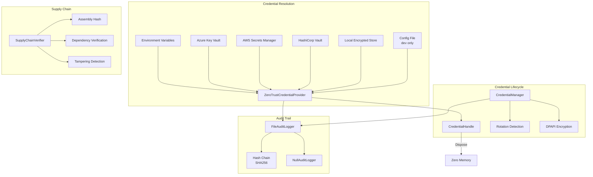
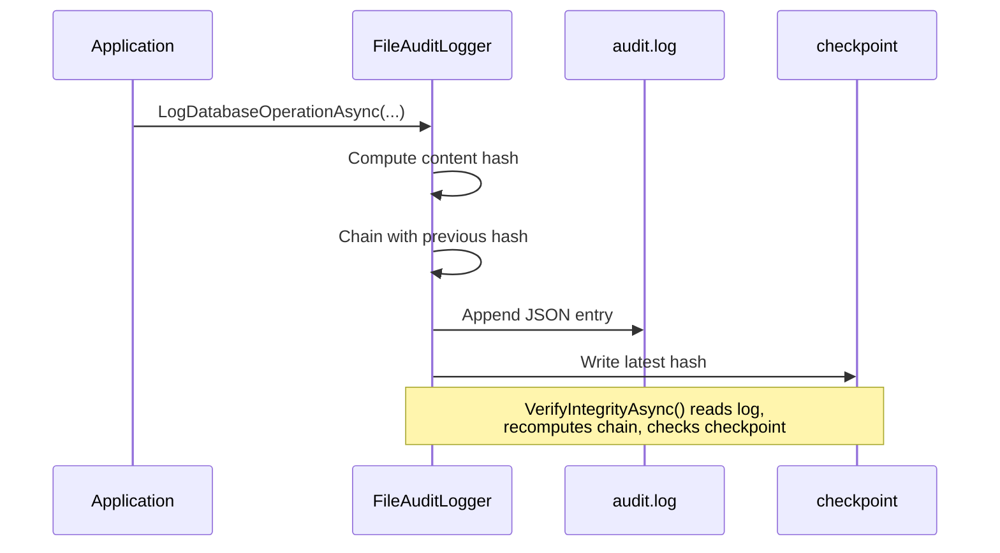
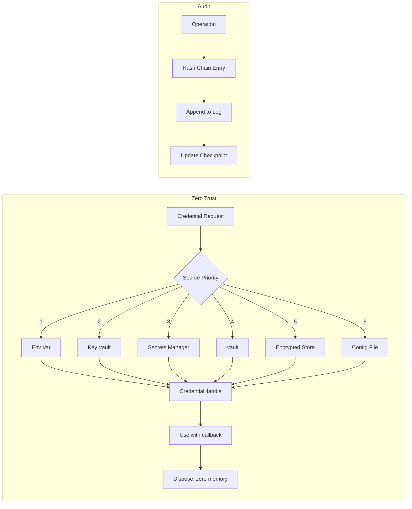

# Security Subsystem

> Source: `src/DataGuard.Core/Security/ZeroTrustCredentialProvider.cs`, `CredentialManager.cs`, `IAuditLogger.cs`, `SupplyChainVerifier.cs`

The security subsystem implements zero-trust credential handling, hash-chain audit logging, and supply chain integrity verification. Every component follows the principle: **never log or serialize secrets, minimize secret lifetime with best-effort clearing, and fail closed by default**. Managed runtimes cannot promise that a secret never appears in a memory dump; callers must treat process-memory access as privileged.

`EncryptConnectionStringAtRest` uses Windows DPAPI on Windows, the login Keychain on macOS, and Linux Secret Service through `secret-tool` on Linux. The Keychain bridge calls Security.framework directly; the Linux bridge supplies a secret on standard input, so neither puts it in command-line arguments. Linux helper output is bounded (1 MiB for the secret and 16 KiB for errors) and operations time out after 10 seconds. If the platform backend or Secret Service is unavailable, an encrypted write fails before any file is written and protected references fail closed. DataGuard never writes plaintext while marking it encrypted. Plaintext storage remains an explicit choice (`EncryptConnectionStringAtRest: false`).
The additive `ICredentialSecretStore` contract allows platform-gated fakes in tests; production selection remains OS-specific and an unavailable implementation throws before persistence.

## Security Flow



## ZeroTrustCredentialProvider

Resolves credentials from multiple secure sources in priority order. Never exposes secrets in logs or serialization.

```csharp
public sealed class ZeroTrustCredentialProvider : ICredentialProvider
{
    public async Task<CredentialHandle> GetCredentialAsync(
        string credentialName,
        CredentialType type,
        CancellationToken cancellationToken = default)
    {
        // Audit log the access (hash only, never the value)
        await _auditLogger.LogCredentialAccessAsync(...);
        var value = await ResolveCredentialAsync(credentialName, type, cancellationToken);
        handle.SetValue(value);
        return handle;
    }
}
```

### Resolution Priority

| Priority | Source | Configuration | Notes |
|----------|--------|---------------|-------|
| 1 | Environment variable | `DATAGUARD_{NAME}` | Highest — CI/CD injection |
| 2 | Azure Key Vault | `KeyVaultUri` | Uses managed identity (IMDS) |
| 3 | AWS Secrets Manager | `AwsRegion` | Uses AWS SDK |
| 4 | HashiCorp Vault | `VaultAddress` | Uses `VAULT_TOKEN` env var |
| 5 | Local encrypted store | Auto-detected | DPAPI on Windows; login Keychain on macOS; Secret Service via `secret-tool` on Linux; unavailable backends fail closed |
| 6 | Config file | `AllowPlaintextConfigFallback` | Dev only, fail-closed by default |

### Azure Key Vault Integration

Uses Azure Managed Identity via IMDS endpoint (`169.254.169.254`):
1. Request OAuth2 token from IMDS
2. Call Key Vault REST API (`GET secrets/{name}?api-version=7.4`)
3. Extract `value` from response

### AWS Secrets Manager Integration

Uses `AmazonSecretsManagerClient` with region from configuration:
```csharp
using var client = new AmazonSecretsManagerClient(
    RegionEndpoint.GetBySystemName(_config.AwsRegion!));
var response = await client.GetSecretValueAsync(
    new GetSecretValueRequest { SecretId = credentialName });
```

### HashiCorp Vault Integration

Uses `VAULT_TOKEN` environment variable and HTTPS-only endpoints:
```csharp
var url = $"{_config.VaultAddress}/v1/secret/data/{credentialName}";
request.Headers.Add("X-Vault-Token", token);
```

## CredentialHandle

Secure handle that reduces accidental credential exposure. Implements `IDisposable` with best-effort memory clearing; it is not a guarantee against process memory dumps or immutable-string copies.

```csharp
public sealed class CredentialHandle : IDisposable
{
    private char[]? _value;

    // Execute action with credential without exposing it
    public T Use<T>(Func<char[], T> action) { ... }

    // Get as string (use with caution)
    public string GetString() { ... }

    public void Dispose()
    {
        // Zero out the credential in memory
        Array.Clear(_value, 0, _value.Length);
        _value = null;
    }
}
```

**Key security properties:**
- Value stored as `char[]` (can be zeroed), not `string` (immutable in .NET)
- `Use<T>()` method allows controlled access without string conversion
- `Dispose()` zeros memory and suppresses finalizer
- Finalizer as safety net if `Dispose()` is not called

## CredentialManager

Manages credential lifecycle with rotation detection and encryption at rest.

The file-backed store rejects symbolic-link/reparse-point files and ancestors (while
allowing the operating system's fixed temporary-root alias), caps reads and records
at 1 MiB, and publishes through a same-directory flushed temporary file with
owner-only Unix permissions. A final path check immediately before replacement
documents the remaining check-to-open race boundary.

```csharp
public sealed class CredentialManager
{
    public async Task<string> GetConnectionStringAsync(CancellationToken ct = default)
    {
        // Environment variables win over config-file values
        var connectionString = Environment.GetEnvironmentVariable("DATAGUARD_CONNECTION_STRING")
            ?? _config.ConnectionString
            ?? stored?.ConnectionString;

        // Check for credential rotation
        if (_config.EnableCredentialRotationDetection)
            await CheckCredentialRotationAsync(connectionString, ct);

        // Decrypt if encrypted (Windows DPAPI)
        if (_config.EncryptConnectionStringAtRest && IsEncrypted(connectionString))
            connectionString = DecryptConnectionString(connectionString);
    }
}
```

### Rotation Detection

Compares current connection string hash against stored hash:
```csharp
if (stored!.ConnectionString != currentConnectionString)
{
    // Warning: credential rotation detected
    // Old hash vs new hash logged to audit
}
```

### Encryption at Rest

Windows-only DPAPI encryption with `ProtectedData`:
- Encrypt: `ProtectedData.Protect(data, entropy, DataProtectionScope.CurrentUser)`
- Decrypt: `ProtectedData.Unprotect(encrypted, entropy, DataProtectionScope.CurrentUser)`
- Prefix: `"ENC:" + base64(encrypted_bytes)`
- Entropy: `"DataGuard.Credential.Protection"` (constant)

## Audit Logging

### IAuditLogger Interface

```csharp
public interface IAuditLogger
{
    Task LogDatabaseOperationAsync(string operation, string provider,
        string connectionStringHash, string details, bool success,
        string? errorMessage = null, CancellationToken ct = default);

    Task LogCredentialAccessAsync(string operation, string provider,
        string connectionStringHash, CancellationToken ct = default);

    Task LogConfigurationChangeAsync(string setting, string? oldValue,
        string? newValue, CancellationToken ct = default);
}
```

### FileAuditLogger

Hash-chain audit log with SHA256 integrity verification.



**Hash chain construction:**
```csharp
var content = Serialize(entry with { Hash = null, PreviousHash = null });
var hash = ComputeHash((previousHash ?? "") + content);
var chained = entry with { Hash = hash, PreviousHash = previousHash };
```

**Integrity verification** (`VerifyIntegrityAsync`):
1. Read all log lines
2. Recompute hash chain from scratch
3. Compare each entry's hash against expected
4. Verify checkpoint matches last hash (detects tail truncation)

### NullAuditLogger

No-op implementation when audit logging is disabled. All methods return `Task.CompletedTask`.

### Sensitive Value Masking

`MaskValue()` redacts sensitive values in configuration change logs:
- Short values (≤8 chars): `"****"`
- Long values: `"abcd****wxyz"` (first 4 + last 4)

## SupplyChainVerifier

Verifies supply chain integrity following SLSA principles.

```csharp
public sealed class SupplyChainVerifier
{
    public async Task<SupplyChainVerificationResult> VerifyAsync(
        string? expectedHashFile = null,
        CancellationToken cancellationToken = default)
    {
        // 1. Assembly integrity (fail closed without anchor)
        // 2. Dependency provenance verification (unverified without signed evidence)
        // 3. Expected hash file comparison
        // 4. Tampering indicators
    }
}
```

### Verification Checks

| Check | Description | Fail Behavior |
|-------|-------------|---------------|
| AssemblyIntegrity | SHA256 hash of assembly file | Fail closed without anchor |
| ExpectedHashMatch | Compare against SLSA provenance file | Fail if file missing |
| Dependency_X | Each referenced assembly requires signed provenance evidence | Fail closed when provenance is unavailable |
| StrongNameSigning | Check for strong name (informational) | Always passes |
| DebugSymbols | Detect debug builds via `IsJITTrackingEnabled` | Warn in release |

Assembly-name prefixes are not trust evidence. The built-in verifier reports every
referenced dependency as unverified until an independent signed provenance/SBOM
verifier supplies artifact-bound evidence. This deliberately fails closed rather
than treating a familiar namespace as a trusted origin.

### Security Flow Diagram



## Configuration

Security settings in `DataGuardConfiguration`:

| Setting | Default | Description |
|---------|---------|-------------|
| `EnableCredentialRotationDetection` | `true` | Detect connection string changes |
| `CredentialRotationWarningDays` | `30` | Days before rotation warning |
| `EncryptConnectionStringAtRest` | `false` | DPAPI (Windows), Keychain (macOS), or Secret Service (Linux when available) |
| `KeyVaultUri` | `null` | Azure Key Vault URI |
| `AwsRegion` | `null` | AWS region for Secrets Manager |
| `VaultAddress` | `null` | HashiCorp Vault address |
| `EnableAuditLogging` | `true` | Enable hash-chain audit log |
| `AuditLogPath` | `null` | Custom audit log path |
| `AllowPlaintextConfigFallback` | `false` | Allow config file credentials (dev only) |
