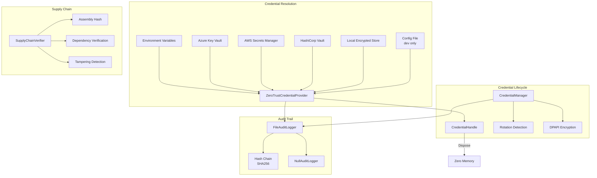
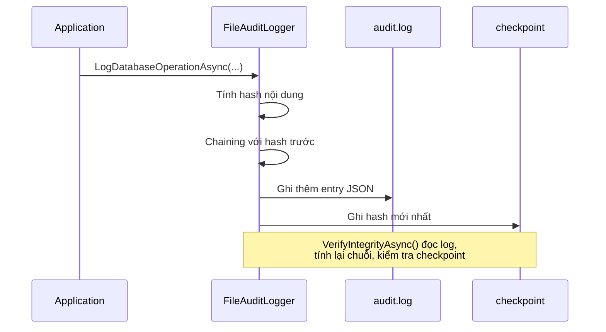
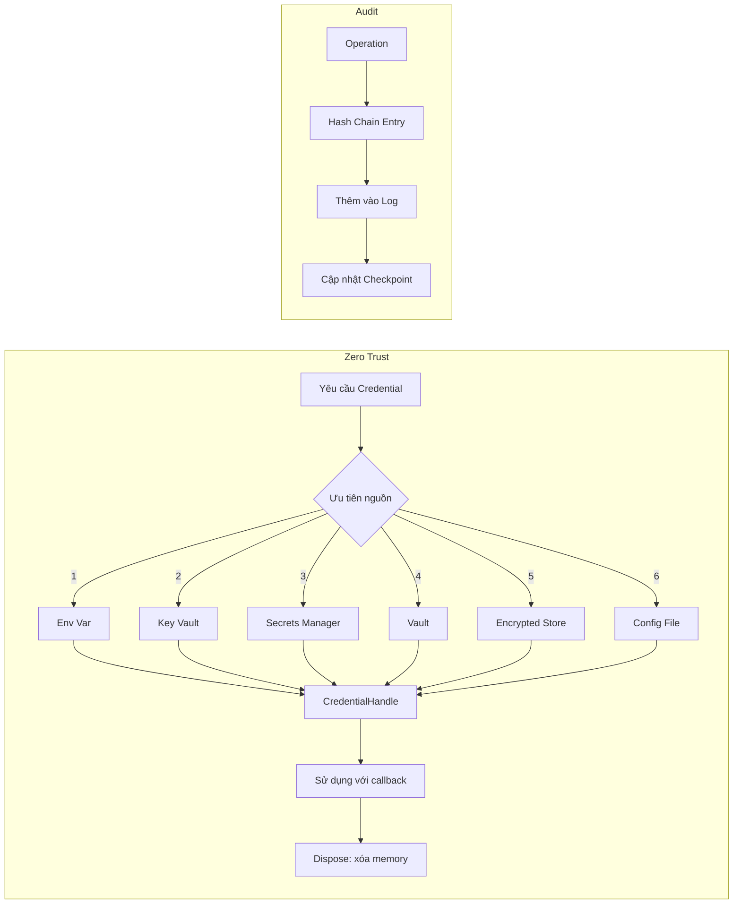

# Hệ Thống Bảo Mật

> Nguồn: `src/DataGuard.Core/Security/ZeroTrustCredentialProvider.cs`, `CredentialManager.cs`, `IAuditLogger.cs`, `SupplyChainVerifier.cs`

Hệ thống bảo mật triển khai xử lý credential zero-trust, audit logging chuỗi hash, và xác minh toàn vẹn chuỗi cung ứng. Mọi thành phần tuân theo nguyên tắc: **không bao giờ log secrets, không bao giờ lộ credentials trong memory dump, mặc định đóng khi lỗi**.

## Luồng Bảo Mật



## ZeroTrustCredentialProvider

Giải quyết credentials từ nhiều nguồn bảo mật theo thứ tự ưu tiên. Không bao giờ lộ secrets trong log hoặc serialization.

```csharp
public sealed class ZeroTrustCredentialProvider : ICredentialProvider
{
    public async Task<CredentialHandle> GetCredentialAsync(
        string credentialName,
        CredentialType type,
        CancellationToken cancellationToken = default)
    {
        // Ghi log audit (chỉ hash, không bao giờ giá trị)
        await _auditLogger.LogCredentialAccessAsync(...);
        var value = await ResolveCredentialAsync(credentialName, type, cancellationToken);
        handle.SetValue(value);
        return handle;
    }
}
```

### Thứ Tự Giải Quyết

| Ưu tiên | Nguồn | Cấu hình | Ghi chú |
|---------|-------|----------|---------|
| 1 | Environment variable | `DATAGUARD_{NAME}` | Cao nhất — CI/CD injection |
| 2 | Azure Key Vault | `KeyVaultUri` | Sử dụng managed identity (IMDS) |
| 3 | AWS Secrets Manager | `AwsRegion` | Sử dụng AWS SDK |
| 4 | HashiCorp Vault | `VaultAddress` | Sử dụng env var `VAULT_TOKEN` |
| 5 | Local encrypted store | Tự phát hiện | DPAPI trên Windows |
| 6 | Config file | `AllowPlaintextConfigFallback` | Chỉ dev, mặc định đóng khi lỗi |

### Tích Hợp Azure Key Vault

Sử dụng Azure Managed Identity qua endpoint IMDS (`169.254.169.254`):
1. Yêu cầu OAuth2 token từ IMDS
2. Gọi Key Vault REST API (`GET secrets/{name}?api-version=7.4`)
3. Trích xuất `value` từ response

### Tích Hợp AWS Secrets Manager

Sử dụng `AmazonSecretsManagerClient` với region từ cấu hình:
```csharp
using var client = new AmazonSecretsManagerClient(
    RegionEndpoint.GetBySystemName(_config.AwsRegion!));
var response = await client.GetSecretValueAsync(
    new GetSecretValueRequest { SecretId = credentialName });
```

### Tích Hợp HashiCorp Vault

Sử dụng environment variable `VAULT_TOKEN` và endpoint chỉ HTTPS:
```csharp
var url = $"{_config.VaultAddress}/v1/secret/data/{credentialName}";
request.Headers.Add("X-Vault-Token", token);
```

## CredentialHandle

Handle bảo mật ngăn chặn lộ credential vô ý. Implement `IDisposable` với memory zeroing.

```csharp
public sealed class CredentialHandle : IDisposable
{
    private char[]? _value;

    // Thực thi action với credential mà không lộ nó
    public T Use<T>(Func<char[], T> action) { ... }

    // Lấy dưới dạng string (sử dụng thận trọng)
    public string GetString() { ... }

    public void Dispose()
    {
        // Xóa credential trong memory
        Array.Clear(_value, 0, _value.Length);
        _value = null;
    }
}
```

**Thuộc tính bảo mật chính:**
- Giá trị lưu dưới dạng `char[]` (có thể xóa), không phải `string` (bất biến trong .NET)
- Phương thức `Use<T>()` cho phép truy cập có kiểm soát mà không chuyển đổi string
- `Dispose()` xóa memory và suppress finalizer
- Finalizer làm biện pháp an toàn nếu `Dispose()` không được gọi

## CredentialManager

Quản lý vòng đời credential với phát hiện rotation và mã hóa khi lưu trữ.

```csharp
public sealed class CredentialManager
{
    public async Task<string> GetConnectionStringAsync(CancellationToken ct = default)
    {
        // Environment variables ưu tiên hơn config-file values
        var connectionString = Environment.GetEnvironmentVariable("DATAGUARD_CONNECTION_STRING")
            ?? _config.ConnectionString
            ?? stored?.ConnectionString;

        // Kiểm tra credential rotation
        if (_config.EnableCredentialRotationDetection)
            await CheckCredentialRotationAsync(connectionString, ct);

        // Giải mã nếu đã mã hóa (Windows DPAPI)
        if (_config.EncryptConnectionStringAtRest && IsEncrypted(connectionString))
            connectionString = DecryptConnectionString(connectionString);
    }
}
```

### Phát Hiện Rotation

So sánh hash connection string hiện tại với hash đã lưu:
```csharp
if (stored!.ConnectionString != currentConnectionString)
{
    // Cảnh báo: phát hiện credential rotation
    // Hash cũ vs hash mới được ghi vào audit
}
```

### Mã Hóa Khi Lưu Trữ

Mã hóa DPAPI chỉ Windows với `ProtectedData`:
- Mã hóa: `ProtectedData.Protect(data, entropy, DataProtectionScope.CurrentUser)`
- Giải mã: `ProtectedData.Unprotect(encrypted, entropy, DataProtectionScope.CurrentUser)`
- Tiền tố: `"ENC:" + base64(encrypted_bytes)`
- Entropy: `"DataGuard.Credential.Protection"` (hằng số)

## Audit Logging

### Interface IAuditLogger

```csharp
public interface IAuditLogger
{
    Task LogDatabaseOperationAsync(string operation, string provider,
        string connectionStringHash, string details, bool success,
        string? errorMessage = null, CancellationToken ct = default);

    Task LogCredentialAccessAsync(string operation, string provider,
        string connectionStringHash, CancellationToken ct = default);

    Task LogConfigurationChangeAsync(string setting, string? oldValue,
        string? newValue, CancellationToken ct = default);
}
```

### FileAuditLogger

Audit log chuỗi hash với xác minh toàn vẹn SHA256.



**Tạo chuỗi hash:**
```csharp
var content = Serialize(entry with { Hash = null, PreviousHash = null });
var hash = ComputeHash((previousHash ?? "") + content);
var chained = entry with { Hash = hash, PreviousHash = previousHash };
```

**Xác minh toàn vẹn** (`VerifyIntegrityAsync`):
1. Đọc tất cả dòng log
2. Tính lại chuỗi hash từ đầu
3. So sánh hash mỗi entry với giá trị mong đợi
4. Xác minh checkpoint khớp hash cuối (phát hiện cắt đuôi)

### NullAuditLogger

Triển khai no-op khi audit logging bị tắt. Tất cả methods trả về `Task.CompletedTask`.

### Che Giá Trị Nhạy Cảm

`MaskValue()` che giá trị nhạy cảm trong log thay đổi cấu hình:
- Giá trị ngắn (≤8 ký tự): `"****"`
- Giá trị dài: `"abcd****wxyz"` (4 đầu + 4 cuối)

## SupplyChainVerifier

Xác minh toàn vẹn chuỗi cung ứng theo nguyên tắc SLSA.

```csharp
public sealed class SupplyChainVerifier
{
    public async Task<SupplyChainVerificationResult> VerifyAsync(
        string? expectedHashFile = null,
        CancellationToken cancellationToken = default)
    {
        // 1. Toàn vẹn assembly (đóng khi lỗi nếu không có anchor)
        // 2. Xác minh dependencies (danh sách tiền tố tin cậy)
        // 3. So sánh file hash mong đợi
        // 4. Chỉ báo giả mạo
    }
}
```

### Các Kiểm Tra Xác Minh

| Kiểm tra | Mô tả | Hành vi khi lỗi |
|----------|-------|-----------------|
| AssemblyIntegrity | Hash SHA256 của file assembly | Đóng khi lỗi nếu không có anchor |
| ExpectedHashMatch | So sánh với file provenance SLSA | Lỗi nếu file thiếu |
| Dependency_X | Mỗi assembly tham chiếu kiểm tra tiền tố tin cậy | Cảnh báo nếu không tin cậy |
| StrongNameSigning | Kiểm tra strong name (thông tin) | Luôn pass |
| DebugSymbols | Phát hiện debug builds qua `IsJITTrackingEnabled` | Cảnh báo trong release |

### Luồng Bảo Mật



## Cấu Hình

Các thiết lập bảo mật trong `DataGuardConfiguration`:

| Thiết lập | Mặc định | Mô tả |
|-----------|----------|-------|
| `EnableCredentialRotationDetection` | `true` | Phát hiện thay đổi connection string |
| `CredentialRotationWarningDays` | `30` | Số ngày trước cảnh báo rotation |
| `EncryptConnectionStringAtRest` | `false` | Mã hóa DPAPI (chỉ Windows) |
| `KeyVaultUri` | `null` | URI Azure Key Vault |
| `AwsRegion` | `null` | Region AWS cho Secrets Manager |
| `VaultAddress` | `null` | Địa chỉ HashiCorp Vault |
| `EnableAuditLogging` | `true` | Bật audit log chuỗi hash |
| `AuditLogPath` | `null` | Đường dẫn audit log tùy chỉnh |
| `AllowPlaintextConfigFallback` | `false` | Cho phép credential config file (chỉ dev) |
