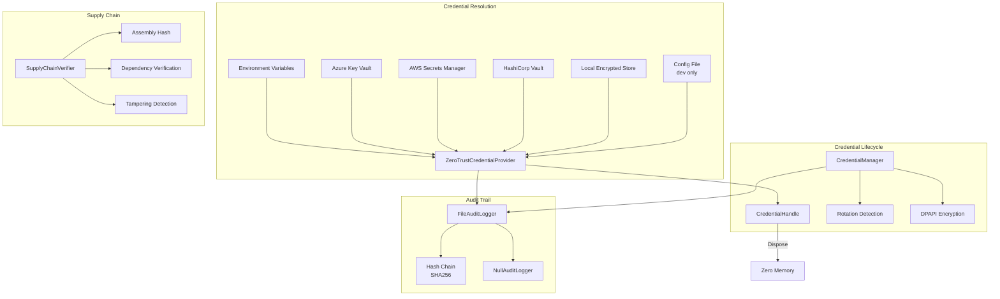
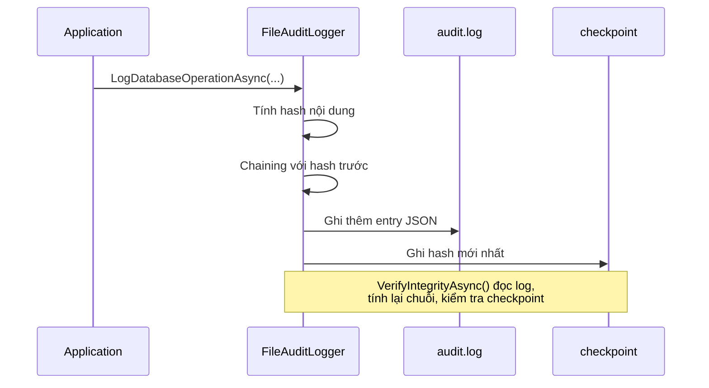
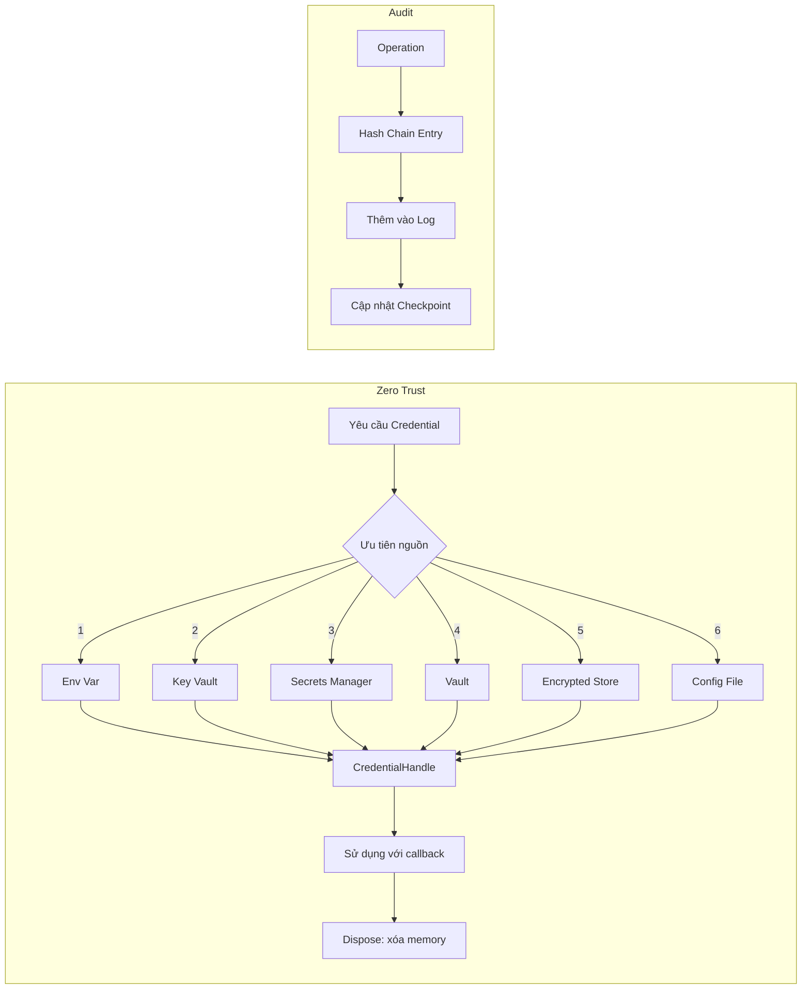

# Hệ Thống Bảo Mật

> Nguồn: `src/DataGuard.Core/Security/ZeroTrustCredentialProvider.cs`, `CredentialManager.cs`, `IAuditLogger.cs`, `SupplyChainVerifier.cs`

Hệ thống bảo mật triển khai xử lý credential zero-trust, audit logging chuỗi hash, và xác minh toàn vẹn chuỗi cung ứng. Mọi thành phần tuân theo nguyên tắc: **không log hoặc serialize secret, giảm vòng đời secret bằng best-effort clearing, và mặc định đóng khi lỗi**. Managed runtime không thể hứa secret không bao giờ xuất hiện trong memory dump; process-memory access phải được xem là đặc quyền.

`EncryptConnectionStringAtRest` dùng Windows DPAPI trên Windows, login Keychain trên macOS, và Linux Secret Service qua `secret-tool` trên Linux. Bridge Keychain gọi trực tiếp Security.framework; bridge Linux đưa secret qua standard input nên không backend nào đưa secret vào command-line argument. Output của helper Linux được giới hạn (1 MiB cho secret và 16 KiB cho lỗi), thao tác hết hạn sau 10 giây. `EncryptConnectionStringAtRest` mặc định `true`. Khi không có backend (`CredentialManager.IsPlatformProtectionAvailable()` là false: Linux thiếu `/usr/bin/secret-tool`, OS khác) việc ghi quay về plaintext chỉ chủ sở hữu đọc được kèm cảnh báo, hoặc fail trước khi ghi file nếu `RequireEncryptedCredentialStore: true`. Khi có backend nhưng ghi lỗi (ví dụ không có phiên Secret Service), yêu cầu fail closed và protected reference fail closed. DataGuard không ghi plaintext rồi đánh dấu encrypted. Lưu plaintext vẫn là lựa chọn tường minh (`EncryptConnectionStringAtRest: false`).
Contract bổ sung `ICredentialSecretStore` cho phép dùng fake theo từng nền tảng trong test; production vẫn chọn backend theo OS và backend không khả dụng sẽ throw trước khi persistence.

## Luồng Bảo Mật


```mermaid
flowchart TB
    subgraph Credential Resolution
        ZTP[ZeroTrustCredentialProvider]
        ENV[Environment Variables]
        AKV[Azure Key Vault]
        AWS[AWS Secrets Manager]
        HCV[HashiCorp Vault]
        LCS[Local Encrypted Store]
        CFG[Config File<br/>dev only]
    end

    subgraph Credential Lifecycle
        CM[CredentialManager]
        CH[CredentialHandle]
        ROT[Rotation Detection]
        ENC[DPAPI Encryption]
    end

    subgraph Audit Trail
        FAL[FileAuditLogger]
        HC[Hash Chain<br/>SHA256]
        NAL[NullAuditLogger]
    end

    subgraph Supply Chain
        SCV[SupplyChainVerifier]
        AH[Assembly Hash]
        DV[Dependency Verification]
        TP[Tampering Detection]
    end

    ENV --> ZTP
    AKV --> ZTP
    AWS --> ZTP
    HCV --> ZTP
    LCS --> ZTP
    CFG --> ZTP

    ZTP --> CH
    CM --> ROT
    CM --> ENC
    CH --> |Dispose| CLEAR[Zero Memory]

    ZTP --> FAL
    CM --> FAL
    FAL --> HC
    FAL --> NAL

    SCV --> AH
    SCV --> DV
    SCV --> TP
```

## ZeroTrustCredentialProvider

Giải quyết credentials từ nhiều nguồn bảo mật theo thứ tự ưu tiên. Không bao giờ lộ secrets trong log hoặc serialization.

```csharp
public sealed class ZeroTrustCredentialProvider : ICredentialProvider
{
    public async Task<CredentialHandle> GetCredentialAsync(
        string credentialName,
        CredentialType type,
        CancellationToken cancellationToken = default)
    {
        // Ghi log audit (chỉ hash, không bao giờ giá trị)
        await _auditLogger.LogCredentialAccessAsync(...);
        var value = await ResolveCredentialAsync(credentialName, type, cancellationToken);
        handle.SetValue(value);
        return handle;
    }
}
```

### Thứ Tự Giải Quyết

| Ưu tiên | Nguồn | Cấu hình | Ghi chú |
|---------|-------|----------|---------|
| 1 | Environment variable | `DATAGUARD_{NAME}` | Cao nhất — CI/CD injection |
| 2 | Azure Key Vault | `KeyVaultUri` | Sử dụng managed identity (IMDS) |
| 3 | AWS Secrets Manager | `AwsRegion` | Sử dụng AWS SDK |
| 4 | HashiCorp Vault | `VaultAddress` | Sử dụng env var `VAULT_TOKEN` |
| 5 | Local encrypted store | Tự phát hiện | DPAPI trên Windows; login Keychain trên macOS; Secret Service qua `secret-tool` trên Linux; backend không có sẽ fail closed |
| 6 | Config file | `AllowPlaintextConfigFallback` | Chỉ dev, mặc định đóng khi lỗi |

### Tích Hợp Azure Key Vault

Sử dụng Azure Managed Identity qua endpoint IMDS (`169.254.169.254`):
1. Yêu cầu OAuth2 token từ IMDS
2. Gọi Key Vault REST API (`GET secrets/{name}?api-version=7.4`)
3. Trích xuất `value` từ response

### Tích Hợp AWS Secrets Manager

`DataGuard.Core` không mang AWS SDK. Secret manager hiện thực `ISecretStore` (`Name`, `IsConfigured`, `GetSecretAsync`; null = không có, exception = lỗi mà provider ghi ở mức **Warning** kèm tên store rồi thử nguồn kế tiếp). Core có sẵn `AzureKeyVaultSecretStore` và `HashiCorpVaultSecretStore`; CLI đăng ký `DataGuard.Cli.Security.AwsSecretsManagerSecretStore` (`AmazonSecretsManagerClient` cho `AwsRegion`) qua constructor `ZeroTrustCredentialProvider(..., IEnumerable<ISecretStore> additionalSecretStores, ...)`. Thứ tự: Key Vault → store đã đăng ký → HashiCorp Vault → file credential mã hoá. Host thư viện đặt `AwsRegion` mà không đăng ký store sẽ nhận cảnh báo.

### Tích Hợp HashiCorp Vault

Sử dụng environment variable `VAULT_TOKEN` và endpoint chỉ HTTPS:
```csharp
var url = $"{_config.VaultAddress}/v1/secret/data/{credentialName}";
request.Headers.Add("X-Vault-Token", token);
```

## CredentialHandle

Handle bảo mật giảm nguy cơ lộ credential vô ý. Implement `IDisposable` với best-effort memory clearing; đây không phải bảo đảm chống memory dump hoặc immutable-string copy.

```csharp
public sealed class CredentialHandle : IDisposable
{
    private char[]? _value;

    // Thực thi action với credential mà không lộ nó
    public T Use<T>(Func<char[], T> action) { ... }

    // Lấy dưới dạng string (sử dụng thận trọng)
    public string GetString() { ... }

    public void Dispose()
    {
        // Xóa credential trong memory
        Array.Clear(_value, 0, _value.Length);
        _value = null;
    }
}
```

**Thuộc tính bảo mật chính:**
- Giá trị lưu dưới dạng `char[]` (có thể xóa), không phải `string` (bất biến trong .NET)
- Phương thức `Use<T>()` cho phép truy cập có kiểm soát mà không chuyển đổi string
- `Dispose()` xóa memory và suppress finalizer
- Finalizer làm biện pháp an toàn nếu `Dispose()` không được gọi

## CredentialManager

Quản lý vòng đời credential với phát hiện rotation và mã hóa khi lưu trữ.

Store dạng file từ chối file và ancestor là symbolic-link/reparse-point (nhưng cho
phép alias cố định của thư mục tạm hệ điều hành), giới hạn đọc và record ở 1 MiB,
đồng thời publish qua temporary file cùng thư mục đã flush với quyền chỉ owner trên
Unix. Kiểm tra path lần cuối ngay trước replace ghi rõ ranh giới race còn lại giữa
kiểm tra và mở file.

```csharp
public sealed class CredentialManager
{
    public async Task<string> GetConnectionStringAsync(CancellationToken ct = default)
    {
        // Environment variables ưu tiên hơn config-file values
        var connectionString = Environment.GetEnvironmentVariable("DATAGUARD_CONNECTION_STRING")
            ?? _config.ConnectionString
            ?? stored?.ConnectionString;

        // Kiểm tra credential rotation
        if (_config.EnableCredentialRotationDetection)
            await CheckCredentialRotationAsync(connectionString, ct);

        // Giải mã nếu đã mã hóa (Windows DPAPI)
        if (_config.EncryptConnectionStringAtRest && IsEncrypted(connectionString))
            connectionString = DecryptConnectionString(connectionString);
    }
}
```

### Phát Hiện Rotation

So sánh hash connection string hiện tại với hash đã lưu:
```csharp
if (stored!.ConnectionString != currentConnectionString)
{
    // Cảnh báo: phát hiện credential rotation
    // Hash cũ vs hash mới được ghi vào audit
}
```

### Mã Hóa Khi Lưu Trữ

Mã hóa DPAPI chỉ Windows với `ProtectedData`:
- Mã hóa: `ProtectedData.Protect(data, entropy, DataProtectionScope.CurrentUser)`
- Giải mã: `ProtectedData.Unprotect(encrypted, entropy, DataProtectionScope.CurrentUser)`
- Tiền tố: `"ENC:" + base64(encrypted_bytes)`
- Entropy: `"DataGuard.Credential.Protection"` (hằng số)

## Audit Logging

### Interface IAuditLogger

```csharp
public interface IAuditLogger
{
    Task LogDatabaseOperationAsync(string operation, string provider,
        string connectionStringHash, string details, bool success,
        string? errorMessage = null, CancellationToken ct = default);

    Task LogCredentialAccessAsync(string operation, string provider,
        string connectionStringHash, CancellationToken ct = default);

    Task LogConfigurationChangeAsync(string setting, string? oldValue,
        string? newValue, CancellationToken ct = default);
}
```

### FileAuditLogger

Audit log chuỗi hash với xác minh toàn vẹn SHA256.


```mermaid
sequenceDiagram
    participant App as Application
    participant FAL as FileAuditLogger
    participant Log as audit.log
    participant CP as checkpoint

    App->>FAL: LogDatabaseOperationAsync(...)
    FAL->>FAL: Tính hash nội dung
    FAL->>FAL: Chaining với hash trước
    FAL->>Log: Ghi thêm entry JSON
    FAL->>CP: Ghi hash mới nhất

    Note over FAL,CP: VerifyIntegrityAsync() đọc log,<br/>tính lại chuỗi, kiểm tra checkpoint
```

**Tạo chuỗi hash:**
```csharp
var content = Serialize(entry with { Hash = null, PreviousHash = null });
var hash = ComputeHash((previousHash ?? "") + content);
var chained = entry with { Hash = hash, PreviousHash = previousHash };
```

**Chuỗi có khoá**: với `DATAGUARD_AUDIT_KEY` hoặc `AuditKeyFile` (tối thiểu 16 byte; `FileAuditLogger.Create(config)`), mỗi mắt xích là `HMAC-SHA256(key, previousHash + content)` và entry mang `HashAlgorithm: "HMAC-SHA256"` (được mắt xích bao phủ). Không có khoá, mắt xích là SHA-256 và trường này bị lược (định dạng dòng cũ).

**Một writer duy nhất**: `CredentialManager` ghi qua `IAuditLogger` được inject (`LogSecurityEventAsync`), không bao giờ ghi dòng thô. Mọi instance `FileAuditLogger` append dưới lock theo đường dẫn và đọc lại đuôi chuỗi trước khi ghi, nên nhiều writer trong một process vẫn giữ một chuỗi. Checkpoint (`<log>.checkpoint`, JSON) lưu hash cuối, chuỗi có khoá hay không, và salt ngẫu nhiên theo file; `HashSensitiveValue` trả `HMAC-SHA256(salt, value)[..16]` làm dấu vân tay connection string (sự kiện rotation).

**Xác minh toàn vẹn** (`VerifyIntegrityAsync` → `AuditIntegrityResult`):
1. Đọc tất cả dòng log
2. Tính lại chuỗi hash từ đầu (`PreviousHash` phải khớp; mắt xích có khoá cần khoá)
3. Entry không khoá sau entry có khoá là giả mạo (hạ cấp)
4. Xác minh checkpoint khớp hash cuối (phát hiện cắt đuôi; checkpoint cũ chỉ chứa hash vẫn được chấp nhận)
5. Trạng thái: `Valid` (có khoá, nguyên vẹn), `Unkeyed` (chuỗi SHA-256 nguyên vẹn), `Tampered`, hoặc `KeyRequired` (có entry khoá nhưng thiếu khoá)

### NullAuditLogger

Triển khai no-op khi audit logging bị tắt. Tất cả methods trả về `Task.CompletedTask`.

### Che Giá Trị Nhạy Cảm

`MaskValue()` che giá trị nhạy cảm trong log thay đổi cấu hình:
- Giá trị từ 12 ký tự trở xuống: `"****"`
- Giá trị dài hơn: `"ab****yz"` (2 đầu + 2 cuối; giữ tối đa bốn ký tự)

## SupplyChainVerifier

Xác minh toàn vẹn chuỗi cung ứng theo nguyên tắc SLSA.

```csharp
public sealed class SupplyChainVerifier
{
    public async Task<SupplyChainVerificationResult> VerifyAsync(
        string? expectedHashFile = null,
        CancellationToken cancellationToken = default)
    {
        // 1. Toàn vẹn assembly (đóng khi lỗi nếu không có anchor)
        // 2. Xác minh provenance dependency (unverified khi thiếu signed evidence)
        // 3. So sánh file hash mong đợi
        // 4. Chỉ báo giả mạo
    }
}
```

### Các Kiểm Tra Xác Minh

| Kiểm tra | Mô tả | Hành vi khi lỗi |
|----------|-------|-----------------|
| AssemblyIntegrity | Hash SHA256 của file assembly | Đóng khi lỗi nếu không có anchor |
| ExpectedHashMatch | So sánh với file provenance SLSA | Lỗi nếu file thiếu |
| Dependency_X | Mỗi assembly tham chiếu cần signed provenance evidence | Fail closed khi provenance không có |

Assembly-name prefix không phải trust evidence. Built-in verifier báo mọi referenced
dependency là unverified cho đến khi signed provenance/SBOM verifier độc lập cung
cấp artifact-bound evidence. Điều này fail closed thay vì coi namespace quen thuộc
là trusted origin.
| StrongNameSigning | Kiểm tra strong name (thông tin) | Luôn pass |
| DebugSymbols | Phát hiện debug builds qua `IsJITTrackingEnabled` | Cảnh báo trong release |

### Luồng Bảo Mật


```mermaid
flowchart LR
    subgraph Zero Trust
        A[Yêu cầu Credential] --> B{Ưu tiên nguồn}
        B --> |1| C[Env Var]
        B --> |2| D[Key Vault]
        B --> |3| E[Secrets Manager]
        B --> |4| F[Vault]
        B --> |5| G[Encrypted Store]
        B --> |6| H[Config File]
        C --> I[CredentialHandle]
        D --> I
        E --> I
        F --> I
        G --> I
        H --> I
        I --> J[Sử dụng với callback]
        J --> K[Dispose: xóa memory]
    end

    subgraph Audit
        L[Operation] --> M[Hash Chain Entry]
        M --> N[Thêm vào Log]
        N --> O[Cập nhật Checkpoint]
    end
```

## Cấu Hình

Các thiết lập bảo mật trong `DataGuardConfiguration`:

| Thiết lập | Mặc định | Mô tả |
|-----------|----------|-------|
| `EnableCredentialRotationDetection` | `true` | Phát hiện thay đổi connection string |
| `CredentialRotationWarningDays` | `30` | Số ngày trước cảnh báo rotation |
| `EncryptConnectionStringAtRest` | `true` | DPAPI (Windows), Keychain (macOS), hoặc Secret Service (Linux khi khả dụng); plaintext kèm cảnh báo khi không có backend |
| `RequireEncryptedCredentialStore` | `false` | Từ chối lưu khi yêu cầu mã hoá mà không có backend |
| `AuditKeyFile` | `null` | File có nội dung (đã trim) là khoá HMAC audit (`DATAGUARD_AUDIT_KEY` thắng) |
| `KeyVaultUri` | `null` | URI Azure Key Vault |
| `AwsRegion` | `null` | Region AWS cho Secrets Manager |
| `VaultAddress` | `null` | Địa chỉ HashiCorp Vault |
| `EnableAuditLogging` | `true` | Bật audit log chuỗi hash |
| `AuditLogPath` | `null` | Đường dẫn audit log tùy chỉnh |
| `AllowPlaintextConfigFallback` | `false` | Cho phép credential config file (chỉ dev) |
