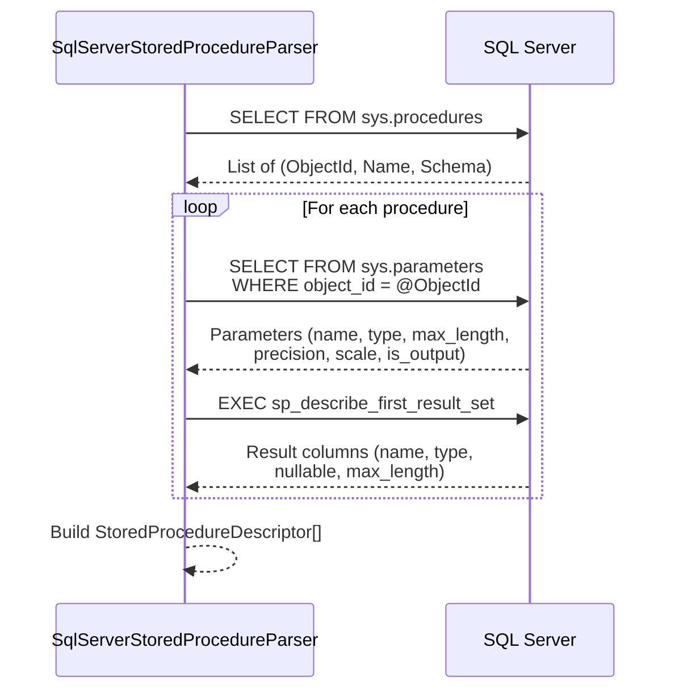

# Contract Sources

> Source: `src/DataGuard.Core/Sources/EfModelSource.cs`, `SqlServerParsers.cs`, `ManualContractSource.cs`, `SqlKeywordMatcher.cs`

Contract sources are the data collection layer of DataGuard. They extract `ContractDescriptor` instances from various origins: EF Core models, database metadata, raw SQL text, and manual attribute annotations.

## Source Extraction Flow

```mermaid
flowchart TB
    subgraph Sources
        EF[EfModelSource]
        SP[SqlServerStoredProcedureParser]
        RS[RawSqlParser]
        MC[ManualContractSource]
    end

    subgraph Data Origins
        CTX[DbContext<br/>Runtime Model]
        SNAP[ModelSnapshot.cs<br/>Design-time]
        SYS[sys.parameters<br/>sys.columns]
        SQL[Raw SQL Text]
        ATTR[[ExpectedColumn]<br/>[ExpectedSpParameter]]
    end

    subgraph Output
        ED[EntityDescriptor]
        SPD[StoredProcedureDescriptor]
        RSD[RawSqlDescriptor]
    end

    CTX --> EF
    SNAP --> EF
    SYS --> SP
    SQL --> RS
    ATTR --> MC

    EF --> ED
    SP --> SPD
    RS --> RSD
    MC --> ED
    MC --> SPD
```

## EfModelSource

Extracts entity contracts from EF Core's `IModel`. Supports both runtime and design-time model extraction.

### Runtime Extraction

```csharp
public class EfModelSource : IContractSource
{
    private readonly DbContext _context;
    private readonly DataGuardConfiguration _config;

    public EfModelSource(DbContext context, DataGuardConfiguration config) { ... }

    public async Task<IReadOnlyList<ContractDescriptor>> ExtractContractsAsync(
        CancellationToken cancellationToken = default)
    {
        var model = _context.Model;
        foreach (var entityType in model.GetEntityTypes())
        {
            // Skip excluded entities and owned types
            // Extract properties with column mappings
            // Build EntityDescriptor with full metadata
        }
    }
}
```

**Runtime extraction process:**

1. Iterate `model.GetEntityTypes()`
2. Skip excluded entities (`config.ExcludedEntities`) and owned types
3. For each entity, iterate `entityType.GetProperties()`:
   - Skip shadow properties
   - Extract `ColumnName`, `ColumnType`, `MaxLength`, `IsNullable`, `IsPrimaryKey`, `IsForeignKey`
   - Collect EF Core annotations
4. Build `EntityDescriptor` with table name, schema, and location info
5. Resolve source file location via Roslyn syntax tree parsing

### Design-time Extraction

For CI/CD pipelines without a running database:

```csharp
public static async Task<IReadOnlyList<EntityDescriptor>> ExtractFromDesignTimeAsync(
    string projectPath,
    string contextTypeName,
    DataGuardConfiguration? config = null,
    CancellationToken cancellationToken = default)
```

**Strategy:**
1. **ModelSnapshot.cs** (fast, no build required) — parses the EF Core migration snapshot
2. **Built assembly fallback** — loads the compiled assembly and instantiates the DbContext

### ModelSnapshot Parsing

Parses the JSON structure emitted by EF Core's generated `ModelSnapshot` class:

```csharp
public static IReadOnlyList<EntityDescriptor> ParseModelSnapshot(
    string json, DataGuardConfiguration? config = null)
```

Extracts entity configurations by navigating the `BuildModel` method structure, finding `Entity<T>()` calls, and parsing `HasColumnName`, `HasColumnType`, `IsRequired`, `HasMaxLength`, `IsPrimaryKey`, `IsForeignKey` calls.

## SqlServerStoredProcedureParser

Extracts stored procedure contracts from SQL Server system views.

```csharp
public class SqlServerStoredProcedureParser : IContractSource
{
    private readonly string _connectionString;
    private readonly DataGuardConfiguration _config;
}
```

### Extraction Process



**Parameter extraction** queries `sys.parameters` joined with `sys.types`:
- Maps `is_output` to `ParameterDirection.InputOutput` or `Input`
- Handles `-1` max_length (maps to `null` for `MAX` types)

**Result column extraction** uses `sp_describe_first_result_set`:
- Gracefully handles errors 11512/11513 (no result set)
- SQL Server doesn't have CHAR/BYTE semantics, so `CharUsed` is always `null`

## RawSqlParser

Parses raw SQL text using Microsoft's ScriptDOM library.

```csharp
public class RawSqlParser : IContractSource
{
    private readonly string _sqlText;
    private readonly string _filePath;
}
```

### ScriptDOM Visitor Pattern

Uses `TSqlFragmentVisitor` to walk the parsed AST:

```csharp
internal class SqlParameterVisitor : TSqlFragmentVisitor
{
    public List<SqlParameterInfo> Parameters { get; } = new();

    public override void Visit(ProcedureParameter parameter)
    {
        // Extract type name, length, precision, scale
        // from ScriptDOM DataTypeReference
    }
}
```

**Type name extraction** (`GetSqlTypeName`):
- Builds SQL-facing type name (e.g. `"varchar(50)"`, `"decimal(10,2)"`)
- Handles `IntegerLiteral` parameters for length/precision/scale
- Dispatches on type category: char/binary take length; numeric take precision/scale

## ManualContractSource

Reads ground-truth contracts from compiled user assemblies via reflection.

```csharp
public sealed class ManualContractSource : IContractSource
{
    private readonly string _assemblyPath;
}
```

### Attribute-based Contracts

Uses two custom attributes from `DataGuard.Contracts`:

**`[ExpectedColumn]`** — marks properties with expected database column metadata:
```csharp
[ExpectedColumn("ORDER_ID", ClrTypeName = "int", IsNullable = false)]
public int OrderId { get; set; }
```

**`[ExpectedSpParameter]`** — marks methods with expected SP parameters:
```csharp
[ExpectedSpParameter("P_ID", DbType = "NUMBER", Direction = ParameterDirection.Input)]
public void GetOrder(int id) { }
```

### Reflection Process

1. `Assembly.LoadFrom(assemblyPath)` — loads the user assembly
2. Iterates all types, scanning properties for `[ExpectedColumn]` and methods for `[ExpectedSpParameter]`
3. Maps `DataGuard.Contracts.ParameterDirection` → `DataGuard.Core.Abstractions.ParameterDirection`
4. Builds `EntityDescriptor` and `StoredProcedureDescriptor` instances

## SqlKeywordMatcher

Shared utility for dialect keyword matching across MySQL, PostgreSQL, and Oracle checkers.

```csharp
public static class SqlKeywordMatcher
{
    public static bool ContainsAny(string sqlText, IEnumerable<string> keywords)
    {
        foreach (var keyword in keywords)
        {
            if (sqlText.Contains(keyword, StringComparison.OrdinalIgnoreCase))
                return true;
        }
        return false;
    }
}
```

Simple substring matching with case-insensitive comparison. Used by dialect-specific checkers to detect database-specific SQL syntax.

## Source Registration

Sources are registered with the validation pipeline:

```csharp
var sources = new IContractSource[]
{
    new EfModelSource(dbContext, config),
    new SqlServerStoredProcedureParser(connectionString, config),
    new ManualContractSource(assemblyPath),
};

var allContracts = new List<ContractDescriptor>();
foreach (var source in sources)
{
    allContracts.AddRange(await source.ExtractContractsAsync());
}
```

## Source Summary

| Source | SourceId | Input | Output | Database Required |
|--------|----------|-------|--------|-------------------|
| `EfModelSource` | `ef-model` | DbContext / ModelSnapshot | `EntityDescriptor[]` | Runtime: Yes, Design-time: No |
| `SqlServerStoredProcedureParser` | `sqlserver-sp` | Connection string | `StoredProcedureDescriptor[]` | Yes |
| `RawSqlParser` | `raw-sql` | SQL text + file path | `RawSqlDescriptor[]` | No |
| `ManualContractSource` | `manual` | Assembly path | `EntityDescriptor[]` + `StoredProcedureDescriptor[]` | No |
