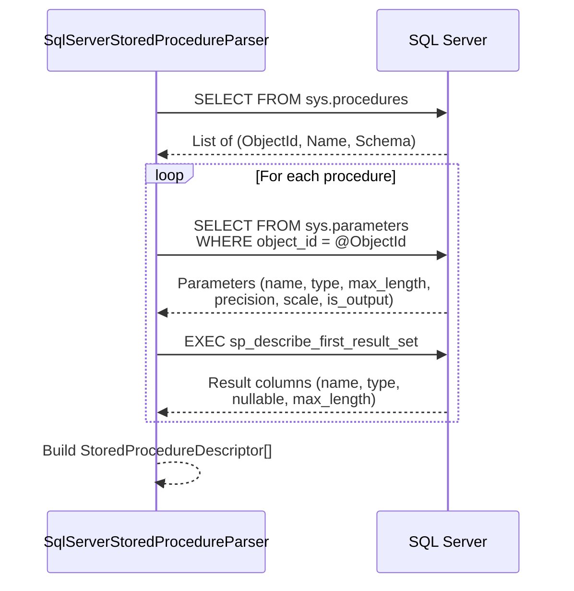

# Contract Sources

> Source: `src/DataGuard.Core/Sources/EfModelSource.cs`, `SqlServerParsers.cs`, `ManualContractSource.cs`, `SqlKeywordMatcher.cs`

Contract sources are the data collection layer of DataGuard. They extract `ContractDescriptor` instances from various origins: EF Core models, database metadata, raw SQL text, and manual attribute annotations.

## Source Extraction Flow

```mermaid
flowchart TB
    subgraph Sources
        EF[EfModelSource]
        SP[SqlServerStoredProcedureParser]
        RS[RawSqlParser]
        MC[ManualContractSource]
    end

    subgraph Data Origins
        CTX[DbContext<br/>Runtime Model]
        SNAP[ModelSnapshot.cs<br/>Design-time]
        SYS[sys.parameters<br/>sys.columns]
        SQL[Raw SQL Text]
        ATTR[[ExpectedColumn]<br/>[ExpectedSpParameter]]
    end

    subgraph Output
        ED[EntityDescriptor]
        SPD[StoredProcedureDescriptor]
        RSD[RawSqlDescriptor]
    end

    CTX --> EF
    SNAP --> EF
    SYS --> SP
    SQL --> RS
    ATTR --> MC

    EF --> ED
    SP --> SPD
    RS --> RSD
    MC --> ED
    MC --> SPD
```

## EfModelSource

Extracts entity contracts from EF Core's `IModel`. Supports both runtime and design-time model extraction.

### Runtime Extraction

```csharp
public class EfModelSource : IContractSource
{
    private readonly DbContext _context;
    private readonly DataGuardConfiguration _config;

    public EfModelSource(DbContext context, DataGuardConfiguration config) { ... }

    public async Task<IReadOnlyList<ContractDescriptor>> ExtractContractsAsync(
        CancellationToken cancellationToken = default)
    {
        var model = _context.Model;
        foreach (var entityType in model.GetEntityTypes())
        {
            // Skip excluded entities and owned types
            // Extract properties with column mappings
            // Build EntityDescriptor with full metadata
        }
    }
}
```

**Runtime extraction process:**

1. Iterate `model.GetEntityTypes()`
2. Skip excluded entities (`config.ExcludedEntities`) and owned types
3. For each entity, iterate `entityType.GetProperties()`:
   - Skip shadow properties
   - Extract `ColumnName`, `ColumnType`, `MaxLength`, `IsNullable`, `IsPrimaryKey`, `IsForeignKey`
   - Collect EF Core annotations
4. Build `EntityDescriptor` with table name, schema, and location info
5. Resolve source file location via Roslyn syntax tree parsing

### Trusted compiled ModelSnapshot extraction

`ModelSnapshot.cs` source can be parsed without loading an assembly by the bounded
`ModelSnapshotCSharpParser`. It supports a narrow generated fluent-API subset for
`Entity<T>`, table, property, key, column name/type, length, and requiredness. Properties come
from `b.Property<T>("Name")` (CLR type = `T`, canonicalized: `System.Int32` ⇒ `int`, `Nullable<DateTime>` ⇒
`DateTime?`, `string?` ⇒ `string`) or `b.Property(x => x.Name)` (no syntactic type: `string` only when
`HasMaxLength`/`IsUnicode`/`IsFixedLength` is configured, otherwise `object`, which the length rules skip).
`.IsUnicode(bool)` becomes `Annotations["IsUnicode"]` (read by Oracle DG008); nullability is `.IsRequired(bool)`
when present, otherwise `T?`/reference types are nullable and known value types are not. Keys come from
`HasKey(x => x.Id)`, `HasKey(x => new { x.A, x.B })` or `HasKey("A", "B")`. It
enforces source-size and syntax-node limits and returns a visible diagnostic for
syntax errors or unsupported input; it never instantiates a `DbContext`, factory,
host, or arbitrary application code. Automatic project/assembly discovery remains
unsupported.

When some entity configurations parse and others do not, the parsed entities are kept and
`EfModelSource.ParseModelSnapshotWithDiagnostics` / `ExtractFromModelSnapshotWithDiagnosticsAsync`
return one `AcquisitionDiagnostic(Kind, Path, Message)` per skipped configuration
(`Kind = ModelSnapshotPartialParse`). `validate` prints them as `ACQUISITION: <path>: <message>`
and exits 3 unless `--allow-unevaluated`. When nothing parses, `EfModelExtractionException` is thrown.

```csharp
var entities = await EfModelSource.ExtractFromTrustedCompiledModelSnapshotAsync(
    trustedAssemblyPath: "/approved/output/MyApp.dll",
    modelSnapshotTypeName: "MyApp.Migrations.AppDbContextModelSnapshot",
    config: config,
    cancellationToken: cancellationToken);
```

The caller explicitly selects one non-linked DLL and the exact concrete `ModelSnapshot` type. The loader is collectible and shares EF Core identity with the host so its `IModel` can be read; dependency resolution is rooted at that selected artifact. Loading managed code is still execution of trusted code, not sandboxing. Missing, linked, mismatched, abstract, or unloadable artifacts raise `EfModelExtractionException` rather than returning an empty successful result.

### Raw SQL parse status

`RawSqlParser` records `RawSqlParseStatus.Invalid` and the ScriptDOM error text for malformed input. Built-in rule `DG019` (`RawSqlParseStatusRule`; DG016 is Phantom Column Reference) reports that status as an Error, so a parser failure cannot appear as a clean validation result.

## SqlServerStoredProcedureParser

Extracts stored procedure contracts from SQL Server system views.

```csharp
public class SqlServerStoredProcedureParser : IContractSource
{
    private readonly string _connectionString;
    private readonly DataGuardConfiguration _config;
}
```

### Extraction Process


```mermaid
sequenceDiagram
    participant Parser as SqlServerStoredProcedureParser
    participant DB as SQL Server

    Parser->>DB: SELECT FROM sys.procedures
    DB-->>Parser: List of (ObjectId, Name, Schema)

    loop For each procedure
        Parser->>DB: SELECT FROM sys.parameters<br/>WHERE object_id = @ObjectId
        DB-->>Parser: Parameters (name, type, max_length,<br/>precision, scale, is_output)

        Parser->>DB: EXEC sp_describe_first_result_set
        DB-->>Parser: Result columns (name, type,<br/>nullable, max_length)
    end

    Parser-->>Parser: Build StoredProcedureDescriptor[]
```

**Parameter extraction** queries `sys.parameters` joined with `sys.types`:
- Maps `is_output` to `ParameterDirection.InputOutput` or `Input`
- Handles `-1` max_length (maps to `null` for `MAX` types)

**Result column extraction** uses `sp_describe_first_result_set`:
- Gracefully handles errors 11512/11513 (no result set)
- SQL Server doesn't have CHAR/BYTE semantics, so `CharUsed` is always `null`

## RawSqlParser

Parses raw SQL text using Microsoft's ScriptDOM library.

```csharp
public class RawSqlParser : IContractSource
{
    private readonly string _sqlText;
    private readonly string _filePath;
}
```

### ScriptDOM Visitor Pattern

Uses `TSqlFragmentVisitor` to walk the parsed AST:

```csharp
internal class SqlParameterVisitor : TSqlFragmentVisitor
{
    public List<SqlParameterInfo> Parameters { get; } = new();

    public override void Visit(ProcedureParameter parameter)
    {
        // Extract type name, length, precision, scale
        // from ScriptDOM DataTypeReference
    }
}
```

**Type name extraction** (`GetSqlTypeName`):
- Builds SQL-facing type name (e.g. `"varchar(50)"`, `"decimal(10,2)"`)
- Handles `IntegerLiteral` parameters for length/precision/scale
- Dispatches on type category: char/binary take length; numeric take precision/scale

## ManualContractSource

Reads ground-truth contracts from compiled user assemblies via reflection.

```csharp
public sealed class ManualContractSource : IContractSource
{
    private readonly string _assemblyPath;
}
```

### Attribute-based Contracts

Uses two custom attributes from `DataGuard.Contracts`:

**`[ExpectedColumn]`** — marks properties with expected database column metadata:
```csharp
[ExpectedColumn("ORDER_ID", ClrTypeName = "int", IsNullable = false)]
public int OrderId { get; set; }
```

**`[ExpectedSpParameter]`** — marks methods with expected SP parameters:
```csharp
[ExpectedSpParameter("P_ID", DbType = "NUMBER", Direction = ParameterDirection.Input)]
public void GetOrder(int id) { }
```

### Reflection Process

1. `Assembly.LoadFrom(assemblyPath)` — loads the user assembly
2. Iterates all types, scanning properties for `[ExpectedColumn]` and methods for `[ExpectedSpParameter]`
3. Maps `DataGuard.Contracts.ParameterDirection` → `DataGuard.Core.Abstractions.ParameterDirection`
4. Builds `EntityDescriptor` and `StoredProcedureDescriptor` instances

## ProjectCSharpSqlSource

Extracts SQL statements and stored-procedure call sites from C# source with Roslyn (syntax plus a semantic model). Code lives in `Sources/ProjectCSharpSqlSource.cs` and the partial parts under `Sources/CSharp/`.

### Call sites

| Shape | Recognized |
|-------|------------|
| Dapper | `Query*` (incl. `QueryFirst*`, `QuerySingle*`, `QueryMultiple*`, `QueryUnbufferedAsync`), `Execute*`, `ExecuteScalar*`, `ExecuteReader*`; `conn?.Query<T>(...)`; `commandType: CommandType.StoredProcedure` (named or positional) |
| EF Core | `FromSqlRaw/FromSqlInterpolated/FromSql`, `ExecuteSqlRaw*/ExecuteSqlInterpolated*/ExecuteSql*`, `SqlQuery/SqlQueryRaw` |
| ADO.NET | `cmd.CommandText = ...`, `new XCommand("...")` and target-typed `XCommand cmd = new("...")`, `CommandType = CommandType.StoredProcedure` (the **last** command text written before the command executes wins) |
| Constants | unreferenced `const`/`static readonly` SQL fields (statement-shaped only) |

`base("...")` in a repository class is SQL only when the argument itself is a statement; table or connection names (`base("DefaultConnection")`) no longer produce a synthetic `SELECT * FROM ...`.

### Statement recognition (`IsSqlString`, `IsProcedureName`)

`IsSqlString` requires a statement-shaped start (after comments): `SELECT|INSERT|UPDATE|DELETE|MERGE|WITH|EXEC|EXECUTE|CALL|BEGIN|DECLARE`. The DML keywords also need a `FROM|INTO|SET|VALUES|JOIN` clause, `WITH` needs `AS (`, `EXEC` a target, `CALL` a `name(`, and `BEGIN`/`DECLARE` an `END` or an inner statement. Text such as `"Please update your profile"` is not SQL. Bare procedure names (`usp_GetUser`, `PKG.PROC`, `[dbo].[Get User]`) are recognized separately by `IsProcedureName` and only for `CommandType.StoredProcedure` calls.

### Stored-procedure descriptors

A `RawSqlDescriptor` for a procedure call carries:

- `ProcedureName` (bare name), `ProcedureSchema`, `ProcedurePackage`, split with `SchemaObjectName.Parse`. Oracle style (provider hint `oracle` or a PL/SQL block): `pkg.proc` ⇒ package, `owner.pkg.proc` ⇒ schema + package. Other providers: `schema.proc` ⇒ schema, `db.schema.proc` ⇒ schema (database dropped).
- `IsStoredProcedure = true` only for `CommandType.StoredProcedure` calls, whose `SqlText` is synthesized as `EXEC {name}`. Textual calls (`EXEC dbo.p @a = {0}`, `CALL s.p(?, ?)`, `BEGIN pkg.p(:a, p_b => :b); END;`) keep their real text and `IsStoredProcedure = false`, so dialect rules still inspect them; they are identified by `ProcedureName != null`.
- One `ParameterDescriptor` per call argument, in call order (`OrdinalPosition` 1-based): `Name` as written (`@Id`, `p_id`, `Id` for Dapper object properties) or `#n` (zero-based) for a positional argument; `ClrType` from the semantic model (`int?` ⇒ `int`, enums ⇒ `enum:<underlying>`, unknown ⇒ null); `CallSiteDirection` from `ParameterDirection.*` (Dapper `DynamicParameters.Add`, ADO `Direction`), `out`/`ref` arguments and T-SQL `OUTPUT`, otherwise `Input` when a value is bound and null when nothing is known; `DataType` is the written provider type (`SqlDbType.Int` ⇒ `Int`) or `unknown`; `HasDefault = false`.

Argument sources: Dapper anonymous objects, `DynamicParameters` (constructor template, `Add`, `AddDynamicParams`), other objects (their public properties); ADO `Parameters.Add/AddWithValue/AddRange` with `new XParameter(...) { ... }`, locals, chained `.Direction/.Value`, `Parameters["x"].Direction`; EF extra arguments and `*Parameter` objects.

### Placeholders and dynamic SQL

Placeholders are scanned after masking comments and literals: `@name`, `:name`, `$n` keep their written form; `{n}` (EF) and `?` (ODBC/MySQL) are positional `#n`; `::cast`, `:=`, `@@SYSTEM` variables and JSON `?|`/`?&` are ignored. Interpolation holes and non-constant concatenation operands become `@name` placeholders (local values are never inlined) and are listed in `Parameters` with their `ClrType`, even when they sit inside quotes.

### Expected properties, ids, skips and diagnostics

- `ExpectedProperties`: public instance properties with a setter or `init`, without `[NotMapped]`; empty for scalar targets (`string`, primitives, date/time types, `Guid`, `decimal`, enums, `byte[]`).
- `Id` = `project-sql:{repo-relative path}:{span start}:{first 8 hex of SHA-256 of whitespace-normalized SQL}`.
- `[SkipContractCheck]` on the method, its type or an enclosing type (also on another partial part) skips the call site; `SkippedContractCount` counts them.
- `Diagnostics` (`AcquisitionDiagnostic(Kind, Path, Message)`) lists `UnreadableFile`, `ParseFailed`, `OversizedLiteral` (> 256 KB) and `SkippedByAttribute` for the last run.
- Compilation references come from the scanned project's `obj/project.assets.json` (compile assets under `NUGET_PACKAGES` or `~/.nuget/packages`, plus the running shared framework) when it was restored, else from the host's trusted platform assemblies, in sorted order.

## SqlKeywordMatcher

Shared utility for dialect keyword matching across MySQL, PostgreSQL, and Oracle checkers.
## Source Registration

Sources are registered with the validation pipeline:

```csharp
var sources = new IContractSource[]
{
    new EfModelSource(dbContext, config),
    new SqlServerStoredProcedureParser(connectionString, config),
    new ManualContractSource(assemblyPath),
};

var allContracts = new List<ContractDescriptor>();
foreach (var source in sources)
{
    allContracts.AddRange(await source.ExtractContractsAsync());
}
```

## Source Summary

| Source | SourceId | Input | Output | Database Required |
|--------|----------|-------|--------|-------------------|
| `EfModelSource` | `ef-model` | DbContext / ModelSnapshot | `EntityDescriptor[]` | Runtime: Yes, Design-time: No |
| `SqlServerStoredProcedureParser` | `sqlserver-sp` | Connection string | `StoredProcedureDescriptor[]` | Yes |
| `RawSqlParser` | `raw-sql` | SQL text + file path | `RawSqlDescriptor[]` | No |
| `ManualContractSource` | `manual` | Assembly path | `EntityDescriptor[]` + `StoredProcedureDescriptor[]` | No |
| `ProjectCSharpSqlSource` | `csharp-source` | C# project / source directory | `RawSqlDescriptor[]` + `StoredProcedureDescriptor[]` | No |
