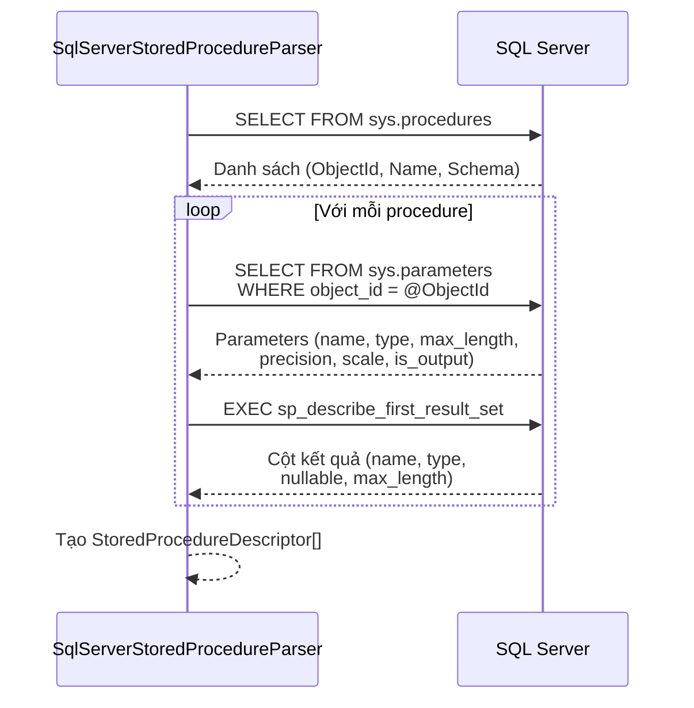

# Contract Sources

> Nguồn: `src/DataGuard.Core/Sources/EfModelSource.cs`, `SqlServerParsers.cs`, `ManualContractSource.cs`, `SqlKeywordMatcher.cs`

Contract sources là lớp thu thập dữ liệu của DataGuard. Chúng trích xuất các thể hiện `ContractDescriptor` từ nhiều nguồn: mô hình EF Core, metadata database, văn bản SQL thô, và các annotation thuộc tính thủ công.

## Luồng Trích Xuất Source

```mermaid
flowchart TB
    subgraph Sources
        EF[EfModelSource]
        SP[SqlServerStoredProcedureParser]
        RS[RawSqlParser]
        MC[ManualContractSource]
    end

    subgraph Data Origins
        CTX[DbContext<br/>Runtime Model]
        SNAP[ModelSnapshot.cs<br/>Design-time]
        SYS[sys.parameters<br/>sys.columns]
        SQL[Raw SQL Text]
        ATTR[[ExpectedColumn]<br/>[ExpectedSpParameter]]
    end

    subgraph Output
        ED[EntityDescriptor]
        SPD[StoredProcedureDescriptor]
        RSD[RawSqlDescriptor]
    end

    CTX --> EF
    SNAP --> EF
    SYS --> SP
    SQL --> RS
    ATTR --> MC

    EF --> ED
    SP --> SPD
    RS --> RSD
    MC --> ED
    MC --> SPD
```

## EfModelSource

Trích xuất entity contracts từ `IModel` của EF Core. Hỗ trợ cả trích xuất runtime và design-time.

### Trích Xuất Runtime

```csharp
public class EfModelSource : IContractSource
{
    private readonly DbContext _context;
    private readonly DataGuardConfiguration _config;

    public EfModelSource(DbContext context, DataGuardConfiguration config) { ... }

    public async Task<IReadOnlyList<ContractDescriptor>> ExtractContractsAsync(
        CancellationToken cancellationToken = default)
    {
        var model = _context.Model;
        foreach (var entityType in model.GetEntityTypes())
        {
            // Bỏ qua entity bị loại trừ và owned types
            // Trích xuất properties với ánh xạ cột
            // Tạo EntityDescriptor với metadata đầy đủ
        }
    }
}
```

**Quy trình trích xuất runtime:**

1. Duyệt `model.GetEntityTypes()`
2. Bỏ qua entity bị loại trừ (`config.ExcludedEntities`) và owned types
3. Với mỗi entity, duyệt `entityType.GetProperties()`:
   - Bỏ qua shadow properties
   - Trích xuất `ColumnName`, `ColumnType`, `MaxLength`, `IsNullable`, `IsPrimaryKey`, `IsForeignKey`
   - Thu thập annotations EF Core
4. Tạo `EntityDescriptor` với tên bảng, schema, và thông tin vị trí
5. Giải quyết vị trí file nguồn qua phân tích syntax tree Roslyn

### Trích Xuất Design-time

Cho CI/CD pipeline không có database đang chạy:

```csharp
public static async Task<IReadOnlyList<EntityDescriptor>> ExtractFromDesignTimeAsync(
    string projectPath,
    string contextTypeName,
    DataGuardConfiguration? config = null,
    CancellationToken cancellationToken = default)
```

**Chiến lược:**
1. **ModelSnapshot.cs** (nhanh, không cần build) — phân tích migration snapshot của EF Core
2. **Fallback assembly đã build** — tải assembly đã biên dịch và khởi tạo DbContext

### Phân Tích ModelSnapshot

Phân tích cấu trúc JSON được tạo bởi lớp `ModelSnapshot` sinh bởi EF Core:

```csharp
public static IReadOnlyList<EntityDescriptor> ParseModelSnapshot(
    string json, DataGuardConfiguration? config = null)
```

Trích xuất cấu hình entity bằng cách điều hướng cấu trúc phương thức `BuildModel`, tìm các lệnh gọi `Entity<T>()`, và phân tích các lệnh gọi `HasColumnName`, `HasColumnType`, `IsRequired`, `HasMaxLength`.

## SqlServerStoredProcedureParser

Trích xuất stored procedure contracts từ system views SQL Server.

```csharp
public class SqlServerStoredProcedureParser : IContractSource
{
    private readonly string _connectionString;
    private readonly DataGuardConfiguration _config;
}
```

### Quy Trình Trích Xuất



**Trích xuất tham số** truy vấn `sys.parameters` kết hợp với `sys.types`:
- Ánh xạ `is_output` thành `ParameterDirection.InputOutput` hoặc `Input`
- Xử lý max_length `-1` (ánh xạ thành `null` cho kiểu `MAX`)

**Trích xuất cột kết quả** sử dụng `sp_describe_first_result_set`:
- Xử lý lỗi 11512/11513 một cách nhẹ nhàng (không có result set)
- SQL Server không có semantics CHAR/BYTE, nên `CharUsed` luôn là `null`

## RawSqlParser

Phân tích văn bản SQL thô bằng thư viện ScriptDOM của Microsoft.

```csharp
public class RawSqlParser : IContractSource
{
    private readonly string _sqlText;
    private readonly string _filePath;
}
```

### ScriptDOM Visitor Pattern

Sử dụng `TSqlFragmentVisitor` để duyệt AST đã phân tích:

```csharp
internal class SqlParameterVisitor : TSqlFragmentVisitor
{
    public List<SqlParameterInfo> Parameters { get; } = new();

    public override void Visit(ProcedureParameter parameter)
    {
        // Trích xuất tên kiểu, độ dài, precision, scale
        // từ ScriptDOM DataTypeReference
    }
}
```

**Trích xuất tên kiểu** (`GetSqlTypeName`):
- Tạo tên kiểu phía SQL (vd: `"varchar(50)"`, `"decimal(10,2)"`)
- Xử lý tham số `IntegerLiteral` cho length/precision/scale
- Phân loại theo loại kiểu: char/binary lấy length; numeric lấy precision/scale

## ManualContractSource

Đọc contracts ground-truth từ assembly người dùng đã biên dịch qua reflection.

```csharp
public sealed class ManualContractSource : IContractSource
{
    private readonly string _assemblyPath;
}
```

### Contracts Dựa Trên Attribute

Sử dụng hai custom attributes từ `DataGuard.Contracts`:

**`[ExpectedColumn]`** — đánh dấu properties với metadata cột database mong đợi:
```csharp
[ExpectedColumn("ORDER_ID", ClrTypeName = "int", IsNullable = false)]
public int OrderId { get; set; }
```

**`[ExpectedSpParameter]`** — đánh dấu methods với tham số SP mong đợi:
```csharp
[ExpectedSpParameter("P_ID", DbType = "NUMBER", Direction = ParameterDirection.Input)]
public void GetOrder(int id) { }
```

### Quy Trình Reflection

1. `Assembly.LoadFrom(assemblyPath)` — tải assembly người dùng
2. Duyệt tất cả types, quét properties cho `[ExpectedColumn]` và methods cho `[ExpectedSpParameter]`
3. Ánh xạ `DataGuard.Contracts.ParameterDirection` → `DataGuard.Core.Abstractions.ParameterDirection`
4. Tạo các thể hiện `EntityDescriptor` và `StoredProcedureDescriptor`

## SqlKeywordMatcher

Tiện ích dùng chung cho khớp keyword dialect giữa các checker MySQL, PostgreSQL, và Oracle.

```csharp
public static class SqlKeywordMatcher
{
    public static bool ContainsAny(string sqlText, IEnumerable<string> keywords)
    {
        foreach (var keyword in keywords)
        {
            if (sqlText.Contains(keyword, StringComparison.OrdinalIgnoreCase))
                return true;
        }
        return false;
    }
}
```

Khớp substring đơn giản với so sánh không phân biệt hoa thường. Được sử dụng bởi các checker đặc thù dialect để phát hiện cú pháp SQL đặc trưng database.

## Đăng Ký Sources

Sources được đăng ký với validation pipeline:

```csharp
var sources = new IContractSource[]
{
    new EfModelSource(dbContext, config),
    new SqlServerStoredProcedureParser(connectionString, config),
    new ManualContractSource(assemblyPath),
};

var allContracts = new List<ContractDescriptor>();
foreach (var source in sources)
{
    allContracts.AddRange(await source.ExtractContractsAsync());
}
```

## Bảng Tổng Hợp Sources

| Source | SourceId | Đầu vào | Đầu ra | Cần Database |
|--------|----------|---------|--------|--------------|
| `EfModelSource` | `ef-model` | DbContext / ModelSnapshot | `EntityDescriptor[]` | Runtime: Có, Design-time: Không |
| `SqlServerStoredProcedureParser` | `sqlserver-sp` | Connection string | `StoredProcedureDescriptor[]` | Có |
| `RawSqlParser` | `raw-sql` | Văn bản SQL + đường dẫn file | `RawSqlDescriptor[]` | Không |
| `ManualContractSource` | `manual` | Đường dẫn assembly | `EntityDescriptor[]` + `StoredProcedureDescriptor[]` | Không |
