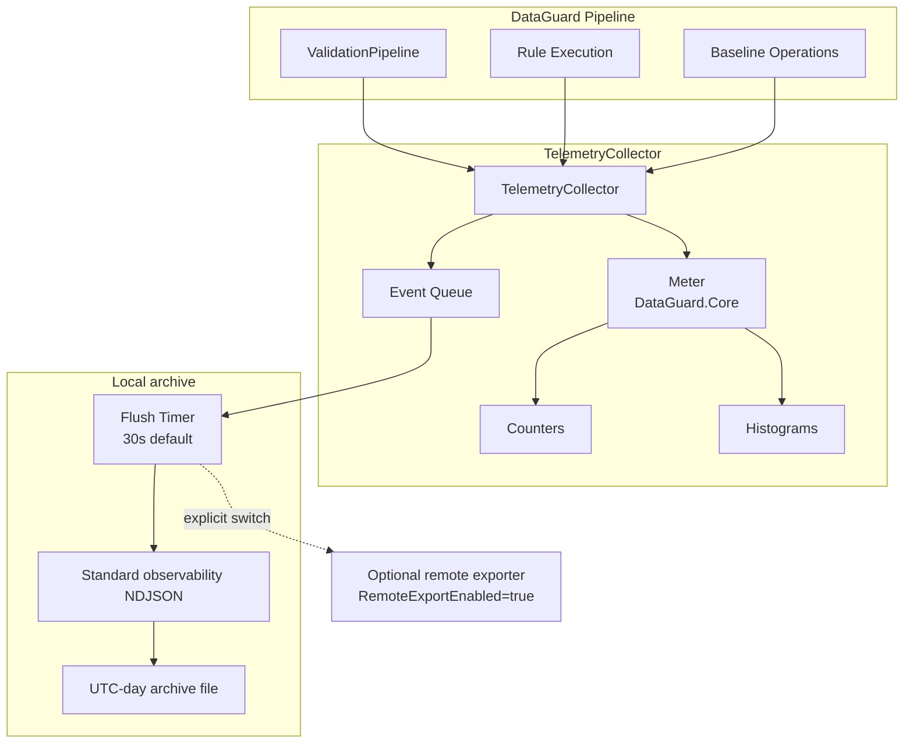

# Telemetry

> Source: `src/DataGuard.Core/Telemetry/TelemetryCollector.cs`

DataGuard's telemetry system is **opt-in, local-only** by default. It uses
`System.Diagnostics.Metrics` (the .NET 9 standard) and automatically writes a bounded,
allowlisted observability envelope to UTC-day NDJSON archive files when enabled. The legacy
NDJSON HTTP exporter is retained only as an explicit compatibility path; `RemoteExportEnabled`
defaults to `false` and no endpoint is contacted implicitly. See
[`docs/observability/local-file-observability.md`](../../observability/local-file-observability.md).

## Telemetry Flow



## TelemetryCollector

Central collector using `System.Diagnostics.Metrics`.

```csharp
public sealed class TelemetryCollector : IDisposable, IAsyncDisposable
{
    private readonly Meter _meter;
    private readonly TelemetryConfig _config;
    private readonly ConcurrentDictionary<string, Counter<long>> _counters = new();
    private readonly ConcurrentDictionary<string, Histogram<double>> _histograms = new();
    private readonly ConcurrentQueue<TelemetryEvent> _eventQueue = new();
    private readonly Timer? _flushTimer;

    public TelemetryCollector(TelemetryConfig config, Func<string, string, Task>? exportSink = null) { ... }
}
```

### Key Design Decisions

| Decision | Rationale |
|----------|-----------|
| **Opt-in only** | `TelemetryConfig.Enabled = false` by default |
| **Local archive first** | Events and metrics are written to daily NDJSON without network egress |
| **Standard .NET APIs** | Uses `System.Diagnostics.Metrics` for compatibility with OpenTelemetry |
| **Bounded/fail-open** | Queue, payload and record limits expose drops without failing validation |
| **Remote switch** | `RemoteExportEnabled=false` blocks the compatibility HTTP exporter |

`FlushAsync(CancellationToken)` is the additive asynchronous flush API. A single flush gate prevents overlapping exports; a failed or cancelled export returns its drained events to the queue for retry. `FlushEvents(object?)` remains for existing callers and waits for the same path. `TelemetryFlushResult` exposes no-work, in-progress, circuit-open, rejected-endpoint, failed/cancelled, and exported outcomes. Rejected endpoints intentionally drop queued events because no permitted destination exists.

The collector lifecycle is `Active → Stopping → Stopped`. `DisposeAsync()` transitions
through those states, stops timer-driven work, and makes one final bounded flush attempt;
new events are refused after `Stopping`. `TerminalLossCount` reports queued events
that remain undelivered when shutdown completes. The legacy synchronous `Dispose()` is
best effort. If a legacy export delegate does
not finish before its timeout, the collector retains its batch and holds the
single-flight gate until that delegate exits, so timer ticks cannot pile up more
exports.

## TelemetryConfig

```csharp
public sealed record TelemetryConfig(
    bool Enabled = false,
    string? ExportEndpoint = null,
    int FlushIntervalSeconds = 30,
    bool IncludeStackTraces = false);
```

| Field | Default | Description |
|-------|---------|-------------|
| `Enabled` | `false` | Master switch — nothing happens when false |
| `ExportEndpoint` | `null` | Legacy HTTPS URL; used only when `RemoteExportEnabled=true` and the file sink is disabled |
| `FlushIntervalSeconds` | `30` | Timer interval for event flushing |
| `IncludeStackTraces` | `false` | Include stack traces in events |
| `MaxQueuedEvents` | `10,000` | Maximum queued plus in-flight events; newer events are dropped after the cap |
| `MaxBatchEvents` | `1,000` | Maximum events in one export request |
| `MaxPayloadBytes` | `1,048,576` | UTF-8 byte ceiling for one request; an individually oversized event is dropped |
| `ExportTimeoutSeconds` | `5` | Bounded wait for one export delegate |
| `FileSinkEnabled` | `true` | Primary local archive when no exporter delegate is injected |
| `FileSinkDirectory` | OS local app-data | Root of `yyyy/MM/dd/` archive directories |
| `FileSinkFilePrefix` | `observability` | Daily file prefix |
| `ServiceName` / `ServiceVersion` / `EnvironmentName` | `dataguard` / `unknown` / `local` | Bounded resource metadata |
| `RemoteExportEnabled` | `false` | Explicit owner-gated legacy network switch |
| `IncludeEventDetails` | `false` | Optional redacted/capped event body; no body by default |
| `MaxRecordBytes` | `65,536` | Maximum serialized local record size |

The bounds are additive init properties, so the primary constructor and its
existing deconstruction shape remain unchanged. `DroppedEventCount` exposes losses
from queue, payload, and rejected-endpoint limits.

## Metrics

### Counters

| Counter | Tags | Description |
|---------|------|-------------|
| `rule.executions` | `rule`, `success` | Per-rule execution count |
| `validations.total` | — | Total validation runs |
| `violations.total` | — | Total violations found |
| `violations.errors` | — | Error-severity violations |
| `violations.warnings` | — | Warning-severity violations |

### Histograms

| Histogram | Unit | Tags | Description |
|-----------|------|------|-------------|
| `rule.duration` | ms | `rule`, `success` | Per-rule execution time |
| `validation.contracts` | — | — | Contracts per validation run |
| `validation.duration` | ms | — | Total validation time |

### Recording Methods

```csharp
// Counter increment
collector.IncrementCounter("rule.executions", 1, new[] {
    new KeyValuePair<string, object?>("rule", "DG002"),
    new KeyValuePair<string, object?>("success", "true"),
});

// Histogram value
collector.RecordHistogram("rule.duration", 42.5, new[] {
    new KeyValuePair<string, object?>("rule", "DG002"),
});

// Timed operation (automatic histogram)
using (collector.MeasureOperation("rule.duration"))
{
    await rule.ValidateAsync(contract, allContracts, ct);
}

// Event recording
collector.RecordEvent("BaselineCreated", "New baseline created", new Dictionary<string, object?>
{
    ["operation"] = "banking.reconciliation.execute",
    ["result"] = "success",
});
```

## TimedOperation

Automatic histogram recording via `IDisposable` pattern:

```csharp
public sealed class TimedOperation : IDisposable
{
    private readonly Stopwatch _stopwatch = Stopwatch.StartNew();

    public void Dispose()
    {
        _stopwatch.Stop();
        _collector.RecordHistogram(_operationName, _stopwatch.Elapsed.TotalMilliseconds, _tags);
    }
}
```

Usage:
```csharp
using (collector.MeasureOperation("validation.total"))
{
    // Timed code block
}
// Automatically records duration to histogram
```

## TelemetryEvent

Event-based tracking for non-numeric data:

```csharp
public sealed record TelemetryEvent(
    DateTimeOffset Timestamp,
    string EventType,
    string Details,
    IReadOnlyDictionary<string, object?> Properties);
```

Events are queued and flushed periodically to the local archive. `TelemetryEvent` remains the
legacy injected-export model; the file path serializes the safer `ObservabilityRecord` envelope.

## Export Mechanism

### NDJSON Format

The local sink writes newline-delimited JSON. The legacy `TelemetryEvent` shape below is shown only
for injected exporters; local files use the `ObservabilityRecord` envelope from the dedicated
[local sink guide](../../observability/local-file-observability.md):

```json
{"record_id":"01b3...","timestamp":"2026-08-25T10:30:00Z","signal":"log","event_name":"baseline.created","service_name":"dataguard","attributes":{"result":"success"},"resource":{"service.name":"dataguard"}}
{"record_id":"02c4...","timestamp":"2026-08-25T10:30:01Z","signal":"metric","event_name":"validation.duration","service_name":"dataguard","value":1500,"unit":"ms","attributes":{},"resource":{"service.name":"dataguard"}}
```

### Endpoint Validation

```csharp
private static bool IsAllowedExportEndpoint(string? endpoint)
{
    if (uri.Scheme == Uri.UriSchemeHttps) return true;
    return uri.Scheme == Uri.UriSchemeHttp
        && (uri.IsLoopback || uri.Host == "localhost");
}
```

Only the explicit compatibility exporter uses endpoint validation. The product-native file sink
does not create or call an endpoint.

### Circuit Breaker

After 3 consecutive export failures, the collector stops exporting until a new instance is created:

```csharp
private const int MaxConsecutiveExportFailures = 3;

if (_consecutiveExportFailures >= MaxConsecutiveExportFailures)
    return; // Stop exporting
```

This prevents telemetry failures from affecting the validation pipeline.

## ValidationMetrics

Convenience method for recording validation summary:

```csharp
public void RecordValidationSummary(
    int contractCount,
    int violationCount,
    int errorCount,
    int warningCount,
    TimeSpan totalDuration)
{
    IncrementCounter("validations.total", 1);
    IncrementCounter("violations.total", violationCount);
    IncrementCounter("violations.errors", errorCount);
    IncrementCounter("violations.warnings", warningCount);
    RecordHistogram("validation.contracts", contractCount);
    RecordHistogram("validation.duration", totalDuration.TotalMilliseconds);
}
```

## Integration with ValidationPipeline

```csharp
var pipeline = DataGuardApi.CreatePipeline(config)
    .WithTelemetry(new TelemetryConfig(
        Enabled: true)
    {
        FileSinkDirectory = "/var/lib/dataguard/observability/archive",
        RemoteExportEnabled = false,
    });

var result = await pipeline.ValidateAsync(contracts);
// Telemetry automatically recorded
```

## Security Guarantees

| Guarantee | Implementation |
|-----------|----------------|
| **Opt-in** | `Enabled = false` by default |
| **No secrets** | Allowlisted attributes; bodies omitted/redacted by default |
| **Local-first** | Metrics and events archive locally through bounded async writes |
| **No implicit endpoint** | Remote exporter requires `RemoteExportEnabled=true`; host routes are separate opt-in |
| **Circuit breaker** | 3 failures → stop exporting |
| **Shared HttpClient** | Applies only to the legacy compatibility exporter (SEC-005) |
