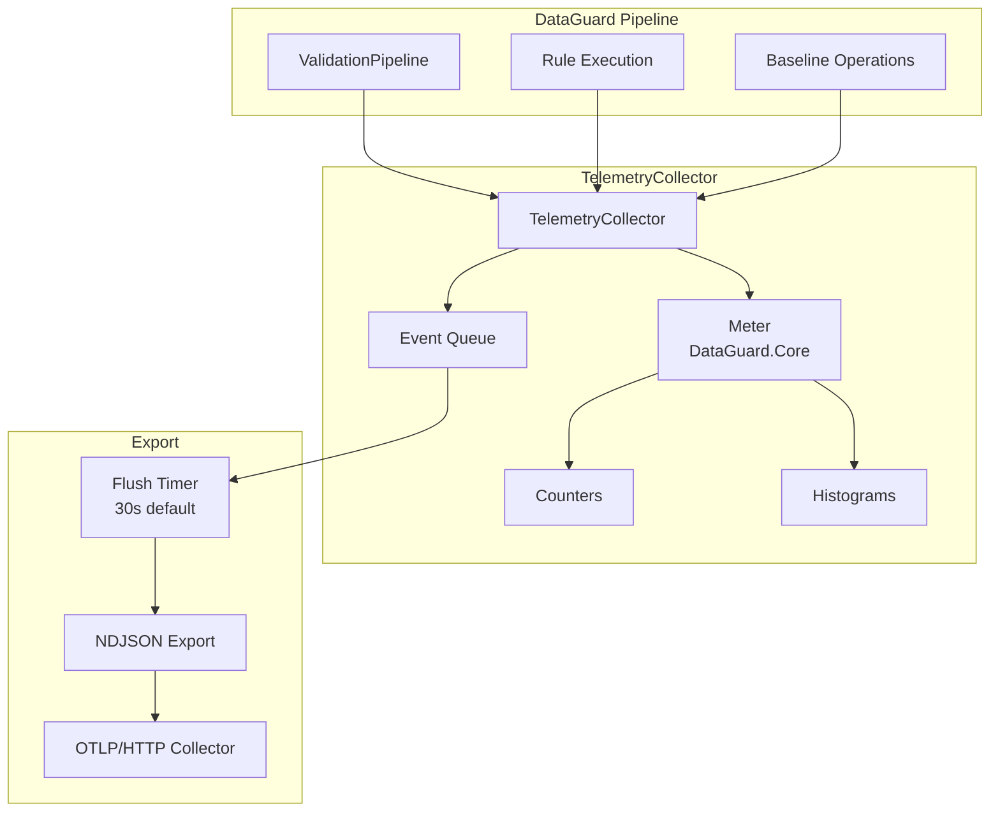

# Telemetry

> Source: `src/DataGuard.Core/Telemetry/TelemetryCollector.cs`

DataGuard's telemetry system is **opt-in, local-only** by default. It uses `System.Diagnostics.Metrics` (the .NET 9 standard) for counters and histograms, with an optional NDJSON export endpoint for integration with observability stacks.

## Telemetry Flow



## TelemetryCollector

Central collector using `System.Diagnostics.Metrics`.

```csharp
public sealed class TelemetryCollector : IDisposable
{
    private readonly Meter _meter;
    private readonly TelemetryConfig _config;
    private readonly ConcurrentDictionary<string, Counter<long>> _counters = new();
    private readonly ConcurrentDictionary<string, Histogram<double>> _histograms = new();
    private readonly ConcurrentQueue<TelemetryEvent> _eventQueue = new();
    private readonly Timer? _flushTimer;

    public TelemetryCollector(TelemetryConfig config, Func<string, string, Task>? exportSink = null) { ... }
}
```

### Key Design Decisions

| Decision | Rationale |
|----------|-----------|
| **Opt-in only** | `TelemetryConfig.Enabled = false` by default |
| **Local-only metrics** | No data sent externally unless export endpoint configured |
| **Standard .NET APIs** | Uses `System.Diagnostics.Metrics` for compatibility with OpenTelemetry |
| **Circuit breaker** | Stops exporting after 3 consecutive failures |
| **HTTPS-only export** | Rejects non-HTTPS endpoints (except localhost for dev) |

## TelemetryConfig

```csharp
public sealed record TelemetryConfig(
    bool Enabled = false,
    string? ExportEndpoint = null,
    int FlushIntervalSeconds = 30,
    bool IncludeStackTraces = false);
```

| Field | Default | Description |
|-------|---------|-------------|
| `Enabled` | `false` | Master switch — nothing happens when false |
| `ExportEndpoint` | `null` | HTTPS URL for NDJSON export |
| `FlushIntervalSeconds` | `30` | Timer interval for event flushing |
| `IncludeStackTraces` | `false` | Include stack traces in events |

## Metrics

### Counters

| Counter | Tags | Description |
|---------|------|-------------|
| `rule.executions` | `rule`, `success` | Per-rule execution count |
| `validations.total` | — | Total validation runs |
| `violations.total` | — | Total violations found |
| `violations.errors` | — | Error-severity violations |
| `violations.warnings` | — | Warning-severity violations |

### Histograms

| Histogram | Unit | Tags | Description |
|-----------|------|------|-------------|
| `rule.duration` | ms | `rule`, `success` | Per-rule execution time |
| `validation.contracts` | — | — | Contracts per validation run |
| `validation.duration` | ms | — | Total validation time |

### Recording Methods

```csharp
// Counter increment
collector.IncrementCounter("rule.executions", 1, new[] {
    new KeyValuePair<string, object?>("rule", "DG002"),
    new KeyValuePair<string, object?>("success", "true"),
});

// Histogram value
collector.RecordHistogram("rule.duration", 42.5, new[] {
    new KeyValuePair<string, object?>("rule", "DG002"),
});

// Timed operation (automatic histogram)
using (collector.MeasureOperation("rule.duration"))
{
    await rule.ValidateAsync(contract, allContracts, ct);
}

// Event recording
collector.RecordEvent("BaselineCreated", "New baseline created", new Dictionary<string, object?>
{
    ["violationCount"] = 42,
    ["schemaVersion"] = "1.0",
});
```

## TimedOperation

Automatic histogram recording via `IDisposable` pattern:

```csharp
public sealed class TimedOperation : IDisposable
{
    private readonly Stopwatch _stopwatch = Stopwatch.StartNew();

    public void Dispose()
    {
        _stopwatch.Stop();
        _collector.RecordHistogram(_operationName, _stopwatch.Elapsed.TotalMilliseconds, _tags);
    }
}
```

Usage:
```csharp
using (collector.MeasureOperation("validation.total"))
{
    // Timed code block
}
// Automatically records duration to histogram
```

## TelemetryEvent

Event-based tracking for non-numeric data:

```csharp
public sealed record TelemetryEvent(
    DateTimeOffset Timestamp,
    string EventType,
    string Details,
    IReadOnlyDictionary<string, object?> Properties);
```

Events are queued and flushed periodically to the export endpoint.

## Export Mechanism

### NDJSON Format

Events are exported as newline-delimited JSON:

```json
{"Timestamp":"2026-08-25T10:30:00Z","EventType":"BaselineCreated","Details":"New baseline","Properties":{"violationCount":42}}
{"Timestamp":"2026-08-25T10:30:01Z","EventType":"ValidationComplete","Details":"Validation finished","Properties":{"duration":1500}}
```

### Endpoint Validation

```csharp
private static bool IsAllowedExportEndpoint(string? endpoint)
{
    if (uri.Scheme == Uri.UriSchemeHttps) return true;
    return uri.Scheme == Uri.UriSchemeHttp
        && (uri.IsLoopback || uri.Host == "localhost");
}
```

Only HTTPS endpoints (or loopback HTTP for development) are allowed.

### Circuit Breaker

After 3 consecutive export failures, the collector stops exporting until a new instance is created:

```csharp
private const int MaxConsecutiveExportFailures = 3;

if (_consecutiveExportFailures >= MaxConsecutiveExportFailures)
    return; // Stop exporting
```

This prevents telemetry failures from affecting the validation pipeline.

## ValidationMetrics

Convenience method for recording validation summary:

```csharp
public void RecordValidationSummary(
    int contractCount,
    int violationCount,
    int errorCount,
    int warningCount,
    TimeSpan totalDuration)
{
    IncrementCounter("validations.total", 1);
    IncrementCounter("violations.total", violationCount);
    IncrementCounter("violations.errors", errorCount);
    IncrementCounter("violations.warnings", warningCount);
    RecordHistogram("validation.contracts", contractCount);
    RecordHistogram("validation.duration", totalDuration.TotalMilliseconds);
}
```

## Integration with ValidationPipeline

```csharp
var pipeline = DataGuardApi.CreatePipeline(config)
    .WithTelemetry(new TelemetryConfig(
        Enabled: true,
        ExportEndpoint: "https://otel.example.com/v1/logs"));

var result = await pipeline.ValidateAsync(contracts);
// Telemetry automatically recorded
```

## Security Guarantees

| Guarantee | Implementation |
|-----------|----------------|
| **Opt-in** | `Enabled = false` by default |
| **No secrets** | Only numeric metrics and event types exported |
| **HTTPS-only** | Non-HTTPS endpoints rejected |
| **Local-first** | Metrics available via `System.Diagnostics.Metrics` listeners |
| **Circuit breaker** | 3 failures → stop exporting |
| **Shared HttpClient** | Prevents socket exhaustion (SEC-005) |
