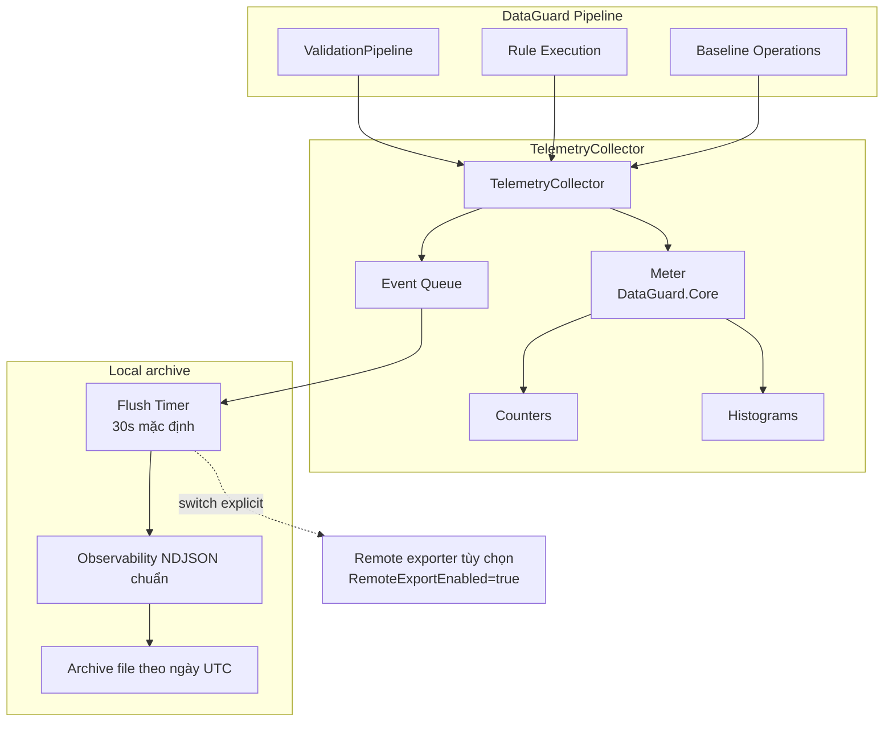

# Telemetry

> Nguồn: `src/DataGuard.Core/Telemetry/TelemetryCollector.cs`

Hệ thống telemetry của DataGuard là **opt-in, chỉ local** theo mặc định. Nó sử dụng
`System.Diagnostics.Metrics` (tiêu chuẩn .NET 9) và tự động ghi envelope observability bounded,
allowlist vào file archive NDJSON theo ngày UTC khi được bật. Legacy NDJSON HTTP exporter chỉ còn là
compatibility path explicit; `RemoteExportEnabled` mặc định `false` và không gọi endpoint ngầm.
Xem [`local-file-observability.md`](../../observability/local-file-observability.md).

## Luồng Telemetry



## TelemetryCollector

Collector trung tâm sử dụng `System.Diagnostics.Metrics`.

```csharp
public sealed class TelemetryCollector : IDisposable, IAsyncDisposable
{
    private readonly Meter _meter;
    private readonly TelemetryConfig _config;
    private readonly ConcurrentDictionary<string, Counter<long>> _counters = new();
    private readonly ConcurrentDictionary<string, Histogram<double>> _histograms = new();
    private readonly ConcurrentQueue<TelemetryEvent> _eventQueue = new();
    private readonly Timer? _flushTimer;

    public TelemetryCollector(TelemetryConfig config, Func<string, string, Task>? exportSink = null) { ... }
}
```

### Quyết Định Thiết Kế Chính

| Quyết định | Lý do |
|------------|-------|
| **Chỉ opt-in** | `TelemetryConfig.Enabled = false` theo mặc định |
| **Local archive trước** | Event và metric ghi vào NDJSON theo ngày, không egress mạng |
| **APIs .NET tiêu chuẩn** | Sử dụng `System.Diagnostics.Metrics` cho tương thích OpenTelemetry |
| **Bounded/fail-open** | Giới hạn queue/payload/record, đo drop mà không fail validation |
| **Remote switch** | `RemoteExportEnabled=false` khóa HTTP exporter compatibility |

`FlushAsync(CancellationToken)` là API flush bất đồng bộ được bổ sung. Một flush gate duy nhất ngăn export chồng nhau; export lỗi hoặc bị hủy đưa events đã lấy ra trở lại queue để retry. `FlushEvents(object?)` vẫn giữ cho caller cũ và chờ cùng đường thực thi. `TelemetryFlushResult` cho phép quan sát các trạng thái no-work, in-progress, circuit-open, rejected-endpoint, failed/cancelled và exported. Endpoint bị từ chối chủ động bỏ queue vì không có đích hợp lệ để gửi.

Vòng đời collector là `Active → Stopping → Stopped`. `DisposeAsync()` chuyển qua các
trạng thái này, dừng timer và thử flush cuối có giới hạn; event mới bị từ chối sau
`Stopping`. `TerminalLossCount` cho biết các event còn trong queue nhưng không thể
gửi khi shutdown hoàn tất. `Dispose()` đồng bộ cũ chỉ best effort. Nếu delegate export cũ không kết thúc trước timeout, collector giữ batch
và giữ single-flight gate đến khi delegate kết thúc, nên các timer tick không tạo
nhiều export chồng lấp.

## TelemetryConfig

```csharp
public sealed record TelemetryConfig(
    bool Enabled = false,
    string? ExportEndpoint = null,
    int FlushIntervalSeconds = 30,
    bool IncludeStackTraces = false);
```

| Trường | Mặc định | Mô tả |
|--------|----------|-------|
| `Enabled` | `false` | Công tắc chính — không hoạt động khi false |
| `ExportEndpoint` | `null` | URL HTTPS legacy; chỉ dùng khi bật remote và tắt file sink |
| `FlushIntervalSeconds` | `30` | Khoảng thời gian timer cho flush events |
| `IncludeStackTraces` | `false` | Bao gồm stack traces trong events |
| `MaxQueuedEvents` | `10.000` | Số event tối đa trong queue cộng batch đang chạy; event mới hơn bị bỏ khi đầy |
| `MaxBatchEvents` | `1.000` | Số event tối đa trong một export request |
| `MaxPayloadBytes` | `1.048.576` | Giới hạn byte UTF-8 mỗi request; event đơn lẻ quá lớn sẽ bị bỏ |
| `ExportTimeoutSeconds` | `5` | Thời gian chờ có giới hạn cho một delegate export |
| `FileSinkEnabled` | `true` | Archive local chính khi không inject exporter delegate |
| `FileSinkDirectory` | local app-data của OS | Gốc thư mục archive `yyyy/MM/dd/` |
| `FileSinkFilePrefix` | `observability` | Prefix file hằng ngày |
| `ServiceName` / `ServiceVersion` / `EnvironmentName` | `dataguard` / `unknown` / `local` | Resource metadata bounded |
| `RemoteExportEnabled` | `false` | Công tắc network legacy do owner kiểm soát |
| `IncludeEventDetails` | `false` | Body event tùy chọn, đã redact/cap; mặc định không body |
| `MaxRecordBytes` | `65.536` | Kích thước tối đa một record local |

Các giới hạn là init property được thêm vào nên primary constructor và deconstruction
hiện có không đổi. `DroppedEventCount` cho biết event mất do giới hạn queue, payload
hoặc endpoint bị từ chối.

## Metrics

### Counters

| Counter | Tags | Mô tả |
|---------|------|-------|
| `rule.executions` | `rule`, `success` | Số lần thực thi mỗi rule |
| `validations.total` | — | Tổng số lần validation |
| `violations.total` | — | Tổng violations tìm thấy |
| `violations.errors` | — | Violations mức Error |
| `violations.warnings` | — | Violations mức Warning |

### Histograms

| Histogram | Đơn vị | Tags | Mô tả |
|-----------|--------|------|-------|
| `rule.duration` | ms | `rule`, `success` | Thời gian thực thi mỗi rule |
| `validation.contracts` | — | — | Contracts mỗi lần validation |
| `validation.duration` | ms | — | Tổng thời gian validation |

### Phương Thức Ghi

```csharp
// Tăng counter
collector.IncrementCounter("rule.executions", 1, new[] {
    new KeyValuePair<string, object?>("rule", "DG002"),
    new KeyValuePair<string, object?>("success", "true"),
});

// Giá trị histogram
collector.RecordHistogram("rule.duration", 42.5, new[] {
    new KeyValuePair<string, object?>("rule", "DG002"),
});

// Operation có hẹn giờ (histogram tự động)
using (collector.MeasureOperation("rule.duration"))
{
    await rule.ValidateAsync(contract, allContracts, ct);
}

// Ghi event
collector.RecordEvent("BaselineCreated", "New baseline created", new Dictionary<string, object?>
{
    ["violationCount"] = 42,
    ["schemaVersion"] = "1.0",
});
```

## TimedOperation

Ghi histogram tự động qua mẫu `IDisposable`:

```csharp
public sealed class TimedOperation : IDisposable
{
    private readonly Stopwatch _stopwatch = Stopwatch.StartNew();

    public void Dispose()
    {
        _stopwatch.Stop();
        _collector.RecordHistogram(_operationName, _stopwatch.Elapsed.TotalMilliseconds, _tags);
    }
}
```

Sử dụng:
```csharp
using (collector.MeasureOperation("validation.total"))
{
    // Khối code được đo thời gian
}
// Tự động ghi thời gian vào histogram
```

## TelemetryEvent

Theo dõi dựa trên event cho dữ liệu không phải số:

```csharp
public sealed record TelemetryEvent(
    DateTimeOffset Timestamp,
    string EventType,
    string Details,
    IReadOnlyDictionary<string, object?> Properties);
```

Events được xếp hàng và flush định kỳ đến local archive. `TelemetryEvent` vẫn giữ cho injected
export legacy; đường file dùng envelope `ObservabilityRecord` an toàn hơn.

## Cơ Chế Export

### Định Dạng NDJSON

Events được export dưới dạng JSON phân tách dòng:

```json
{"Timestamp":"2026-08-25T10:30:00Z","EventType":"BaselineCreated","Details":"New baseline","Properties":{"violationCount":42}}
{"Timestamp":"2026-08-25T10:30:01Z","EventType":"ValidationComplete","Details":"Validation finished","Properties":{"duration":1500}}
```

### Xác Thực Endpoint

```csharp
private static bool IsAllowedExportEndpoint(string? endpoint)
{
    if (uri.Scheme == Uri.UriSchemeHttps) return true;
    return uri.Scheme == Uri.UriSchemeHttp
        && (uri.IsLoopback || uri.Host == "localhost");
}
```

Chỉ compatibility exporter explicit mới dùng endpoint validation. File sink native không tạo hoặc
gọi endpoint.

### Circuit Breaker

Sau 3 lần thất bại export liên tiếp, collector dừng export cho đến khi tạo instance mới:

```csharp
private const int MaxConsecutiveExportFailures = 3;

if (_consecutiveExportFailures >= MaxConsecutiveExportFailures)
    return; // Dừng export
```

Điều này ngăn lỗi telemetry ảnh hưởng đến validation pipeline.

## Tích Hợp Với ValidationPipeline

```csharp
var pipeline = DataGuardApi.CreatePipeline(config)
    .WithTelemetry(new TelemetryConfig(
        Enabled: true)
    {
        FileSinkDirectory = "/var/lib/dataguard/observability/archive",
        RemoteExportEnabled = false,
    });

var result = await pipeline.ValidateAsync(contracts);
// Telemetry tự động ghi nhận
```

## Đảm Bảo Bảo Mật

| Đảm bảo | Triển khai |
|----------|------------|
| **Opt-in** | `Enabled = false` theo mặc định |
| **Không secrets** | Attributes allowlist; body mặc định bỏ hoặc redact |
| **Local-first** | Metrics/event archive local qua async write bounded |
| **Không endpoint ngầm** | Remote cần `RemoteExportEnabled=true`; host routes là opt-in riêng |
| **Circuit breaker** | 3 lần thất bại → dừng export |
| **Shared HttpClient** | Chỉ áp dụng legacy exporter compatibility (SEC-005) |
