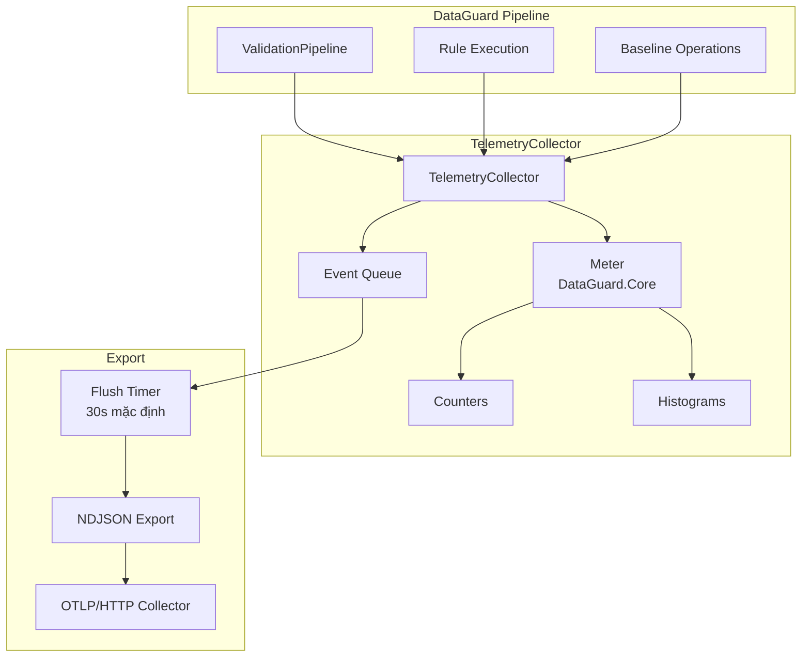

# Telemetry

> Nguồn: `src/DataGuard.Core/Telemetry/TelemetryCollector.cs`

Hệ thống telemetry của DataGuard là **opt-in, chỉ local** theo mặc định. Nó sử dụng `System.Diagnostics.Metrics` (tiêu chuẩn .NET 9) cho counters và histograms, với endpoint export NDJSON tùy chọn để tích hợp với các stacks observability.

## Luồng Telemetry



## TelemetryCollector

Collector trung tâm sử dụng `System.Diagnostics.Metrics`.

```csharp
public sealed class TelemetryCollector : IDisposable
{
    private readonly Meter _meter;
    private readonly TelemetryConfig _config;
    private readonly ConcurrentDictionary<string, Counter<long>> _counters = new();
    private readonly ConcurrentDictionary<string, Histogram<double>> _histograms = new();
    private readonly ConcurrentQueue<TelemetryEvent> _eventQueue = new();
    private readonly Timer? _flushTimer;

    public TelemetryCollector(TelemetryConfig config, Func<string, string, Task>? exportSink = null) { ... }
}
```

### Quyết Định Thiết Kế Chính

| Quyết định | Lý do |
|------------|-------|
| **Chỉ opt-in** | `TelemetryConfig.Enabled = false` theo mặc định |
| **Chỉ metrics local** | Không gửi dữ liệu ra ngoài trừ khi cấu hình export endpoint |
| **APIs .NET tiêu chuẩn** | Sử dụng `System.Diagnostics.Metrics` cho tương thích OpenTelemetry |
| **Circuit breaker** | Dừng export sau 3 lần thất bại liên tiếp |
| **Chỉ export HTTPS** | Từ chối endpoints không phải HTTPS (trừ localhost cho dev) |

## TelemetryConfig

```csharp
public sealed record TelemetryConfig(
    bool Enabled = false,
    string? ExportEndpoint = null,
    int FlushIntervalSeconds = 30,
    bool IncludeStackTraces = false);
```

| Trường | Mặc định | Mô tả |
|--------|----------|-------|
| `Enabled` | `false` | Công tắc chính — không hoạt động khi false |
| `ExportEndpoint` | `null` | URL HTTPS cho export NDJSON |
| `FlushIntervalSeconds` | `30` | Khoảng thời gian timer cho flush events |
| `IncludeStackTraces` | `false` | Bao gồm stack traces trong events |

## Metrics

### Counters

| Counter | Tags | Mô tả |
|---------|------|-------|
| `rule.executions` | `rule`, `success` | Số lần thực thi mỗi rule |
| `validations.total` | — | Tổng số lần validation |
| `violations.total` | — | Tổng violations tìm thấy |
| `violations.errors` | — | Violations mức Error |
| `violations.warnings` | — | Violations mức Warning |

### Histograms

| Histogram | Đơn vị | Tags | Mô tả |
|-----------|--------|------|-------|
| `rule.duration` | ms | `rule`, `success` | Thời gian thực thi mỗi rule |
| `validation.contracts` | — | — | Contracts mỗi lần validation |
| `validation.duration` | ms | — | Tổng thời gian validation |

### Phương Thức Ghi

```csharp
// Tăng counter
collector.IncrementCounter("rule.executions", 1, new[] {
    new KeyValuePair<string, object?>("rule", "DG002"),
    new KeyValuePair<string, object?>("success", "true"),
});

// Giá trị histogram
collector.RecordHistogram("rule.duration", 42.5, new[] {
    new KeyValuePair<string, object?>("rule", "DG002"),
});

// Operation có hẹn giờ (histogram tự động)
using (collector.MeasureOperation("rule.duration"))
{
    await rule.ValidateAsync(contract, allContracts, ct);
}

// Ghi event
collector.RecordEvent("BaselineCreated", "New baseline created", new Dictionary<string, object?>
{
    ["violationCount"] = 42,
    ["schemaVersion"] = "1.0",
});
```

## TimedOperation

Ghi histogram tự động qua mẫu `IDisposable`:

```csharp
public sealed class TimedOperation : IDisposable
{
    private readonly Stopwatch _stopwatch = Stopwatch.StartNew();

    public void Dispose()
    {
        _stopwatch.Stop();
        _collector.RecordHistogram(_operationName, _stopwatch.Elapsed.TotalMilliseconds, _tags);
    }
}
```

Sử dụng:
```csharp
using (collector.MeasureOperation("validation.total"))
{
    // Khối code được đo thời gian
}
// Tự động ghi thời gian vào histogram
```

## TelemetryEvent

Theo dõi dựa trên event cho dữ liệu không phải số:

```csharp
public sealed record TelemetryEvent(
    DateTimeOffset Timestamp,
    string EventType,
    string Details,
    IReadOnlyDictionary<string, object?> Properties);
```

Events được xếp hàng và flush định kỳ đến export endpoint.

## Cơ Chế Export

### Định Dạng NDJSON

Events được export dưới dạng JSON phân tách dòng:

```json
{"Timestamp":"2026-08-25T10:30:00Z","EventType":"BaselineCreated","Details":"New baseline","Properties":{"violationCount":42}}
{"Timestamp":"2026-08-25T10:30:01Z","EventType":"ValidationComplete","Details":"Validation finished","Properties":{"duration":1500}}
```

### Xác Thực Endpoint

```csharp
private static bool IsAllowedExportEndpoint(string? endpoint)
{
    if (uri.Scheme == Uri.UriSchemeHttps) return true;
    return uri.Scheme == Uri.UriSchemeHttp
        && (uri.IsLoopback || uri.Host == "localhost");
}
```

Chỉ endpoints HTTPS (hoặc loopback HTTP cho phát triển) được phép.

### Circuit Breaker

Sau 3 lần thất bại export liên tiếp, collector dừng export cho đến khi tạo instance mới:

```csharp
private const int MaxConsecutiveExportFailures = 3;

if (_consecutiveExportFailures >= MaxConsecutiveExportFailures)
    return; // Dừng export
```

Điều này ngăn lỗi telemetry ảnh hưởng đến validation pipeline.

## Tích Hợp Với ValidationPipeline

```csharp
var pipeline = DataGuardApi.CreatePipeline(config)
    .WithTelemetry(new TelemetryConfig(
        Enabled: true,
        ExportEndpoint: "https://otel.example.com/v1/logs"));

var result = await pipeline.ValidateAsync(contracts);
// Telemetry tự động ghi nhận
```

## Đảm Bảo Bảo Mật

| Đảm bảo | Triển khai |
|----------|------------|
| **Opt-in** | `Enabled = false` theo mặc định |
| **Không secrets** | Chỉ export metrics số và loại event |
| **Chỉ HTTPS** | Từ chối endpoints không phải HTTPS |
| **Local-first** | Metrics có sẵn qua `System.Diagnostics.Metrics` listeners |
| **Circuit breaker** | 3 lần thất bại → dừng export |
| **Shared HttpClient** | Ngăn chặn cạn kiệt socket (SEC-005) |
