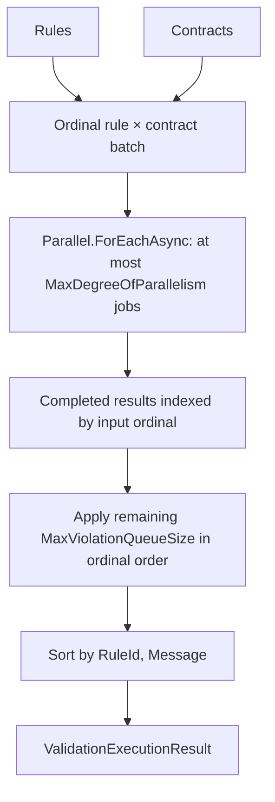

# Concurrent Validation Engine

> Source: `src/DataGuard.Core/Validation/ConcurrentValidationEngine.cs`

`ConcurrentValidationEngine` validates every rule/contract pair with bounded parallelism. It processes a bounded, ordinal batch at a time, collects each job's completed result by its input position, then applies the violation cap in that position order. Output is finally sorted by `(RuleId, Message)`.

## Execution flow



`GraphValidationExecutor` obtains dependency levels from `RuleDependencyGraph` and runs one level at a time. Rules within a level may run concurrently; a dependent level never starts before every job in its prerequisite level completes. The violation cap is global across all levels.

## Configuration and outcomes

| Parameter | Meaning |
|---|---|
| `maxDegreeOfParallelism = 0` | Uses `Environment.ProcessorCount` (minimum one). |
| `maxViolationQueueSize = 100,000` | Maximum retained violations. A negative value uses this default; zero retains none while still evaluating work. |
| `ValidationExecutionResult` | Contains retained violations, `IsIncomplete`, and an exact dropped count when known. |

The engine evaluates every scheduled job even once the retained cap is full. Thus zero cap is **complete** when no job finds a violation, and **incomplete** with an exact dropped count when findings exist. `ValidateDetailedAsync` exposes that outcome. The legacy `ValidateAsync` cannot represent an incomplete result and throws `ValidationIncompleteException` rather than return a partial list.

If a rule throws, including an admitted in-process plugin, the pipeline contains the exception at the rule boundary, records that rule as `Failed`, and marks the run incomplete. Other rules can still run; caller cancellation is propagated rather than being recorded as a rule failure.

## Direct use

```csharp
var engine = new ConcurrentValidationEngine(
    maxDegreeOfParallelism: 8,
    maxViolationQueueSize: 50_000);

var result = await engine.ValidateDetailedAsync(contracts, rules, cancellationToken);
if (result.IsIncomplete)
    throw new ValidationIncompleteException("Validation was truncated.", result);
```

`CancellationToken` is supplied to `Parallel.ForEachAsync` and every rule invocation. Inputs are read-only; mutation is limited to the coordinator after parallel jobs finish, so there is no concurrent result collection.

## Pipeline behavior

When `DataGuardConfiguration.EnableConcurrentValidation` is true, `ValidationPipeline` uses `GraphValidationExecutor`. It preserves the execution outcome after baseline filtering: a baseline may remove retained findings from the displayed list, but it cannot convert an incomplete run into a clean result. `ValidationResult.IsClean` is true only when there are no displayed violations and execution completed.

## Operational characteristics

| Aspect | Behavior |
|---|---|
| Parallel work | At most `MaxDegreeOfParallelism` rule executions at once. |
| Dependency order | Graph levels are sequential; rules in one level can run in parallel. |
| Retained findings | Bounded by the configured cap across the full graph execution. |
| Ordering | Deterministic `(RuleId, Message)` ordering. |
| Cancellation | Stops queued/active work through the supplied token. |
