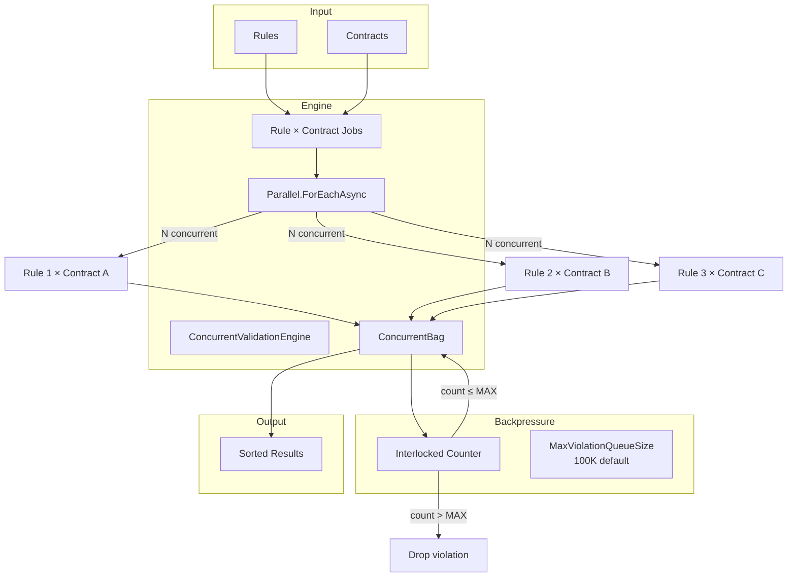
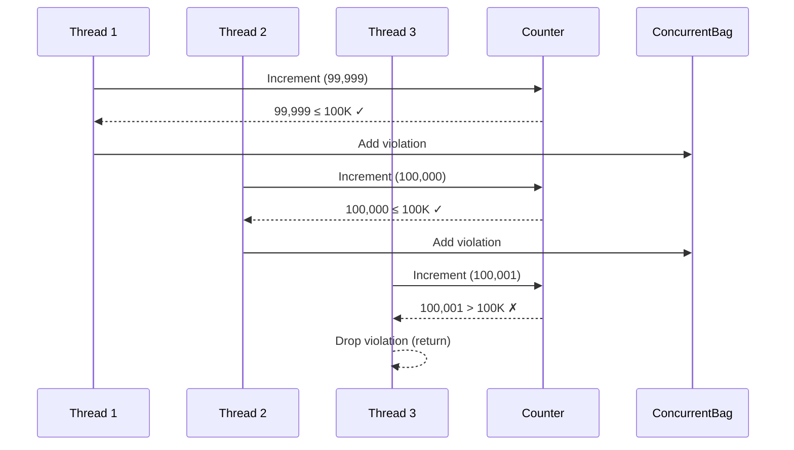

# Concurrent Validation Engine

> Source: `src/DataGuard.Core/Validation/ConcurrentValidationEngine.cs`

The concurrent validation engine runs contract rules against descriptors with bounded parallelism and backpressure. It uses `Parallel.ForEachAsync` for efficient CPU utilization while preventing memory exhaustion from unbounded violation queues.

## Parallel Validation Flow



## ConcurrentValidationEngine

```csharp
public sealed class ConcurrentValidationEngine
{
    private readonly int _maxDegreeOfParallelism;
    private readonly int _maxViolationQueueSize;

    public ConcurrentValidationEngine(
        int maxDegreeOfParallelism = 0,
        int maxViolationQueueSize = 100_000) { ... }

    public async Task<IReadOnlyList<ContractViolation>> ValidateAsync(
        IReadOnlyList<ContractDescriptor> contracts,
        IReadOnlyList<IContractRule> rules,
        CancellationToken cancellationToken = default) { ... }
}
```

### Configuration

| Parameter | Default | Description |
|-----------|---------|-------------|
| `maxDegreeOfParallelism` | `0` (auto = `Environment.ProcessorCount`) | Maximum concurrent rule executions |
| `maxViolationQueueSize` | `100,000` | Backpressure bound on violation collection |

### Execution Model

```csharp
var jobs = from rule in rules
           from contract in contracts
           select (rule, contract);

await Parallel.ForEachAsync(
    jobs,
    new ParallelOptions
    {
        MaxDegreeOfParallelism = _maxDegreeOfParallelism,
        CancellationToken = cancellationToken,
    },
    async (job, ct) =>
    {
        var violations = await job.rule.ValidateAsync(job.contract, contracts, ct);
        foreach (var violation in violations)
        {
            if (Interlocked.Increment(ref addedCount) > _maxViolationQueueSize)
                return; // Backpressure: stop adding beyond the bound

            results.Add(violation);
        }
    });
```

**Key design decisions:**

1. **Cartesian product** — every rule runs against every contract (rules internally filter by descriptor type)
2. **Bounded parallelism** — `MaxDegreeOfParallelism` prevents thread pool exhaustion
3. **Atomic backpressure** — `Interlocked.Increment` ensures thread-safe count checking without locks
4. **ConcurrentBag** — lock-free collection for concurrent adds from multiple threads

### Backpressure Mechanism



The backpressure uses `Interlocked.Increment` for lock-free atomic counting. When the count exceeds `MaxViolationQueueSize`, new violations are silently dropped. The final result set is capped at `MaxViolationQueueSize` entries.

### Result Ordering

Results are sorted deterministically for reproducible output:

```csharp
return results.Take(_maxViolationQueueSize)
    .OrderBy(v => v.RuleId, StringComparer.Ordinal)
    .ThenBy(v => v.Message, StringComparer.Ordinal)
    .ToList();
```

## Performance Characteristics

| Metric | Behavior |
|--------|----------|
| **CPU utilization** | Scales with `Environment.ProcessorCount` |
| **Memory** | Bounded by `MaxViolationQueueSize` × average violation size |
| **Thread safety** | `ConcurrentBag` + `Interlocked` — no locks |
| **Cancellation** | Respects `CancellationToken` across all parallel jobs |
| **Determinism** | Results sorted by (RuleId, Message) regardless of execution order |

## Usage

### Direct Usage

```csharp
var engine = new ConcurrentValidationEngine(
    maxDegreeOfParallelism: 8,
    maxViolationQueueSize: 50_000);

var violations = await engine.ValidateAsync(contracts, rules, cancellationToken);
```

### Via ValidationPipeline

The `ValidationPipeline` uses the engine internally when `EnableConcurrentValidation` is true:

```csharp
var pipeline = DataGuardApi.CreatePipeline(config);
var result = await pipeline.ValidateAsync(contracts);
```

## Comparison with Sequential Execution

| Aspect | Sequential | Concurrent |
|--------|-----------|------------|
| **Speed** | Baseline | 2-4× faster on multi-core |
| **Memory** | Linear | Bounded by backpressure |
| **Ordering** | Execution order | Sorted deterministically |
| **Cancellation** | Per-rule | Per-batch |
| **Complexity** | Simple | Thread-safe collection + atomic counter |

## Thread Safety Guarantees

1. **ConcurrentBag** — designed for concurrent `Add()` from multiple threads
2. **Interlocked.Increment** — atomic counter without locks
3. **Immutable input** — `IReadOnlyList` contracts and rules are not modified
4. **No shared mutable state** — each rule execution is independent
5. **CancellationToken** — propagated to all parallel operations
