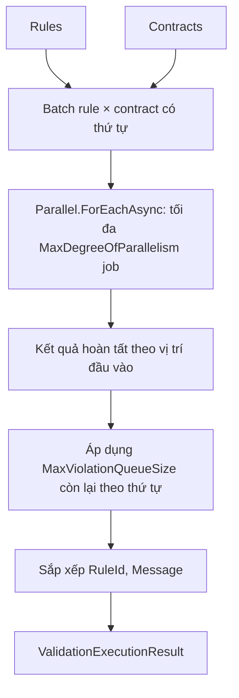

# Engine validation đồng thời

> Source: `src/DataGuard.Core/Validation/ConcurrentValidationEngine.cs`

`ConcurrentValidationEngine` kiểm tra mọi cặp rule/contract với mức song song bị chặn. Engine xử lý từng batch có kích thước bị chặn theo thứ tự đầu vào, thu kết quả của từng job theo vị trí đó, rồi áp dụng giới hạn violation theo đúng thứ tự. Kết quả cuối cùng được sắp xếp theo `(RuleId, Message)`.

## Luồng thực thi



`GraphValidationExecutor` lấy các level phụ thuộc từ `RuleDependencyGraph` và chạy lần lượt từng level. Rules trong cùng level có thể chạy song song; level phụ thuộc không bắt đầu trước khi mọi job của level tiền đề hoàn tất. Giới hạn violation dùng chung cho toàn bộ các level.

## Cấu hình và kết quả

| Tham số | Ý nghĩa |
|---|---|
| `maxDegreeOfParallelism = 0` | Dùng `Environment.ProcessorCount` (ít nhất một). |
| `maxViolationQueueSize = 100,000` | Số violation tối đa được giữ. Giá trị âm dùng default này; giá trị zero không giữ violation nhưng vẫn đánh giá công việc. |
| `ValidationExecutionResult` | Chứa violations được giữ, `IsIncomplete`, và số lượng bị bỏ chính xác khi biết được. |

Engine vẫn đánh giá mọi job đã lập lịch sau khi cap giữ kết quả đã đầy. Vì vậy cap zero là **complete** nếu không job nào tìm thấy violation, và **incomplete** với số lượng bị bỏ chính xác nếu có finding. `ValidateDetailedAsync` trả về trạng thái đó. `ValidateAsync` legacy không biểu diễn được kết quả incomplete và ném `ValidationIncompleteException` thay vì trả về danh sách một phần.

Khi một rule ném exception, kể cả plugin in-process đã được nhận, pipeline chặn exception tại ranh giới rule, ghi rule đó là `Failed` và đánh dấu run incomplete. Các rule khác vẫn có thể chạy; cancellation của caller được truyền tiếp thay vì bị ghi thành lỗi rule.

## Dùng trực tiếp

```csharp
var engine = new ConcurrentValidationEngine(
    maxDegreeOfParallelism: 8,
    maxViolationQueueSize: 50_000);

var result = await engine.ValidateDetailedAsync(contracts, rules, cancellationToken);
if (result.IsIncomplete)
    throw new ValidationIncompleteException("Validation was truncated.", result);
```

`CancellationToken` được truyền vào `Parallel.ForEachAsync` và mọi lần gọi rule. Input chỉ đọc; coordinator chỉ thay đổi kết quả sau khi các job song song hoàn tất, nên không có thu thập kết quả đồng thời.

## Hành vi pipeline

Khi `DataGuardConfiguration.EnableConcurrentValidation` là true, `ValidationPipeline` dùng `GraphValidationExecutor`. Pipeline giữ nguyên trạng thái thực thi sau khi lọc baseline: baseline có thể loại finding đã giữ khỏi danh sách hiển thị, nhưng không thể biến một run incomplete thành clean. `ValidationResult.IsClean` chỉ true khi không có violation hiển thị và thực thi đã complete.

## Đặc tính vận hành

| Khía cạnh | Hành vi |
|---|---|
| Công việc song song | Tối đa `MaxDegreeOfParallelism` rule executions cùng lúc. |
| Thứ tự phụ thuộc | Graph levels tuần tự; rules trong một level có thể song song. |
| Findings được giữ | Bị chặn bởi cap cấu hình trên toàn bộ graph execution. |
| Thứ tự | Xác định theo `(RuleId, Message)`. |
| Cancellation | Dừng công việc đang chờ/đang chạy qua token được truyền. |
