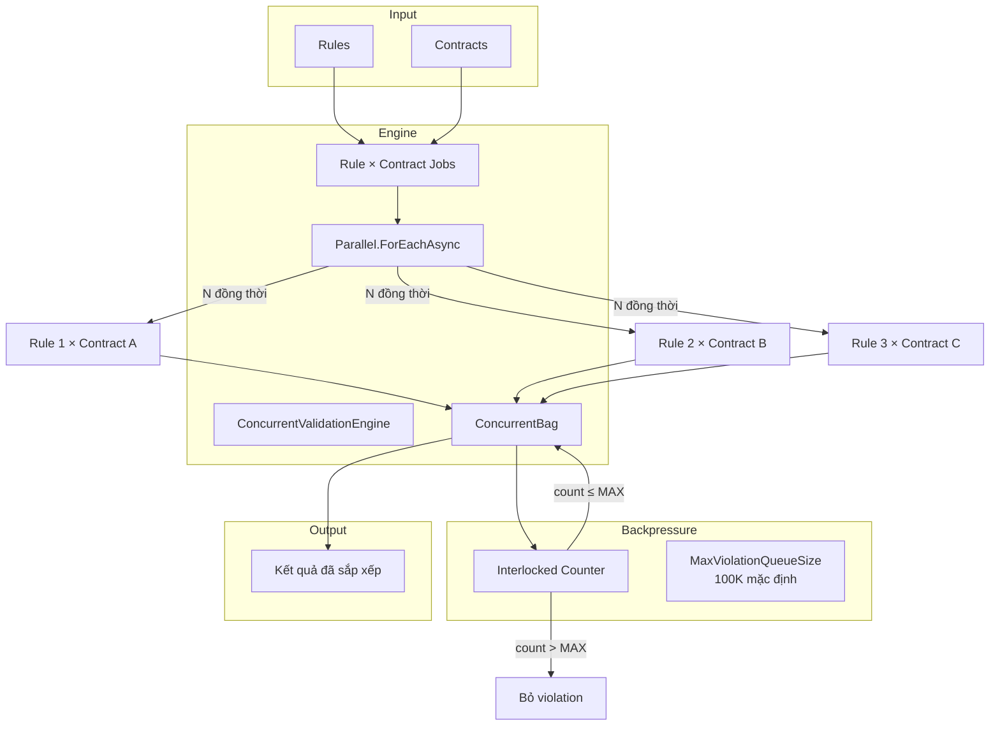
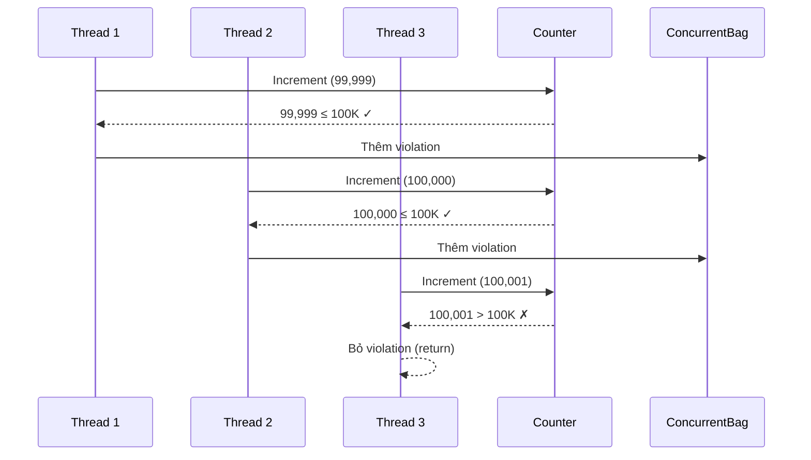

# Engine Validation Đồng Thời

> Nguồn: `src/DataGuard.Core/Validation/ConcurrentValidationEngine.cs`

Engine validation đồng thời chạy các rules contract với descriptors ở chế độ song song có giới hạn và backpressure. Nó sử dụng `Parallel.ForEachAsync` để tận dụng CPU hiệu quả trong khi ngăn chặn cạn kiệt bộ nhớ từ hàng đợi violations không giới hạn.

## Luồng Validation Song Song



## ConcurrentValidationEngine

```csharp
public sealed class ConcurrentValidationEngine
{
    private readonly int _maxDegreeOfParallelism;
    private readonly int _maxViolationQueueSize;

    public ConcurrentValidationEngine(
        int maxDegreeOfParallelism = 0,
        int maxViolationQueueSize = 100_000) { ... }

    public async Task<IReadOnlyList<ContractViolation>> ValidateAsync(
        IReadOnlyList<ContractDescriptor> contracts,
        IReadOnlyList<IContractRule> rules,
        CancellationToken cancellationToken = default) { ... }
}
```

### Cấu Hình

| Tham số | Mặc định | Mô tả |
|---------|----------|-------|
| `maxDegreeOfParallelism` | `0` (tự động = `Environment.ProcessorCount`) | Số lượng thực thi rule đồng thời tối đa |
| `maxViolationQueueSize` | `100,000` | Giới hạn backpressure cho việc thu thập violations |

### Mô Hình Thực Thi

```csharp
var jobs = from rule in rules
           from contract in contracts
           select (rule, contract);

await Parallel.ForEachAsync(
    jobs,
    new ParallelOptions
    {
        MaxDegreeOfParallelism = _maxDegreeOfParallelism,
        CancellationToken = cancellationToken,
    },
    async (job, ct) =>
    {
        var violations = await job.rule.ValidateAsync(job.contract, contracts, ct);
        foreach (var violation in violations)
        {
            if (Interlocked.Increment(ref addedCount) > _maxViolationQueueSize)
                return; // Backpressure: dừng thêm khi vượt giới hạn

            results.Add(violation);
        }
    });
```

**Quyết định thiết kế chính:**

1. **Tích Descartes** — mọi rule chạy với mọi contract (rules nội bộ lọc theo kiểu descriptor)
2. **Song song có giới hạn** — `MaxDegreeOfParallelism` ngăn chặn cạn kiệt thread pool
3. **Backpressure nguyên tử** — `Interlocked.Increment` đảm bảo đếm thread-safe mà không cần locks
4. **ConcurrentBag** — collection không khóa cho việc thêm đồng thời từ nhiều threads

### Cơ Chế Backpressure



Backpressure sử dụng `Interlocked.Increment` cho đếm nguyên tử không khóa. Khi số lượng vượt quá `MaxViolationQueueSize`, violations mới bị bỏ qua im lặng. Tập kết quả cuối cùng được giới hạn ở `MaxViolationQueueSize` entries.

### Sắp Xếp Kết Quả

Kết quả được sắp xếp deterministic cho đầu ra có thể tái tạo:

```csharp
return results.Take(_maxViolationQueueSize)
    .OrderBy(v => v.RuleId, StringComparer.Ordinal)
    .ThenBy(v => v.Message, StringComparer.Ordinal)
    .ToList();
```

## Đặc Tính Hiệu Suất

| Chỉ số | Hành vi |
|--------|---------|
| **Sử dụng CPU** | Tỷ lệ với `Environment.ProcessorCount` |
| **Bộ nhớ** | Giới hạn bởi `MaxViolationQueueSize` × kích thước violation trung bình |
| **Thread safety** | `ConcurrentBag` + `Interlocked` — không khóa |
| **Hủy bỏ** | Tôn trọng `CancellationToken` trên tất cả jobs song song |
| **Tính xác định** | Kết quả sắp xếp theo (RuleId, Message) bất kể thứ tự thực thi |

## Sử Dụng

### Sử Dụng Trực Tiếp

```csharp
var engine = new ConcurrentValidationEngine(
    maxDegreeOfParallelism: 8,
    maxViolationQueueSize: 50_000);

var violations = await engine.ValidateAsync(contracts, rules, cancellationToken);
```

### Qua ValidationPipeline

`ValidationPipeline` sử dụng engine nội bộ khi `EnableConcurrentValidation` là true:

```csharp
var pipeline = DataGuardApi.CreatePipeline(config);
var result = await pipeline.ValidateAsync(contracts);
```

## So Sánh Với Thực Thi Tuần Tự

| Khía cạnh | Tuần tự | Đồng thời |
|-----------|---------|-----------|
| **Tốc độ** | Cơ sở | Nhanh hơn 2-4× trên multi-core |
| **Bộ nhớ** | Tuyến tính | Giới hạn bởi backpressure |
| **Sắp xếp** | Thứ tự thực thi | Sắp xếp deterministic |
| **Hủy bỏ** | Theo rule | Theo batch |
| **Độ phức tạp** | Đơn giản | Collection thread-safe + counter nguyên tử |

## Đảm Bảo Thread Safety

1. **ConcurrentBag** — thiết kế cho `Add()` đồng thời từ nhiều threads
2. **Interlocked.Increment** — counter nguyên tử không cần khóa
3. **Input bất biến** — `IReadOnlyList` contracts và rules không bị sửa đổi
4. **Không trạng thái mutable dùng chung** — mỗi thực thi rule là độc lập
5. **CancellationToken** — truyền đến tất cả operations song song
