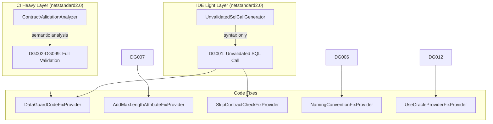
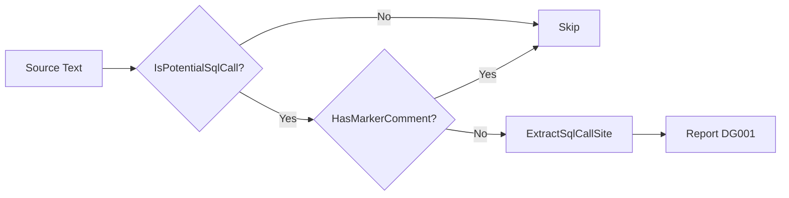
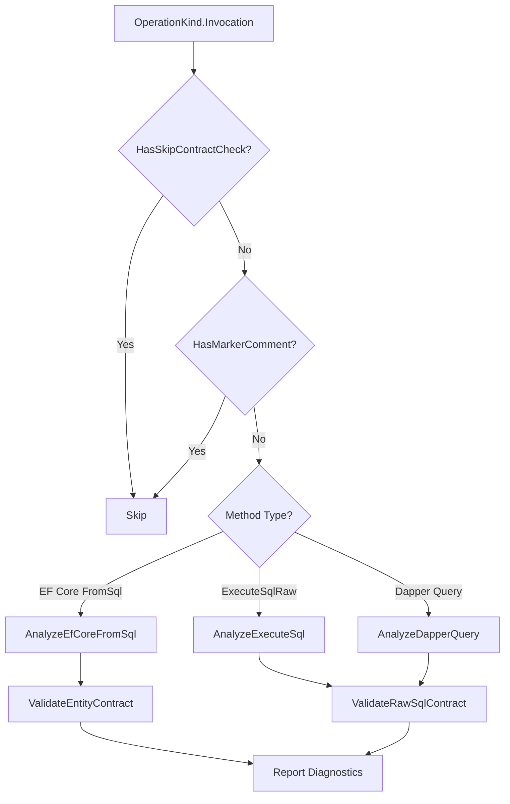

# Roslyn Analyzers

DataGuard ships two Roslyn analyzer layers: a fast **IDE Light Layer** (incremental generator) for real-time feedback during coding, and a **CI Heavy Layer** (full semantic analyzer) for comprehensive contract validation in build pipelines.

## Architecture



## Source Files

| File | Lines | Purpose |
|------|-------|---------|
| `Analyzers.cs` | 785 | DiagnosticIds, DiagnosticDescriptors, UnvalidatedSqlCallGenerator, ContractValidationAnalyzer |
| `IsExternalInit.cs` | ~10 | Polyfill for `init` keyword on netstandard2.0 |

## Project Configuration

```xml
<Project Sdk="Microsoft.NET.Sdk">
  <PropertyGroup>
    <TargetFramework>netstandard2.0</TargetFramework>
    <EnforceExtendedAnalyzerRules>true</EnforceExtendedAnalyzerRules>
  </PropertyGroup>
  <ItemGroup>
    <PackageReference Include="Microsoft.CodeAnalysis.Analyzers" Version="3.3.4" PrivateAssets="all" />
    <PackageReference Include="Microsoft.CodeAnalysis.CSharp" Version="4.8.0" />
  </ItemGroup>
</Project>
```

The analyzer targets `netstandard2.0` for maximum compatibility with all .NET SDK versions.

## DiagnosticIds

All diagnostic IDs are defined as constants in the `DiagnosticIds` class:

| ID | Name | Layer | Category |
|----|------|-------|----------|
| `DG001` | UnvalidatedSqlCall | IDE | DataGuard.IDE |
| `DG002` | ParameterMismatch | CI | DataGuard.Contracts |
| `DG003` | DirectionMismatch | CI | DataGuard.Contracts |
| `DG004` | ColumnShapeMismatch | CI | DataGuard.Contracts |
| `DG005` | NullableMismatch | CI | DataGuard.Contracts |
| `DG006` | NamingConvention | CI | DataGuard.Contracts |
| `DG007` | LengthExceedsColumn | CI | DataGuard.Length |
| `DG008` | ByteLengthOverflow | CI | DataGuard.Length |
| `DG009` | InferredSizeFallback | CI | DataGuard.Length |
| `DG010` | OracleSyntaxInNonOracle | CI | DataGuard.Dialect |
| `DG011` | NonOracleFunctionInOracle | CI | DataGuard.Dialect |
| `DG012` | ProviderOptionMismatch | CI | DataGuard.Dialect |
| `DG013` | SqlServerSyntaxLeak | CI | DataGuard.Dialect |
| `DG014` | UnmappedTypeUsage | CI | DataGuard.Dialect |
| `DG015` | PhantomTable | CI | DataGuard.Contracts |
| `DG016` | PhantomColumn | CI | DataGuard.Contracts |
| `DG098` | MissingFromClause | CI | DataGuard.Contracts |
| `DG099` | SqlInjectionPattern | CI | DataGuard.Security |

## IDE Light Layer — UnvalidatedSqlCallGenerator

An `IIncrementalGenerator` that runs on every keystroke with syntax-only analysis (~ms). Designed for zero-allocation, minimal GC pressure, and incremental caching.

### Detection Flow



### Recognized SQL Methods

| Category | Methods |
|----------|---------|
| **EF Core** | `FromSqlRaw`, `FromSqlInterpolated` |
| **ExecuteSql** | `ExecuteSqlRaw`, `ExecuteSqlRawAsync`, `ExecuteSqlInterpolated`, `ExecuteSqlInterpolatedAsync` |
| **Dapper** | `Query*`, `Execute*` (prefix match) |
| **Raw SQL** | Any method with string literal containing SQL keywords |

### SQL Keyword Detection

Checks for: `SELECT`, `INSERT`, `UPDATE`, `DELETE`, `EXEC`, `BEGIN`, `WITH`, `MERGE`

### Marker Comment Suppression

A `// DataGuard: ...` comment on the enclosing statement suppresses the DG001 diagnostic. This is used when developers acknowledge the SQL call and defer validation to CI.

### Performance Characteristics

- **Syntax-only**: No semantic model access, no symbol resolution
- **Pre-computed sets**: `EfCoreMethods` and `ExecuteSqlMethods` are `HashSet<string>` for O(1) lookup
- **Zero allocation**: `SqlCallSite` is a `readonly struct`
- **Incremental caching**: Only re-analyzes changed syntax nodes

## CI Heavy Layer — ContractValidationAnalyzer

A `DiagnosticAnalyzer` that performs full semantic analysis with `IInvocationOperation`. Runs in CI pipeline for comprehensive validation.

### Analysis Flow



### Validation Checks

| Check | Diagnostic | Description |
|-------|------------|-------------|
| SQL injection patterns | DG099 | Detects `;--`, `' or '1'='1`, `UNION SELECT`, `DROP TABLE`, etc. |
| Missing FROM clause | DG098 | SELECT without FROM |
| Stored proc format | DG002 | EXEC/EXECUTE prefix validation |

### SkipContractCheck Integration

Methods decorated with `[SkipContractCheck]` are automatically excluded from analysis:

```csharp
[SkipContractCheck(Reason = "Dynamic SQL - manual review required")]
public IQueryable<T> Search(string query) => DbSet.FromSqlRaw(query);
```

## DiagnosticDescriptors

All descriptors are defined in the internal `DiagnosticDescriptors` class with consistent naming:

```csharp
public static readonly DiagnosticDescriptor UnvalidatedSqlCall = new(
    id: DiagnosticIds.UnvalidatedSqlCall,
    title: "SQL call not validated",
    messageFormat: "SQL call '{0}' not validated - run 'dataguard check' for full validation",
    category: "DataGuard.IDE",
    defaultSeverity: DiagnosticSeverity.Warning,
    isEnabledByDefault: true);
```

### Severity Levels

| Severity | Diagnostics |
|----------|-------------|
| **Error** | DG002, DG003, DG004, DG007, DG012, DG015, DG016 |
| **Warning** | DG001, DG005, DG006, DG008, DG009, DG010, DG011, DG013, DG014, DG098, DG099 |

## Usage

### In IDE (Visual Studio / VS Code)

The IDE Light Layer runs automatically when the DataGuard analyzer package is referenced:

```xml
<PackageReference Include="DataGuard.Analyzers" Version="*" PrivateAssets="all" />
```

DG001 warnings appear as green squiggles under SQL call sites.

### In CI Pipeline

The CI Heavy Layer runs as part of the standard Roslyn analysis during `dotnet build`:

```bash
dotnet build -warnaserror:DG002,DG003,DG004  # Treat specific diagnostics as errors
```

### Suppression

```csharp
#pragma warning disable DG001 // Acknowledged SQL call
var results = context.Customers.FromSqlRaw("SELECT * FROM Customers");
#pragma warning restore DG001
```

Or via `.editorconfig`:

```ini
[*.cs]
dotnet_diagnostic.DG001.severity = none
```
