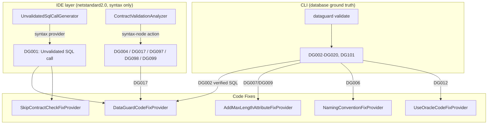

# Roslyn Analyzers

DataGuard's analyzer package is a **syntax-only IDE layer**: an incremental generator (DG001) and a syntax-node
`DiagnosticAnalyzer` (literal-SQL heuristics). Neither binds symbols, opens a database, or does file/network IO.
Checks that need database ground truth (DG002-DG020, DG101) run only in the CLI (`dataguard validate`); their
descriptors are advertised by the analyzer so `.editorconfig` severities and code fixes bind to the same IDs.

## Architecture


```mermaid
graph TB
    subgraph "IDE layer (netstandard2.0, syntax only)"
        UG[UnvalidatedSqlCallGenerator]
        CVA[ContractValidationAnalyzer]
        DG001[DG001: Unvalidated SQL call]
        HEUR[DG004 / DG017 / DG097 / DG098 / DG099]
    end

    subgraph "CLI (database ground truth)"
        CLI[dataguard validate]
        ENGINE[DG002-DG020, DG101]
    end

    subgraph "Code Fixes"
        CFP[DataGuardCodeFixProvider]
        MAFP[AddMaxLengthAttributeFixProvider]
        SCFP[SkipContractCheckFixProvider]
        NCFP[NamingConventionFixProvider]
        UOFP[UseOracleCodeFixProvider]
    end

    UG -->|syntax provider| DG001
    CVA -->|syntax-node action| HEUR
    CLI --> ENGINE

    DG001 --> CFP
    DG001 --> SCFP
    HEUR -->|DG017| CFP
    ENGINE -->|DG002 verified SQL| CFP
    ENGINE -->|DG007/DG009| MAFP
    ENGINE -->|DG006| NCFP
    ENGINE -->|DG012| UOFP
```

## Source Files

| File | Purpose |
|------|---------|
| `DiagnosticDescriptors.cs` | `DiagnosticIds` and `DiagnosticDescriptors`: the single source of analyzer IDs and titles |
| `SqlCallSyntax.cs` | Syntax-only recognition of SQL call sites, SQL text recovery, `[SkipContractCheck]`/marker suppression |
| `UnvalidatedSqlCallGenerator.cs` | DG001 incremental generator and its equatable `SqlCallModel` |
| `ContractValidationAnalyzer.cs` | Syntax-node analyzer for literal-SQL heuristics |
| `SqlTextHeuristics.cs` | Injection markers, SELECT *, SELECT without FROM, stored-procedure text form, SELECT-list extraction |
| `TypeShapeIndex.cs` | Lazy, syntax-only index of the class/record properties declared in the compilation (DG004, DG017 fix) |
| `AnalyzerReleases.*.md` | Roslyn release tracking (RS2008) |

The analyzer targets `netstandard2.0` with `EnforceExtendedAnalyzerRules` and the Roslyn `RS1xxx`/`RS2xxx` rules
enabled; the build must stay at 0 warnings. `src/DataGuard.Analyzers` contains no `SemanticModel` or `IOperation`
usage.

## Diagnostic IDs

IDs DG001-DG017 share their meaning with the CLI rules engine, and their descriptor title is the engine's
`ProviderRuleCatalog.RuleTitles` text (`DescriptorCatalogParityTests` reads the CLI file and compares). DG097-DG099
are analyzer-only.

| ID | Title | Emitted by | Category | Severity |
|----|-------|------------|----------|----------|
| `DG001` | Track Unvalidated SQL Calls | Generator | DataGuard.IDE | Warning |
| `DG002` | Parameter Type Match | CLI (advertised) | DataGuard.Contracts | Error |
| `DG003` | Parameter Direction (In/Out/Return) | CLI (advertised) | DataGuard.Contracts | Error |
| `DG004` | Result Set Column Shape | Analyzer (literal SELECT list) and CLI | DataGuard.Contracts | Error |
| `DG005` | Nullable Compatibility | CLI (advertised) | DataGuard.Contracts | Warning |
| `DG006` | Naming Convention Compliance | CLI (advertised) | DataGuard.Contracts | Warning |
| `DG007` | Entity Length Exceeds Column | CLI (advertised) | DataGuard.Length | Error |
| `DG008` | Multi-Byte Length Overflow Risk | CLI (advertised) | DataGuard.Length | Warning |
| `DG009` | Inferred Size Fallback Risk | CLI (advertised) | DataGuard.Length | Warning |
| `DG010` | Oracle Syntax in Non-Oracle Context | CLI (advertised) | DataGuard.Dialect | Warning |
| `DG011` | Non-Oracle Function in Oracle Context | CLI (advertised) | DataGuard.Dialect | Warning |
| `DG012` | Provider Option Mismatch | CLI (advertised) | DataGuard.Dialect | Error |
| `DG013` | SQL Server Syntax Leak | CLI (advertised) | DataGuard.Dialect | Warning |
| `DG014` | Unmapped Type Usage | CLI (advertised) | DataGuard.Dialect | Warning |
| `DG015` | Phantom Table Reference | CLI (advertised) | DataGuard.Contracts | Error |
| `DG016` | Phantom Column Reference | CLI (advertised) | DataGuard.Contracts | Error |
| `DG017` | Avoid SELECT * | Analyzer and CLI | DataGuard.Performance | Warning |
| `DG097` | Stored procedure command text form | Analyzer only | DataGuard.Contracts | Warning |
| `DG098` | Raw SQL query missing FROM clause | Analyzer only | DataGuard.Contracts | Warning |
| `DG099` | Potential SQL injection pattern | Analyzer only | DataGuard.Security | Warning |

> **DG097 (new).** The analyzer used to report "Stored procedure call must start with EXEC or EXECUTE" as `DG002`,
> which in the engine means *parameter type match*, and it fired on leading whitespace (`"  EXEC ..."`). The
> heuristic is now `DG097` and reports (a) a text command that is only a procedure name plus `@parameters`
> (`"dbo.ArchiveOrders @id"`) and (b) `CommandType.StoredProcedure` with an `EXEC`/`EXECUTE`/`CALL` prefix.
> `.editorconfig` entries for the analyzer's old `DG002` should move to `DG097`.

## UnvalidatedSqlCallGenerator (DG001)

An `IIncrementalGenerator` that reports DG001 at the invocation of every recognized SQL call. Pipeline:

1. **Predicate** (`SqlCallSyntax.IsCandidate`, per node, no tree walk): the invocation's method name is an EF Core
   raw-SQL API, starts with `Query`/`Execute`, or an argument is `CommandType.StoredProcedure`.
2. **Transform** (`SqlCallSyntax.Classify`, syntax only): classifies the call and returns an equatable
   `SqlCallModel(Path, Start, Length, Method, Kind, Sql, ContainingType, LineSpan)` record. It holds no syntax node
   and no `Location`, so unchanged call sites are served from the generator cache on the next keystroke
   (tracked step `DataGuard.SqlCallModels`).
3. **Output**: maps the model's path to the compilation's syntax tree (one dictionary lookup per call site) and
   reports DG001 with an in-source location, so squiggles, `#pragma` and code fixes work.

### Recognized SQL calls

| Kind | Rule |
|------|------|
| **EF Core** | `FromSqlRaw`, `FromSqlInterpolated`, `FromSql`, `SqlQueryRaw`, `SqlQuery`: by method name on **any** receiver (`db.Orders`, a `DbSet<T>` parameter or local, `db.Set<T>()`) |
| **ExecuteSql** | `ExecuteSqlRaw(Async)`, `ExecuteSqlInterpolated(Async)`, `ExecuteSql(Async)`: by method name, even with non-literal SQL (dynamic SQL is exactly the unvalidated case) |
| **Dapper** | `Query*`, `Execute*` (incl. `QueryFirst*`, `QuerySingle*`, `QueryMultiple`, `ExecuteScalar`) only when the SQL argument is SQL text (a string literal, verbatim/raw/interpolated string, concatenation, or a local/const whose initializer is one, starting with a statement keyword) **or** the call passes `CommandType.StoredProcedure` |
| **ADO.NET** | `ExecuteReader`/`ExecuteNonQuery`/`ExecuteScalar`(`Async`) without a string argument only when the same identifier gets `CommandText = ...`, `CommandType = StoredProcedure`, `new XxxCommand("...")` or `new XxxCommand { CommandText = ... }` in the enclosing member (or the command is created inline) |
| **Helper** | Any other call that passes `CommandType.StoredProcedure` (`db.RunHelper("GET_METRICS", CommandType.StoredProcedure)`) |

Not flagged: `ICommand.Execute(null)`, `index.QueryTerms(5)`, `QueryText("selected products")`,
`command.ExecuteNonQuery()` with no command text in scope, SQL that appears only in comments, and SQL literals passed
to unrelated methods.

### Suppression

- `[SkipContractCheck]` / `[SkipContractCheckAttribute]` on the method, local function, type or any enclosing type
  (matched by attribute name, syntactically).
- A `// DataGuard: ...` comment on the enclosing statement.

### Keystroke cost

`tools/benchmarks` → `GeneratorKeystrokeBenchmark` re-runs a warm driver after a one-character edit of a 2,000-line
file with 50 SQL calls (`dotnet run -c Release -- --keystroke-only --short`). Recorded on the sandbox host at the
time of this change (BenchmarkDotNet ShortRun, not a gate): **Keystroke ≈ 4.6 ms** mean (±0.4 ms StdDev, ~298 KB
allocated); a cold driver over the same file ≈ 3.3 ms.

## ContractValidationAnalyzer

A `DiagnosticAnalyzer` that registers `RegisterSyntaxNodeAction(..., SyntaxKind.InvocationExpression)` (inside a
compilation-start action that owns the lazy type index). It never calls the semantic API. For each call recognized
by `SqlCallSyntax` (same rules as DG001, except ADO.NET commands without a SQL argument) it applies text heuristics
to the SQL argument and reports **every diagnostic at the SQL argument span**:

| Check | Diagnostic | Rule |
|-------|------------|------|
| Injection markers | DG099 | `;--`, `1=1`, `' or '1'='1`, `UNION SELECT`, `DROP TABLE`, `xp_cmdshell`, `sp_executesql`, `EXECUTE IMMEDIATE`, ... (same on EF, ExecuteSql and Dapper paths, including `EXEC ...` text) |
| Values spliced into raw SQL | DG099 | String concatenation with a non-constant operand, or an interpolated string with holes, passed to a raw API (`*Raw`, Dapper, helpers). Parameterizing APIs (`FromSqlInterpolated`, `ExecuteSqlInterpolated`, `FromSql`, `ExecuteSql`, `SqlQuery`) are exempt. Locals and `const`/`readonly` fields are followed to their initializer. |
| Stored-procedure text form | DG097 | See above |
| Missing FROM | DG098 | `SELECT` without `FROM` (not for `CommandType.StoredProcedure`) |
| SELECT * | DG017 | `SELECT *`, `SELECT TOP n *`, `SELECT DISTINCT *`, `SELECT t.*`, multi-line and raw strings; comments and SQL strings are ignored (shared `SqlClassifier`). Carries `ExplicitColumns` when the mapped type is known, which the DG017 code fix uses. |
| Result-set shape | DG004 | Literal SELECT list vs. the scalar properties of the mapped type (`Query<T>`, multi-mapping `Query<T1, T2, TReturn>` → T1, T2; `FromSqlRaw<T>`, `SqlQueryRaw<T>`; the `DbSet<T>` receiver). Honors `[Column("x")]`, `[NotMapped]`, snake_case and base classes. Only for types **declared in this compilation**, matched by simple name; ambiguous names and dynamic SQL are skipped. |

### Cost of the type index

DG004 and the DG017 fix need the properties of the mapped type. `TypeShapeIndex` is built **lazily, at most once
per compilation**, the first time a SQL call actually has a target type: it walks `Compilation.SyntaxTrees` but
descends only into namespace and type declarations (never into member bodies), so its cost is proportional to the
number of type/member declarations. Edits in projects without such SQL calls never build it.

### Suppression

`[SkipContractCheck]` (method, local function, type or enclosing type, by attribute name) and the
`// DataGuard: ...` marker comment suppress the analyzer the same way as the generator. Generated code is not
analyzed.

```csharp
[SkipContractCheck(Reason = "Dynamic SQL - manual review required")]
public IQueryable<T> Search(string query) => DbSet.FromSqlRaw(query);
```

## Usage

```xml
<PackageReference Include="DataGuard.Analyzers" Version="*" PrivateAssets="all" />
```

DG001 warnings appear as squiggles under SQL call sites; the heuristics appear under the SQL argument. Database
validation is a separate CLI step:

```bash
dataguard validate --project src/App/App.csproj --provider oracle
```

### Suppression

```csharp
#pragma warning disable DG001 // Acknowledged SQL call
var results = context.Customers.FromSqlRaw("SELECT Id, Name FROM Customers");
#pragma warning restore DG001
```

Or via `.editorconfig`:

```ini
[*.cs]
dotnet_diagnostic.DG001.severity = none
dotnet_diagnostic.DG097.severity = suggestion
```
