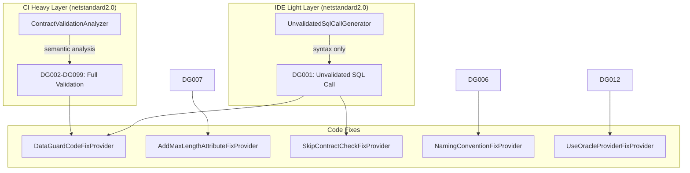
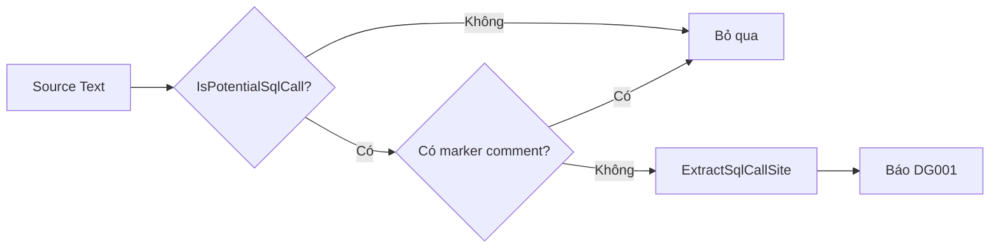
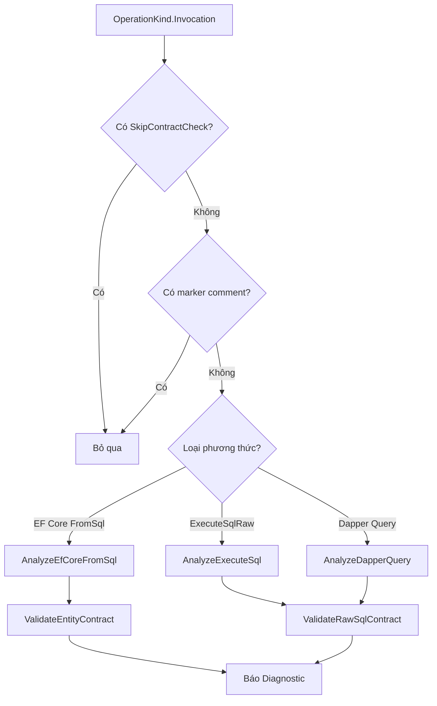

# Roslyn Analyzers

DataGuard cung cấp hai lớp analyzer Roslyn: **IDE Light Layer** (incremental generator) nhanh cho phản hồi thời gian thực khi code, và **CI Heavy Layer** (full semantic analyzer) để xác thực contract toàn diện trong pipeline build.

## Kiến trúc



## File nguồn

| File | Dòng | Mục đích |
|------|------|----------|
| `Analyzers.cs` | 785 | DiagnosticIds, DiagnosticDescriptors, UnvalidatedSqlCallGenerator, ContractValidationAnalyzer |
| `IsExternalInit.cs` | ~10 | Polyfill cho từ khóa `init` trên netstandard2.0 |

## Cấu hình project

```xml
<Project Sdk="Microsoft.NET.Sdk">
  <PropertyGroup>
    <TargetFramework>netstandard2.0</TargetFramework>
    <EnforceExtendedAnalyzerRules>true</EnforceExtendedAnalyzerRules>
  </PropertyGroup>
  <ItemGroup>
    <PackageReference Include="Microsoft.CodeAnalysis.Analyzers" Version="3.3.4" PrivateAssets="all" />
    <PackageReference Include="Microsoft.CodeAnalysis.CSharp" Version="4.8.0" />
  </ItemGroup>
</Project>
```

Analyzer nhắm đến `netstandard2.0` để tương thích tối đa với tất cả phiên bản .NET SDK.

## DiagnosticIds

Tất cả diagnostic ID được định nghĩa dưới dạng hằng số trong lớp `DiagnosticIds`:

| ID | Tên | Lớp | Danh mục |
|----|-----|-----|----------|
| `DG001` | UnvalidatedSqlCall | IDE | DataGuard.IDE |
| `DG002` | ParameterMismatch | CI | DataGuard.Contracts |
| `DG003` | DirectionMismatch | CI | DataGuard.Contracts |
| `DG004` | ColumnShapeMismatch | CI | DataGuard.Contracts |
| `DG005` | NullableMismatch | CI | DataGuard.Contracts |
| `DG006` | NamingConvention | CI | DataGuard.Contracts |
| `DG007` | LengthExceedsColumn | CI | DataGuard.Length |
| `DG008` | ByteLengthOverflow | CI | DataGuard.Length |
| `DG009` | InferredSizeFallback | CI | DataGuard.Length |
| `DG010` | OracleSyntaxInNonOracle | CI | DataGuard.Dialect |
| `DG011` | NonOracleFunctionInOracle | CI | DataGuard.Dialect |
| `DG012` | ProviderOptionMismatch | CI | DataGuard.Dialect |
| `DG013` | SqlServerSyntaxLeak | CI | DataGuard.Dialect |
| `DG014` | UnmappedTypeUsage | CI | DataGuard.Dialect |
| `DG015` | PhantomTable | CI | DataGuard.Contracts |
| `DG016` | PhantomColumn | CI | DataGuard.Contracts |
| `DG098` | MissingFromClause | CI | DataGuard.Contracts |
| `DG099` | SqlInjectionPattern | CI | DataGuard.Security |

## IDE Light Layer — UnvalidatedSqlCallGenerator

`IIncrementalGenerator` chạy trên mỗi lần gõ phím với phân tích chỉ cú pháp (~ms). Thiết kế cho zero-allocation, áp lực GC tối thiểu, và cache tăng dần.

### Flow phát hiện



### Phương thức SQL được nhận diện

| Danh mục | Phương thức |
|----------|-------------|
| **EF Core** | `FromSqlRaw`, `FromSqlInterpolated` |
| **ExecuteSql** | `ExecuteSqlRaw`, `ExecuteSqlRawAsync`, `ExecuteSqlInterpolated`, `ExecuteSqlInterpolatedAsync` |
| **Dapper** | `Query*`, `Execute*` (khớp tiền tố) |
| **Raw SQL** | Bất kỳ phương thức nào với literal chuỗi chứa từ khóa SQL |

### Phát hiện từ khóa SQL

Kiểm tra: `SELECT`, `INSERT`, `UPDATE`, `DELETE`, `EXEC`, `BEGIN`, `WITH`, `MERGE`

### Ẩn bằng marker comment

Comment `// DataGuard: ...` trên câu lệnh bao quanh sẽ ẩn diagnostic DG001. Được sử dụng khi developer xác nhận lệnh SQL và hoãn xác thực sang CI.

### Đặc điểm hiệu suất

- **Chỉ cú pháp**: Không truy cập semantic model, không phân giải symbol
- **Tập hợp tính trước**: `EfCoreMethods` và `ExecuteSqlMethods` là `HashSet<string>` cho tra cứu O(1)
- **Zero allocation**: `SqlCallSite` là `readonly struct`
- **Cache tăng dần**: Chỉ phân tích lại các nút cú pháp đã thay đổi

## CI Heavy Layer — ContractValidationAnalyzer

`DiagnosticAnalyzer` thực hiện phân tích ngữ nghĩa đầy đủ với `IInvocationOperation`. Chạy trong pipeline CI để xác thực toàn diện.

### Flow phân tích



### Kiểm tra xác thực

| Kiểm tra | Diagnostic | Mô tả |
|----------|------------|-------|
| Mẫu SQL injection | DG099 | Phát hiện `;--`, `' or '1'='1`, `UNION SELECT`, `DROP TABLE`, etc. |
| Thiếu FROM clause | DG098 | SELECT không có FROM |
| Định dạng stored proc | DG002 | Xác thực tiền tố EXEC/EXECUTE |

### Tích hợp SkipContractCheck

Phương thức được trang trí `[SkipContractCheck]` tự động bị loại trừ khỏi phân tích:

```csharp
[SkipContractCheck(Reason = "Dynamic SQL - manual review required")]
public IQueryable<T> Search(string query) => DbSet.FromSqlRaw(query);
```

## DiagnosticDescriptors

Tất cả descriptor được định nghĩa trong lớp nội bộ `DiagnosticDescriptors` với tên nhất quán:

```csharp
public static readonly DiagnosticDescriptor UnvalidatedSqlCall = new(
    id: DiagnosticIds.UnvalidatedSqlCall,
    title: "SQL call not validated",
    messageFormat: "SQL call '{0}' not validated - run 'dataguard check' for full validation",
    category: "DataGuard.IDE",
    defaultSeverity: DiagnosticSeverity.Warning,
    isEnabledByDefault: true);
```

### Mức độ nghiêm trọng

| Mức độ | Diagnostics |
|--------|-------------|
| **Error** | DG002, DG003, DG004, DG007, DG012, DG015, DG016 |
| **Warning** | DG001, DG005, DG006, DG008, DG009, DG010, DG011, DG013, DG014, DG098, DG099 |

## Sử dụng

### Trong IDE (Visual Studio / VS Code)

IDE Light Layer chạy tự động khi package analyzer DataGuard được tham chiếu:

```xml
<PackageReference Include="DataGuard.Analyzers" Version="*" PrivateAssets="all" />
```

Cảnh báo DG001 xuất hiện dưới dạng gạch chân xanh lá tại các vị trí gọi SQL.

### Trong Pipeline CI

CI Heavy Layer chạy như một phần của phân tích Roslyn tiêu chuẩn trong `dotnet build`:

```bash
dotnet build -warnaserror:DG002,DG003,DG004  # Coi một số diagnostic là lỗi
```

### Ẩn diagnostic

```csharp
#pragma warning disable DG001 // Acknowledged SQL call
var results = context.Customers.FromSqlRaw("SELECT * FROM Customers");
#pragma warning restore DG001
```

Hoặc qua `.editorconfig`:

```ini
[*.cs]
dotnet_diagnostic.DG001.severity = none
```
