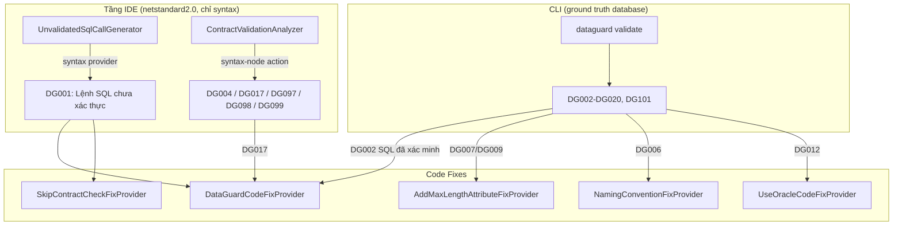

# Roslyn Analyzers

Gói analyzer của DataGuard là **tầng IDE chỉ dùng syntax**: một incremental generator (DG001) và một
`DiagnosticAnalyzer` dạng syntax-node (heuristic trên SQL literal). Cả hai không bind symbol, không mở database, không
IO file/mạng. Các kiểm tra cần ground truth database (DG002-DG020, DG101) chỉ chạy trong CLI (`dataguard validate`);
descriptor của chúng vẫn được analyzer khai báo để severity trong `.editorconfig` và code fix gắn đúng ID.

## Kiến trúc


```mermaid
graph TB
    subgraph "Tầng IDE (netstandard2.0, chỉ syntax)"
        UG[UnvalidatedSqlCallGenerator]
        CVA[ContractValidationAnalyzer]
        DG001[DG001: Lệnh SQL chưa xác thực]
        HEUR[DG004 / DG017 / DG097 / DG098 / DG099]
    end

    subgraph "CLI (ground truth database)"
        CLI[dataguard validate]
        ENGINE[DG002-DG020, DG101]
    end

    subgraph "Code Fixes"
        CFP[DataGuardCodeFixProvider]
        MAFP[AddMaxLengthAttributeFixProvider]
        SCFP[SkipContractCheckFixProvider]
        NCFP[NamingConventionFixProvider]
        UOFP[UseOracleCodeFixProvider]
    end

    UG -->|syntax provider| DG001
    CVA -->|syntax-node action| HEUR
    CLI --> ENGINE

    DG001 --> CFP
    DG001 --> SCFP
    HEUR -->|DG017| CFP
    ENGINE -->|DG002 SQL đã xác minh| CFP
    ENGINE -->|DG007/DG009| MAFP
    ENGINE -->|DG006| NCFP
    ENGINE -->|DG012| UOFP
```

## File nguồn

| File | Mục đích |
|------|----------|
| `DiagnosticDescriptors.cs` | `DiagnosticIds` và `DiagnosticDescriptors`: nguồn duy nhất của ID và title analyzer |
| `SqlCallSyntax.cs` | Nhận diện call site SQL chỉ bằng syntax, khôi phục SQL text, ẩn bằng `[SkipContractCheck]`/marker |
| `UnvalidatedSqlCallGenerator.cs` | Generator DG001 và model `SqlCallModel` có so sánh bằng giá trị |
| `ContractValidationAnalyzer.cs` | Analyzer syntax-node cho heuristic SQL literal |
| `SqlTextHeuristics.cs` | Dấu hiệu injection, SELECT *, SELECT thiếu FROM, dạng text stored procedure, trích danh sách SELECT |
| `TypeShapeIndex.cs` | Chỉ mục lười, chỉ syntax, các property của class/record khai báo trong compilation (DG004, fix DG017) |
| `AnalyzerReleases.*.md` | Release tracking của Roslyn (RS2008) |

Analyzer nhắm `netstandard2.0` với `EnforceExtendedAnalyzerRules` và các rule Roslyn `RS1xxx`/`RS2xxx`; build phải
giữ 0 warning. `src/DataGuard.Analyzers` không dùng `SemanticModel` hay `IOperation`.

## Diagnostic ID

DG001-DG017 dùng chung nghĩa với rules engine của CLI, và title descriptor chính là text trong
`ProviderRuleCatalog.RuleTitles` (`DescriptorCatalogParityTests` đọc file CLI và so sánh). DG097-DG099 chỉ có ở
analyzer.

| ID | Title | Phát ra bởi | Category | Severity |
|----|-------|-------------|----------|----------|
| `DG001` | Track Unvalidated SQL Calls | Generator | DataGuard.IDE | Warning |
| `DG002` | Parameter Type Match | CLI (chỉ khai báo) | DataGuard.Contracts | Error |
| `DG003` | Parameter Direction (In/Out/Return) | CLI (chỉ khai báo) | DataGuard.Contracts | Error |
| `DG004` | Result Set Column Shape | Analyzer (danh sách SELECT literal) và CLI | DataGuard.Contracts | Error |
| `DG005` | Nullable Compatibility | CLI (chỉ khai báo) | DataGuard.Contracts | Warning |
| `DG006` | Naming Convention Compliance | CLI (chỉ khai báo) | DataGuard.Contracts | Warning |
| `DG007` | Entity Length Exceeds Column | CLI (chỉ khai báo) | DataGuard.Length | Error |
| `DG008` | Multi-Byte Length Overflow Risk | CLI (chỉ khai báo) | DataGuard.Length | Warning |
| `DG009` | Inferred Size Fallback Risk | CLI (chỉ khai báo) | DataGuard.Length | Warning |
| `DG010` | Oracle Syntax in Non-Oracle Context | CLI (chỉ khai báo) | DataGuard.Dialect | Warning |
| `DG011` | Non-Oracle Function in Oracle Context | CLI (chỉ khai báo) | DataGuard.Dialect | Warning |
| `DG012` | Provider Option Mismatch | CLI (chỉ khai báo) | DataGuard.Dialect | Error |
| `DG013` | SQL Server Syntax Leak | CLI (chỉ khai báo) | DataGuard.Dialect | Warning |
| `DG014` | Unmapped Type Usage | CLI (chỉ khai báo) | DataGuard.Dialect | Warning |
| `DG015` | Phantom Table Reference | CLI (chỉ khai báo) | DataGuard.Contracts | Error |
| `DG016` | Phantom Column Reference | CLI (chỉ khai báo) | DataGuard.Contracts | Error |
| `DG017` | Avoid SELECT * | Analyzer và CLI | DataGuard.Performance | Warning |
| `DG097` | Stored procedure command text form | Chỉ analyzer | DataGuard.Contracts | Warning |
| `DG098` | Raw SQL query missing FROM clause | Chỉ analyzer | DataGuard.Contracts | Warning |
| `DG099` | Potential SQL injection pattern | Chỉ analyzer | DataGuard.Security | Warning |

> **DG097 (mới).** Trước đây analyzer báo "Stored procedure call must start with EXEC or EXECUTE" bằng `DG002`,
> trong khi ở engine `DG002` nghĩa là *khớp kiểu tham số*, và nó báo sai khi có khoảng trắng đầu (`"  EXEC ..."`).
> Heuristic nay là `DG097` và báo khi (a) command text chỉ là tên procedure kèm `@tham_số` (`"dbo.ArchiveOrders @id"`)
> và (b) `CommandType.StoredProcedure` nhưng text có tiền tố `EXEC`/`EXECUTE`/`CALL`. Mục `.editorconfig` cho
> `DG002` cũ của analyzer nên chuyển sang `DG097`.

## UnvalidatedSqlCallGenerator (DG001)

`IIncrementalGenerator` báo DG001 tại invocation của mọi lệnh SQL được nhận diện. Pipeline:

1. **Predicate** (`SqlCallSyntax.IsCandidate`, mỗi node, không duyệt cây): tên method là API raw-SQL của EF Core, bắt
   đầu bằng `Query`/`Execute`, hoặc có đối số `CommandType.StoredProcedure`.
2. **Transform** (`SqlCallSyntax.Classify`, chỉ syntax): phân loại lệnh gọi và trả về record
   `SqlCallModel(Path, Start, Length, Method, Kind, Sql, ContainingType, LineSpan)` so sánh bằng giá trị. Model không
   giữ syntax node hay `Location`, nên call site không đổi được lấy từ cache ở lần gõ phím sau (tracked step
   `DataGuard.SqlCallModels`).
3. **Output**: ánh xạ path của model về syntax tree của compilation (một lần tra dictionary mỗi call site) và báo DG001
   với location trong source, nên squiggle, `#pragma` và code fix đều hoạt động.

### Lệnh SQL được nhận diện

| Loại | Quy tắc |
|------|---------|
| **EF Core** | `FromSqlRaw`, `FromSqlInterpolated`, `FromSql`, `SqlQueryRaw`, `SqlQuery`: theo tên method trên **mọi** receiver (`db.Orders`, tham số/biến `DbSet<T>`, `db.Set<T>()`) |
| **ExecuteSql** | `ExecuteSqlRaw(Async)`, `ExecuteSqlInterpolated(Async)`, `ExecuteSql(Async)`: theo tên method, kể cả SQL không phải literal (SQL động chính là trường hợp chưa xác thực) |
| **Dapper** | `Query*`, `Execute*` (gồm `QueryFirst*`, `QuerySingle*`, `QueryMultiple`, `ExecuteScalar`) chỉ khi đối số SQL là SQL text (literal, chuỗi verbatim/raw/interpolated, phép nối, hoặc biến local/const có initializer như vậy, bắt đầu bằng từ khóa câu lệnh) **hoặc** truyền `CommandType.StoredProcedure` |
| **ADO.NET** | `ExecuteReader`/`ExecuteNonQuery`/`ExecuteScalar`(`Async`) không có đối số chuỗi chỉ khi cùng identifier được gán `CommandText = ...`, `CommandType = StoredProcedure`, `new XxxCommand("...")` hoặc `new XxxCommand { CommandText = ... }` trong member bao quanh (hoặc command được tạo inline) |
| **Helper** | Mọi lệnh gọi khác truyền `CommandType.StoredProcedure` (`db.RunHelper("GET_METRICS", CommandType.StoredProcedure)`) |

Không báo: `ICommand.Execute(null)`, `index.QueryTerms(5)`, `QueryText("selected products")`,
`command.ExecuteNonQuery()` không có command text trong phạm vi, SQL chỉ nằm trong comment, và SQL literal truyền cho
method không liên quan.

### Ẩn diagnostic

- `[SkipContractCheck]` / `[SkipContractCheckAttribute]` trên method, local function, type hoặc type bao ngoài (so
  khớp syntax theo tên attribute).
- Comment `// DataGuard: ...` trên câu lệnh bao quanh.

### Chi phí mỗi lần gõ phím

`tools/benchmarks` → `GeneratorKeystrokeBenchmark` chạy lại driver đã warm sau khi sửa một ký tự trong file 2.000 dòng
có 50 lệnh SQL (`dotnet run -c Release -- --keystroke-only --short`). Số đo trên máy sandbox tại thời điểm thay đổi
này (BenchmarkDotNet ShortRun, không phải gate): **Keystroke ≈ 4,6 ms** trung bình (StdDev ±0,4 ms, ~298 KB cấp phát);
driver lạnh trên cùng file ≈ 3,3 ms.

## ContractValidationAnalyzer

`DiagnosticAnalyzer` đăng ký `RegisterSyntaxNodeAction(..., SyntaxKind.InvocationExpression)` (bên trong
compilation-start action giữ chỉ mục type lười). Nó không gọi semantic API. Với mỗi lệnh gọi được `SqlCallSyntax` nhận
diện (cùng quy tắc với DG001, trừ command ADO.NET không có đối số SQL), nó áp dụng heuristic văn bản trên đối số SQL và
báo **mọi diagnostic tại span của đối số SQL**:

| Kiểm tra | Diagnostic | Quy tắc |
|----------|------------|---------|
| Dấu hiệu injection | DG099 | `;--`, `1=1`, `' or '1'='1`, `UNION SELECT`, `DROP TABLE`, `xp_cmdshell`, `sp_executesql`, `EXECUTE IMMEDIATE`, ... (như nhau trên đường EF, ExecuteSql và Dapper, kể cả text `EXEC ...`) |
| Ghép giá trị vào raw SQL | DG099 | Nối chuỗi với toán hạng không phải hằng, hoặc chuỗi interpolated có hole, truyền vào API raw (`*Raw`, Dapper, helper). API tham số hóa (`FromSqlInterpolated`, `ExecuteSqlInterpolated`, `FromSql`, `ExecuteSql`, `SqlQuery`) được miễn. Biến local và field `const`/`readonly` được lần theo tới initializer. |
| Dạng text stored procedure | DG097 | Xem ở trên |
| Thiếu FROM | DG098 | `SELECT` không có `FROM` (không áp dụng cho `CommandType.StoredProcedure`) |
| SELECT * | DG017 | `SELECT *`, `SELECT TOP n *`, `SELECT DISTINCT *`, `SELECT t.*`, chuỗi nhiều dòng và raw string; bỏ qua comment và chuỗi SQL (dùng chung `SqlClassifier`). Kèm `ExplicitColumns` khi biết type ánh xạ, code fix DG017 dùng giá trị này. |
| Shape result set | DG004 | Danh sách SELECT literal so với property scalar của type ánh xạ (`Query<T>`, multi-mapping `Query<T1, T2, TReturn>` → T1, T2; `FromSqlRaw<T>`, `SqlQueryRaw<T>`; receiver `DbSet<T>`). Tôn trọng `[Column("x")]`, `[NotMapped]`, snake_case và class cơ sở. Chỉ cho type **khai báo trong compilation này**, so khớp theo tên đơn; tên mơ hồ và SQL động được bỏ qua. |

### Chi phí của chỉ mục type

DG004 và fix DG017 cần property của type ánh xạ. `TypeShapeIndex` được dựng **lười, tối đa một lần mỗi compilation**,
lần đầu một lệnh SQL thực sự có type đích: nó duyệt `Compilation.SyntaxTrees` nhưng chỉ đi vào khai báo namespace và
type (không bao giờ vào thân member), nên chi phí tỷ lệ với số khai báo type/member. Project không có lệnh SQL như vậy
không bao giờ dựng chỉ mục.

### Ẩn diagnostic

`[SkipContractCheck]` (method, local function, type hoặc type bao ngoài, theo tên attribute) và comment marker
`// DataGuard: ...` ẩn analyzer giống như generator. Code sinh tự động không được phân tích.

```csharp
[SkipContractCheck(Reason = "Dynamic SQL - manual review required")]
public IQueryable<T> Search(string query) => DbSet.FromSqlRaw(query);
```

## Sử dụng

```xml
<PackageReference Include="DataGuard.Analyzers" Version="*" PrivateAssets="all" />
```

Cảnh báo DG001 hiện dưới dạng gạch chân tại call site SQL; các heuristic hiện tại đối số SQL. Xác thực với database là
một bước CLI riêng:

```bash
dataguard validate --project src/App/App.csproj --provider oracle
```

### Ẩn diagnostic

```csharp
#pragma warning disable DG001 // Acknowledged SQL call
var results = context.Customers.FromSqlRaw("SELECT Id, Name FROM Customers");
#pragma warning restore DG001
```

Hoặc qua `.editorconfig`:

```ini
[*.cs]
dotnet_diagnostic.DG001.severity = none
dotnet_diagnostic.DG097.severity = suggestion
```
