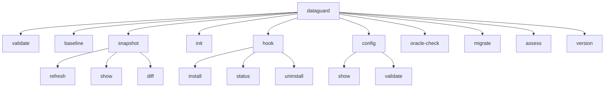

# CLI Reference

The DataGuard CLI (`dataguard`) is the primary interface for contract validation, schema management, and environment assessment. Built with `System.CommandLine`, it provides 10 commands with consistent option patterns.

## Command Tree



## Commands

### `validate`

Validates entity contracts against database schema or snapshot.

```bash
dataguard validate [options]
```

| Option | Default | Description |
|--------|---------|-------------|
| `--connection` | — | Database connection string |
| `--config` | — | Path to `.dataguard.yml` config file |
| `--output` | — | Output file path (required for sarif/evidence) |
| `--format` | `text` | Output format: `text`, `sarif`, `evidence`, `contracts`, `yaml`, `typescript` |
| `--offline` | `false` | Run in offline mode (no DB connection, requires `--assembly` or `--project`) |
| `--verbose` | `false` | Enable verbose output |
| `--provider` | Config `DefaultProvider`, then `sqlserver` | Database provider: `sqlserver`, `oracle`, `mysql`, `postgresql` |
| `--schema` | — | Database schema/owner name |
| `--assembly` | — | Path to compiled assembly for Manual ground-truth mode |
| `--ef-snapshot` | — | Explicit `ModelSnapshot.cs` source parsed with Roslyn; no assembly is loaded or executed |
| `--ef-project` | — | `.csproj` file or directory containing a source `*ModelSnapshot.cs`; never builds or loads an assembly |
| `--ef-context` | — | Context name used to select one snapshot under `--ef-project` |
| `--skip-rules` | — | Comma-separated rule IDs to skip (for example `DG002,DG017,MY001`) |
| `--project` | — | Path to C# project (`.csproj`), solution (`.sln`), or directory to extract inline SQL queries and C# models |
| `--progress` | `false` | Stream safe line-delimited JSON progress events to stderr |

**Behavior:**
- Without `--connection`: validates against committed snapshot (Snapshot mode)
- With `--offline`: runs validation without database access. Requires either `--assembly` (Manual ground-truth mode with attributes) or `--project` (Roslyn AST extraction mode for inline SQL and models). No compiled binary is required when using `--project`.
- `--project`: discovers C# source contracts and inline SQL queries (Dapper, ADO.NET) directly from source code (`.csproj`, `.sln`, or directory) via Roslyn AST without requiring a pre-compiled assembly
- `--progress`: outputs real-time step progress events as newline-delimited JSON (NDJSON) lines to `stderr` for tooling and IDE integration (e.g., VS Code extension)
- `--verbose`: prints detailed scan report including discovered connection strings/hints, detected SQL queries with line numbers, AST operation types, referenced tables, target DTO mappings, and unmapped column/property diagnostics
- `--format contracts`: exports extracted contracts as JSON
- `--format yaml`: exports the same contract schema as deterministic YAML
- `--format sarif`: emits SARIF 2.1.0 diagnostics to `--output`. When `--format sarif` is used, a supplementary `summary.json` file is automatically written to the same directory as `--output` containing aggregated scan metrics
- `--ef-snapshot`: adds bounded source-only EF descriptors; syntax/unsupported input fails visibly instead of producing empty contracts
- `--ef-project`: accepts only a directory or `.csproj`, finds source snapshots only, ignores `bin`, `obj`, and `.git`, and fails if selection is ambiguous; use `--ef-context` to select one context
- `--ef-snapshot` and `--ef-project` are mutually exclusive; `--ef-context` requires `--ef-project`
- `--skip-rules`: excludes the listed rule IDs before validation; matching is case-insensitive and surrounding whitespace is ignored
- `--format typescript`: exports TypeScript DTOs from entity descriptors

#### Progress Event Stream (`--progress`)

When `--progress` is enabled, the CLI streams machine-readable NDJSON events to `stderr`. Each line represents a discrete milestone or lifecycle phase:

```json
{"Kind":"PhaseStarted","Phase":"Acquiring contracts","Detail":"Scanning C# project for SQL queries and contracts.","Data":null}
{"Kind":"ContractDiscovered","Phase":"Acquiring contracts","Detail":"EntityDescriptor","Data":null}
{"Kind":"PhaseCompleted","Phase":"Acquiring contracts","Detail":"Contract acquisition completed.","Data":{"ContractCount":42,"Status":"Complete"}}
{"Kind":"PhaseStarted","Phase":"Validating rules","Detail":"Running enabled validation rules.","Data":{"ContractCount":42}}
{"Kind":"RuleExecuted","Phase":"Validating rules","Detail":"DG001","Data":null}
{"Kind":"Summary","Phase":"Validation complete","Detail":"Validation completed.","Data":{"ErrorCount":0,"WarningCount":2,"ViolationCount":2}}
```

Available `Kind` values: `PhaseStarted`, `PhaseCompleted`, `ContractDiscovered`, `RuleExecuted`, `Summary`. Event values strictly redact passwords, tokens, or raw connection strings.

#### Supplementary Scan Summary (`summary.json`)

When emitting SARIF output (`--format sarif --output <path>`), DataGuard automatically produces a companion `summary.json` in the same directory:

```json
{
  "filesScanned": 12,
  "queriesFound": 28,
  "connectionsFound": 2,
  "violationsCount": 1,
  "connections": [
    {
      "name": "DefaultConnection",
      "provider": "sqlserver",
      "hint": "Server=localhost;Database=Sales..."
    }
  ],
  "queries": [
    {
      "sql": "SELECT Id, Name, Email FROM Users WHERE TenantId = @TenantId",
      "operation": "Select",
      "tables": ["Users"],
      "targetType": "UserDto",
      "columns": ["Id", "Name", "Email"],
      "properties": ["Id", "Name", "Email"],
      "unmappedColumns": [],
      "unmappedProperties": []
    }
  ]
}
```

#### Verbose Scan Report (`--verbose`)

Running `dataguard validate --verbose` outputs a human-readable diagnostic report directly to `stdout`:

```text
=== DataGuard Scan Report ===
Scanned C# project/directory: src/OrderService

--- Connections Found ---
  [1] SQLSERVER "DefaultConnection" (Server=localhost;Database=Sales...)

--- SQL Queries Found ---
  [Q1] SELECT Id, Amount, CustomerId FROM Orders WHERE Status = @Status
       Location: OrderRepository.cs:45
       Operation: Select | Tables: Orders | Target: OrderDto
       Mapping: 3/3 properties matched. Unmapped columns: 0, unmapped properties: 0

Validation complete: 0 issues (0 errors, 0 warnings)
```
## Managed pre-commit hooks

The hook installer writes POSIX `sh` scripts and invokes `dataguard validate --format text` so it uses the normal persisted Snapshot path. It never emits `--offline` without the required `--assembly`. On Unix it sets executable mode. Install and uninstall only replace or delete files marked as DataGuard-managed; an existing user hook or `lefthook.yml` is preserved, including when force is requested.

```bash
dataguard hook install [--type auto|native|husky|lefthook] [--force]
dataguard hook status
dataguard hook uninstall
```

`status` is read-only. `uninstall` only removes files carrying the DataGuard marker; it never deletes a user-owned hook. `--force` does not override that ownership rule.
Native Git hooks also resolve a linked-worktree `.git` file to its real `gitdir`, so status and removal operate on the same managed file as installation. The installer rejects a symbolic-link hook path and preserves its target outside the workspace.

### `baseline`

Creates a baseline from current violations for drift detection.

```bash
dataguard baseline [options]
```

| Option | Default | Description |
|--------|---------|-------------|
| `--connection` | — | Database connection string |
| `--config` | — | Path to config file |
| `--output` | `.dataguard-baseline.json` | Baseline output path |
| `--verbose` | `false` | Verbose output |
| `--provider` | `sqlserver` | Database provider |
| `--schema` | — | Schema/owner name |
| `--package` | — | Oracle package name |

**Output includes:**
- Violation list with rule IDs and messages
- Database version (from `@@VERSION` or `V$VERSION`)
- Schema hash (SHA-256, first 16 hex chars)

### `preflight`

Performs an explicitly operator-authorized live acquisition and writes a bounded,
redacted manifest for offline MSBuild validation. Project properties and build
imports cannot invoke this command or grant it authority.

```bash
dataguard preflight --connection "..." --provider sqlserver \
  --target production-schema --output .dataguard/preflight.json
```

`--provider` is limited to `sqlserver`, `postgresql`, `mysql`, and `oracle`;
`--target` is bounded to 128 characters. The output contains a schema version,
target/provider binding, contract count, and SHA-256 digest without persisting
connection strings or contract payloads. The resulting absolute manifest can be
passed to `DataGuardOfflineManifest` during an offline build.

### `snapshot`

Manages schema snapshots for offline validation and drift detection.

#### `snapshot refresh`

Refreshes the snapshot from the live database.

```bash
dataguard snapshot refresh [options]
```

| Option | Default | Description |
|--------|---------|-------------|
| `--connection` | — | Database connection string |
| `--config` | — | Path to config file |
| `--verbose` | `false` | Verbose output |
| `--provider` | `sqlserver` | Database provider |
| `--schema` | — | Schema/owner name |
| `--package` | — | Oracle package name |

**Oracle-specific:** When provider is Oracle, captures the full schema (all tables, all columns with `CHAR_USED`, `CHAR_LENGTH`) into the snapshot for offline length-mismatch detection.

This command requires a configured database connection. Without a fresh live
acquisition it returns `UNEVALUATED` (exit code 3) and does not create a
snapshot.

#### `snapshot show`

Displays current snapshot metadata.

```bash
dataguard snapshot show [--config <path>]
```

**Output:**
- Snapshot file path
- Version, schema version, ground truth mode
- Database version, schema hash, hash kind
- Provider, schema scope, canonicalization version
- Creation timestamp, violation count

#### `snapshot diff`

Compares current schema with the committed snapshot.

```bash
dataguard snapshot diff [options]
```

| Option | Default | Description |
|--------|---------|-------------|
| `--fail-on-drift` | `false` | Exit non-zero when drift is detected |
| `--legacy-violation-diff` | `false` | Explicitly enable deprecated violation-only comparison for v1 snapshots |

**Drift detection:**
- Requires a fresh live acquisition before every comparison; persisted schema is
  never compared with itself
- Uses schema-based hashing when both persisted and freshly acquired schemas are available
- Returns `UNEVALUATED` (exit code 3) when no connection, provider result, or
  required fresh schema is available
- Legacy v1 comparison is disabled by default; the explicit
  `--legacy-violation-diff` opt-in is not structural drift evidence
- In CI environments (`CI` or `GITHUB_ACTIONS` set), warns about drift even without `--fail-on-drift`

Validation classifies contract acquisition as `Complete`, `Unavailable`,
`Incomplete`, or `Failed`. Non-complete acquisition returns `UNEVALUATED` (exit
code 3) and suppresses normal contract, YAML, TypeScript, SARIF, and evidence
exports; an explicit EF model-snapshot source may supply the contracts directly.

### `init`

Initializes a DataGuard configuration file.

```bash
dataguard init [--output <path>] [--provider <name>] [--wizard]
```

| Option | Default | Description |
|--------|---------|-------------|
| `--output` | `.dataguard.yml` | Output config file path |
| `--provider` | `sqlserver` | Default provider |
| `--wizard` | `false` | Prompt for setup choices interactively and write to `--output` |

The wizard reads from the terminal and writes only to the explicit `--output` path (default `.dataguard.yml`). It does not put a connection string in generated configuration; use `DATAGUARD_CONNECTION_STRING` for credentials.

**Generated config:**
```yaml
GroundTruthMode: Snapshot
SnapshotFilePath: .dataguard-snapshot.json
BaselineFilePath: .dataguard-baseline.json
NamingConvention: SnakeCaseToPascalCase
EnableBaseline: true
```

### `config`

Manages DataGuard configuration.

#### `config show`

Displays current configuration with secrets redacted.

```bash
dataguard config show [--config <path>]
```

**Security:** Connection strings are always redacted to `***redacted***` in output.

#### `config validate`

Validates a configuration file.

```bash
dataguard config validate [--config <path>]
```

### `oracle-check`

Runs Oracle-specific dialect and length checks.

```bash
dataguard oracle-check [options]
```

| Option | Default | Description |
|--------|---------|-------------|
| `--connection` | — | **Required.** Oracle connection string |
| `--config` | — | Path to config file |
| `--output` | — | Output file path |
| `--format` | `text` | Output format |
| `--verbose` | `false` | Verbose output |
| `--schema` | — | Oracle owner/schema |
| `--package` | — | Oracle package name |

**Pipeline:**
1. Resolves NLS length semantics (CHAR vs BYTE)
2. Reads full schema (all tables, all columns)
3. Runs dialect checks against column types
4. Reports unmapped type usage

### `migrate`

Migrates a legacy baseline file (v1) to v2 format.

```bash
dataguard migrate [--baseline <path>]
```

| Option | Default | Description |
|--------|---------|-------------|
| `--baseline` | `.dataguard-baseline.json` | Path to baseline file to migrate |

### `assess`

Runs read-only environment/dependency/config assessment.

```bash
dataguard assess [options]
```

| Option | Default | Description |
|--------|---------|-------------|
| `--workspace` | `.` | Workspace root to assess |
| `--project-filter` | — | Optional project path filters (substring, case-insensitive) |
| `--output` | — | Output file path |
| `--format` | `text` | Output format: `text`, `json`, `sarif` |
| `--verbose` | `false` | Verbose output |

**Assessment packs:**
- Inventory: project files, target frameworks
- Dependencies: NuGet packages, version analysis
- Build/CI: build scripts, CI configuration
- Secrets: hardcoded credentials detection
- Dependency health: outdated/vulnerable packages

### `version`

Displays DataGuard version information.

```bash
dataguard version
```

**Output:**
- CLI version (from `AssemblyInformationalVersion`)
- .NET runtime version
- OS version
- Component versions: Core, Oracle.Adapter, SqlServer.Adapter, Analyzers

## Common Options

| Option | Short | Description |
|--------|-------|-------------|
| `--connection` | — | Database connection string |
| `--config` | `-c` | Path to `.dataguard.yml` |
| `--output` | `-o` | Output file path |
| `--format` | `-f` | Output format |
| `--offline` | — | Offline mode (no DB) |
| `--verbose` | `-v` | Verbose output |
| `--provider` | `-p` | Database provider |
| `--schema` | `-s` | Schema/owner name |
| `--package` | — | Oracle package name |
| `--assembly` | — | Assembly path for Manual mode |
| `--fail-on-drift` | — | Exit non-zero on drift |

## Exit Codes

| Code | Meaning |
|------|---------|
| `0` | Pass — no errors found |
| `1` | Fail — errors detected or operational failure |
| `2` | Config error — invalid options or unsupported format |

## Output Formats

### `text` (default)

Human-readable console output with color-coded severity.

### `sarif`

SARIF 2.1.0 JSON format for IDE integration and CI pipelines. Requires `--output`.

### `evidence`

Contract evidence JSON for audit trails. Requires `--output`.

### `contracts`

Exported contract descriptors as JSON. Requires `--output`.

### `typescript`

TypeScript DTO definitions exported from entity descriptors. Requires `--output`.

## Configuration File

The `.dataguard.yml` file supports all configuration options:

```yaml
GroundTruthMode: Snapshot          # Snapshot | Manual | Full
ConnectionString: "Server=..."     # Prefer env DATAGUARD_CONNECTION_STRING
DefaultSchema: dbo
DefaultPackage: ""                 # Oracle package name
NamingConvention: SnakeCaseToPascalCase
EnableBaseline: true
BaselineFilePath: .dataguard-baseline.json
SnapshotFilePath: .dataguard-snapshot.json
EnableConcurrentValidation: true
MaxDegreeOfParallelism: 4
```

**Security note:** Never commit connection strings to source control. Use environment variable `DATAGUARD_CONNECTION_STRING` instead.

For every database-backed command, connection resolution is deterministic: `--connection` takes precedence, then `DATAGUARD_CONNECTION_STRING`, then `ConnectionString` from the selected config file. Provider resolution is `--provider`, then the config's persisted `DefaultProvider`, then `sqlserver`. `dataguard init --provider oracle` writes that fallback without storing a credential.

When a selected provider includes a rule whose required analyzer context is unavailable, `validate` reports the rule ID and prerequisite, exits with code `3`, and suppresses normal text/SARIF/evidence/contracts/TypeScript success output. This is an incomplete run, not a clean result.

## Environment Variables

| Variable | Purpose |
|----------|---------|
| `DATAGUARD_CONNECTION_STRING` | Database connection string (overrides config) |
| `CI` | Detected for CI-specific behavior |
| `GITHUB_ACTIONS` | Detected for GitHub Actions-specific behavior |
