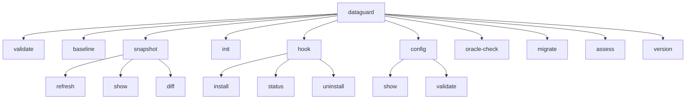

# Tham chiếu CLI

CLI DataGuard (`dataguard`) là giao diện chính để xác thực contract, quản lý schema, và đánh giá môi trường. Xây dựng với `System.CommandLine`, cung cấp 10 lệnh với mẫu tùy chọn nhất quán.

## Cây lệnh



## Lệnh

### `validate`

Xác thực contract entity với schema database hoặc snapshot.

```bash
dataguard validate [options]
```

| Tùy chọn | Mặc định | Mô tả |
|-----------|----------|-------|
| `--connection` | — | Chuỗi kết nối database |
| `--config` | — | Đường dẫn file `.dataguard.yml` |
| `--output` | — | Đường dẫn file output (bắt buộc cho sarif/evidence) |
| `--format` | `text` | Định dạng output: `text`, `sarif`, `evidence`, `contracts`, `yaml`, `typescript` |
| `--offline` | `false` | Chạy ở chế độ offline (không kết nối DB, cần `--assembly`) |
| `--verbose` | `false` | Bật output chi tiết |
| `--provider` | `DefaultProvider` trong config, rồi `sqlserver` | Database provider: `sqlserver`, `oracle`, `mysql`, `postgresql` |
| `--schema` | — | Tên schema/owner |
| `--assembly` | — | Đường dẫn assembly cho chế độ Manual ground-truth |
| `--ef-snapshot` | — | Source `ModelSnapshot.cs` tường minh, parse bằng Roslyn; không load hay thực thi assembly |
| `--ef-project` | — | File `.csproj` hoặc directory chứa source `*ModelSnapshot.cs`; không build hay load assembly |
| `--ef-context` | — | Tên context dùng để chọn một snapshot dưới `--ef-project` |
| `--skip-rules` | — | Danh sách ID rule bỏ qua, phân tách bằng dấu phẩy (ví dụ `DG002,DG017,MY001`) |

**Hành vi:**
- Không có `--connection`: xác thực với snapshot đã commit (chế độ Snapshot)
- Với `--offline`: cần `--assembly` cho chế độ Manual ground-truth dùng attribute `[ExpectedColumn]`/`[ExpectedSpParameter]`
- `--format contracts`: xuất contract đã trích xuất dưới dạng JSON
- `--format yaml`: xuất cùng schema contract dưới dạng YAML xác định
- `--ef-snapshot`: thêm EF descriptor chỉ từ source có giới hạn; syntax/unsupported input lỗi hiển thị thay vì tạo contract rỗng
- `--ef-project`: chỉ nhận directory hoặc `.csproj`, chỉ tìm source snapshot, bỏ qua `bin`, `obj` và `.git`, đồng thời lỗi nếu selection mơ hồ; dùng `--ef-context` để chọn context
- `--ef-snapshot` và `--ef-project` loại trừ nhau; `--ef-context` cần `--ef-project`
- `--skip-rules`: loại trừ các rule ID đã liệt kê trước khi validate; so khớp không phân biệt hoa/thường và bỏ qua khoảng trắng thừa
- `--format typescript`: xuất TypeScript DTO từ entity descriptor

## Managed pre-commit hook

Hook installer ghi script POSIX `sh` và gọi `dataguard validate --format text` để dùng đường Snapshot đã lưu thông thường. Nó không phát `--offline` khi thiếu `--assembly`. Trên Unix, installer đặt executable mode. Install và uninstall chỉ thay thế hoặc xóa file có marker DataGuard-managed; hook người dùng hoặc `lefthook.yml` đang có luôn được giữ lại, kể cả khi yêu cầu force.

```bash
dataguard hook install [--type auto|native|husky|lefthook] [--force]
dataguard hook status
dataguard hook uninstall
```

`status` chỉ đọc. `uninstall` chỉ xóa file mang marker DataGuard; không bao giờ xóa hook do người dùng sở hữu. `--force` không vượt qua quy tắc ownership này.
Native Git hook cũng resolve file `.git` của linked worktree tới `gitdir` thực, nên status và removal thao tác cùng managed file với installation. Installer từ chối hook path là symbolic link và giữ nguyên target bên ngoài workspace.

### `baseline`

Tạo baseline từ các vi phạm hiện tại để phát hiện drift.

```bash
dataguard baseline [options]
```

| Tùy chọn | Mặc định | Mô tả |
|-----------|----------|-------|
| `--connection` | — | Chuỗi kết nối database |
| `--config` | — | Đường dẫn file config |
| `--output` | `.dataguard-baseline.json` | Đường dẫn output baseline |
| `--verbose` | `false` | Output chi tiết |
| `--provider` | `sqlserver` | Database provider |
| `--schema` | — | Tên schema/owner |
| `--package` | — | Tên package Oracle |

**Output bao gồm:**
- Danh sách vi phạm với rule ID và thông báo
- Phiên bản database (từ `@@VERSION` hoặc `V$VERSION`)
- Hash schema (SHA-256, 16 ký tự hex đầu tiên)

### `preflight`

Thực hiện acquisition trực tiếp do operator chủ động cho phép và ghi manifest
giới hạn, đã loại bỏ dữ liệu nhạy cảm, để MSBuild xác thực offline. Property và
import của project không thể tự gọi lệnh này hoặc cấp quyền.

```bash
dataguard preflight --connection "..." --provider sqlserver \
  --target production-schema --output .dataguard/preflight.json
```

`--provider` chỉ nhận `sqlserver`, `postgresql`, `mysql` hoặc `oracle`;
`--target` tối đa 128 ký tự. Output chứa schema version, liên kết target/provider,
số contract và digest SHA-256, không lưu connection string hay payload contract.
Manifest tuyệt đối này có thể truyền vào `DataGuardOfflineManifest` trong build
offline.

### `snapshot`

Quản lý snapshot schema để xác thực offline và phát hiện drift.

#### `snapshot refresh`

Làm mới snapshot từ database trực tiếp.

```bash
dataguard snapshot refresh [options]
```

| Tùy chọn | Mặc định | Mô tả |
|-----------|----------|-------|
| `--connection` | — | Chuỗi kết nối database |
| `--config` | — | Đường dẫn file config |
| `--verbose` | `false` | Output chi tiết |
| `--provider` | `sqlserver` | Database provider |
| `--schema` | — | Tên schema/owner |
| `--package` | — | Tên package Oracle |

**Đặc thù Oracle:** Khi provider là Oracle, capture toàn bộ schema (tất cả bảng, tất cả cột với `CHAR_USED`, `CHAR_LENGTH`) vào snapshot để phát hiện sai lệch độ dài offline.

Lệnh này yêu cầu database connection được cấu hình. Nếu không có acquisition
trực tiếp mới, lệnh trả `UNEVALUATED` (exit code 3) và không tạo snapshot.

#### `snapshot show`

Hiển thị metadata snapshot hiện tại.

```bash
dataguard snapshot show [--config <path>]
```

**Output:**
- Đường dẫn file snapshot
- Version, schema version, chế độ ground truth
- Phiên bản database, hash schema và loại hash
- Provider, phạm vi schema, phiên bản canonicalization
- Thời gian tạo, số lượng vi phạm

#### `snapshot diff`

So sánh schema hiện tại với snapshot đã commit.

```bash
dataguard snapshot diff [options]
```

| Tùy chọn | Mặc định | Mô tả |
|-----------|----------|-------|
| `--fail-on-drift` | `false` | Thoát mã khác 0 khi phát hiện drift |
| `--legacy-violation-diff` | `false` | Bật tường minh so sánh chỉ violation đã deprecated cho snapshot v1 |

**Phát hiện drift:**
- Luôn yêu cầu acquisition trực tiếp mới trước mỗi lần so sánh; không bao giờ
  so schema persisted với chính nó
- Dùng hash schema khi có cả schema persisted và schema vừa acquire
- Trả `UNEVALUATED` (exit code 3) khi thiếu connection, provider result hoặc
  fresh schema bắt buộc
- So sánh snapshot v1 bị tắt mặc định; opt-in tường minh
  `--legacy-violation-diff` không phải bằng chứng structural drift
- Trong môi trường CI (biến `CI` hoặc `GITHUB_ACTIONS` được đặt), cảnh báo drift ngay cả khi không có `--fail-on-drift`

Validate phân loại acquisition contract thành `Complete`, `Unavailable`,
`Incomplete` hoặc `Failed`. Acquisition không hoàn tất trả `UNEVALUATED` (mã
thoát 3) và không xuất contract, YAML, TypeScript, SARIF hay evidence thành
công; nguồn EF model snapshot tường minh vẫn có thể cung cấp contract trực tiếp.

### `init`

Khởi tạo file cấu hình DataGuard.

```bash
dataguard init [--output <path>] [--provider <name>] [--wizard]
```

| Tùy chọn | Mặc định | Mô tả |
|-----------|----------|-------|
| `--output` | `.dataguard.yml` | Đường dẫn file config output |
| `--provider` | `sqlserver` | Provider mặc định |
| `--wizard` | `false` | Hỏi lựa chọn setup tương tác và ghi vào `--output` |

Wizard đọc từ terminal và chỉ ghi đúng đường dẫn `--output` (mặc định `.dataguard.yml`). Nó không đưa connection string vào config sinh ra; dùng `DATAGUARD_CONNECTION_STRING` cho credential.

**Config được tạo:**
```yaml
GroundTruthMode: Snapshot
SnapshotFilePath: .dataguard-snapshot.json
BaselineFilePath: .dataguard-baseline.json
NamingConvention: SnakeCaseToPascalCase
EnableBaseline: true
```

### `config`

Quản lý cấu hình DataGuard.

#### `config show`

Hiển thị cấu hình hiện tại với secret được redact.

```bash
dataguard config show [--config <path>]
```

**Bảo mật:** Chuỗi kết nối luôn được redact thành `***redacted***` trong output.

#### `config validate`

Xác thực file cấu hình.

```bash
dataguard config validate [--config <path>]
```

### `oracle-check`

Chạy kiểm tra phương ngữ và độ dài đặc thù Oracle.

```bash
dataguard oracle-check [options]
```

| Tùy chọn | Mặc định | Mô tả |
|-----------|----------|-------|
| `--connection` | — | **Bắt buộc.** Chuỗi kết nối Oracle |
| `--config` | — | Đường dẫn file config |
| `--output` | — | Đường dẫn file output |
| `--format` | `text` | Định dạng output |
| `--verbose` | `false` | Output chi tiết |
| `--schema` | — | Oracle owner/schema |
| `--package` | — | Tên package Oracle |

**Pipeline:**
1. Giải quyết ngữ nghĩa độ dài NLS (CHAR vs BYTE)
2. Đọc toàn bộ schema (tất cả bảng, tất cả cột)
3. Chạy kiểm tra phương ngữ với kiểu cột
4. Báo cáo sử dụng kiểu không ánh xạ

### `migrate`

Di chuyển file baseline legacy (v1) sang định dạng v2.

```bash
dataguard migrate [--baseline <path>]
```

| Tùy chọn | Mặc định | Mô tả |
|-----------|----------|-------|
| `--baseline` | `.dataguard-baseline.json` | Đường dẫn file baseline cần di chuyển |

### `assess`

Chạy đánh giá môi trường/phụ thuộc/cấu hình chỉ đọc.

```bash
dataguard assess [options]
```

| Tùy chọn | Mặc định | Mô tả |
|-----------|----------|-------|
| `--workspace` | `.` | Workspace root để đánh giá |
| `--project-filter` | — | Bộ lọc đường dẫn project (substring, không phân biệt hoa thường) |
| `--output` | — | Đường dẫn file output |
| `--format` | `text` | Định dạng output: `text`, `json`, `sarif` |
| `--verbose` | `false` | Output chi tiết |

**Các pack đánh giá:**
- Inventory: file project, target framework
- Dependencies: gói NuGet, phân tích phiên bản
- Build/CI: script build, cấu hình CI
- Secrets: phát hiện credential cứng
- Dependency health: gói lỗi thời/dễ bị tổn thương

### `version`

Hiển thị thông tin phiên bản DataGuard.

```bash
dataguard version
```

**Output:**
- Phiên bản CLI (từ `AssemblyInformationalVersion`)
- Phiên bản runtime .NET
- Phiên bản OS
- Phiên bản thành phần: Core, Oracle.Adapter, SqlServer.Adapter, Analyzers

## Tùy chọn chung

| Tùy chọn | Viết tắt | Mô tả |
|-----------|----------|-------|
| `--connection` | — | Chuỗi kết nối database |
| `--config` | `-c` | Đường dẫn `.dataguard.yml` |
| `--output` | `-o` | Đường dẫn file output |
| `--format` | `-f` | Định dạng output |
| `--offline` | — | Chế độ offline (không DB) |
| `--verbose` | `-v` | Output chi tiết |
| `--provider` | `-p` | Database provider |
| `--schema` | `-s` | Tên schema/owner |
| `--package` | — | Tên package Oracle |
| `--assembly` | — | Đường dẫn assembly cho chế độ Manual |
| `--fail-on-drift` | — | Thoát mã khác 0 khi có drift |

## Mã thoát

| Mã | Ý nghĩa |
|----|---------|
| `0` | Pass — không tìm thấy lỗi |
| `1` | Fail — phát hiện lỗi hoặc lỗi vận hành |
| `2` | Lỗi cấu hình — tùy chọn không hợp lệ hoặc định dạng không hỗ trợ |

## Định dạng output

### `text` (mặc định)

Output console dễ đọc với mã màu theo mức độ nghiêm trọng.

### `sarif`

Định dạng JSON SARIF 2.1.0 cho tích hợp IDE và pipeline CI. Cần `--output`.

### `evidence`

JSON bằng chứng contract cho audit trail. Cần `--output`.

### `contracts`

Contract descriptor đã xuất dưới dạng JSON. Cần `--output`.

### `typescript`

Định nghĩa TypeScript DTO được xuất từ entity descriptor. Cần `--output`.

## File cấu hình

File `.dataguard.yml` hỗ trợ tất cả tùy chọn cấu hình:

```yaml
GroundTruthMode: Snapshot          # Snapshot | Manual | Full
ConnectionString: "Server=..."     # Ưu tiên env DATAGUARD_CONNECTION_STRING
DefaultSchema: dbo
DefaultPackage: ""                 # Tên package Oracle
NamingConvention: SnakeCaseToPascalCase
EnableBaseline: true
BaselineFilePath: .dataguard-baseline.json
SnapshotFilePath: .dataguard-snapshot.json
EnableConcurrentValidation: true
MaxDegreeOfParallelism: 4
```

**Lưu ý bảo mật:** Không bao giờ commit chuỗi kết nối vào source control. Sử dụng biến môi trường `DATAGUARD_CONNECTION_STRING` thay thế.

Với mọi lệnh cần database, thứ tự resolve connection là xác định: `--connection` ưu tiên cao nhất, tiếp theo là `DATAGUARD_CONNECTION_STRING`, rồi `ConnectionString` trong config được chọn. Thứ tự provider là `--provider`, rồi `DefaultProvider` đã lưu trong config, rồi `sqlserver`. `dataguard init --provider oracle` ghi fallback này nhưng không lưu credential.

Khi provider được chọn có rule cần analyzer context nhưng context chưa có, `validate` báo rule ID và prerequisite, thoát với code `3`, đồng thời không xuất payload success thông thường cho text/SARIF/evidence/contracts/TypeScript. Đây là run incomplete, không phải kết quả sạch.

## Biến môi trường

| Biến | Mục đích |
|------|----------|
| `DATAGUARD_CONNECTION_STRING` | Chuỗi kết nối database (ghi đè config) |
| `CI` | Được phát hiện cho hành vi đặc thù CI |
| `GITHUB_ACTIONS` | Được phát hiện cho hành vi đặc thù GitHub Actions |
