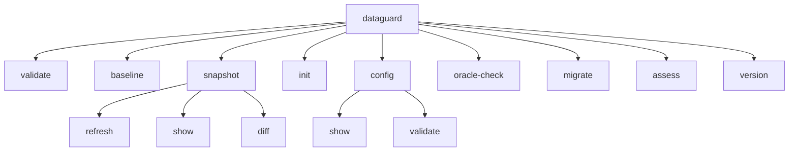

# Tham chiếu CLI

CLI DataGuard (`dataguard`) là giao diện chính để xác thực contract, quản lý schema, và đánh giá môi trường. Xây dựng với `System.CommandLine`, cung cấp 9 lệnh với mẫu tùy chọn nhất quán.

## Cây lệnh



## Lệnh

### `validate`

Xác thực contract entity với schema database hoặc snapshot.

```bash
dataguard validate [options]
```

| Tùy chọn | Mặc định | Mô tả |
|-----------|----------|-------|
| `--connection` | — | Chuỗi kết nối database |
| `--config` | — | Đường dẫn file `.dataguard.yml` |
| `--output` | — | Đường dẫn file output (bắt buộc cho sarif/evidence) |
| `--format` | `text` | Định dạng output: `text`, `sarif`, `evidence`, `contracts`, `typescript` |
| `--offline` | `false` | Chạy ở chế độ offline (không kết nối DB, cần `--assembly`) |
| `--verbose` | `false` | Bật output chi tiết |
| `--provider` | `sqlserver` | Database provider: `sqlserver`, `oracle`, `mysql`, `postgresql` |
| `--schema` | — | Tên schema/owner |
| `--assembly` | — | Đường dẫn assembly cho chế độ Manual ground-truth |

**Hành vi:**
- Không có `--connection`: xác thực với snapshot đã commit (chế độ Snapshot)
- Với `--offline`: cần `--assembly` cho chế độ Manual ground-truth dùng attribute `[ExpectedColumn]`/`[ExpectedSpParameter]`
- `--format contracts`: xuất contract đã trích xuất dưới dạng JSON
- `--format typescript`: xuất TypeScript DTO từ entity descriptor

### `baseline`

Tạo baseline từ các vi phạm hiện tại để phát hiện drift.

```bash
dataguard baseline [options]
```

| Tùy chọn | Mặc định | Mô tả |
|-----------|----------|-------|
| `--connection` | — | Chuỗi kết nối database |
| `--config` | — | Đường dẫn file config |
| `--output` | `.dataguard-baseline.json` | Đường dẫn output baseline |
| `--verbose` | `false` | Output chi tiết |
| `--provider` | `sqlserver` | Database provider |
| `--schema` | — | Tên schema/owner |
| `--package` | — | Tên package Oracle |

**Output bao gồm:**
- Danh sách vi phạm với rule ID và thông báo
- Phiên bản database (từ `@@VERSION` hoặc `V$VERSION`)
- Hash schema (SHA-256, 16 ký tự hex đầu tiên)

### `snapshot`

Quản lý snapshot schema để xác thực offline và phát hiện drift.

#### `snapshot refresh`

Làm mới snapshot từ database trực tiếp.

```bash
dataguard snapshot refresh [options]
```

| Tùy chọn | Mặc định | Mô tả |
|-----------|----------|-------|
| `--connection` | — | Chuỗi kết nối database |
| `--config` | — | Đường dẫn file config |
| `--verbose` | `false` | Output chi tiết |
| `--provider` | `sqlserver` | Database provider |
| `--schema` | — | Tên schema/owner |
| `--package` | — | Tên package Oracle |

**Đặc thù Oracle:** Khi provider là Oracle, capture toàn bộ schema (tất cả bảng, tất cả cột với `CHAR_USED`, `CHAR_LENGTH`) vào snapshot để phát hiện sai lệch độ dài offline.

#### `snapshot show`

Hiển thị metadata snapshot hiện tại.

```bash
dataguard snapshot show [--config <path>]
```

**Output:**
- Đường dẫn file snapshot
- Version, schema version, chế độ ground truth
- Phiên bản database, hash schema
- Thời gian tạo, số lượng vi phạm

#### `snapshot diff`

So sánh schema hiện tại với snapshot đã commit.

```bash
dataguard snapshot diff [options]
```

| Tùy chọn | Mặc định | Mô tả |
|-----------|----------|-------|
| `--fail-on-drift` | `false` | Thoát mã khác 0 khi phát hiện drift |

**Phát hiện drift:**
- Dùng hash dựa trên schema khi snapshot chứa schema persisted (Oracle)
- Quay lại hash dựa trên vi phạm cho snapshot v1 legacy
- Trong môi trường CI (biến `CI` hoặc `GITHUB_ACTIONS` được đặt), cảnh báo drift ngay cả khi không có `--fail-on-drift`

### `init`

Khởi tạo file cấu hình DataGuard.

```bash
dataguard init [--output <path>] [--provider <name>]
```

| Tùy chọn | Mặc định | Mô tả |
|-----------|----------|-------|
| `--output` | `.dataguard.yml` | Đường dẫn file config output |
| `--provider` | `sqlserver` | Provider mặc định |

**Config được tạo:**
```yaml
GroundTruthMode: Snapshot
SnapshotFilePath: .dataguard-snapshot.json
BaselineFilePath: .dataguard-baseline.json
NamingConvention: SnakeCaseToPascalCase
EnableBaseline: true
```

### `config`

Quản lý cấu hình DataGuard.

#### `config show`

Hiển thị cấu hình hiện tại với secret được redact.

```bash
dataguard config show [--config <path>]
```

**Bảo mật:** Chuỗi kết nối luôn được redact thành `***redacted***` trong output.

#### `config validate`

Xác thực file cấu hình.

```bash
dataguard config validate [--config <path>]
```

### `oracle-check`

Chạy kiểm tra phương ngữ và độ dài đặc thù Oracle.

```bash
dataguard oracle-check [options]
```

| Tùy chọn | Mặc định | Mô tả |
|-----------|----------|-------|
| `--connection` | — | **Bắt buộc.** Chuỗi kết nối Oracle |
| `--config` | — | Đường dẫn file config |
| `--output` | — | Đường dẫn file output |
| `--format` | `text` | Định dạng output |
| `--verbose` | `false` | Output chi tiết |
| `--schema` | — | Oracle owner/schema |
| `--package` | — | Tên package Oracle |

**Pipeline:**
1. Giải quyết ngữ nghĩa độ dài NLS (CHAR vs BYTE)
2. Đọc toàn bộ schema (tất cả bảng, tất cả cột)
3. Chạy kiểm tra phương ngữ với kiểu cột
4. Báo cáo sử dụng kiểu không ánh xạ

### `migrate`

Di chuyển file baseline legacy (v1) sang định dạng v2.

```bash
dataguard migrate [--baseline <path>]
```

| Tùy chọn | Mặc định | Mô tả |
|-----------|----------|-------|
| `--baseline` | `.dataguard-baseline.json` | Đường dẫn file baseline cần di chuyển |

### `assess`

Chạy đánh giá môi trường/phụ thuộc/cấu hình chỉ đọc.

```bash
dataguard assess [options]
```

| Tùy chọn | Mặc định | Mô tả |
|-----------|----------|-------|
| `--workspace` | `.` | Workspace root để đánh giá |
| `--project-filter` | — | Bộ lọc đường dẫn project (substring, không phân biệt hoa thường) |
| `--output` | — | Đường dẫn file output |
| `--format` | `text` | Định dạng output: `text`, `json`, `sarif` |
| `--verbose` | `false` | Output chi tiết |

**Các pack đánh giá:**
- Inventory: file project, target framework
- Dependencies: gói NuGet, phân tích phiên bản
- Build/CI: script build, cấu hình CI
- Secrets: phát hiện credential cứng
- Dependency health: gói lỗi thời/dễ bị tổn thương

### `version`

Hiển thị thông tin phiên bản DataGuard.

```bash
dataguard version
```

**Output:**
- Phiên bản CLI (từ `AssemblyInformationalVersion`)
- Phiên bản runtime .NET
- Phiên bản OS
- Phiên bản thành phần: Core, Oracle.Adapter, SqlServer.Adapter, Analyzers

## Tùy chọn chung

| Tùy chọn | Viết tắt | Mô tả |
|-----------|----------|-------|
| `--connection` | — | Chuỗi kết nối database |
| `--config` | `-c` | Đường dẫn `.dataguard.yml` |
| `--output` | `-o` | Đường dẫn file output |
| `--format` | `-f` | Định dạng output |
| `--offline` | — | Chế độ offline (không DB) |
| `--verbose` | `-v` | Output chi tiết |
| `--provider` | `-p` | Database provider |
| `--schema` | `-s` | Tên schema/owner |
| `--package` | — | Tên package Oracle |
| `--assembly` | — | Đường dẫn assembly cho chế độ Manual |
| `--fail-on-drift` | — | Thoát mã khác 0 khi có drift |

## Mã thoát

| Mã | Ý nghĩa |
|----|---------|
| `0` | Pass — không tìm thấy lỗi |
| `1` | Fail — phát hiện lỗi hoặc lỗi vận hành |
| `2` | Lỗi cấu hình — tùy chọn không hợp lệ hoặc định dạng không hỗ trợ |

## Định dạng output

### `text` (mặc định)

Output console dễ đọc với mã màu theo mức độ nghiêm trọng.

### `sarif`

Định dạng JSON SARIF 2.1.0 cho tích hợp IDE và pipeline CI. Cần `--output`.

### `evidence`

JSON bằng chứng contract cho audit trail. Cần `--output`.

### `contracts`

Contract descriptor đã xuất dưới dạng JSON. Cần `--output`.

### `typescript`

Định nghĩa TypeScript DTO được xuất từ entity descriptor. Cần `--output`.

## File cấu hình

File `.dataguard.yml` hỗ trợ tất cả tùy chọn cấu hình:

```yaml
GroundTruthMode: Snapshot          # Snapshot | Manual | Full
ConnectionString: "Server=..."     # Ưu tiên env DATAGUARD_CONNECTION_STRING
DefaultSchema: dbo
DefaultPackage: ""                 # Tên package Oracle
NamingConvention: SnakeCaseToPascalCase
EnableBaseline: true
BaselineFilePath: .dataguard-baseline.json
SnapshotFilePath: .dataguard-snapshot.json
EnableConcurrentValidation: true
MaxDegreeOfParallelism: 4
```

**Lưu ý bảo mật:** Không bao giờ commit chuỗi kết nối vào source control. Sử dụng biến môi trường `DATAGUARD_CONNECTION_STRING` thay thế.

## Biến môi trường

| Biến | Mục đích |
|------|----------|
| `DATAGUARD_CONNECTION_STRING` | Chuỗi kết nối database (ghi đè config) |
| `CI` | Được phát hiện cho hành vi đặc thù CI |
| `GITHUB_ACTIONS` | Được phát hiện cho hành vi đặc thù GitHub Actions |
