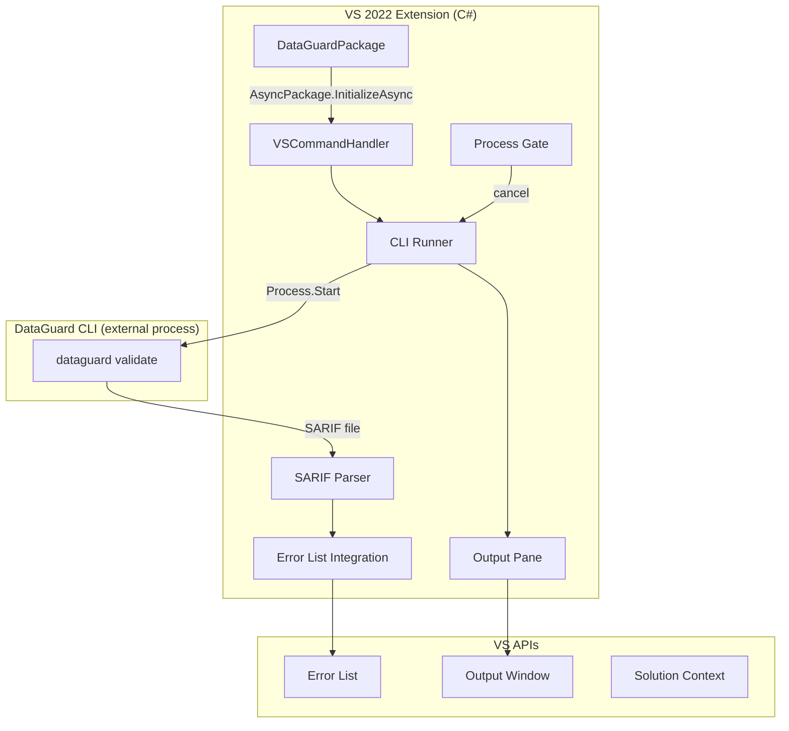
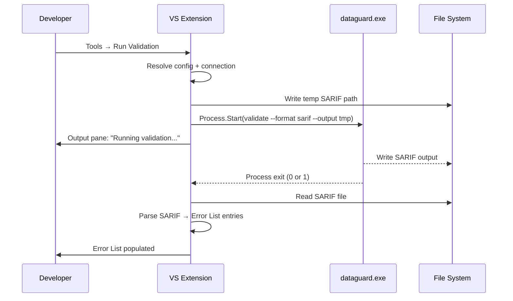

# Visual Studio 2022 Extension

The DataGuard Visual Studio 2022 extension integrates contract validation into the VS IDE via the VSSDK extensibility model. It runs the DataGuard CLI as an external process and surfaces results in the Error List and Output pane.

## Architecture



## Key Design Decision: External CLI Process

The VS extension does **not** load database providers inside `devenv.exe`. Instead, it shells out to the `dataguard` CLI:

**Why:**
- Database provider assemblies (e.g., `Oracle.ManagedDataAccess.Core`) have native dependencies that conflict with VS's loaded assemblies
- The CLI is a self-contained .NET 9 application with its own assembly load context
- Process isolation prevents crashes in the IDE from provider failures
- The CLI can be updated independently of the VS extension

## DataGuardPackage

The entry point is an `AsyncPackage` that registers commands and initializes the extension:

```csharp
[PackageRegistration(UseManagedResourcesOnly = true, AllowsBackgroundLoading = true)]
[ProvideAutoLoad(UIContextGuids80.SolutionExists, PackageAutoLoadFlags.BackgroundLoad)]
[Guid("dataguard-package-guid")]
[ProvideMenuResource("Menus.ctmenu", 1)]
public sealed class DataGuardPackage : AsyncPackage
{
    protected override async Task InitializeAsync(
        CancellationToken cancellationToken,
        IProgress<ServiceProgressData> progress)
    {
        await base.InitializeAsync(cancellationToken, progress);
        await JoinableTaskFactory.SwitchToMainThreadAsync(cancellationToken);
        await DataGuardCommand.InitializeAsync(this);
    }
}
```

### Attributes

| Attribute | Purpose |
|-----------|---------|
| `PackageRegistration` | Registers the package with VS |
| `ProvideAutoLoad` | Auto-loads when a solution exists |
| `Guid` | Unique package identifier |
| `ProvideMenuResource` | Links to command menu definitions |

## VSSDK Tools Commands

Commands are defined in a `.vsct` (Visual Studio Command Table) file:

| Command | ID | Menu Location |
|---------|----|---------------|
| Run Validation | `cmdidRunValidation` | Tools menu + context menu |
| Cancel Validation | `cmdidCancelValidation` | Tools menu |
| Show Settings | `cmdidShowSettings` | Tools menu |

### Command Handler

```csharp
public sealed class DataGuardCommand
{
    public static async Task InitializeAsync(AsyncPackage package)
    {
        var commandService = await package.GetServiceAsync<IMenuCommandService>();
        var runCommand = new CommandID(GuidList.guidDataGuardCmdSet,
            (int)PkgCmdIDList.cmdidRunValidation);
        commandService.AddCommand(new MenuCommand(ExecuteValidation, runCommand));
    }

    private static void ExecuteValidation(object sender, EventArgs e)
    {
        // Runs on UI thread; spawns CLI process
    }
}
```

## CLI Runner

The CLI runner manages the external `dataguard` process:

### Process Lifecycle



### Process Start

```csharp
var psi = new ProcessStartInfo
{
    FileName = "dataguard",
    Arguments = $"validate --format sarif --output \"{sarifPath}\" --provider {provider}",
    UseShellExecute = false,
    RedirectStandardOutput = true,
    RedirectStandardError = true,
    CreateNoWindow = true,
};
var process = Process.Start(psi);
```

### Output Capture

Both stdout and stderr are captured asynchronously and written to the VS Output pane:

```csharp
process.OutputDataReceived += (s, e) =>
{
    if (e.Data != null)
        OutputPane.WriteLine(e.Data);
};
```

## SARIF to Error List Integration

The extension parses SARIF 2.1.0 output and creates `ErrorTask` entries for the VS Error List:

### Mapping

| SARIF Field | ErrorTask Property |
|-------------|-------------------|
| `result.ruleId` | `Category` |
| `result.level` | `ErrorCategory` (Error/Warning/Message) |
| `result.message.text` | `Text` |
| `result.locations[].physicalLocation.artifactLocation.uri` | `Document` |
| `result.locations[].physicalLocation.region.startLine` | `Line` |

### Error Categories

| SARIF Level | VS ErrorCategory |
|-------------|-----------------|
| `error` | `TaskErrorCategory.Error` |
| `warning` | `TaskErrorCategory.Warning` |
| `note` | `TaskErrorCategory.Message` |

## Output Pane

A dedicated "DataGuard" output pane displays:

- Command being executed
- CLI stdout (real-time streaming)
- CLI stderr (errors)
- Summary: "Validation complete: N issues (X errors, Y warnings)"

The pane is created via `IVsOutputWindow`:

```csharp
var outputWindow = await GetServiceAsync<SVsOutputWindow, IVsOutputWindow>();
outputWindow.CreatePane(ref guidDataGuardOutputPane, "DataGuard", 1, 1);
outputWindow.GetPane(ref guidDataGuardOutputPane, out var pane);
```

## Process Gate for Cancellation

The extension maintains a `CancellationTokenSource` that gates the running process:

```csharp
private CancellationTokenSource? _validationCts;

public void CancelValidation()
{
    _validationCts?.Cancel();
    // Process.Kill() is called if graceful cancellation fails
}
```

When the user triggers "Cancel Validation":
1. `CancellationTokenSource.Cancel()` is called
2. If the process doesn't exit within 5 seconds, `Process.Kill()` is called
3. The Error List is not updated with partial results
4. The Output pane shows "Validation cancelled"

## Configuration

The extension reads configuration from:

1. **`.dataguard.yml`** in the solution root (primary)
2. **VS Options page** (Tools → Options → DataGuard)
3. **Environment variables** (`DATAGUARD_CONNECTION_STRING`)

### Options Page

| Setting | Type | Default | Description |
|---------|------|---------|-------------|
| CLI Path | `string` | `dataguard` | Path to the CLI executable |
| Default Provider | `enum` | `sqlserver` | Default database provider |
| Auto-validate on Build | `bool` | `false` | Run validation before build |
| Show Output Pane | `bool` | `true` | Auto-show output pane on validation |

## Limitations

- Requires the `dataguard` CLI installed and on PATH
- No real-time squiggles (unlike the VS Code extension with Roslyn analyzers)
- SARIF file paths must be within the solution directory for Error List navigation
- One validation at a time; concurrent requests queue
