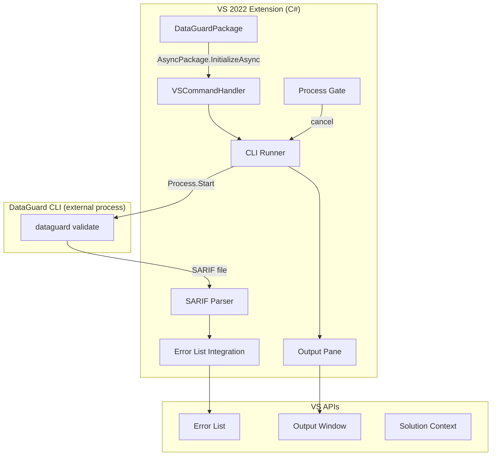
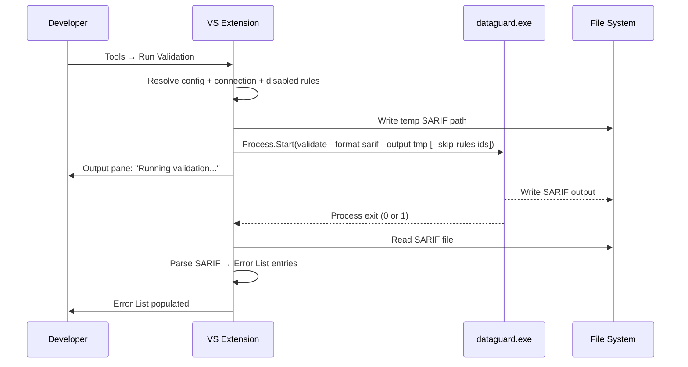

# Visual Studio 2022 Extension

The DataGuard Visual Studio 2022 extension integrates contract validation into the VS IDE via the VSSDK extensibility model. It runs the DataGuard CLI as an external process and surfaces results in the Error List and Output pane.

## Architecture


```mermaid
graph TB
    subgraph "VS 2022 Extension (C#)"
        PKG[DataGuardPackage]
        CMD[VSCommandHandler]
        CLR[CLI Runner]
        SARIF[SARIF Parser]
        ERR[Error List Integration]
        OUT[Output Pane]
        PG[Process Gate]
    end

    subgraph "DataGuard CLI (external process)"
        DG[dataguard validate]
    end

    subgraph "VS APIs"
        EL[Error List]
        OP[Output Window]
        SC[Solution Context]
    end

    PKG -->|AsyncPackage.InitializeAsync| CMD
    CMD --> CLR
    CLR -->|Process.Start| DG
    DG -->|SARIF file| SARIF
    SARIF --> ERR
    ERR --> EL
    CLR --> OUT
    OUT --> OP
    PG -->|cancel| CLR
```

## Key Design Decision: External CLI Process

The VS extension does **not** load database providers inside `devenv.exe`. Instead, it shells out to the `dataguard` CLI:

**Why:**
- Database provider assemblies (e.g., `Oracle.ManagedDataAccess.Core`) have native dependencies that conflict with VS's loaded assemblies
- The CLI is a self-contained .NET 9 application with its own assembly load context
- Process isolation prevents crashes in the IDE from provider failures
- The CLI can be updated independently of the VS extension

## DataGuardPackage

The entry point is an `AsyncPackage` that registers commands and initializes the extension:

```csharp
[ProvideBindingPath]
[PackageRegistration(UseManagedResourcesOnly = true, AllowsBackgroundLoading = true)]
[ProvideAutoLoad(UIContextGuids80.SolutionExists, PackageAutoLoadFlags.BackgroundLoad)]
[Guid("dataguard-package-guid")]
[ProvideMenuResource("Menus.ctmenu", 1)]
public sealed class DataGuardPackage : AsyncPackage
{
    protected override async Task InitializeAsync(
        CancellationToken cancellationToken,
        IProgress<ServiceProgressData> progress)
    {
        await base.InitializeAsync(cancellationToken, progress);
        await JoinableTaskFactory.SwitchToMainThreadAsync(cancellationToken);
        await DataGuardCommand.InitializeAsync(this);
    }
}
```

### Attributes

| Attribute | Purpose |
|-----------|---------|
| `PackageRegistration` | Registers the package with VS |
| `ProvideAutoLoad` | Auto-loads when a solution exists |
| `Guid` | Unique package identifier |
| `ProvideMenuResource` | Links to command menu definitions |
| `ProvideBindingPath` | Adds the extension installation directory to Visual Studio's assembly probing path for bundled dependencies |

## VSSDK Tools Commands

Commands are defined in a `.vsct` (Visual Studio Command Table) file:

| Command | ID | Menu Location |
|---------|----|---------------|
| Run Validation | `ValidateCommand` (`0x0100`) | Tools menu |
| Cancel Validation | `CancelCommand` (`0x0101`) | Tools menu |
| Assess Workspace | `AssessCommand` (`0x0102`) | Tools menu; runs local-first assessment with no remote advisory consent |

### Command Handler

```csharp
public sealed class DataGuardCommand
{
    public static async Task InitializeAsync(AsyncPackage package)
    {
        var commandService = await package.GetServiceAsync<IMenuCommandService>();
        var runCommand = new CommandID(GuidList.guidDataGuardCmdSet,
            (int)PkgCmdIDList.cmdidRunValidation);
        commandService.AddCommand(new MenuCommand(ExecuteValidation, runCommand));
    }

    private static void ExecuteValidation(object sender, EventArgs e)
    {
        // Runs on UI thread; spawns CLI process
    }
}
```

## CLI Runner

The CLI runner manages the external `dataguard` process:

### Process Lifecycle


```mermaid
sequenceDiagram
    participant User as Developer
    participant VS as VS Extension
    participant CLI as dataguard.exe
    participant FS as File System

    User->>VS: Tools → Run Validation
    VS->>VS: Resolve config + connection + disabled rules
    VS->>FS: Write temp SARIF path
    VS->>CLI: Process.Start(validate --format sarif --output tmp [--skip-rules ids])
    VS->>User: Output pane: "Running validation..."
    CLI-->>FS: Write SARIF output
    CLI-->>VS: Process exit (0 or 1)
    VS->>FS: Read SARIF file
    VS->>VS: Parse SARIF → Error List entries
    VS->>User: Error List populated
```

### Process Start

```csharp
var psi = new ProcessStartInfo
{
    FileName = "dataguard",
    Arguments = $"validate --format sarif --output \"{sarifPath}\" --provider {provider}{skipArg}",
    UseShellExecute = false,
    RedirectStandardOutput = true,
    RedirectStandardError = true,
    CreateNoWindow = true,
};
var process = Process.Start(psi);
```

`skipArg` is `" --skip-rules " + string.Join(",", disabledRuleIds)` when the Validation Rules options page has disabled rules; otherwise it is empty. Disabled rules are therefore excluded by the CLI and never reach the SARIF/Error List stage.

### Output Capture

Both stdout and stderr are captured asynchronously and written to the VS Output pane:

```csharp
process.OutputDataReceived += (s, e) =>
{
    if (e.Data != null)
        OutputPane.WriteLine(e.Data);
};
```

## SARIF to Error List Integration

The extension parses SARIF 2.1.0 output and creates `ErrorTask` entries for the VS Error List:

### Mapping

| SARIF Field | ErrorTask Property |
|-------------|-------------------|
| `result.ruleId` | `Category` |
| `result.level` | `ErrorCategory` (Error/Warning/Message) |
| `result.message.text` | `Text` |
| `result.locations[].physicalLocation.artifactLocation.uri` | `Document` |
| `result.locations[].physicalLocation.region.startLine` | `Line` |
| `result.locations[].physicalLocation.region.startColumn` | `Column` |

### Error List Navigation

Each `ErrorTask` attaches an asynchronous `Navigate` event handler that switches to the Visual Studio main thread and calls:
```csharp
VsShellUtilities.OpenDocument(
    this,
    task.Document,
    Microsoft.VisualStudio.VSConstants.LOGVIEWID_Code,
    out _,
    out _,
    out IVsWindowFrame windowFrame,
    out IVsTextView textView);
windowFrame?.Show();
if (textView != null)
{
    textView.SetCaretPos(task.Line, task.Column);
    textView.CenterLines(task.Line, 1);
}
```
Double-clicking an item in the Error List automatically opens the target source file, places the caret at the exact `Line` and `Column`, and centers the line in the active text editor. If the target file no longer exists, a diagnostic message is printed to the DataGuard Output pane.

### Error Categories

| SARIF Level | VS ErrorCategory |
|-------------|-----------------|
| `error` | `TaskErrorCategory.Error` |
| `warning` | `TaskErrorCategory.Warning` |
| `note` | `TaskErrorCategory.Message` |

## Output Pane and Rule Inventory Summary

A dedicated "DataGuard" output pane displays:

- Command being executed
- CLI stdout (real-time streaming progress)
- CLI stderr (errors)
- Validation summary and Rule Inventory Banner:

```text
[DataGuard] ==================== Validation Summary ====================
[DataGuard] Rules Evaluated: 12 (DG001, DG002, DG010, ...)
[DataGuard] Rules with Findings: DG010 (2)
[DataGuard] Double-click any Error List item to jump directly to code.
[DataGuard] ==========================================================
```

The inventory accumulator (`_ruleInventory`) tracks rule IDs, rule titles, and finding counts under lock synchronization across CLI progress events and clears between validation runs.

The pane is created via `IVsOutputWindow`:

```csharp
var outputWindow = await GetServiceAsync<SVsOutputWindow, IVsOutputWindow>();
outputWindow.CreatePane(ref guidDataGuardOutputPane, "DataGuard", 1, 1);
outputWindow.GetPane(ref guidDataGuardOutputPane, out var pane);
```

## Bundled Roslyn Analyzers and Code Fixes

The extension packages Roslyn code analyzers and fixes directly inside the VSIX container:
- `DataGuard.Analyzers.dll`
- `DataGuard.CodeFixes.dll`

These assemblies are built during the VSIX packaging target (`BuildAnalyzers`) and registered as Analyzer assets in `source.extension.vsixmanifest`:
```xml
<Asset Type="Microsoft.VisualStudio.Analyzer" Path="DataGuard.Analyzers.dll" />
<Asset Type="Microsoft.VisualStudio.Analyzer" Path="DataGuard.CodeFixes.dll" />
```
This enables in-editor live diagnostics and quick-fixes for solutions opened in Visual Studio 2022 without requiring separate per-project NuGet package installations.
## Process Gate for Cancellation

The extension maintains a `CancellationTokenSource` that gates the running process:

```csharp
private CancellationTokenSource? _validationCts;

public void CancelValidation()
{
    _validationCts?.Cancel();
    // Process.Kill() is called if graceful cancellation fails
}
```

When the user triggers "Cancel Validation":
1. `CancellationTokenSource.Cancel()` is called
2. If the process doesn't exit within 5 seconds, `Process.Kill()` is called
3. The Error List is not updated with partial results
4. The Output pane shows "Validation cancelled"

## Configuration

The extension reads configuration from:

1. **`.dataguard.yml`** in the solution root (primary)
2. **VS Options page** (Tools → Options → DataGuard)
3. **Environment variables** (`DATAGUARD_CONNECTION_STRING`)

### Options Page (Tools → Options → DataGuard → General)

| Setting | Type | Category | Default | Description |
|---------|------|----------|---------|-------------|
| Enable Detailed Logging | `bool` | Diagnostics & Logging | `true` | Automatically records lifecycle events, command runs, CLI outputs, and errors |
| Log Directory | `string` | Diagnostics & Logging | `""` (empty) | Custom directory for log files (defaults to `%APPDATA%\DataGuard\logs`) |
| Custom CLI Executable Path | `string` | CLI Configuration | `""` (empty) | Absolute path to `dataguard.exe` (falls back to `DATAGUARD_CLI_PATH`, `~/.dotnet/tools`, or PATH) |
| Run Validation on Build | `bool` | Automation | `false` | Automatically trigger validation when a solution build/rebuild finishes successfully |
| Validation Timeout (seconds) | `int` | Automation | `300` | Timeout before CLI `validate` process is terminated (clamped between 5 and 900 seconds) |
| Assessment Timeout (seconds) | `int` | Automation | `60` | Timeout before CLI `assess` process is terminated (clamped between 5 and 900 seconds) |
### Validation Rules options

`Tools → Options → DataGuard → Validation Rules` exposes one toggle per rule group. `GetDisabledRuleIds()` maps each disabled toggle to its concrete rule IDs (for example disabling dialect leakage excludes `DG010-DG013,MY001-MY003,PG001-PG002`). `Run Validation` forwards that list as `validate --skip-rules <ids>`.

## Limitations

- Requires the `dataguard` CLI installed and on PATH for full project-wide batch validation
- In-editor squiggles and code fixes for opened C# documents are provided by the bundled Roslyn analyzers (`DataGuard.Analyzers.dll` and `DataGuard.CodeFixes.dll`)
- SARIF file paths must be within the solution directory for Error List navigation
- One validation at a time; concurrent requests queue
