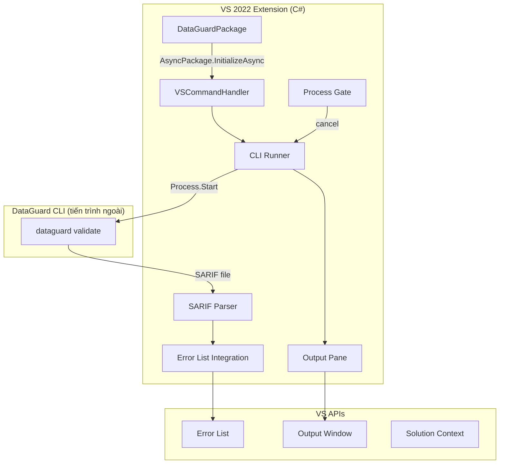
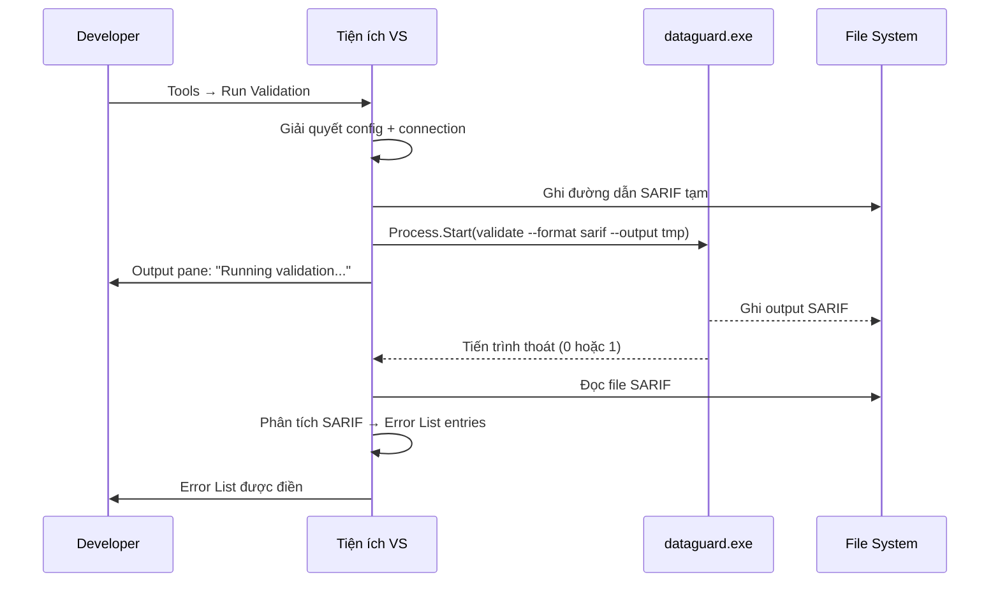

# Tiện ích mở rộng Visual Studio 2022

Tiện ích mở rộng Visual Studio 2022 của DataGuard tích hợp xác thực contract vào VS IDE qua mô hình mở rộng VSSDK. Chạy CLI DataGuard như tiến trình bên ngoài và hiển thị kết quả trong Error List và Output pane.

## Kiến trúc



## Quyết định thiết kế chính: Tiến trình CLI bên ngoài

Tiện ích VS **không** tải database provider bên trong `devenv.exe`. Thay vào đó, nó gọi ra CLI `dataguard`:

**Lý do:**
- Assembly provider database (ví dụ: `Oracle.ManagedDataAccess.Core`) có phụ thuộc native xung đột với assembly đã tải của VS
- CLI là ứng dụng .NET 9 tự chứa với ngữ cảnh tải assembly riêng
- Cô lập tiến trình ngăn crash trong IDE do lỗi provider
- CLI có thể được cập nhật độc lập với tiện ích VS

## DataGuardPackage

Điểm vào là `AsyncPackage` đăng ký lệnh và khởi tạo tiện ích:

```csharp
[PackageRegistration(UseManagedResourcesOnly = true, AllowsBackgroundLoading = true)]
[ProvideAutoLoad(UIContextGuids80.SolutionExists, PackageAutoLoadFlags.BackgroundLoad)]
[Guid("dataguard-package-guid")]
[ProvideMenuResource("Menus.ctmenu", 1)]
public sealed class DataGuardPackage : AsyncPackage
{
    protected override async Task InitializeAsync(
        CancellationToken cancellationToken,
        IProgress<ServiceProgressData> progress)
    {
        await base.InitializeAsync(cancellationToken, progress);
        await JoinableTaskFactory.SwitchToMainThreadAsync(cancellationToken);
        await DataGuardCommand.InitializeAsync(this);
    }
}
```

### Attributes

| Attribute | Mục đích |
|-----------|----------|
| `PackageRegistration` | Đăng ký package với VS |
| `ProvideAutoLoad` | Tự động tải khi solution tồn tại |
| `Guid` | Định danh package duy nhất |
| `ProvideMenuResource` | Liên kết với định nghĩa menu lệnh |

## Lệnh VSSDK Tools

Lệnh được định nghĩa trong file `.vsct` (Visual Studio Command Table):

| Lệnh | ID | Vị trí menu |
|------|----|-------------|
| Chạy xác thực | `cmdidRunValidation` | Tools menu + context menu |
| Hủy xác thực | `cmdidCancelValidation` | Tools menu |
| Hiển thị cài đặt | `cmdidShowSettings` | Tools menu |

### Command Handler

```csharp
public sealed class DataGuardCommand
{
    public static async Task InitializeAsync(AsyncPackage package)
    {
        var commandService = await package.GetServiceAsync<IMenuCommandService>();
        var runCommand = new CommandID(GuidList.guidDataGuardCmdSet,
            (int)PkgCmdIDList.cmdidRunValidation);
        commandService.AddCommand(new MenuCommand(ExecuteValidation, runCommand));
    }

    private static void ExecuteValidation(object sender, EventArgs e)
    {
        // Chạy trên UI thread; spawn tiến trình CLI
    }
}
```

## CLI Runner

CLI runner quản lý tiến trình `dataguard` bên ngoài:

### Vòng đời tiến trình



### Khởi chạy tiến trình

```csharp
var psi = new ProcessStartInfo
{
    FileName = "dataguard",
    Arguments = $"validate --format sarif --output \"{sarifPath}\" --provider {provider}",
    UseShellExecute = false,
    RedirectStandardOutput = true,
    RedirectStandardError = true,
    CreateNoWindow = true,
};
var process = Process.Start(psi);
```

### Capture output

Cả stdout và stderr được capture bất đồng bộ và ghi vào Output pane VS:

```csharp
process.OutputDataReceived += (s, e) =>
{
    if (e.Data != null)
        OutputPane.WriteLine(e.Data);
};
```

## Tích hợp SARIF vào Error List

Tiện ích phân tích output SARIF 2.1.0 và tạo entries `ErrorTask` cho VS Error List:

### Ánh xạ

| Trường SARIF | Thuộc tính ErrorTask |
|--------------|---------------------|
| `result.ruleId` | `Category` |
| `result.level` | `ErrorCategory` (Error/Warning/Message) |
| `result.message.text` | `Text` |
| `result.locations[].physicalLocation.artifactLocation.uri` | `Document` |
| `result.locations[].physicalLocation.region.startLine` | `Line` |

### Danh mục lỗi

| Mức SARIF | ErrorCategory VS |
|-----------|-----------------|
| `error` | `TaskErrorCategory.Error` |
| `warning` | `TaskErrorCategory.Warning` |
| `note` | `TaskErrorCategory.Message` |

## Output Pane

Output pane chuyên dụng "DataGuard" hiển thị:

- Lệnh đang được thực thi
- CLI stdout (streaming thời gian thực)
- CLI stderr (lỗi)
- Tóm tắt: "Validation complete: N issues (X errors, Y warnings)"

Pane được tạo qua `IVsOutputWindow`:

```csharp
var outputWindow = await GetServiceAsync<SVsOutputWindow, IVsOutputWindow>();
outputWindow.CreatePane(ref guidDataGuardOutputPane, "DataGuard", 1, 1);
outputWindow.GetPane(ref guidDataGuardOutputPane, out var pane);
```

## Process Gate cho hủy bỏ

Tiện ích duy trì `CancellationTokenSource` điều khiển tiến trình đang chạy:

```csharp
private CancellationTokenSource? _validationCts;

public void CancelValidation()
{
    _validationCts?.Cancel();
    // Process.Kill() được gọi nếu hủy graceful thất bại
}
```

Khi người dùng kích hoạt "Cancel Validation":
1. `CancellationTokenSource.Cancel()` được gọi
2. Nếu tiến trình không thoát trong 5 giây, `Process.Kill()` được gọi
3. Error List không được cập nhật với kết quả một phần
4. Output pane hiển thị "Validation cancelled"

## Cấu hình

Tiện ích đọc cấu hình từ:

1. **`.dataguard.yml`** trong solution root (chính)
2. **VS Options page** (Tools → Options → DataGuard)
3. **Biến môi trường** (`DATAGUARD_CONNECTION_STRING`)

### Options Page

| Cài đặt | Kiểu | Mặc định | Mô tả |
|---------|------|----------|-------|
| CLI Path | `string` | `dataguard` | Đường dẫn đến file thực thi CLI |
| Default Provider | `enum` | `sqlserver` | Database provider mặc định |
| Auto-validate on Build | `bool` | `false` | Chạy xác thực trước build |
| Show Output Pane | `bool` | `true` | Tự hiện output pane khi xác thực |

## Giới hạn

- Yêu cầu cài đặt CLI `dataguard` và nằm trong PATH
- Không có squiggles thời gian thực (khác với tiện ích VS Code với Roslyn analyzers)
- Đường dẫn file SARIF phải nằm trong thư mục solution để điều hướng Error List
- Một xác thực tại một thời điểm; yêu cầu đồng thời xếp hàng
