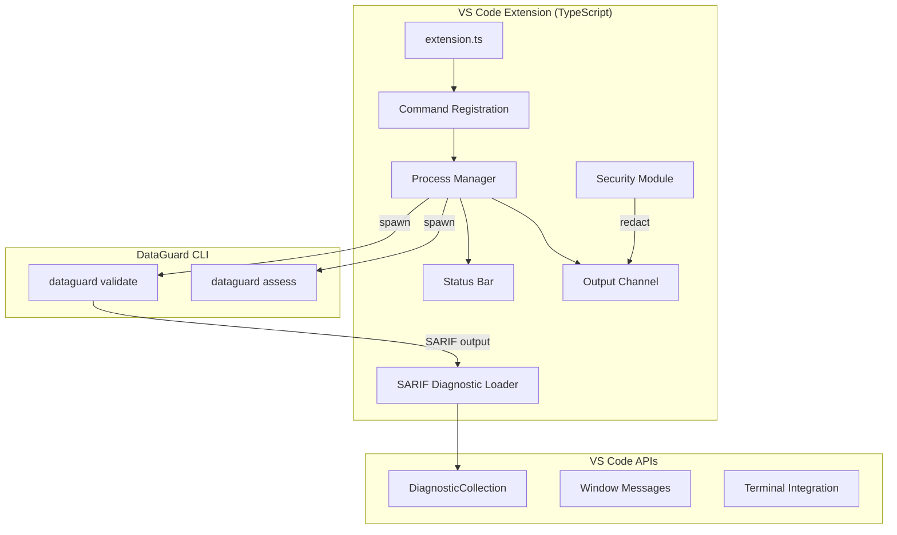
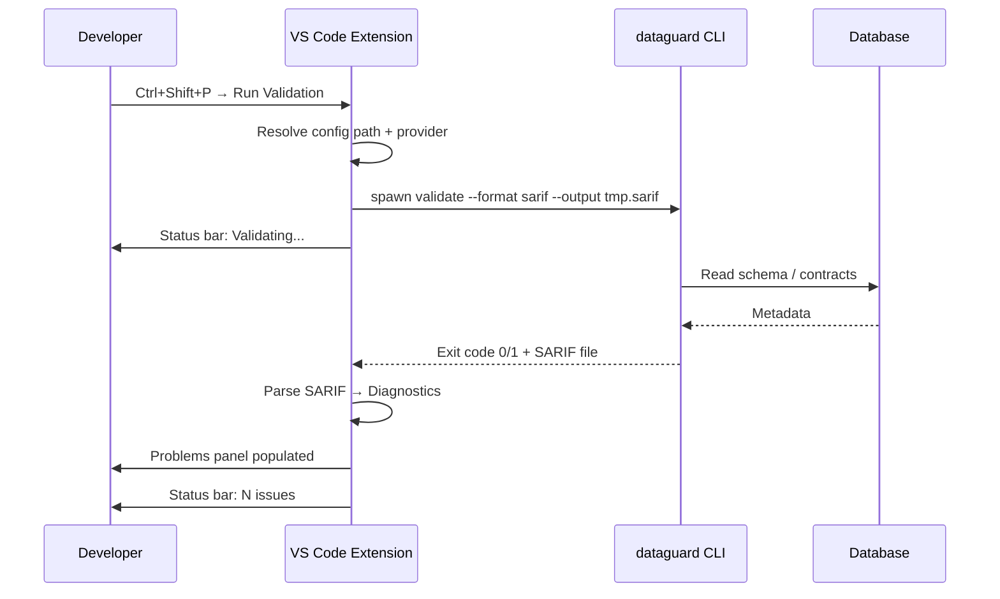

# VS Code Extension

The DataGuard VS Code extension provides integrated contract validation directly in the VS Code editor, loading SARIF diagnostics into the Problems panel and offering real-time feedback during development.

## Architecture



## Commands

| Command | ID | Description |
|---------|----|-------------|
| Run Validation | `dataguard.runValidation` | Execute `dataguard validate` and load SARIF diagnostics |
| Cancel Validation | `dataguard.cancelValidation` | Terminate running validation process |

## Extension Activation

The extension activates on:
- Opening a `.cs` file in a workspace containing `.dataguard.yml`
- Running any `dataguard.*` command from the Command Palette
- Opening a workspace with a `DataGuard.Core` project reference

## SARIF Diagnostic Loading

The extension runs `dataguard validate --format sarif --output <temp-file>` and parses the SARIF 2.1.0 output to populate VS Code's Problems panel.

### SARIF to VS Code Mapping

| SARIF Field | VS Code Diagnostic |
|-------------|-------------------|
| `result.ruleId` | `Diagnostic.code` |
| `result.level` | `DiagnosticSeverity` (error/warning/info) |
| `result.message.text` | `Diagnostic.message` |
| `result.locations[].physicalLocation` | `Diagnostic.range` + `Diagnostic.source` |

### Severity Mapping

| SARIF Level | VS Code Severity |
|-------------|-----------------|
| `error` | `DiagnosticSeverity.Error` |
| `warning` | `DiagnosticSeverity.Warning` |
| `note` | `DiagnosticSeverity.Information` |

## Status Bar Integration

Shows validation status in the VS Code status bar:

| State | Text | Color |
|-------|------|-------|
| Idle | `$(check) DataGuard` | Default |
| Running | `$(sync~spin) DataGuard: Validating...` | Blue |
| Pass | `$(check) DataGuard: 0 issues` | Green |
| Fail | `$(warning) DataGuard: N issues` | Yellow |
| Error | `$(error) DataGuard: Failed` | Red |

Clicking the status bar item opens the Output Channel with detailed results.

## Output Channel

A dedicated `DataGuard` output channel displays:
- CLI command being executed
- Raw CLI stdout/stderr
- Parsed violation summary
- Error messages and stack traces (when verbose mode enabled)

All output passes through the security module before display.

## Process Management

### Spawn

Validation processes are spawned using Node.js `child_process.spawn()`:

```typescript
const child = spawn('dataguard', ['validate', '--format', 'sarif', '--output', tempFile, ...args]);
```

### Termination

The `dataguard.cancelValidation` command sends `SIGTERM` to the running process. If the process doesn't exit within 5 seconds, `SIGKILL` is sent.

### Concurrency

Only one validation process runs at a time. Starting a new validation while one is running cancels the previous one.

## Security Module

### redactSensitiveText

Redacts connection strings and sensitive data from output before displaying in the Output Channel:

```typescript
function redactSensitiveText(text: string): string {
    // Redact connection string credential patterns
    return text.replace(/(?:Password|Pwd|User\s*Id|UID)=[^;]*/gi, '***redacted***');
}
```

Applied to every line written to the Output Channel, ensuring credentials never leak into logs or screenshots.

### resolveWorkspaceConfigPath

Resolves the `.dataguard.yml` config path relative to the workspace root, with fallback behavior when missing:

```typescript
function resolveWorkspaceConfigPath(): string | undefined {
    const workspaceFolder = vscode.workspace.workspaceFolders?.[0];
    if (!workspaceFolder) return undefined;

    const configPath = path.join(workspaceFolder.uri.fsPath, '.dataguard.yml');
    return fs.existsSync(configPath) ? configPath : undefined;
}
```

When no config file exists, the extension falls back to CLI defaults (Snapshot mode).

## Extension Manifest

```json
{
    "name": "dataguard",
    "displayName": "DataGuard - Contract Validator",
    "description": "Validate Entity ↔ SP/Raw SQL contracts in .NET projects",
    "version": "0.1.0",
    "engines": { "vscode": "^1.85.0" },
    "categories": ["Linters", "Programming Languages"],
    "activationEvents": [
        "onLanguage:csharp",
        "workspaceContains:**/.dataguard.yml"
    ],
    "main": "./out/extension.js",
    "contributes": {
        "commands": [
            {
                "command": "dataguard.runValidation",
                "title": "DataGuard: Run Validation"
            },
            {
                "command": "dataguard.cancelValidation",
                "title": "DataGuard: Cancel Validation"
            }
        ],
        "configuration": {
            "title": "DataGuard",
            "properties": {
                "dataguard.configPath": {
                    "type": "string",
                    "default": ".dataguard.yml",
                    "description": "Path to the DataGuard configuration file"
                },
                "dataguard.provider": {
                    "type": "string",
                    "enum": ["sqlserver", "oracle", "mysql", "postgresql"],
                    "default": "sqlserver",
                    "description": "Database provider for validation"
                }
            }
        }
    }
}
```

## Typical Workflow



## Development

### Building

```bash
cd extensions/vscode
npm install
npm run compile
```

### Testing

```bash
npm test
```

### Packaging

```bash
npx vsce package
```

This produces a `.vsix` file installable via `code --install-extension dataguard-0.1.0.vsix`.

## Limitations

- Requires the `dataguard` CLI on PATH (or configured via settings)
- One validation at a time; concurrent saves queue or cancel
- SARIF file paths are resolved relative to the workspace root; files outside the workspace are skipped in the Problems panel
