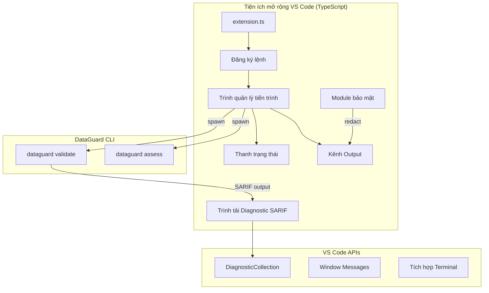
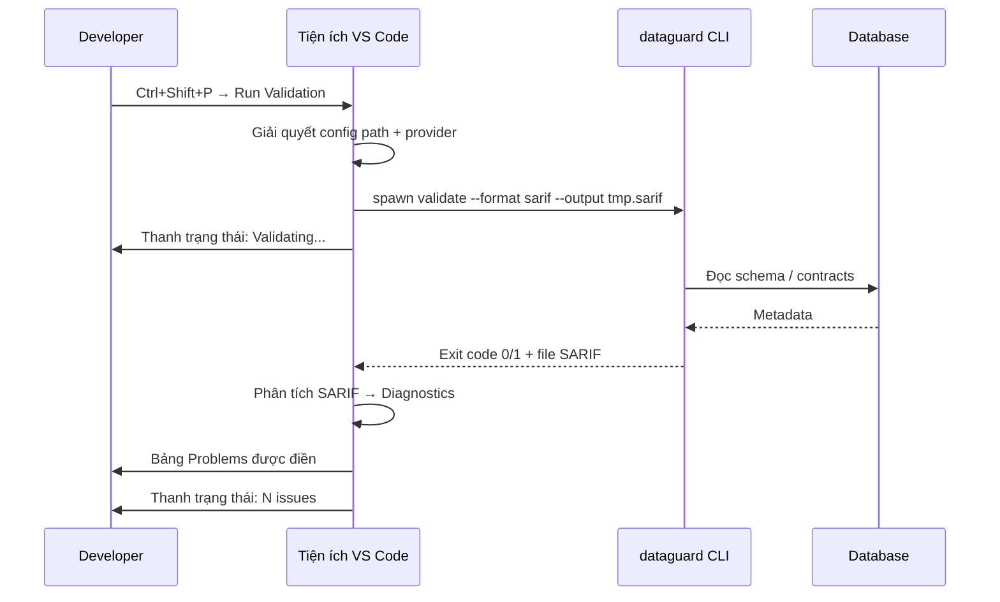

# Tiện ích mở rộng VS Code

Tiện ích mở rộng VS Code của DataGuard cung cấp xác thực contract tích hợp trực tiếp trong trình soạn thảo VS Code, tải diagnostic SARIF vào bảng Problems và cung cấp phản hồi thời gian thực trong quá trình phát triển.

## Kiến trúc



## Lệnh

| Lệnh | ID | Mô tả |
|------|----|-------|
| Chạy xác thực | `dataguard.runValidation` | Thực thi `dataguard validate` và tải diagnostic SARIF |
| Hủy xác thực | `dataguard.cancelValidation` | Kết thúc tiến trình xác thực đang chạy |

## Kích hoạt tiện ích

Tiện ích kích hoạt khi:
- Mở file `.cs` trong workspace chứa `.dataguard.yml`
- Chạy bất kỳ lệnh `dataguard.*` nào từ Command Palette
- Mở workspace có tham chiếu project `DataGuard.Core`

## Tải Diagnostic SARIF

Tiện ích chạy `dataguard validate --format sarif --output <file-tạm>` và phân tích output SARIF 2.1.0 để điền vào bảng Problems của VS Code.

### Ánh xạ SARIF sang VS Code

| Trường SARIF | Diagnostic VS Code |
|--------------|-------------------|
| `result.ruleId` | `Diagnostic.code` |
| `result.level` | `DiagnosticSeverity` (error/warning/info) |
| `result.message.text` | `Diagnostic.message` |
| `result.locations[].physicalLocation` | `Diagnostic.range` + `Diagnostic.source` |

### Ánh xạ mức độ nghiêm trọng

| Mức SARIF | Mức VS Code |
|-----------|-------------|
| `error` | `DiagnosticSeverity.Error` |
| `warning` | `DiagnosticSeverity.Warning` |
| `note` | `DiagnosticSeverity.Information` |

## Tích hợp thanh trạng thái

Hiển thị trạng thái xác thực trong thanh trạng thái VS Code:

| Trạng thái | Văn bản | Màu |
|------------|---------|-----|
| Idle | `$(check) DataGuard` | Mặc định |
| Running | `$(sync~spin) DataGuard: Validating...` | Xanh dương |
| Pass | `$(check) DataGuard: 0 issues` | Xanh lá |
| Fail | `$(warning) DataGuard: N issues` | Vàng |
| Error | `$(error) DataGuard: Failed` | Đỏ |

Click vào mục thanh trạng thái mở Kênh Output với kết quả chi tiết.

## Kênh Output

Kênh output chuyên dụng `DataGuard` hiển thị:
- Lệnh CLI đang được thực thi
- stdout/stderr thô của CLI
- Tóm tắt vi phạm đã phân tích
- Thông báo lỗi và stack trace (khi bật chế độ verbose)

Tất cả output đi qua module bảo mật trước khi hiển thị.

## Quản lý tiến trình

### Spawn

Các tiến trình xác thực được khởi chạy bằng Node.js `child_process.spawn()`:

```typescript
const child = spawn('dataguard', ['validate', '--format', 'sarif', '--output', tempFile, ...args]);
```

### Termination

Lệnh `dataguard.cancelValidation` gửi `SIGTERM` đến tiến trình đang chạy. Nếu tiến trình không thoát trong vòng 5 giây, `SIGKILL` được gửi.

### Đồng thời

Chỉ một tiến trình xác thực chạy tại một thời điểm. Bắt đầu xác thực mới khi một tiến trình đang chạy sẽ hủy tiến trình trước đó.

## Module bảo mật

### redactSensitiveText

Redact chuỗi kết nối và dữ liệu nhạy cảm từ output trước khi hiển thị trong Kênh Output:

```typescript
function redactSensitiveText(text: string): string {
    // Redact các mẫu credential chuỗi kết nối
    return text.replace(/(?:Password|Pwd|User\s*Id|UID)=[^;]*/gi, '***redacted***');
}
```

Áp dụng cho mọi dòng ghi vào Kênh Output, đảm bảo credential không bao giờ rò rỉ vào log hoặc screenshot.

### resolveWorkspaceConfigPath

Giải quyết đường dẫn config `.dataguard.yml` tương đối với workspace root, với hành vi fallback khi thiếu:

```typescript
function resolveWorkspaceConfigPath(): string | undefined {
    const workspaceFolder = vscode.workspace.workspaceFolders?.[0];
    if (!workspaceFolder) return undefined;

    const configPath = path.join(workspaceFolder.uri.fsPath, '.dataguard.yml');
    return fs.existsSync(configPath) ? configPath : undefined;
}
```

Khi không có file config, tiện ích quay lại mặc định CLI (chế độ Snapshot).

## Manifest tiện ích

```json
{
    "name": "dataguard",
    "displayName": "DataGuard - Contract Validator",
    "description": "Validate Entity ↔ SP/Raw SQL contracts in .NET projects",
    "version": "0.1.0",
    "engines": { "vscode": "^1.85.0" },
    "categories": ["Linters", "Programming Languages"],
    "activationEvents": [
        "onLanguage:csharp",
        "workspaceContains:**/.dataguard.yml"
    ],
    "main": "./out/extension.js",
    "contributes": {
        "commands": [
            {
                "command": "dataguard.runValidation",
                "title": "DataGuard: Run Validation"
            },
            {
                "command": "dataguard.cancelValidation",
                "title": "DataGuard: Cancel Validation"
            }
        ],
        "configuration": {
            "title": "DataGuard",
            "properties": {
                "dataguard.configPath": {
                    "type": "string",
                    "default": ".dataguard.yml",
                    "description": "Đường dẫn file cấu hình DataGuard"
                },
                "dataguard.provider": {
                    "type": "string",
                    "enum": ["sqlserver", "oracle", "mysql", "postgresql"],
                    "default": "sqlserver",
                    "description": "Database provider cho xác thực"
                }
            }
        }
    }
}
```

## Workflow điển hình



## Phát triển

### Build

```bash
cd extensions/vscode
npm install
npm run compile
```

### Test

```bash
npm test
```

### Đóng gói

```bash
npx vsce package
```

Tạo ra file `.vsix` có thể cài đặt qua `code --install-extension dataguard-0.1.0.vsix`.

## Giới hạn

- Yêu cầu cài đặt CLI `dataguard` trong PATH hoặc cấu hình đường dẫn trong settings
- Một tiến trình xác thực tại một thời điểm; xác thực đồng thời sẽ xếp hàng hoặc hủy
- Vị trí file SARIF được giải quyết tương đối với workspace root; vi phạm ngoài workspace không hiển thị trong bảng Problems
