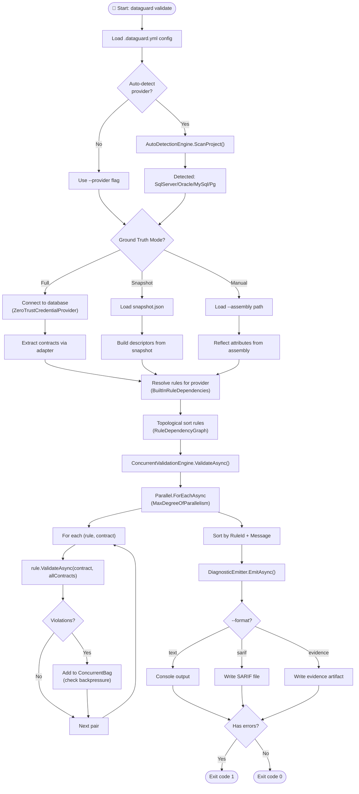
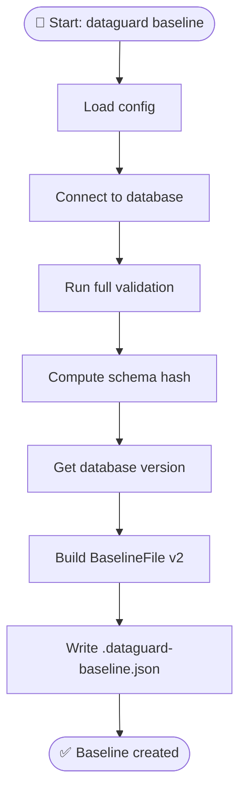
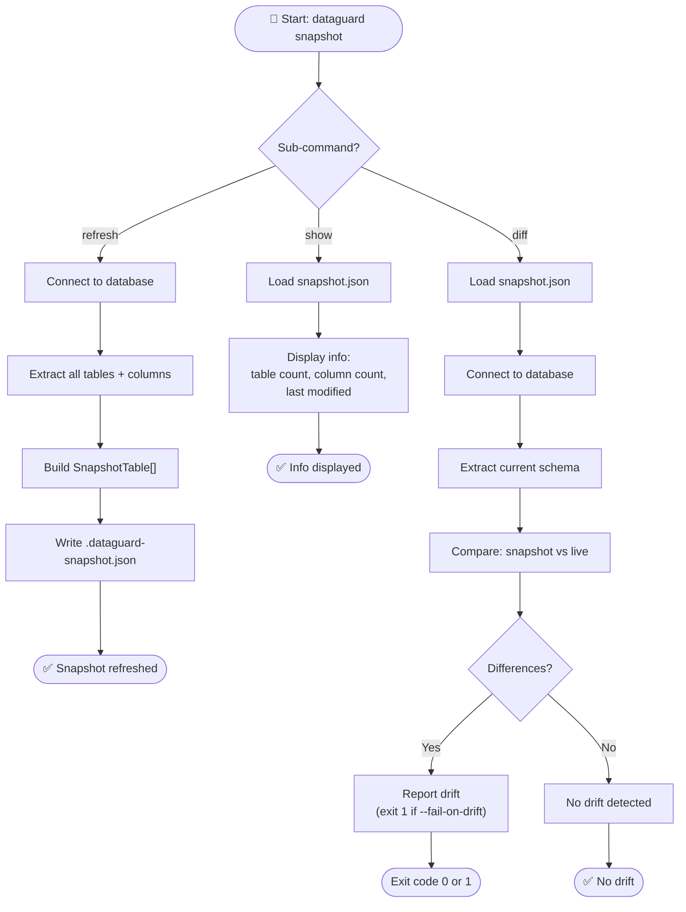
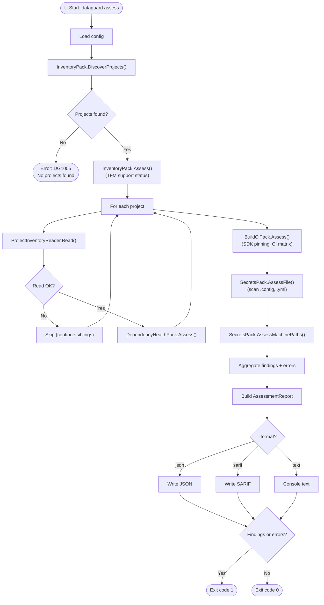
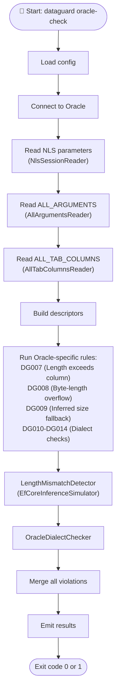
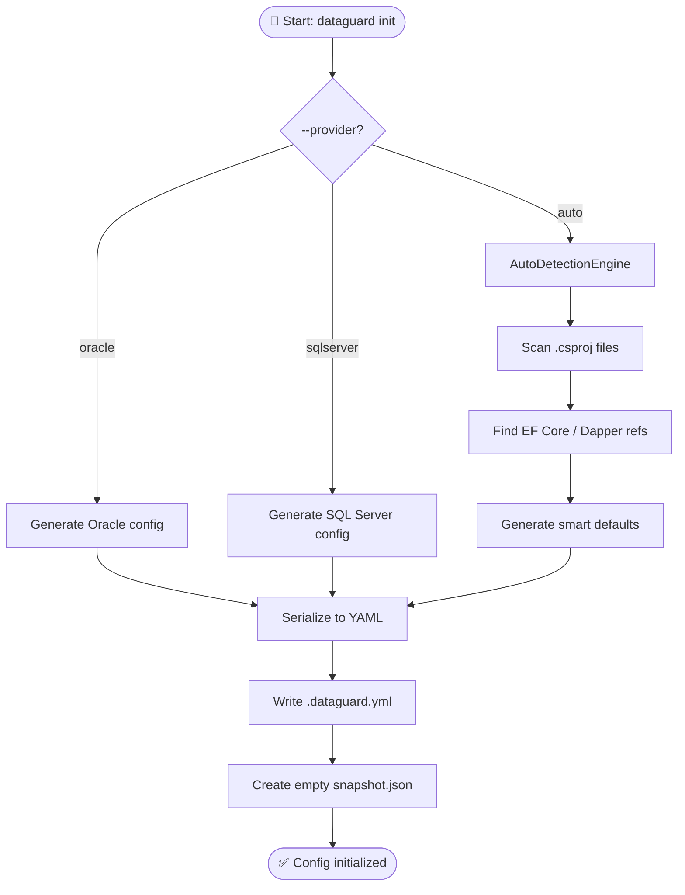
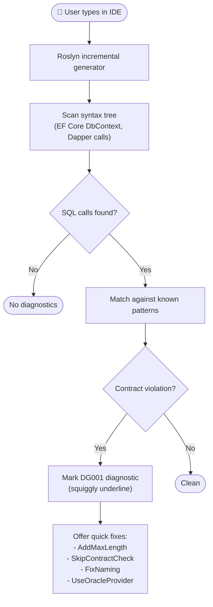

# Activity Diagrams

## 1. Validate Command Activity

## 2. Baseline Command Activity

## 3. Snapshot Command Activity

## 4. Assess Command Activity

## 5. Oracle Check Activity

## 6. Init Command Activity

## 7. IDE Analysis Activity (Roslyn Analyzer)

