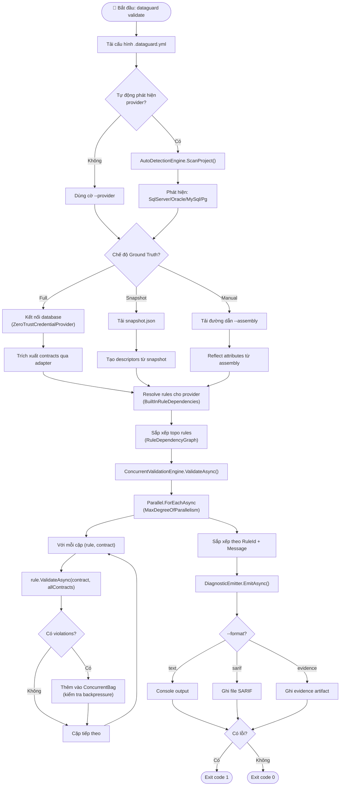
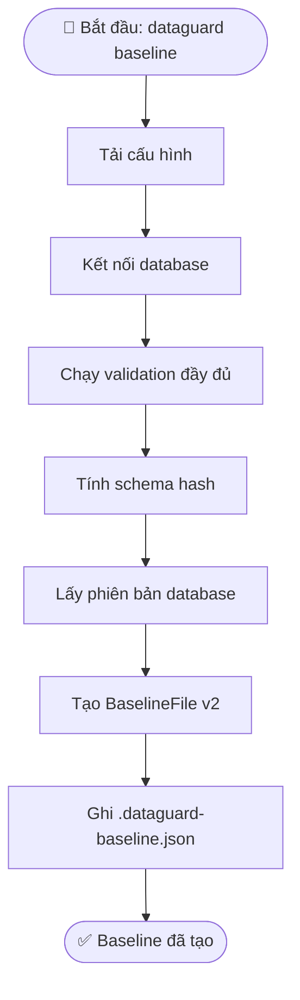
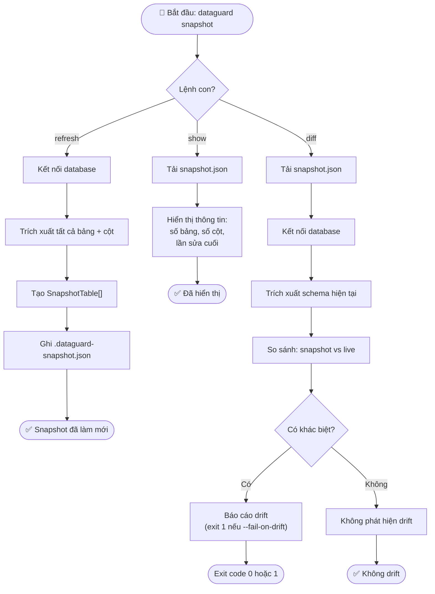
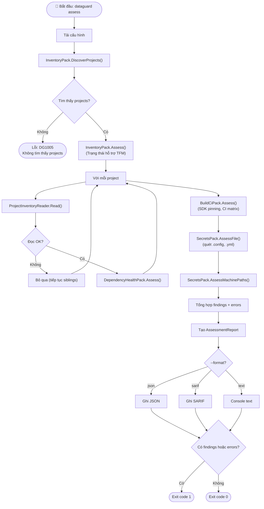
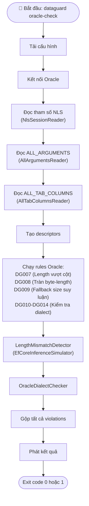
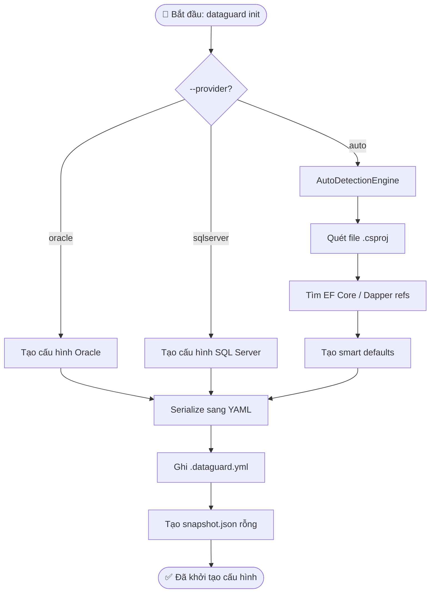
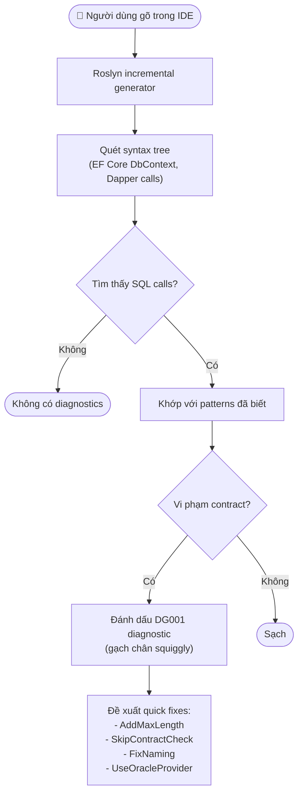

# Sơ Đồ Hoạt Động

## 1. Hoạt Động Lệnh Validate

## 2. Hoạt Động Lệnh Baseline

## 3. Hoạt Động Lệnh Snapshot

## 4. Hoạt Động Lệnh Assess

## 5. Hoạt Động Oracle Check

## 6. Hoạt Động Lệnh Init

## 7. Hoạt Động IDE Analysis (Roslyn Analyzer)

