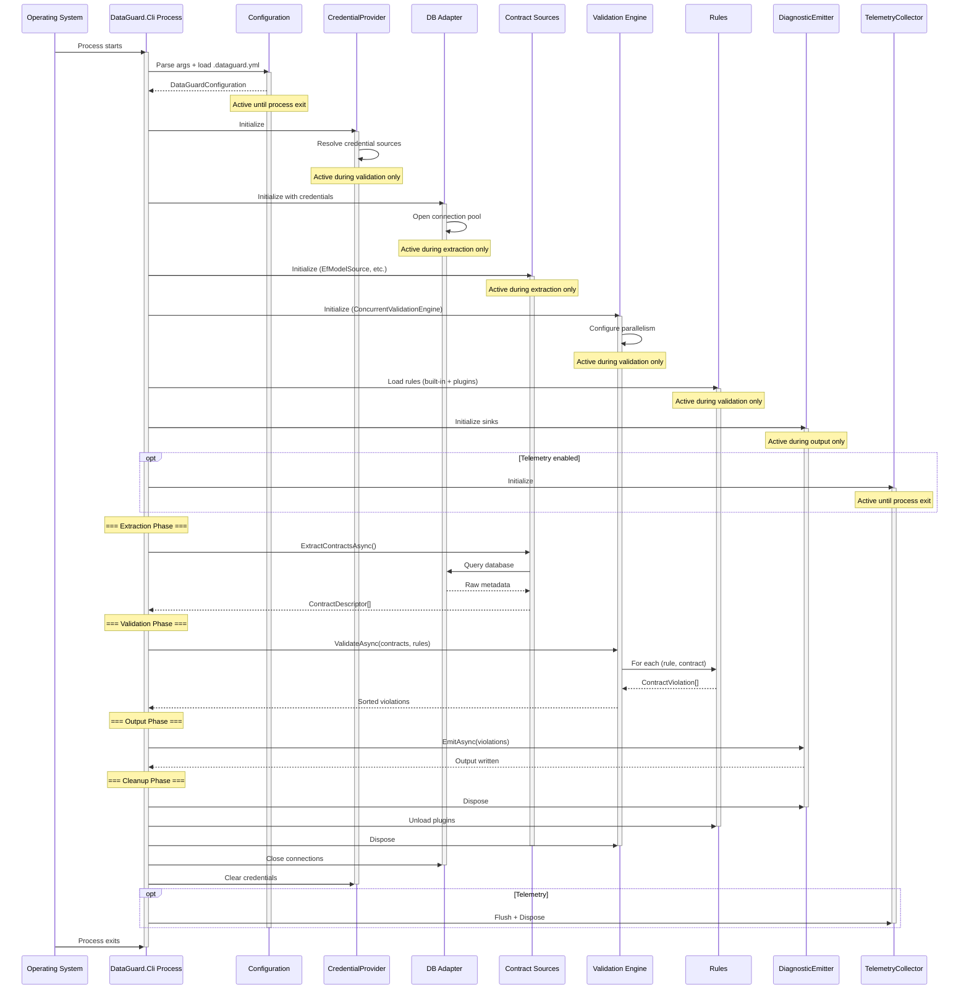
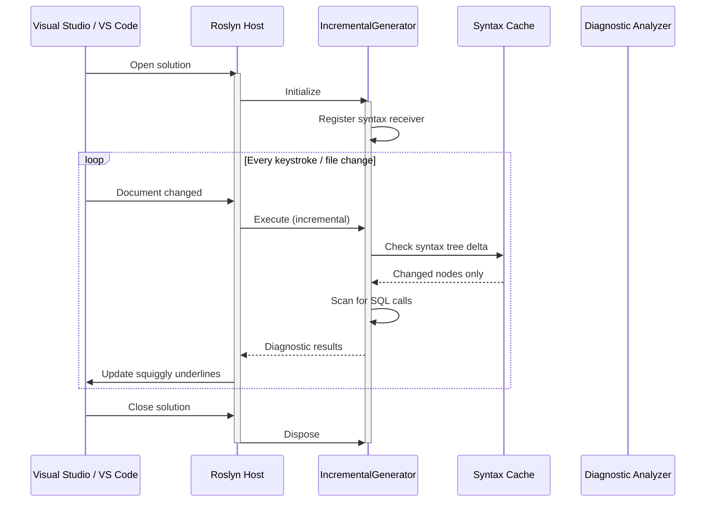
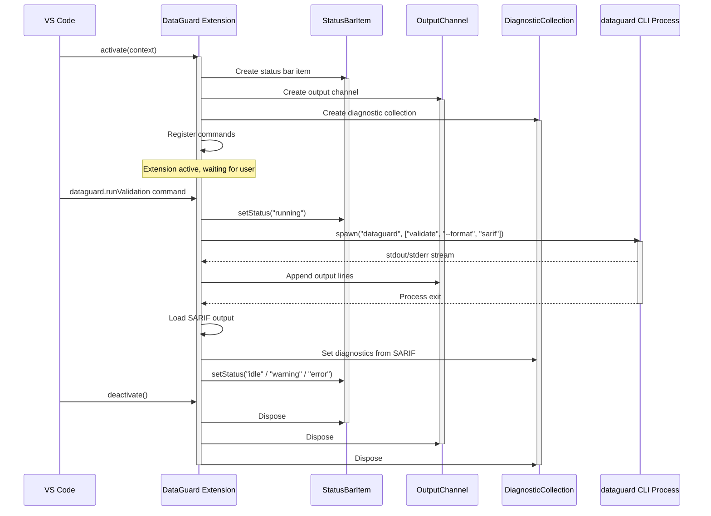
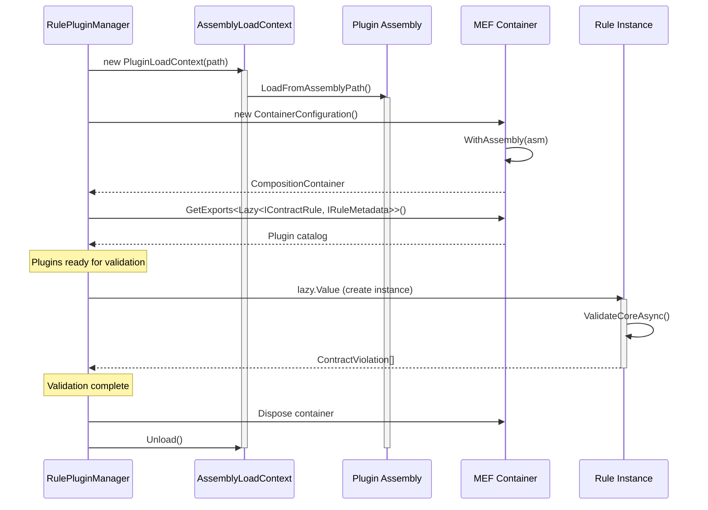
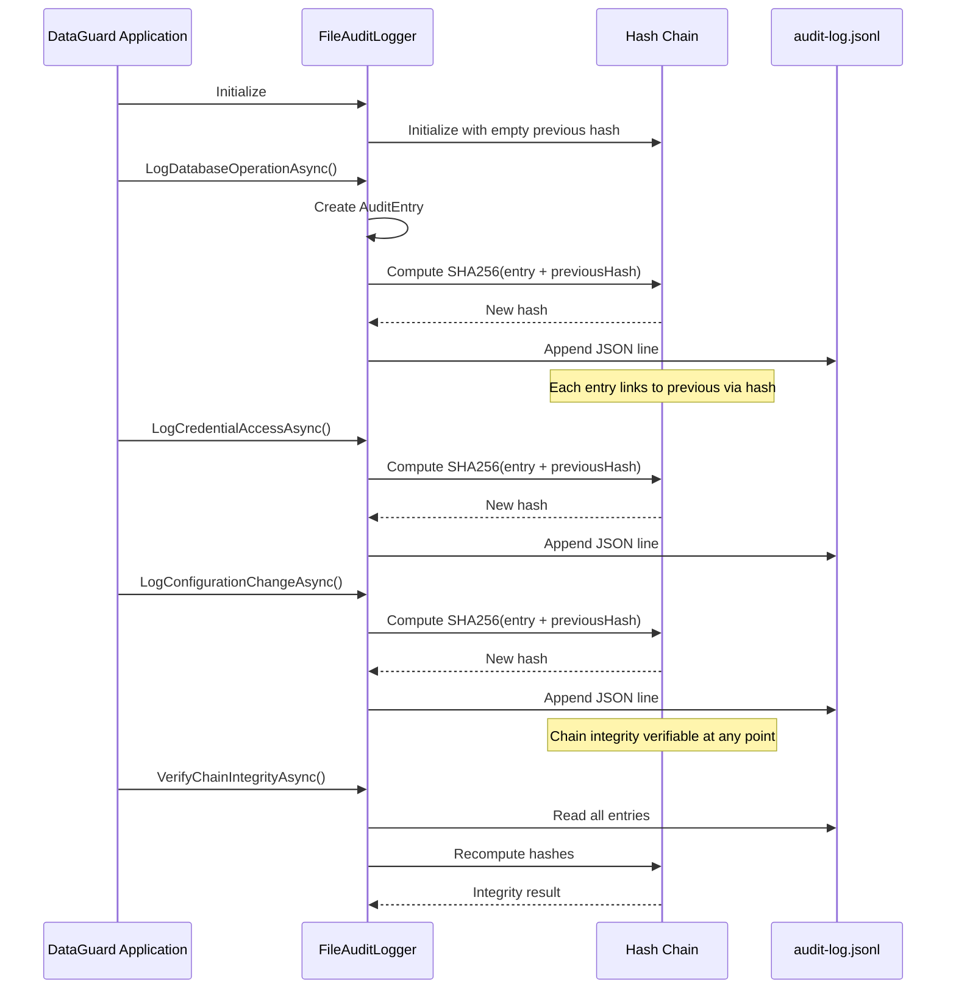

# Component Active Lifetime Diagrams

## 1. DataGuard CLI Process Lifetime



## 2. Roslyn Analyzer Lifetime (IDE Session)



## 3. VS Code Extension Lifetime



## 4. Visual Studio Extension Lifetime

```mermaid
sequenceDiagram
    participant VS as Visual Studio 2022
    participant Pkg as DataGuardPackage
    participant Menu as Menu Commands
    participant EL as ErrorListProvider
    participant OP as Output Pane
    participant CLI as dataguard CLI Process

    VS->>Pkg: InitializeAsync()
    activate Pkg
    Pkg->>Menu: Register Validate + Cancel commands
    Pkg->>EL: Create ErrorListProvider
    activate EL
    Pkg->>OP: Create output pane
    activate OP
    
    Note over Pkg: Package loaded, waiting for commands
    
    VS->>Menu: Validate command clicked
    Menu->>Pkg: RunValidationAsync()
    Pkg->>Pkg: processGate lock
    Pkg->>CLI: Process.Start("dataguard", "validate --format sarif")
    activate CLI
    CLI-->>Pkg: stdout/stderr
    Pkg->>OP: Write output lines
    
    alt User cancels
        VS->>Menu: Cancel command clicked
        Menu->>Pkg: CancelValidationAsync()
        Pkg->>CLI: Kill process tree
        deactivate CLI
    else Process completes
        CLI-->>Pkg: Exit code
        deactivate CLI
        Pkg->>Pkg: Load SARIF
        Pkg->>EL: Publish SARIF diagnostics
    end
    
    Pkg->>Pkg: processGate unlock
    
    VS->>Pkg: Dispose
    Pkg->>EL: Dispose
    deactivate EL
    Pkg->>OP: Dispose
    deactivate OP
    deactivate Pkg
```

## 5. MEF Plugin Assembly Lifetime



## 6. Audit Log Hash Chain Lifetime


