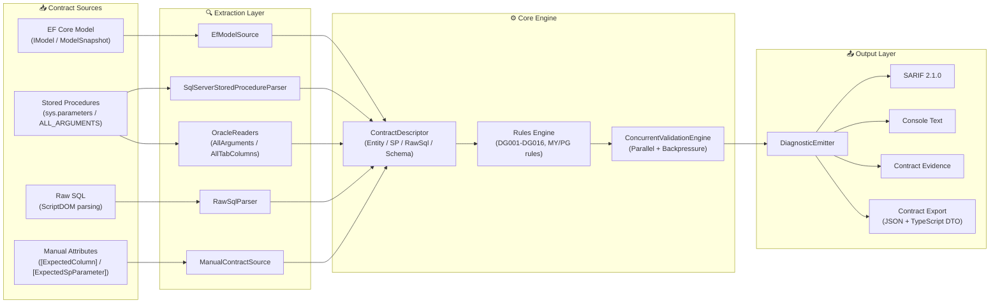
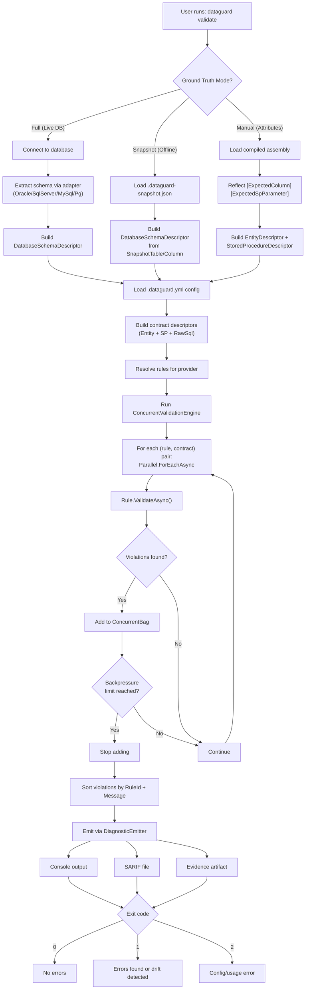
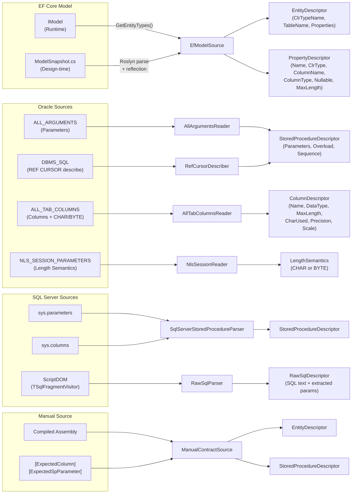
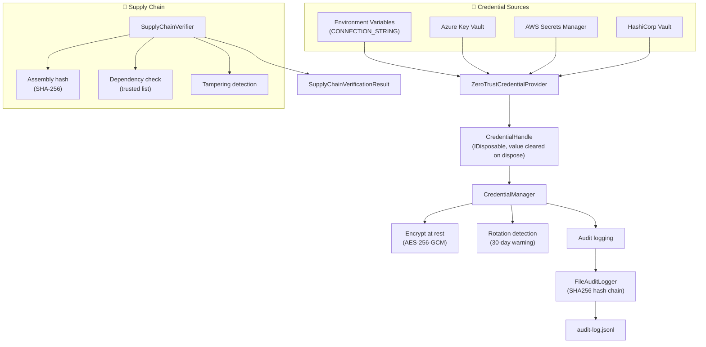
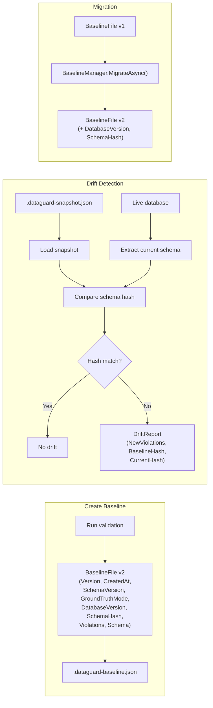
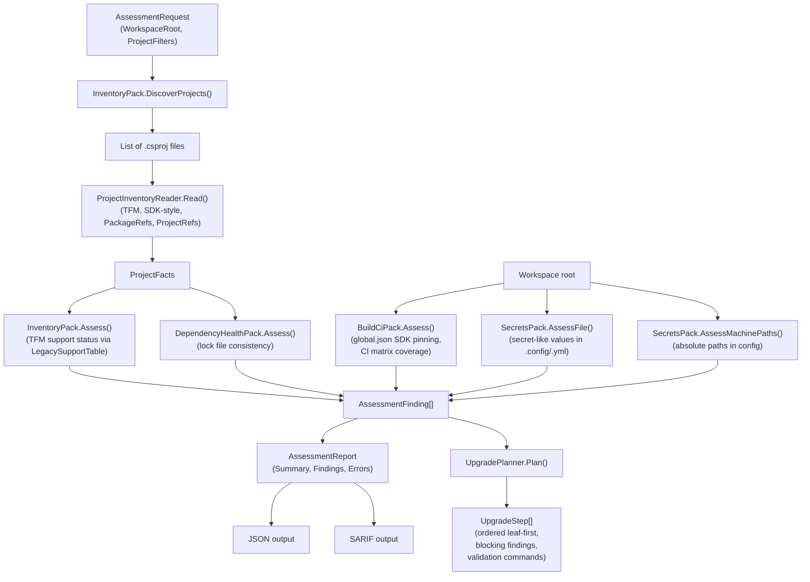

# Data Flow Diagrams

## 1. High-Level Data Flow Pipeline

## 2. Validation Data Flow Detail

## 3. Source Extraction Data Flow

## 4. Security Data Flow

## 5. Baseline & Drift Data Flow

## 6. Assessment Data Flow

