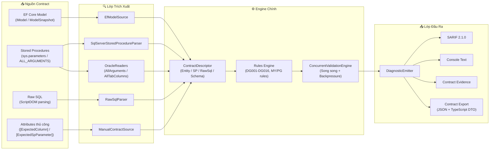
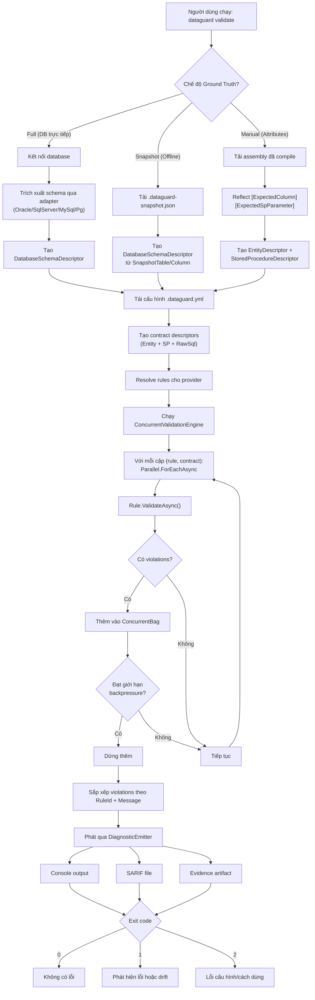
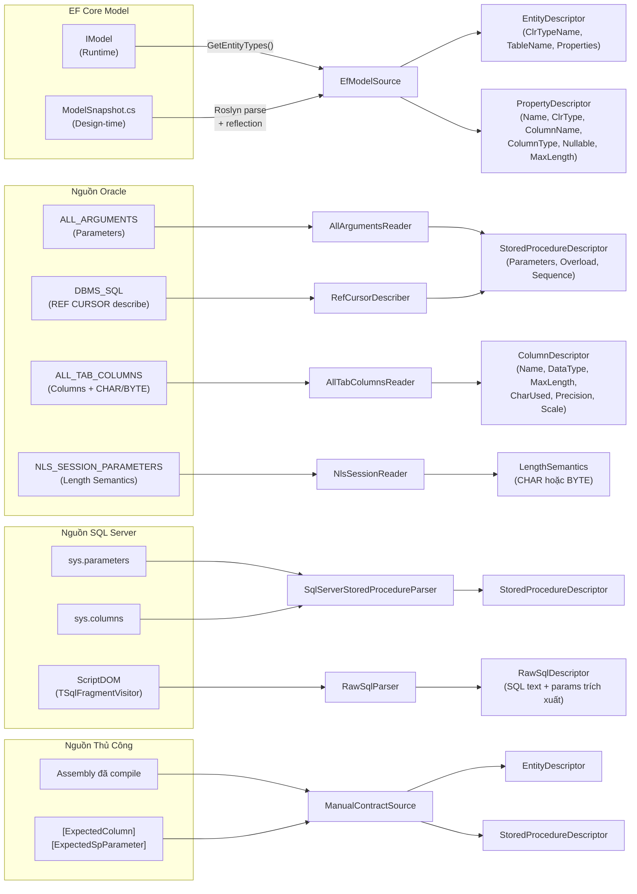
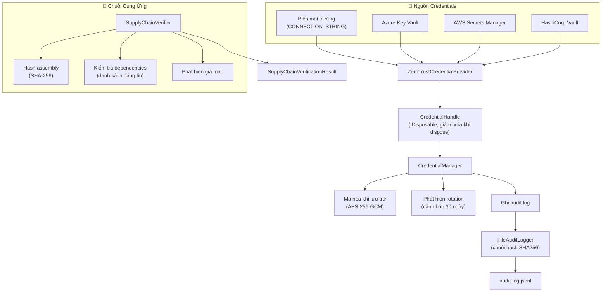
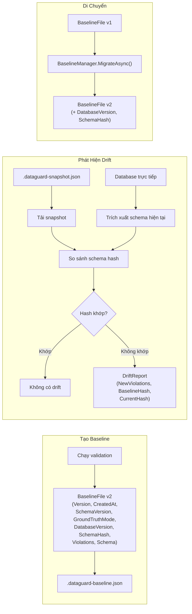
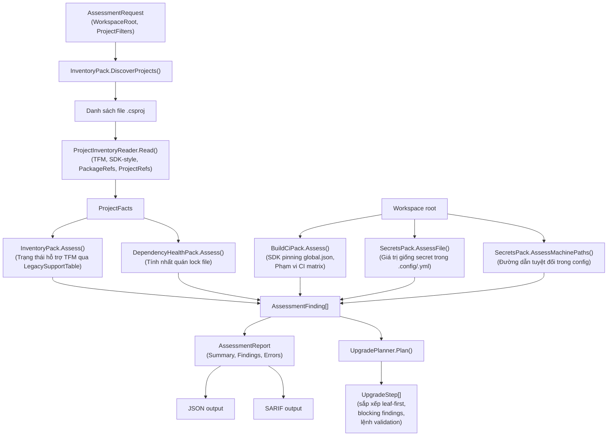

# Sơ Đồ Luồng Dữ Liệu

## 1. Đường Ống Luồng Dữ Liệu Tổng Quan

## 2. Chi Tiết Luồng Dữ Liệu Validation

## 3. Luồng Dữ Liệu Trích Xuất Nguồn

## 4. Luồng Dữ Liệu Bảo Mật

## 5. Luồng Dữ Liệu Baseline & Drift

## 6. Luồng Dữ Liệu Assessment

