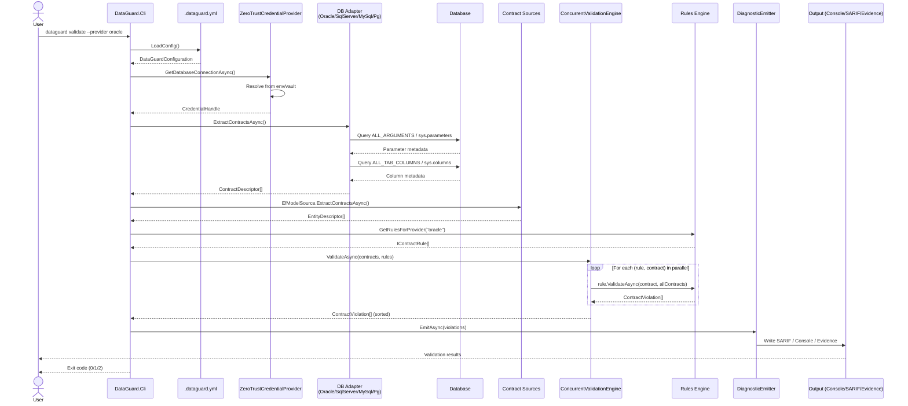
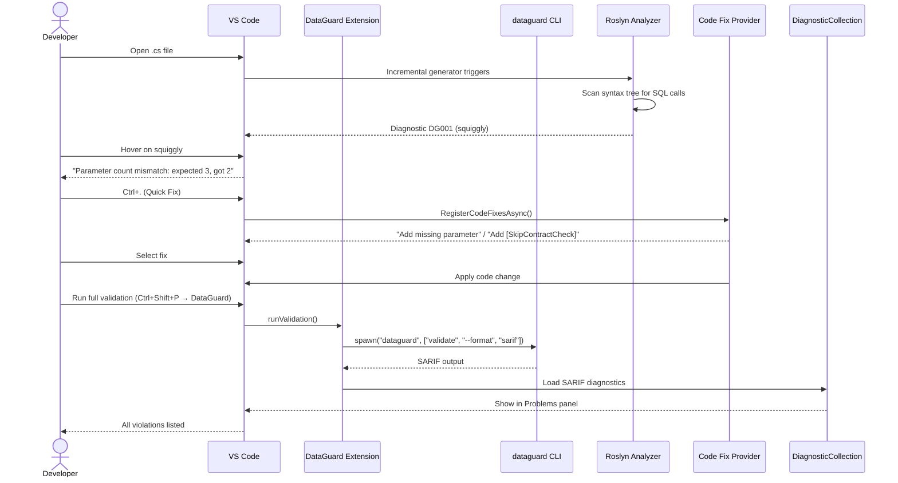
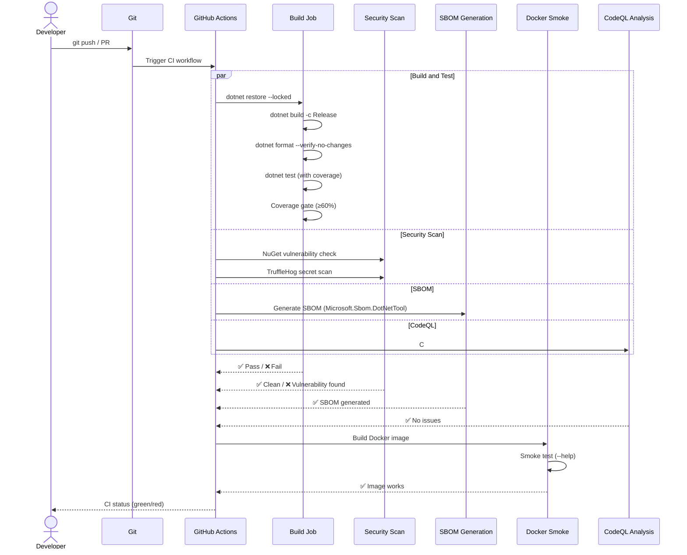
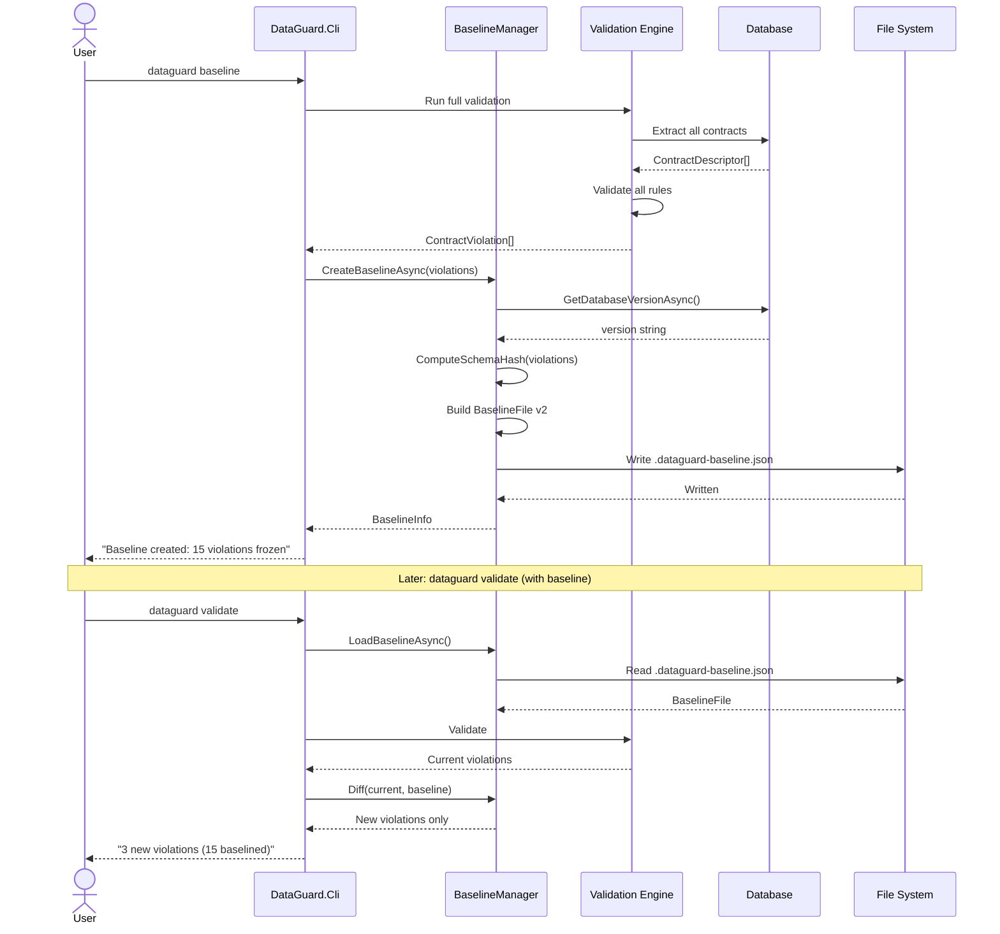
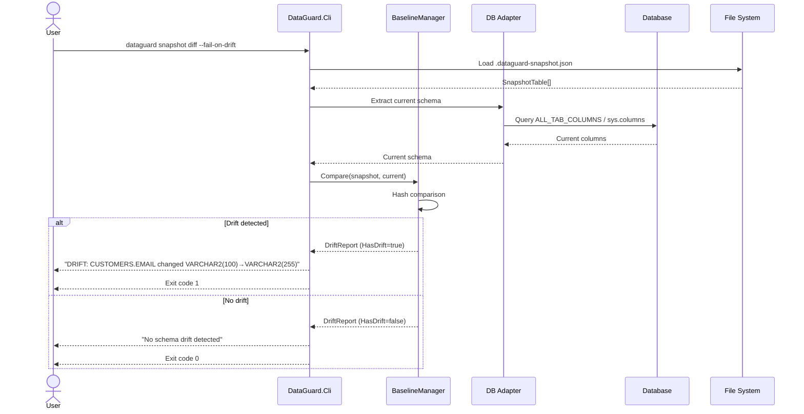
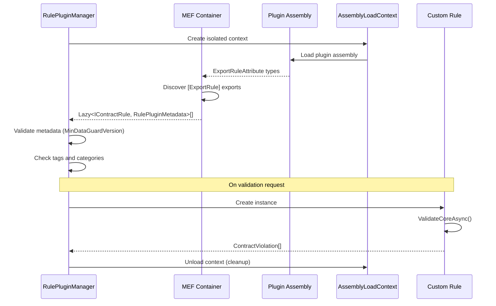
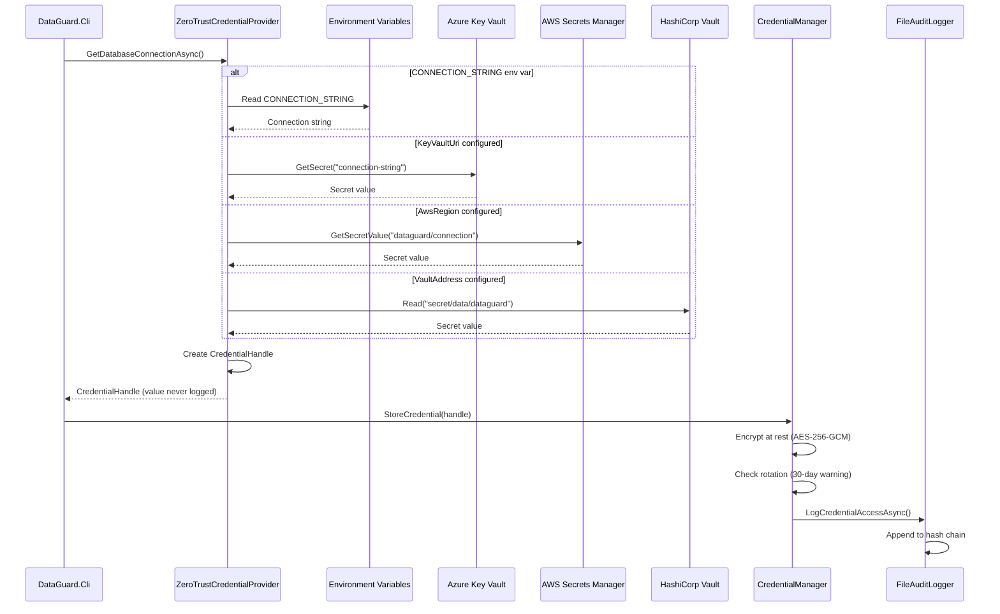

# Sequence Diagrams

## 1. Full Validation Flow (CLI → Database → Output)

## 2. IDE Analysis Flow (VS Code → Analyzer → Quick Fix)

## 3. CI Pipeline Flow

## 4. Baseline Lifecycle Sequence

## 5. Snapshot Drift Detection Sequence

## 6. Plugin Loading Sequence

## 7. Credential Resolution Sequence

