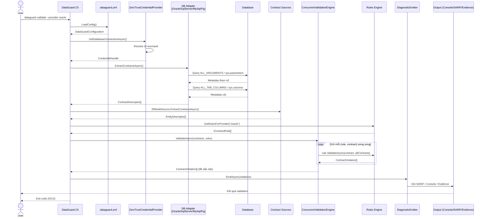
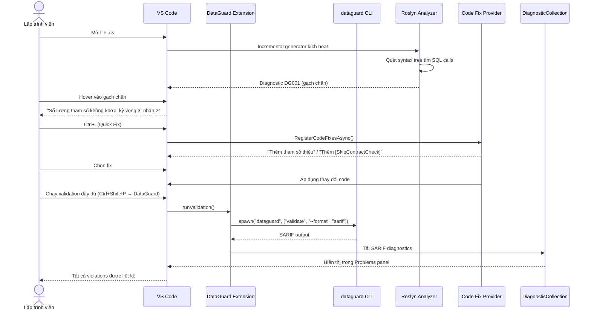
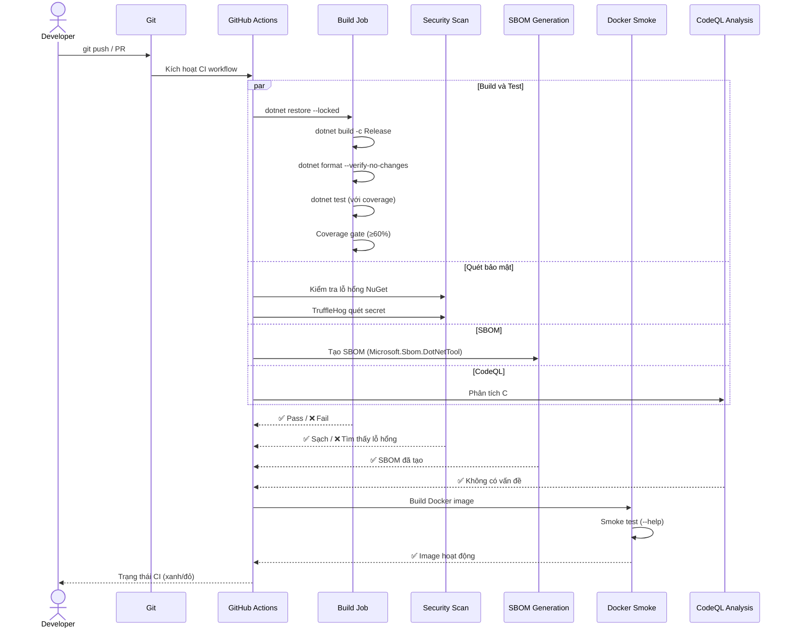
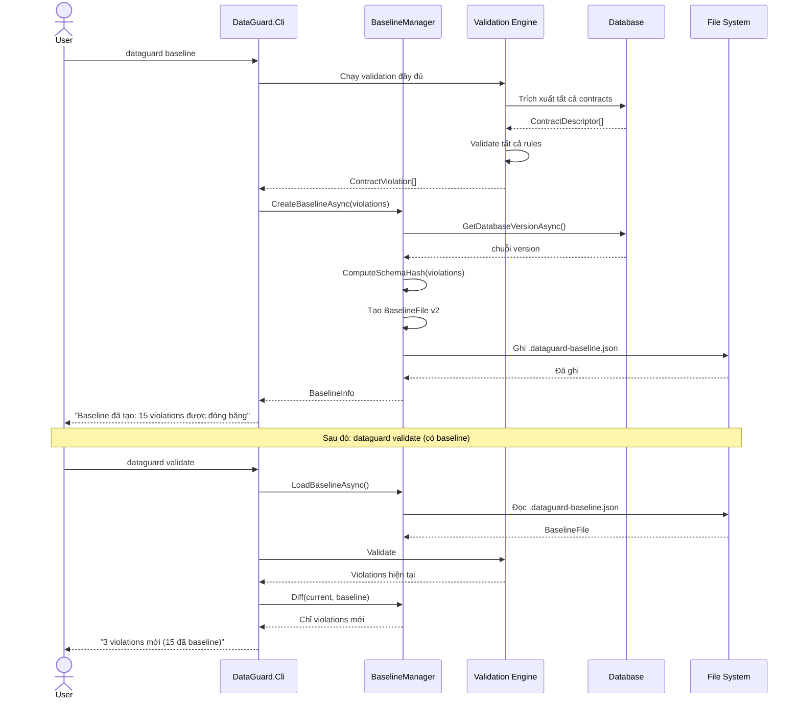
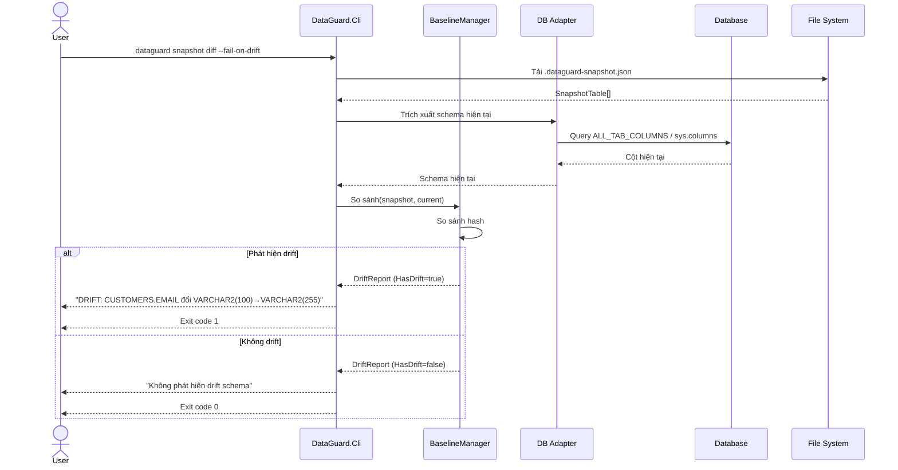
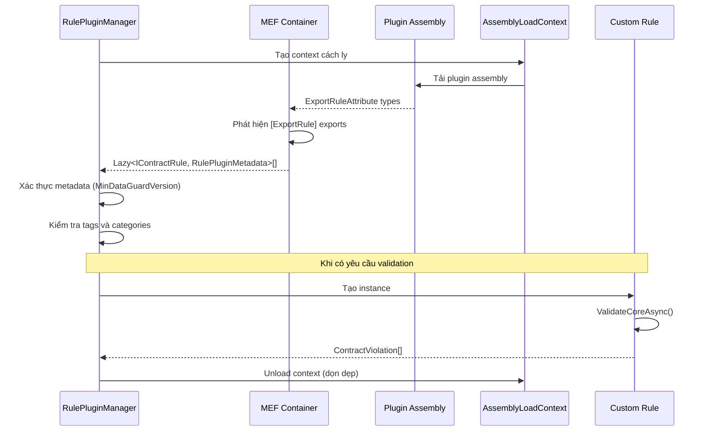
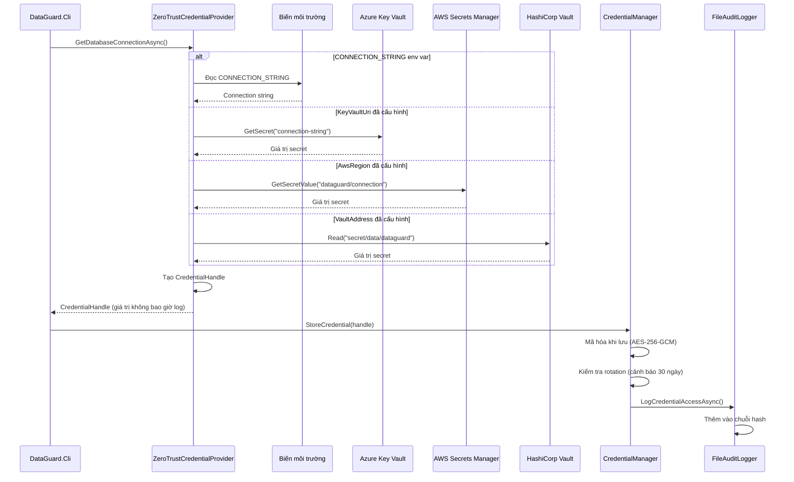

# Sơ Đồ Tuần Tự

## 1. Luồng Validation Đầy Đủ (CLI → Database → Output)

## 2. Luồng Phân Tích IDE (VS Code → Analyzer → Quick Fix)

## 3. Luồng CI Pipeline

## 4. Tuần Tự Vòng Đời Baseline

## 5. Tuần Tự Phát Hiện Drift Snapshot

## 6. Tuần Tự Tải Plugin

## 7. Tuần Tự Resolve Credentials

