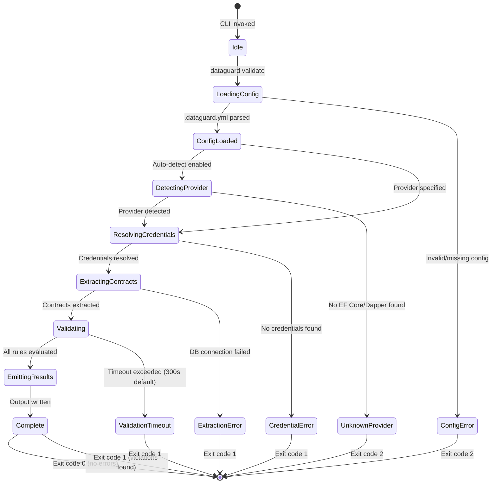
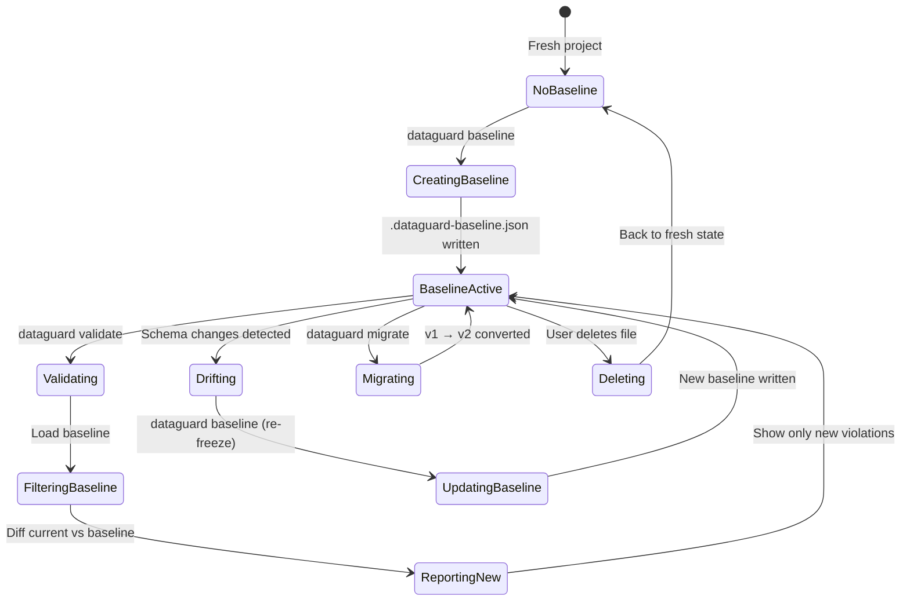
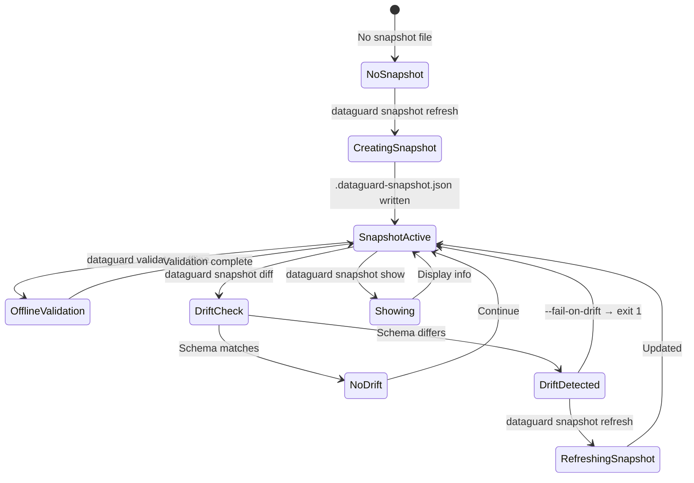
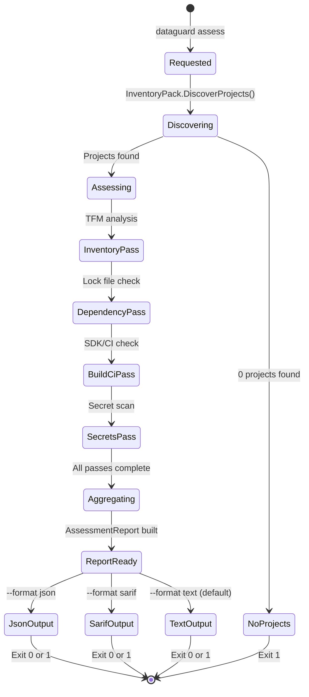
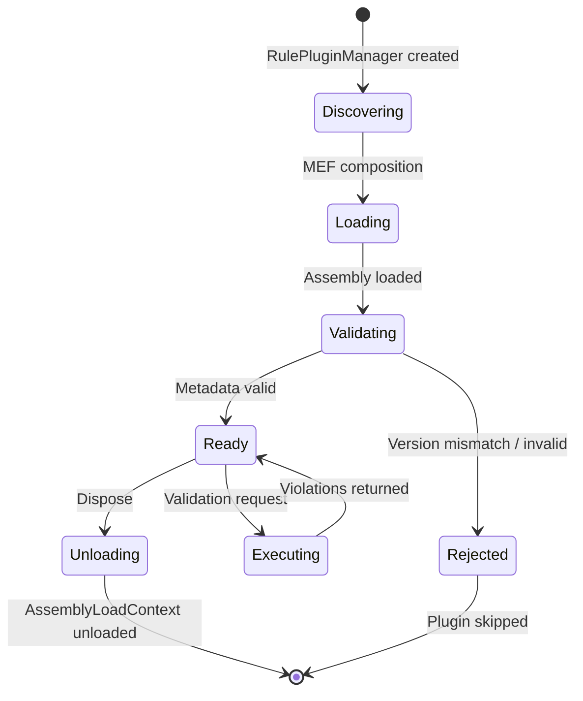
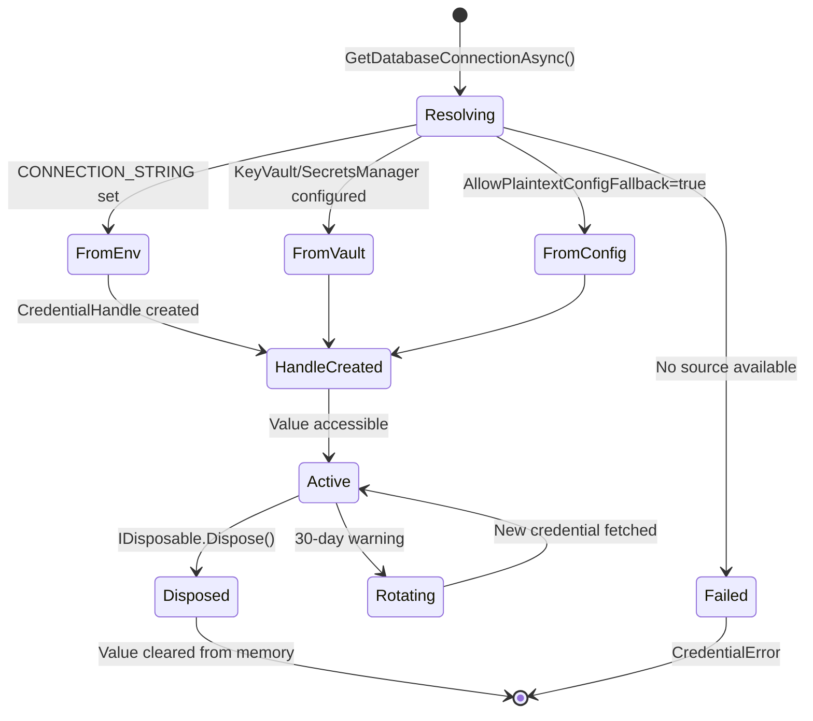
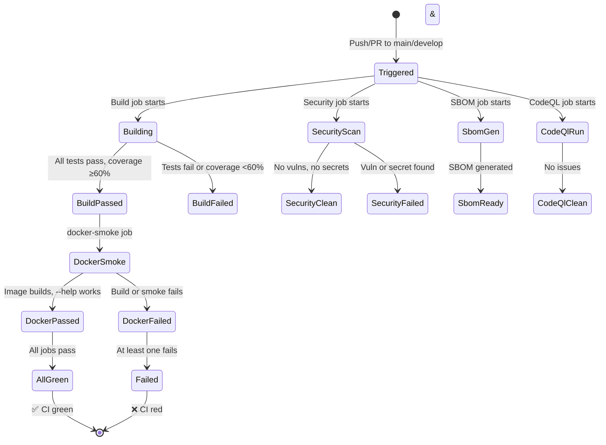

# State Machine & Status Flow

## 1. Validation Lifecycle State Machine

## 2. Baseline Lifecycle State Machine

## 3. Snapshot Lifecycle State Machine

## 4. Assessment Report State Machine

## 5. Plugin Lifecycle State Machine

## 6. Credential Lifecycle State Machine

## 7. CI Pipeline State Machine

