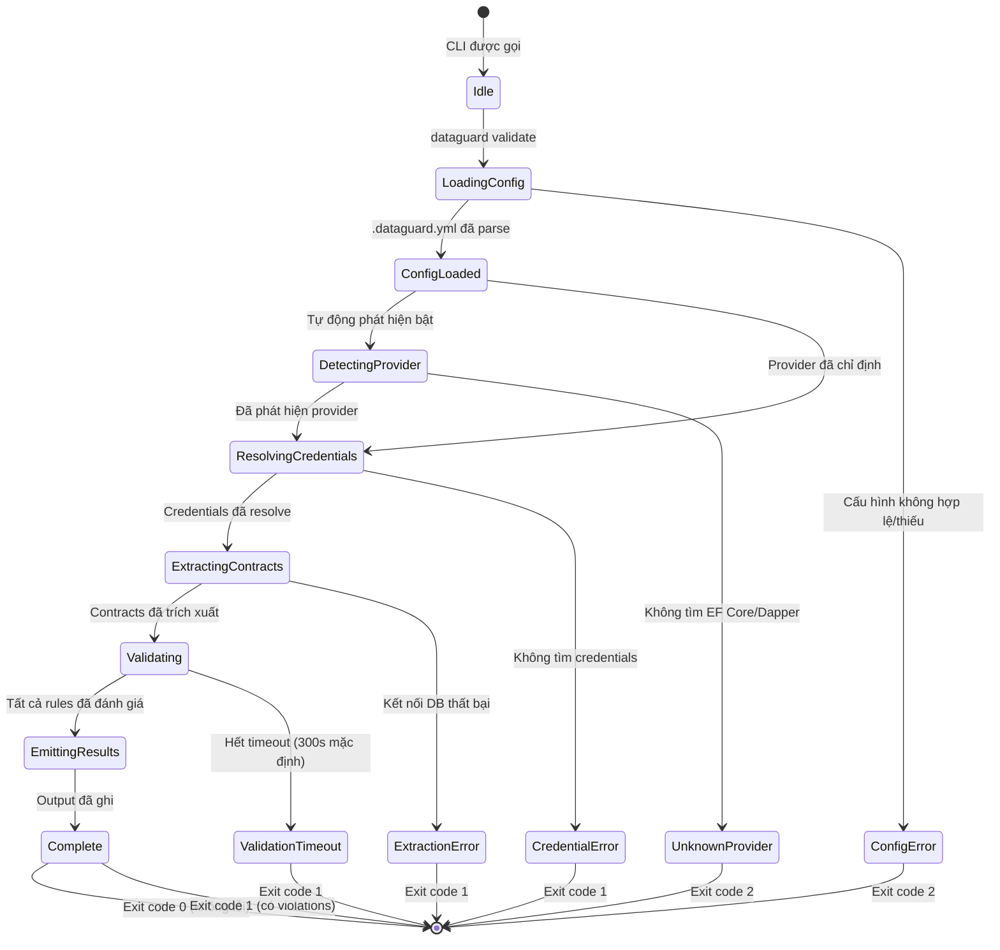
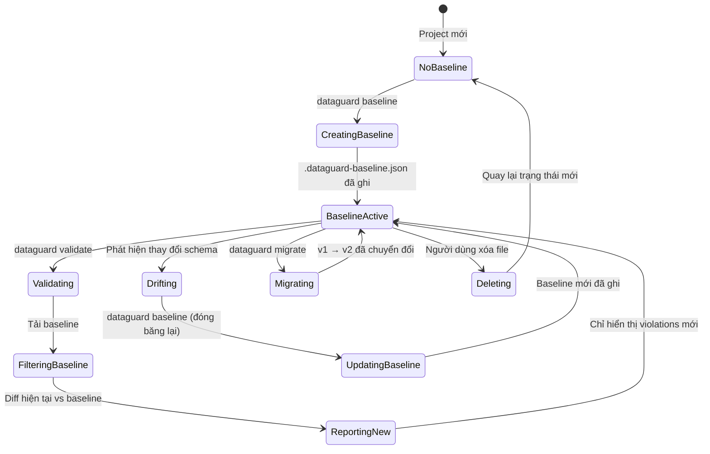
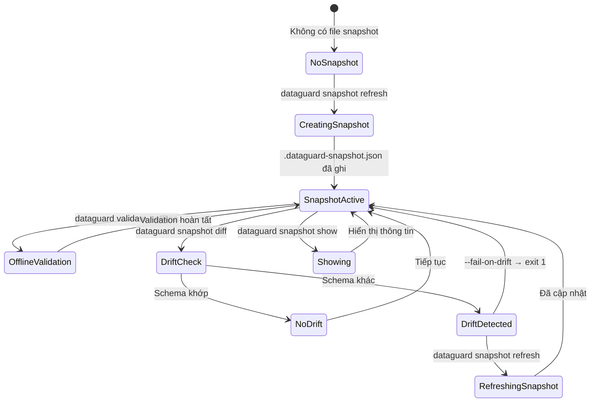
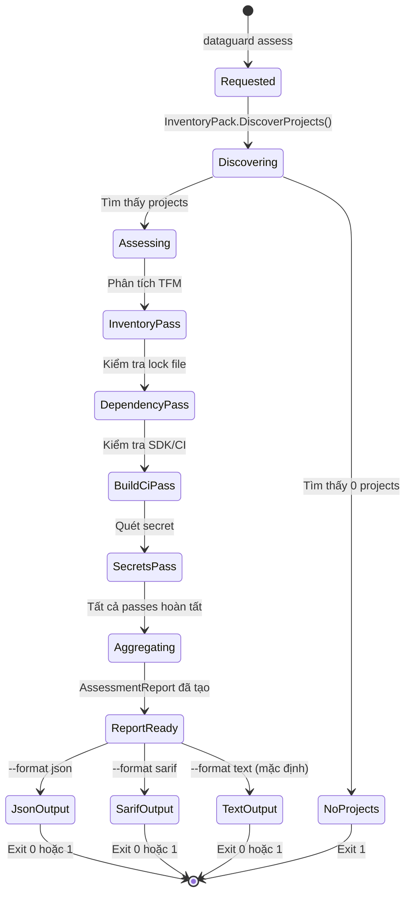
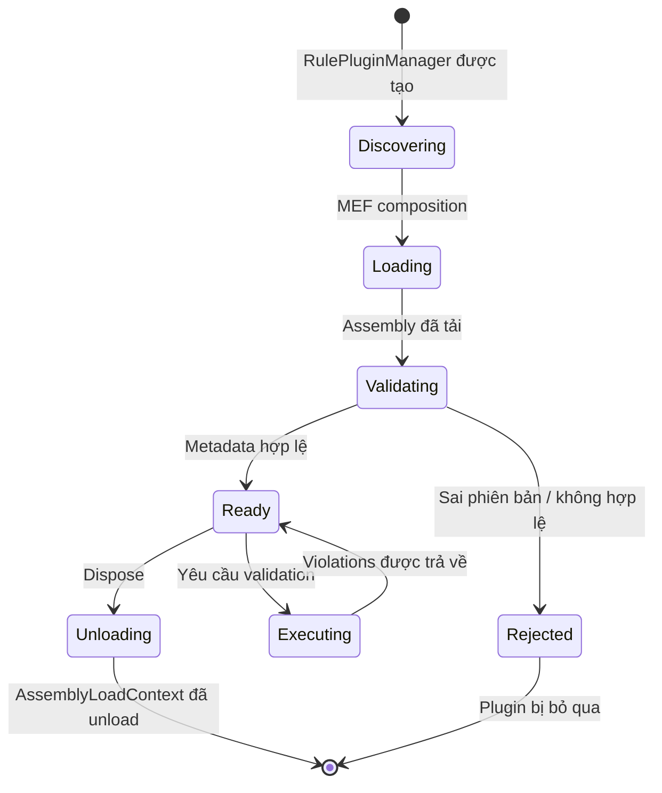
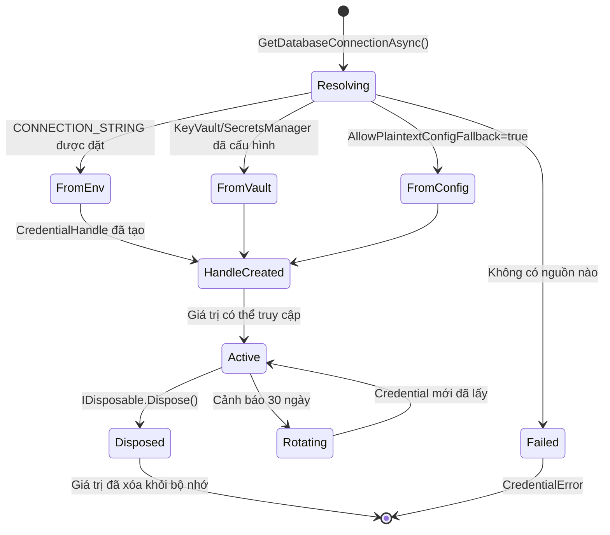
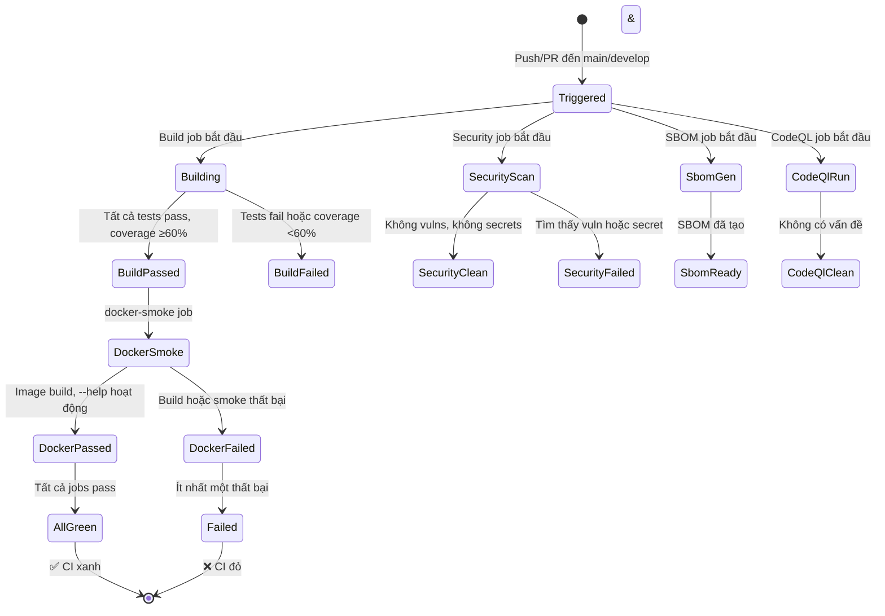

# Máy Trạng Thái & Luồng Trạng Thái

## 1. Máy Trạng Thái Vòng Đời Validation

## 2. Máy Trạng Thái Vòng Đời Baseline

## 3. Máy Trạng Thái Vòng Đời Snapshot

## 4. Máy Trạng Thái Báo Cáo Assessment

## 5. Máy Trạng Thái Vòng Đời Plugin

## 6. Máy Trạng Thái Vòng Đời Credential

## 7. Máy Trạng Thái CI Pipeline

