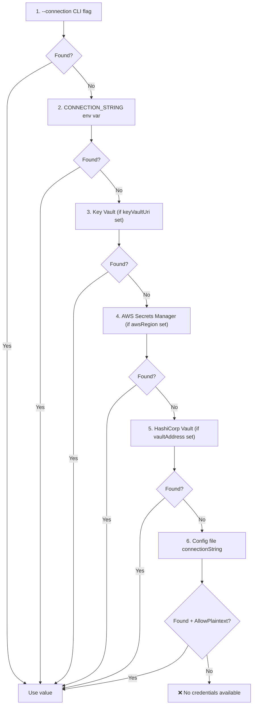

# Configuration Guide

## Configuration File: `.dataguard.yml`

DataGuard uses a YAML configuration file (default: `.dataguard.yml` in project root).

### Generate Default Config

```bash
dataguard init                          # SQL Server default
dataguard init --provider oracle        # Oracle default
```

### Full Configuration Reference

```yaml
# Database connection (or use CONNECTION_STRING env var)
connectionString: "Server=localhost;Database=mydb;Trusted_Connection=true;"

# Ground truth mode: Full | Snapshot | Manual
groundTruthMode: Snapshot

# Path to snapshot file (Snapshot mode)
snapshotFilePath: ".dataguard-snapshot.json"

# Path to baseline file
baselineFilePath: ".dataguard-baseline.json"

# Naming convention: SnakeCaseToPascalCase | CamelCase | None
namingConvention: SnakeCaseToPascalCase

# Enable baseline filtering
enableBaseline: true

# Exclude specific procedures/entities
excludedProcedures:
  - "dbo.sp_temp_debug"
excludedEntities:
  - "TempEntity"

# Parallelism (0 = auto = ProcessorCount)
maxDegreeOfParallelism: 0
enableConcurrentValidation: true
validationTimeoutSeconds: 300
maxViolationQueueSize: 100000

# Security settings
enableCredentialRotationDetection: true
credentialRotationWarningDays: 30
encryptConnectionStringAtRest: false
keyVaultUri: null                    # Azure Key Vault URI
awsRegion: null                      # AWS region for Secrets Manager
vaultAddress: null                   # HashiCorp Vault address
enableAuditLogging: true
auditLogPath: null                   # Custom audit log path
allowPlaintextConfigFallback: false  # true only for Development

# Manual mode: path to compiled assembly
manualAssemblyPath: null

# Auto-detection
autoDetectProvider: true
autoDetectEFContext: true
autoDetectDapper: true
enableSmartDefaults: true
defaultSchema: null
defaultPackage: null

# Telemetry (opt-in, local only)
enableTelemetry: false

# Oracle-specific
oracle:
  owner: null                        # Oracle schema owner
  useRefCursorDescribe: true
  useAllArguments: true
  useAllTabColumns: true

# SQL Server-specific
sqlServer:
  schema: "dbo"
  useFirstResultSet: true
```

## Environment Variables

| Variable | Description | Priority |
|----------|-------------|----------|
| `CONNECTION_STRING` | Database connection string | Overrides config file |
| `DG_PROVIDER` | Database provider (sqlserver, oracle, mysql, postgresql) | Overrides config |
| `DG_SCHEMA` | Database schema/owner | Overrides config |
| `DG_PACKAGE` | Oracle package name | Overrides config |
| `DG_CONFIG` | Path to config file | Overrides default location |
| `DG_FORMAT` | Output format (text, sarif, evidence) | Overrides default |
| `DG_VERBOSE` | Enable verbose output | Overrides default |

## Credential Resolution Order



## Provider-Specific Configuration

### Oracle

```yaml
groundTruthMode: Full
connectionString: "User Id=scott;Password=tiger;Data Source=ORCL"
oracle:
  owner: "SCOTT"
  useRefCursorDescribe: true
  useAllArguments: true
  useAllTabColumns: true
```

### SQL Server

```yaml
groundTruthMode: Full
connectionString: "Server=localhost;Database=Northwind;Trusted_Connection=true;"
sqlServer:
  schema: "dbo"
  useFirstResultSet: true
```

### MySQL

```yaml
groundTruthMode: Full
connectionString: "Server=localhost;Database=mydb;Uid=root;Pwd=secret;"
```

### PostgreSQL

```yaml
groundTruthMode: Full
connectionString: "Host=localhost;Database=mydb;Username=postgres;Password=secret;"
```

## Snapshot Mode (Offline)

```yaml
groundTruthMode: Snapshot
snapshotFilePath: ".dataguard-snapshot.json"
```

Create snapshot:
```bash
dataguard snapshot refresh --connection "..." --provider oracle
```

## Manual Mode (Zero DB Access)

```yaml
groundTruthMode: Manual
manualAssemblyPath: "./bin/Release/net9.0/MyApp.dll"
```

Requires `[ExpectedColumn]` and `[ExpectedSpParameter]` attributes in code.
