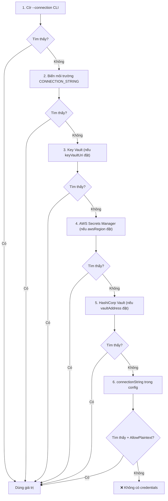

# Hướng Dẫn Cấu Hình

## File Cấu Hình: `.dataguard.yml`

DataGuard sử dụng file cấu hình YAML (mặc định: `.dataguard.yml` trong thư mục gốc project).

### Tạo Cấu Hình Mặc Định

```bash
dataguard init                          # Mặc định SQL Server
dataguard init --provider oracle        # Mặc định Oracle
```

### Tham Chiếu Cấu Hình Đầy Đủ

```yaml
# Kết nối database (hoặc dùng biến môi trường CONNECTION_STRING)
connectionString: "Server=localhost;Database=mydb;Trusted_Connection=true;"

# Chế độ ground truth: Full | Snapshot | Manual
groundTruthMode: Snapshot

# Đường dẫn file snapshot (chế độ Snapshot)
snapshotFilePath: ".dataguard-snapshot.json"

# Đường dẫn file baseline
baselineFilePath: ".dataguard-baseline.json"

# Quy ước đặt tên: SnakeCaseToPascalCase | CamelCase | None
namingConvention: SnakeCaseToPascalCase

# Bật lọc baseline
enableBaseline: true

# Loại trừ procedure/entity cụ thể
excludedProcedures:
  - "dbo.sp_temp_debug"
excludedEntities:
  - "TempEntity"

# Song song (0 = tự động = ProcessorCount)
maxDegreeOfParallelism: 0
enableConcurrentValidation: true
validationTimeoutSeconds: 300
maxViolationQueueSize: 100000

# Cài đặt bảo mật
enableCredentialRotationDetection: true
credentialRotationWarningDays: 30
encryptConnectionStringAtRest: false
keyVaultUri: null                    # URI Azure Key Vault
awsRegion: null                      # Vùng AWS cho Secrets Manager
vaultAddress: null                   # Địa chỉ HashiCorp Vault
enableAuditLogging: true
auditLogPath: null                   # Đường dẫn audit log tùy chỉnh
allowPlaintextConfigFallback: false  # true chỉ cho Development

# Chế độ Manual: đường dẫn assembly đã compile
manualAssemblyPath: null

# Tự động phát hiện
autoDetectProvider: true
autoDetectEFContext: true
autoDetectDapper: true
enableSmartDefaults: true
defaultSchema: null
defaultPackage: null

# Telemetry (opt-in, chỉ local)
enableTelemetry: false

# Oracle
oracle:
  owner: null
  useRefCursorDescribe: true
  useAllArguments: true
  useAllTabColumns: true

# SQL Server
sqlServer:
  schema: "dbo"
  useFirstResultSet: true
```

## Biến Môi Trường

| Biến | Mô tả | Ưu tiên |
|------|-------|---------|
| `CONNECTION_STRING` | Chuỗi kết nối database | Ghi đè file cấu hình |
| `DG_PROVIDER` | Database provider (sqlserver, oracle, mysql, postgresql) | Ghi đè cấu hình |
| `DG_SCHEMA` | Schema/owner database | Ghi đè cấu hình |
| `DG_PACKAGE` | Tên package Oracle | Ghi đè cấu hình |
| `DG_CONFIG` | Đường dẫn file cấu hình | Ghi đè vị trí mặc định |
| `DG_FORMAT` | Định dạng output (text, sarif, evidence) | Ghi đè mặc định |
| `DG_VERBOSE` | Bật output chi tiết | Ghi đè mặc định |

## Thứ Tự Resolve Credentials



## Cấu Hình Theo Provider

### Oracle

```yaml
groundTruthMode: Full
connectionString: "User Id=scott;Password=tiger;Data Source=ORCL"
oracle:
  owner: "SCOTT"
  useRefCursorDescribe: true
  useAllArguments: true
  useAllTabColumns: true
```

### SQL Server

```yaml
groundTruthMode: Full
connectionString: "Server=localhost;Database=Northwind;Trusted_Connection=true;"
sqlServer:
  schema: "dbo"
  useFirstResultSet: true
```

### MySQL

```yaml
groundTruthMode: Full
connectionString: "Server=localhost;Database=mydb;Uid=root;Pwd=secret;"
```

### PostgreSQL

```yaml
groundTruthMode: Full
connectionString: "Host=localhost;Database=mydb;Username=postgres;Password=secret;"
```

## Chế độ Snapshot (Offline)

```yaml
groundTruthMode: Snapshot
snapshotFilePath: ".dataguard-snapshot.json"
```

Tạo snapshot:
```bash
dataguard snapshot refresh --connection "..." --provider oracle
```

## Chế độ Manual (Không cần DB)

```yaml
groundTruthMode: Manual
manualAssemblyPath: "./bin/Release/net9.0/MyApp.dll"
```

Yêu cầu attributes `[ExpectedColumn]` và `[ExpectedSpParameter]` trong code.
