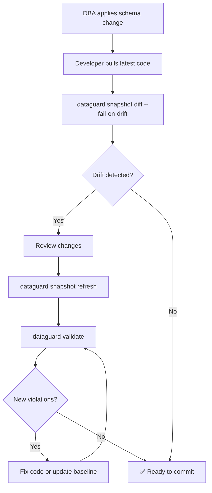

# Operations Playbook

## Daily Operations

### Morning Check (CI Pipeline)

```bash
# Check latest CI status
gh run list --limit 5

# If validation failures, check details
gh run view <run-id> --log-failed
```

### Schema Change Workflow



### Baseline Management

```bash
# Create baseline for legacy codebase
dataguard baseline --connection "..." --provider oracle

# Check what's baselined
cat .dataguard-baseline.json | jq '.violations | length'

# Re-baseline after fixing violations
dataguard baseline --connection "..." --provider oracle

# Migrate v1 baseline to v2
dataguard migrate --baseline .dataguard-baseline.json
```

### Snapshot Management

```bash
# Refresh snapshot from database
dataguard snapshot refresh --connection "..." --provider oracle

# Show snapshot info
dataguard snapshot show

# Check for drift
dataguard snapshot diff --connection "..." --provider oracle --fail-on-drift
```

## Team Workflows

### New Project Onboarding

```bash
# 1. Install DataGuard
dotnet tool install -g DataGuard.Cli

# 2. Initialize config
dataguard init --provider oracle

# 3. Create initial snapshot
dataguard snapshot refresh --connection "..." --provider oracle

# 4. Run first validation
dataguard validate --verbose

# 5. Create baseline for existing violations
dataguard baseline --connection "..." --provider oracle

# 6. Commit config files
git add .dataguard.yml .dataguard-snapshot.json .dataguard-baseline.json
git commit -m "chore: initialize DataGuard contract validation"
```

### PR Review Checklist

- [ ] `dataguard validate` passes (exit code 0)
- [ ] No new violations beyond baseline
- [ ] Snapshot updated if schema changed
- [ ] New entities have `[ExpectedColumn]` attributes (Manual mode)
- [ ] New SP calls have `[ExpectedSpParameter]` attributes

### Release Process

```bash
# 1. Full validation
dataguard validate --format sarif --output release-validation.sarif

# 2. Snapshot diff
dataguard snapshot diff --fail-on-drift

# 3. Assessment
dataguard assess --format json --output assessment.json

# 4. Commit artifacts
git add release-validation.sarif assessment.json
git commit -m "chore: release validation artifacts"
```

## Environment-Specific Configs

### Development

```yaml
groundTruthMode: Manual
allowPlaintextConfigFallback: true
enableAuditLogging: false
```

### Staging

```yaml
groundTruthMode: Full
connectionString: null  # Use CONNECTION_STRING env var
enableAuditLogging: true
auditLogPath: "/var/log/dataguard/audit.jsonl"
```

### Production CI

```yaml
groundTruthMode: Snapshot
snapshotFilePath: ".dataguard-snapshot.json"
enableAuditLogging: true
enableCredentialRotationDetection: true
```

## Monitoring

### Key Metrics

| Metric | Source | Alert Threshold |
|--------|--------|-----------------|
| Validation duration | TelemetryCollector | > 60s |
| Violation count | Validation output | New violations beyond baseline |
| Schema drift | snapshot diff | Any drift |
| Credential rotation | CredentialManager | < 30 days remaining |
| Audit log integrity | FileAuditLogger | Chain break |

### Health Checks

```bash
# Verify DataGuard installation
dataguard version

# Verify config
dataguard config validate

# Verify database connectivity
dataguard validate --verbose 2>&1 | head -20
```
