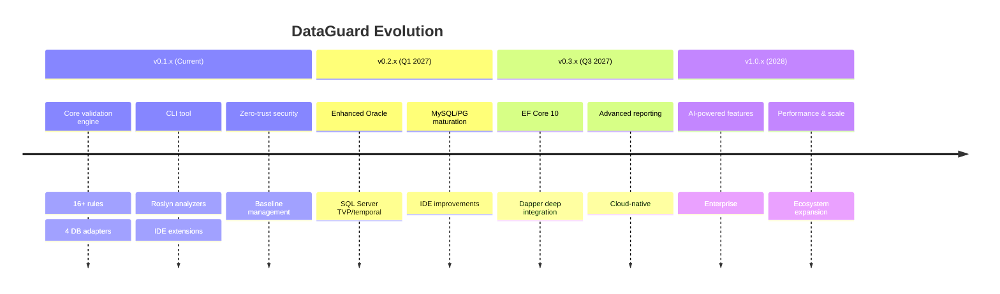

# Upgrade Path & Feature Evolution

## Version History



## Upgrade Guide: v0.1.x → v0.2.x

### Breaking Changes (Expected)

- None planned for v0.2.x (semver minor)

### New Features

1. **Oracle Package Body parsing**: No config change needed, automatic
2. **TVP support**: Add `[ExpectedColumn]` for TVP table type columns
3. **Real-time IDE validation**: Update VS Code extension

### Migration Steps

```bash
# 1. Update CLI tool
dotnet tool update -g DataGuard.Cli

# 2. Update analyzer package
dotnet add package DataGuard.Analyzers --version 0.2.*

# 3. Refresh snapshot (new schema columns may be detected)
dataguard snapshot refresh --connection "..." --provider oracle

# 4. Re-baseline if new violations appear
dataguard baseline --connection "..." --provider oracle
```

## Feature Dependency Map

```mermaid
graph TD
    CORE["Core Validation Engine"] --> RULES["Rules Engine"]
    CORE --> SOURCES["Contract Sources"]
    CORE --> SECURITY["Security Layer"]
    
    RULES --> BUILTIN["Built-in Rules (DG001-DG016)"]
    RULES --> PLUGIN["Plugin Rules (MEF)"]
    RULES --> ORACLE_RULES["Oracle Rules (DG007-DG014)"]
    RULES --> MYSQL_RULES["MySQL Rules (MY001-003)"]
    RULES --> PG_RULES["PostgreSQL Rules (PG001-003)"]
    
    SOURCES --> EF["EF Core Model"]
    SOURCES --> SP["Stored Procedures"]
    SOURCES --> RAW["Raw SQL"]
    SOURCES --> MANUAL["Manual Attributes"]
    
    SECURITY --> CRED["Credential Manager"]
    SECURITY --> AUDIT["Audit Logger"]
    SECURITY --> SUPPLY["Supply Chain Verifier"]
    
    CORE --> BASELINE["Baseline Manager"]
    CORE --> REPORTING["Reporting (SARIF/Evidence)"]
    CORE --> ASSESSMENT["Assessment Engine"]
    
    RULES --> CLI["CLI Tool"]
    SOURCES --> CLI
    CLI --> VSCODE["VS Code Extension"]
    CLI --> VS["Visual Studio Extension"]
    
    RULES --> ANALYZERS["Roslyn Analyzers"]
    ANALYZERS --> CODEFIXES["Code Fix Providers"]
    
    style CORE fill:#f9f,stroke:#333
    style RULES fill:#bbf,stroke:#333
    style SOURCES fill:#bfb,stroke:#333
    style SECURITY fill:#fbb,stroke:#333
```



## Feature Priority Matrix

| Feature | Impact | Effort | Priority | Version |
|---------|--------|--------|----------|---------|
| Oracle Package Body | High | Medium | P1 | v0.2.x |
| TVP support | High | Medium | P1 | v0.2.x |
| Real-time IDE validation | High | Low | P1 | v0.2.x |
| EF Core 10 support | High | Low | P1 | v0.2.x |
| Dapper deep integration | Medium | High | P2 | v0.3.x |
| HTML reports | Medium | Medium | P2 | v0.3.x |
| AI contract suggestion | High | High | P2 | v1.0.x |
| Multi-repo support | Medium | High | P3 | v1.0.x |
| MongoDB adapter | Low | High | P3 | v1.0.x |

## Deprecation Policy

- **Minor versions**: No breaking changes, deprecation warnings only
- **Major versions**: Breaking changes with migration guide
- **Deprecated features**: Supported for 2 minor versions after deprecation notice

## Backward Compatibility

| Component | Compatibility Guarantee |
|-----------|------------------------|
| `.dataguard.yml` | Forward-compatible: new fields ignored by old versions |
| `.dataguard-snapshot.json` | Forward-compatible: new columns ignored |
| `.dataguard-baseline.json` | v2 format, v1 migration supported |
| CLI commands | Stable: new commands added, existing unchanged |
| Rule IDs (DG001-DG016) | Stable: never removed, severity may change |
| SARIF output | SARIF 2.1.0 spec compliant |
| NuGet packages | Semver: minor = no breaking changes |
