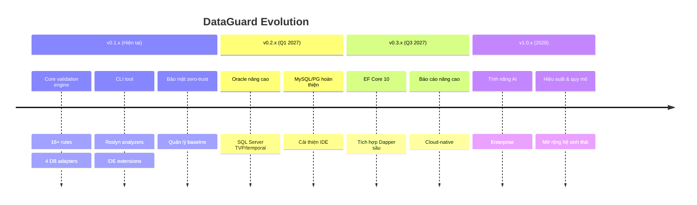

# Lộ Trình Nâng Cấp & Phát Triển Tính Năng

## Lịch Sử Phiên Bản



## Hướng Dẫn Nâng Cấp: v0.1.x → v0.2.x

### Thay Đổi Phá Vỡ (Dự kiến)

- Không có dự kiến cho v0.2.x (semver minor)

### Tính Năng Mới

1. **Parse Oracle Package Body**: Không cần thay đổi config, tự động
2. **Hỗ trợ TVP**: Thêm `[ExpectedColumn]` cho cột TVP table type
3. **Validation IDE thời gian thực**: Cập nhật extension VS Code

### Các Bước Di Chuyển

```bash
# 1. Cập nhật CLI tool
dotnet tool update -g DataGuard.Cli

# 2. Cập nhật package analyzer
dotnet add package DataGuard.Analyzers --version 0.2.*

# 3. Làm mới snapshot (có thể phát hiện cột schema mới)
dataguard snapshot refresh --connection "..." --provider oracle

# 4. Baseline lại nếu có violations mới
dataguard baseline --connection "..." --provider oracle
```

## Bản Đồ Phụ Thuộc Tính Năng

```mermaid
graph TD
    CORE["Core Validation Engine"] --> RULES["Rules Engine"]
    CORE --> SOURCES["Contract Sources"]
    CORE --> SECURITY["Security Layer"]
    
    RULES --> BUILTIN["Built-in Rules (DG001-DG016)"]
    RULES --> PLUGIN["Plugin Rules (MEF)"]
    RULES --> ORACLE_RULES["Oracle Rules (DG007-DG014)"]
    RULES --> MYSQL_RULES["MySQL Rules (MY001-003)"]
    RULES --> PG_RULES["PostgreSQL Rules (PG001-003)"]
    
    SOURCES --> EF["EF Core Model"]
    SOURCES --> SP["Stored Procedures"]
    SOURCES --> RAW["Raw SQL"]
    SOURCES --> MANUAL["Manual Attributes"]
    
    SECURITY --> CRED["Credential Manager"]
    SECURITY --> AUDIT["Audit Logger"]
    SECURITY --> SUPPLY["Supply Chain Verifier"]
    
    CORE --> BASELINE["Baseline Manager"]
    CORE --> REPORTING["Reporting (SARIF/Evidence)"]
    CORE --> ASSESSMENT["Assessment Engine"]
    
    RULES --> CLI["CLI Tool"]
    SOURCES --> CLI
    CLI --> VSCODE["VS Code Extension"]
    CLI --> VS["Visual Studio Extension"]
    
    RULES --> ANALYZERS["Roslyn Analyzers"]
    ANALYZERS --> CODEFIXES["Code Fix Providers"]
    
    style CORE fill:#f9f,stroke:#333
    style RULES fill:#bbf,stroke:#333
    style SOURCES fill:#bfb,stroke:#333
    style SECURITY fill:#fbb,stroke:#333
```



## Ma Trận Ưu Tiên Tính Năng

| Tính năng | Tác động | Nỗ lực | Ưu tiên | Phiên bản |
|-----------|---------|--------|---------|-----------|
| Oracle Package Body | Cao | Trung bình | P1 | v0.2.x |
| Hỗ trợ TVP | Cao | Trung bình | P1 | v0.2.x |
| Validation IDE thời gian thực | Cao | Thấp | P1 | v0.2.x |
| Hỗ trợ EF Core 10 | Cao | Thấp | P1 | v0.2.x |
| Tích hợp Dapper sâu | Trung bình | Cao | P2 | v0.3.x |
| Báo cáo HTML | Trung bình | Trung bình | P2 | v0.3.x |
| Gợi ý contract AI | Cao | Cao | P2 | v1.0.x |
| Hỗ trợ multi-repo | Trung bình | Cao | P3 | v1.0.x |
| Adapter MongoDB | Thấp | Cao | P3 | v1.0.x |

## Chính Sách Ngừng Hỗ Trợ

- **Minor versions**: Không có thay đổi phá vỡ, chỉ cảnh báo ngừng hỗ trợ
- **Major versions**: Thay đổi phá vỡ với hướng dẫn di chuyển
- **Tính năng ngừng hỗ trợ**: Được hỗ trợ trong 2 minor versions sau thông báo

## Tương Thịch Ngược

| Thành phần | Cam kết tương thích |
|-----------|---------------------|
| `.dataguard.yml` | Tương thích tiến: trường mới bị bỏ qua bởi phiên bản cũ |
| `.dataguard-snapshot.json` | Tương thích tiến: cột mới bị bỏ qua |
| `.dataguard-baseline.json` | Định dạng v2, hỗ trợ di chuyển v1 |
| Lệnh CLI | Ổn định: lệnh mới được thêm, hiện có không đổi |
| Rule IDs (DG001-DG016) | Ổn định: không bao giờ xóa, severity có thể đổi |
| Output SARIF | Tuân thủ spec SARIF 2.1.0 |
| NuGet packages | Semver: minor = không thay đổi phá vỡ |
