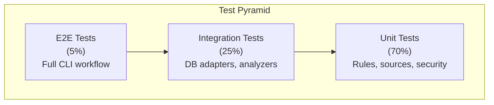

# QA & Test Strategy

> **Execution evidence (2026-09-12):** the local macOS arm64 baseline at
> `93bf7288324dd746669ad09c5e2a592adc772748` built Release with 0 warnings/errors
> and ran 484 passing C# tests. This is not evidence of live database assertions
> or Windows/Visual Studio behavior; those gates require their own marked runs.

## Test Philosophy

DataGuard follows a **contract-first, evidence-based** testing approach:

1. **Every rule has tests**: Each DG/MY/PG rule has unit tests covering happy path, edge cases, and error conditions
2. **Golden corpus**: Known-good and known-bad SQL/entity pairs for regression testing
3. **Integration tests**: Real database connections for adapter validation
4. **Analyzer tests**: Roslyn analyzer behavior verified with test projects

## Test Pyramid



## Test Projects

| Project | Focus | Test Count |
|---------|-------|------------|
| `DataGuard.Core.Tests` | Core engine, rules, security, assessment | 250+ tests |
| `DataGuard.GoldenCorpus.Tests` | Known-good/bad SQL regression | 20+ tests |
| `DataGuard.Analyzers.Tests` | Roslyn analyzer behavior | 20+ tests |

## Running Tests

```bash
# All tests
dotnet test

# Specific project
dotnet test tests/DataGuard.Core.Tests

# With coverage
dotnet test --collect:"XPlat Code Coverage"

# Filter by category
dotnet test --filter "Category=Unit"
dotnet test --filter "Category=Integration"
```

## Coverage

- **Current**: 68.7% line coverage
- **Gate**: ≥60% (enforced in CI)
- **Target**: 80% by v0.2.x

## Test Categories

### Unit Tests

- **Rules engine**: Each rule tested with mock descriptors
- **Sources**: EfModelSource, ManualContractSource with test assemblies
- **Security**: CredentialManager, ZeroTrustCredentialProvider, SupplyChainVerifier
- **Baseline**: BaselineManager create/load/migrate
- **Reporting**: DiagnosticEmitter, ContractExport, ContractEvidence
- **Assessment**: AssessmentEngine, UpgradePlanner, all packs

### Integration Tests

- **SQL Server**: Real connection, stored procedure extraction
- **Oracle**: Real connection, ALL_ARGUMENTS/ALL_TAB_COLUMNS queries
- **MySQL**: Real connection, INFORMATION_SCHEMA queries
- **PostgreSQL**: Real connection, pg_catalog queries

SQL Server fixtures normally record an informational skip when Docker is not
available. To make Docker/provider health a required gate, use:

```bash
DATAGUARD_RUN_SQLSERVER_INTEGRATION=1 dotnet test tests/DataGuard.Core.Tests/DataGuard.Core.Tests.csproj \
  --configuration Release --no-restore \
  --filter 'FullyQualifiedName~SqlServerIntegrationTests|FullyQualifiedName~SqlServerParserIntegrationTests'
```

In required-live mode, image pull, daemon, startup, or health-check failure
fails the fixture instead of being reported as a successful skip.

The PostgreSQL extraction fixture uses the same opt-in policy:

```bash
DATAGUARD_REQUIRE_LIVE_RELATIONAL=1 dotnet test tests/DataGuard.Core.Tests/DataGuard.Core.Tests.csproj \
  --configuration Release --no-restore --filter FullyQualifiedName~PostgreSqlIntegrationTests
```

Use the same variable for MySQL:

```bash
DATAGUARD_REQUIRE_LIVE_RELATIONAL=1 dotnet test tests/DataGuard.Core.Tests/DataGuard.Core.Tests.csproj \
  --configuration Release --no-restore --filter FullyQualifiedName~MySqlIntegrationTests
```

Oracle Free uses the same required-live switch and a dedicated application user:

```bash
DATAGUARD_REQUIRE_LIVE_RELATIONAL=1 dotnet test tests/DataGuard.Core.Tests/DataGuard.Core.Tests.csproj \
  --configuration Release --no-restore --filter FullyQualifiedName~OracleIntegrationTests
```

### Golden Corpus Tests

- Known-good SQL that should pass all rules
- Known-bad SQL that should trigger specific rules
- Edge cases: empty result sets, overloaded procedures, nullable columns

### Analyzer Tests

- DiagnosticDescriptor arity verification
- Generator execution with test projects
- Code fix application and verification

## CI Test Gates

```yaml
# From .github/workflows/ci.yml
- name: Test
  run: dotnet test --collect:"XPlat Code Coverage"

- name: Coverage gate
  run: |
    # Fail if coverage < 60%
    python scripts/coverage_gate.py --threshold 60
```

## Test Data Management

- **Test fixtures**: Embedded in test projects as resources
- **Mock databases**: In-memory SQLite for unit tests
- **Test containers**: Docker-based for integration tests (SQL Server, Oracle, MySQL, PostgreSQL)
- **Golden corpus**: Committed JSON files with known-good/bad pairs

## Writing New Tests

### For a New Rule

```csharp
[Fact]
public async Task NewRule_DetectsViolation_WhenConditionMet()
{
    // Arrange
    var rule = new MyNewRule();
    var contract = new RawSqlDescriptor(...);
    
    // Act
    var violations = await rule.ValidateAsync(contract, allContracts, CancellationToken.None);
    
    // Assert
    Assert.Single(violations);
    Assert.Equal("DG017", violations[0].RuleId);
}
```

### For a New Adapter

```csharp
[Fact]
public async Task OracleAdapter_ExtractsOverloadedProcedures()
{
    // Arrange
    var adapter = new AllArgumentsReader(connectionString);
    
    // Act
    var params = await adapter.ReadParametersAsync("SCOTT", "GET_CUSTOMER");
    
    // Assert
    Assert.Equal(2, params.Count(p => p.Overload > 0));
}
```
