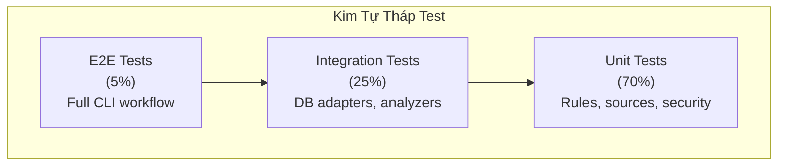

# Chiến Lược QA & Kiểm Thử

## Triết Lý Kiểm Thử

DataGuard tuân theo phương pháp kiểm thử **contract-first, dựa trên bằng chứng**:

1. **Mỗi rule có tests**: Mỗi rule DG/MY/PG có unit tests bao gồm happy path, edge cases, và điều kiện lỗi
2. **Golden corpus**: Các cặp SQL/entity đã biết đúng/sai để kiểm thử hồi quy
3. **Integration tests**: Kết nối database thực để validate adapter
4. **Analyzer tests**: Hành vi Roslyn analyzer được xác minh với test projects

## Kim Tự Tháp Test



## Test Projects

| Project | Trọng tâm | Số lượng test |
|---------|----------|---------------|
| `DataGuard.Core.Tests` | Core engine, rules, security, assessment | 250+ tests |
| `DataGuard.GoldenCorpus.Tests` | SQL đã biết đúng/sai hồi quy | 20+ tests |
| `DataGuard.Analyzers.Tests` | Hành vi Roslyn analyzer | 20+ tests |

## Chạy Tests

```bash
# Tất cả tests
dotnet test

# Project cụ thể
dotnet test tests/DataGuard.Core.Tests

# Với coverage
dotnet test --collect:"XPlat Code Coverage"

# Lọc theo category
dotnet test --filter "Category=Unit"
dotnet test --filter "Category=Integration"
```

## Coverage

- **Hiện tại**: 68.7% line coverage
- **Gate**: ≥60% (ép buộc trong CI)
- **Mục tiêu**: 80% vào v0.2.x

## Danh Mục Test

### Unit Tests

- **Rules engine**: Mỗi rule test với mock descriptors
- **Sources**: EfModelSource, ManualContractSource với test assemblies
- **Security**: CredentialManager, ZeroTrustCredentialProvider, SupplyChainVerifier
- **Baseline**: BaselineManager create/load/migrate
- **Reporting**: DiagnosticEmitter, ContractExport, ContractEvidence
- **Assessment**: AssessmentEngine, UpgradePlanner, tất cả packs

### Integration Tests

- **SQL Server**: Kết nối thực, trích xuất stored procedure
- **Oracle**: Kết nối thực, truy vấn ALL_ARGUMENTS/ALL_TAB_COLUMNS
- **MySQL**: Kết nối thực, truy vấn INFORMATION_SCHEMA
- **PostgreSQL**: Kết nối thực, truy vấn pg_catalog

### Golden Corpus Tests

- SQL đã biết đúng phải pass tất cả rules
- SQL đã biết sai phải trigger rules cụ thể
- Edge cases: result sets rỗng, overloaded procedures, nullable columns

### Analyzer Tests

- Xác minh DiagnosticDescriptor arity
- Generator execution với test projects
- Áp dụng và xác minh code fix

## Gates Test CI

```yaml
# Từ .github/workflows/ci.yml
- name: Test
  run: dotnet test --collect:"XPlat Code Coverage"

- name: Coverage gate
  run: |
    # Fail nếu coverage < 60%
    python scripts/coverage_gate.py --threshold 60
```

## Quản Lý Test Data

- **Test fixtures**: Nhúng trong test projects như resources
- **Mock databases**: In-memory SQLite cho unit tests
- **Test containers**: Docker-based cho integration tests (SQL Server, Oracle, MySQL, PostgreSQL)
- **Golden corpus**: File JSON đã commit với cặp đã biết đúng/sai

## Viết Tests Mới

### Cho Rule Mới

```csharp
[Fact]
public async Task NewRule_DetectsViolation_WhenConditionMet()
{
    // Arrange
    var rule = new MyNewRule();
    var contract = new RawSqlDescriptor(...);
    
    // Act
    var violations = await rule.ValidateAsync(contract, allContracts, CancellationToken.None);
    
    // Assert
    Assert.Single(violations);
    Assert.Equal("DG017", violations[0].RuleId);
}
```

### Cho Adapter Mới

```csharp
[Fact]
public async Task OracleAdapter_ExtractsOverloadedProcedures()
{
    // Arrange
    var adapter = new AllArgumentsReader(connectionString);
    
    // Act
    var params = await adapter.ReadParametersAsync("SCOTT", "GET_CUSTOMER");
    
    // Assert
    Assert.Equal(2, params.Count(p => p.Overload > 0));
}
```
