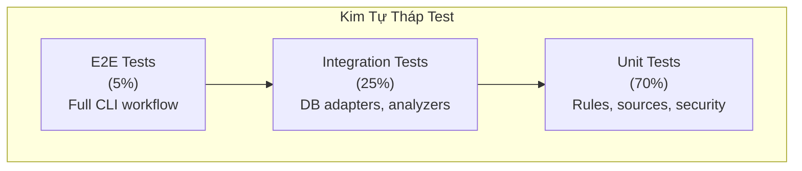

# Chiến Lược QA & Kiểm Thử

> **Bằng chứng thực thi (2026-09-12):** baseline macOS arm64 tại
> `93bf7288324dd746669ad09c5e2a592adc772748` build Release với 0 warnings/errors
> và chạy 484 C# tests pass. Đây không phải bằng chứng cho assertion database thật
> hoặc hành vi Windows/Visual Studio; các gate đó cần lần chạy có marker riêng.

## Triết Lý Kiểm Thử

DataGuard tuân theo phương pháp kiểm thử **contract-first, dựa trên bằng chứng**:

1. **Mỗi rule có tests**: Mỗi rule DG/MY/PG có unit tests bao gồm happy path, edge cases, và điều kiện lỗi
2. **Golden corpus**: Các cặp SQL/entity đã biết đúng/sai để kiểm thử hồi quy
3. **Integration tests**: Kết nối database thực để validate adapter
4. **Analyzer tests**: Hành vi Roslyn analyzer được xác minh với test projects

## Kim Tự Tháp Test


```mermaid
graph TB
    subgraph Pyramid ["Kim Tự Tháp Test"]
        E2E["E2E Tests<br/>(5%)<br/>Full CLI workflow"]
        INT["Integration Tests<br/>(25%)<br/>DB adapters, analyzers"]
        UNIT["Unit Tests<br/>(70%)<br/>Rules, sources, security"]
    end
    
    E2E --> INT
    INT --> UNIT
```

## Test Projects

| Project | Trọng tâm | Số lượng test |
|---------|----------|---------------|
| `DataGuard.Core.Tests` | Core engine, rules, security, assessment | 250+ tests |
| `DataGuard.GoldenCorpus.Tests` | SQL đã biết đúng/sai hồi quy | 20+ tests |
| `DataGuard.Analyzers.Tests` | Hành vi Roslyn analyzer | 20+ tests |

## Chạy Tests

```bash
# Tất cả tests
dotnet test

# Project cụ thể
dotnet test tests/DataGuard.Core.Tests

# Với coverage
dotnet test --collect:"XPlat Code Coverage"

# Lọc theo category
dotnet test --filter "Category=Unit"
dotnet test --filter "Category=Integration"
```

## Coverage

- **Hiện tại**: 68.7% line coverage
- **Gate**: ≥60% (ép buộc trong CI)
- **Mục tiêu**: 80% vào v0.2.x

## Danh Mục Test

### Unit Tests

- **Rules engine**: Mỗi rule test với mock descriptors
- **Sources**: EfModelSource, ManualContractSource với test assemblies
- **Security**: CredentialManager, ZeroTrustCredentialProvider, SupplyChainVerifier
- **Baseline**: BaselineManager create/load/migrate
- **Reporting**: DiagnosticEmitter, ContractExport, ContractEvidence
- **Assessment**: AssessmentEngine, UpgradePlanner, tất cả packs

### Integration Tests

- **SQL Server**: Kết nối thực, trích xuất stored procedure
- **Oracle**: Kết nối thực, truy vấn ALL_ARGUMENTS/ALL_TAB_COLUMNS
- **MySQL**: Kết nối thực, truy vấn INFORMATION_SCHEMA
- **PostgreSQL**: Kết nối thực, truy vấn pg_catalog

### Test cơ sở dữ liệu thật (`Category=LiveDb`)

Năm fixture Testcontainers (`OracleIntegrationTests`, `MySqlIntegrationTests`,
`PostgreSqlIntegrationTests`, `SqlServerIntegrationTests`,
`SqlServerParserIntegrationTests`) dùng `[LiveDbFact(LiveDbTarget.Relational | SqlServer)]`
trong `tests/DataGuard.Core.Tests/LiveDbFactAttribute.cs`:

| Biến bật | Bật cho | Image |
|---|---|---|
| `DATAGUARD_REQUIRE_LIVE_RELATIONAL=1` | Oracle, MySQL, PostgreSQL | `gvenzl/oracle-free:23-slim-faststart`, `mysql:8.4`, `postgres:16-alpine` |
| `DATAGUARD_REQUIRE_LIVE_SQLSERVER=1` (alias cũ `DATAGUARD_RUN_SQLSERVER_INTEGRATION=1`) | SQL Server | `mcr.microsoft.com/mssql/server:2022-latest` |

- Không đặt biến: test được báo **Skipped** kèm lý do; không còn `return` sớm rồi tính là passed, và không khởi động container.
- Có đặt biến: fixture bắt buộc khởi động container; lỗi pull image, daemon, khởi động hoặc health-check sẽ ném ngoại lệ và làm test fail.
- Mọi test có cổng đều mang trait `Category=LiveDb` (và `LiveDbTarget=Relational|SqlServer`).

```bash
# Job mặc định/unit: loại hẳn các test live
dotnet test DataGuard.CrossPlatform.slnf -c Release --filter "Category!=LiveDb"

# Job live (cần Docker): chạy thật
DATAGUARD_REQUIRE_LIVE_RELATIONAL=1 DATAGUARD_REQUIRE_LIVE_SQLSERVER=1 \
  dotnet test tests/DataGuard.Core.Tests -c Release --filter Category=LiveDb
```

Vẫn có thể chọn riêng một provider bằng biến cổng tương ứng và filter
`FullyQualifiedName~<Fixture>`, ví dụ:

```bash
DATAGUARD_REQUIRE_LIVE_SQLSERVER=1 dotnet test tests/DataGuard.Core.Tests/DataGuard.Core.Tests.csproj \
  --configuration Release --no-restore \
  --filter 'FullyQualifiedName~SqlServerIntegrationTests|FullyQualifiedName~SqlServerParserIntegrationTests'
```

Ở required-live mode, lỗi image pull, daemon, startup hoặc health-check sẽ làm
fixture fail thay vì được báo là skip thành công.

PostgreSQL extraction fixture dùng cùng chính sách opt-in:

```bash
DATAGUARD_REQUIRE_LIVE_RELATIONAL=1 dotnet test tests/DataGuard.Core.Tests/DataGuard.Core.Tests.csproj \
  --configuration Release --no-restore --filter FullyQualifiedName~PostgreSqlIntegrationTests
```

Dùng cùng biến cho MySQL:

```bash
DATAGUARD_REQUIRE_LIVE_RELATIONAL=1 dotnet test tests/DataGuard.Core.Tests/DataGuard.Core.Tests.csproj \
  --configuration Release --no-restore --filter FullyQualifiedName~MySqlIntegrationTests
```

Oracle Free dùng cùng required-live switch và user ứng dụng riêng:

```bash
DATAGUARD_REQUIRE_LIVE_RELATIONAL=1 dotnet test tests/DataGuard.Core.Tests/DataGuard.Core.Tests.csproj \
  --configuration Release --no-restore --filter FullyQualifiedName~OracleIntegrationTests
```

### Golden Corpus Tests

`tests/DataGuard.GoldenCorpus.Tests/golden-corpus/<Category>/*.json`, mỗi file một case:

- Bộ rule lấy từ inventory của CLI `ProviderRuleCatalog.Get(provider)` lọc theo
  `Ready`, nên corpus chạy đúng những rule mà `dataguard validate` đăng ký.
- Finding Error và Warning được so khớp toàn bộ theo `(ruleId, severity)`: thiếu hoặc
  thừa một Error/Warning đều làm case fail; Info được nới lỏng.
- JSON lỗi hoặc thiếu trường bắt buộc (`testCase`, `category`, `input`,
  `expectedDiagnostics`, `provenance`) làm fail đúng dòng theory đó.
- Ngưỡng: tối thiểu 24 case, tối thiểu 6 case `Negative/` (`expectedDiagnostics: []`),
  mọi thư mục category không rỗng, phủ đủ bốn provider.
- `provenance`: `{ "source": "manual" | "llm", "model": <id hoặc null>, "date": "yyyy-MM-dd" }`
  (`llm` bắt buộc có `model`). `tools/corpus/collect_hallucinations.py` soạn nháp case
  `llm`; xem `tools/corpus/README.md`.

### Analyzer Tests

- Xác minh DiagnosticDescriptor arity
- Generator execution với test projects
- Áp dụng và xác minh code fix

## Gates Test CI

```yaml
# Từ .github/workflows/ci.yml
- name: Test
  run: dotnet test --collect:"XPlat Code Coverage"

- name: Coverage gate
  run: |
    # Fail nếu coverage < 60%
    python scripts/coverage_gate.py --threshold 60
```

## Quản Lý Test Data

- **Test fixtures**: Nhúng trong test projects như resources
- **Mock databases**: In-memory SQLite cho unit tests
- **Test containers**: Docker-based cho integration tests (SQL Server, Oracle, MySQL, PostgreSQL)
- **Golden corpus**: File JSON đã commit với cặp đã biết đúng/sai

## Viết Tests Mới

### Cho Rule Mới

```csharp
[Fact]
public async Task NewRule_DetectsViolation_WhenConditionMet()
{
    // Arrange
    var rule = new MyNewRule();
    var contract = new RawSqlDescriptor(...);
    
    // Act
    var violations = await rule.ValidateAsync(contract, allContracts, CancellationToken.None);
    
    // Assert
    Assert.Single(violations);
    Assert.Equal("DG017", violations[0].RuleId);
}
```

### Cho Adapter Mới

```csharp
[Fact]
public async Task OracleAdapter_ExtractsOverloadedProcedures()
{
    // Arrange
    var adapter = new AllArgumentsReader(connectionString);
    
    // Act
    var params = await adapter.ReadParametersAsync("SCOTT", "GET_CUSTOMER");
    
    // Assert
    Assert.Equal(2, params.Count(p => p.Overload > 0));
}
```
