# Tương Tác Thành Phần / Component Interaction / Tương Tác Thành Phần

## Tổng Quan Tương Tác / Interaction Overview / Tổng Quan Tương Tác

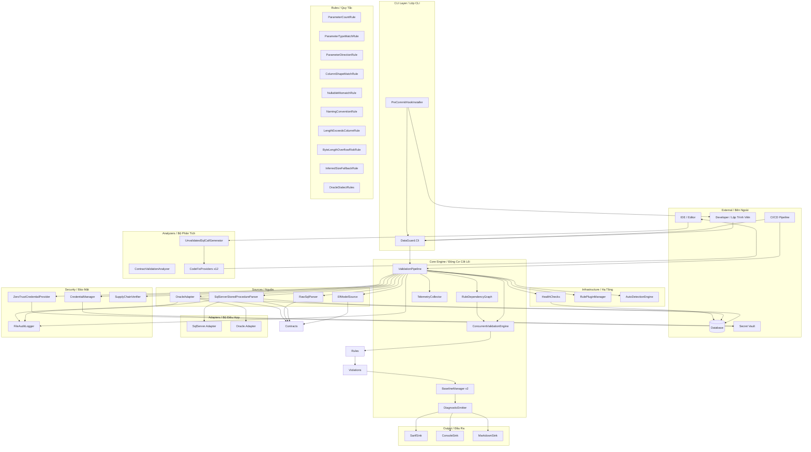

---

## Tương Tác Chi Tiết / Detailed Interactions / Tương Tác Chi Tiết

### 1. CLI → ValidationPipeline

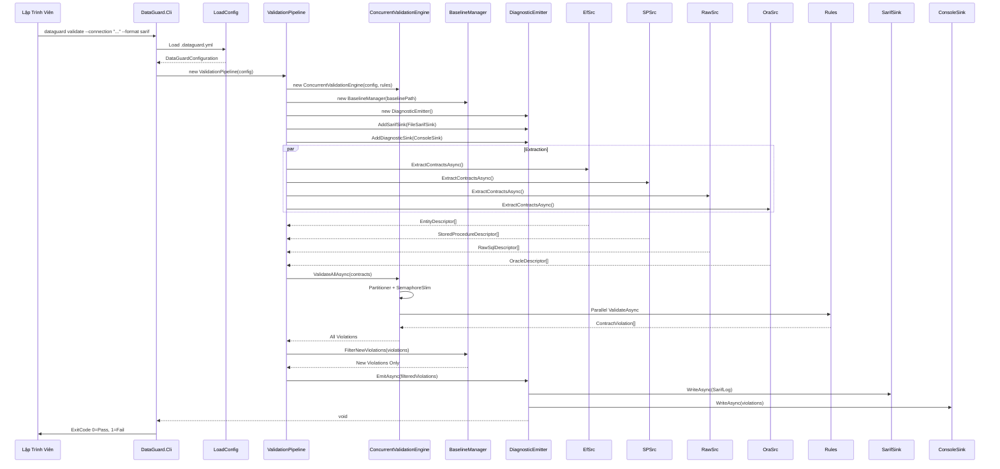

### 2. Analyzers Tương Tác IDE / IDE Analyzer Interaction

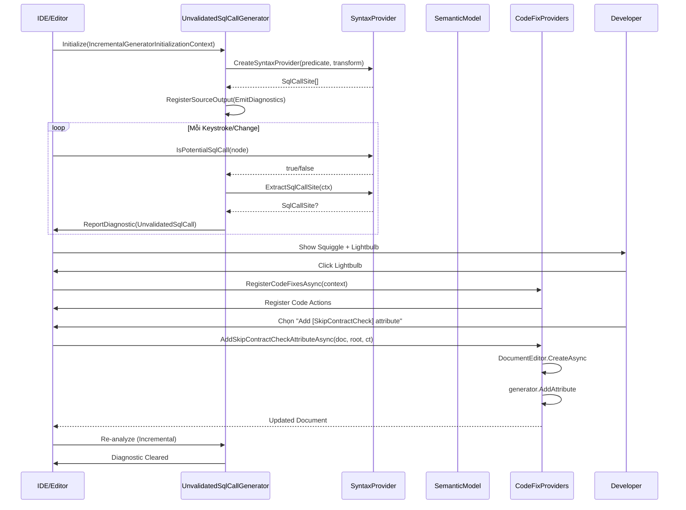

### 3. Oracle Adapter Tương Tác Database

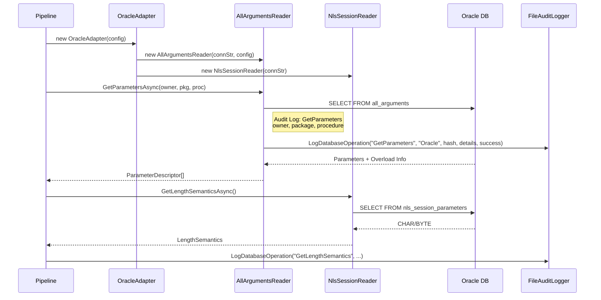

### 4. Baseline v2 Tương Tác File System

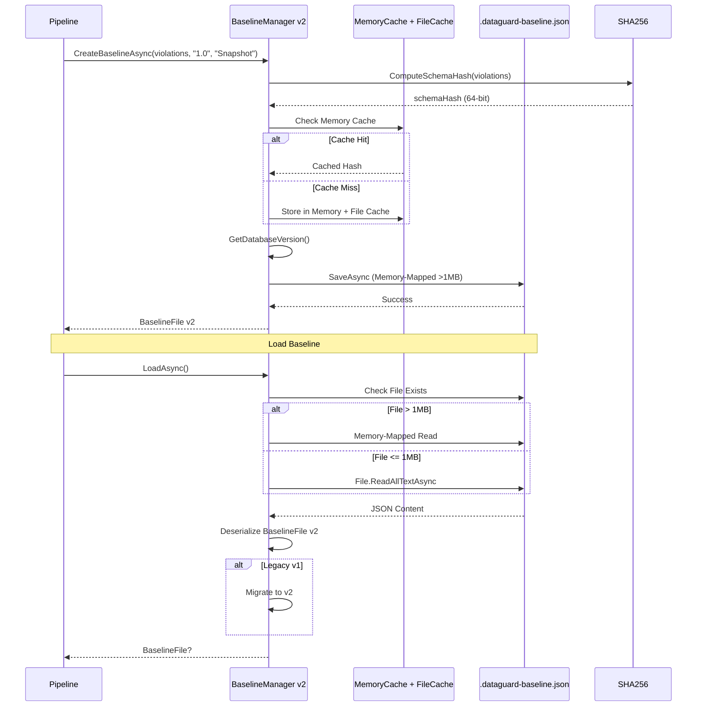

### 5. Baseline Filter Tương Tác

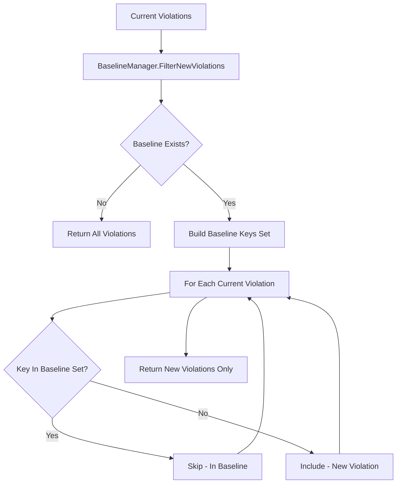

**Key Generation / Tạo Key**:
```csharp
// BaselineViolation Key
$"{RuleId}|{Message}|{Severity}|{FilePath}|{StartLine}"

// ContractViolation Key  
$"{RuleId}|{Message}|{Severity}|{SourceTree.FilePath}|{StartLine}"
```

---

## Ma Trận Tương Tác / Interaction Matrix / Ma Trận Tương Tác

| Component A | Component B | Interaction Type / Loại Tương Tác | Direction / Hướng | Protocol / Giao Thức |
|------|------|------|--------|--------|
| CLI | ValidationPipeline | Method Call / Gọi Phương Thức | CLI → Pipeline | In-process / Trong tiến trình |
| Pipeline | EfModelSource | Async Method | Pipeline → Source | `Task<IReadOnlyList<ContractDescriptor>>` |
| Pipeline | SqlServerAdapter | Async Method | Pipeline → Adapter | `Task<IReadOnlyList<ContractDescriptor>>` |
| Pipeline | OracleAdapter | Async Method | Pipeline → Adapter | `Task<IReadOnlyList<ContractDescriptor>>` |
| Pipeline | RuleDependencyGraph | Method Call | Pipeline → Graph | `ImmutableArray<IContractRule>` |
| Pipeline | ConcurrentValidationEngine | Async Method | Pipeline → Engine | `Task<IReadOnlyList<ContractViolation>>` |
| Engine | Rules | Async Method | Engine → Rule | `Task<IReadOnlyList<ContractViolation>>` |
| Rules | Violations | Return Value | Rule → Engine | `IReadOnlyList<ContractViolation>` |
| Engine | Pipeline | Return Value | Engine → Pipeline | `IReadOnlyList<ContractViolation>` |
| Pipeline | BaselineManager | Async Method | Pipeline → Baseline | `Task<BaselineFile>` / `FilterNewViolations` |
| Pipeline | DiagnosticEmitter | Async Method | Pipeline → Emitter | `Task EmitAsync` |
| Emitter | SarifSink | Async Method | Emitter → Sink | `Task WriteAsync(SarifLog)` |
| Emitter | ConsoleSink | Async Method | Emitter → Sink | `Task WriteAsync(violations)` |
| Pipeline | CredentialManager | Async Method | Pipeline → CredMgr | `Task<string> GetConnectionStringAsync` |
| CredMgr | Vault | External Call | CredMgr → Vault | KeyVault/AWS/Vault API |
| Pipeline | ZeroTrustCredentialProvider | Async Method | Pipeline → ZTProvider | `Task<CredentialHandle>` |
| ZTProvider | AuditLogger | Async Method | ZTProvider → Audit | `Task LogCredentialAccessAsync` |
| Pipeline | SupplyChainVerifier | Async Method | Pipeline → SCV | `Task<SupplyChainVerificationResult>` |
| SCV | Assembly | Reflection | SCV → Assembly | `Assembly.GetReferencedAssemblies()` |
| Pipeline | TelemetryCollector | Method Call | Pipeline → Telemetry | `IncrementCounter`, `RecordHistogram` |
| Telemetry | Meter | .NET Metrics | Telemetry → Meter | `IMeter` API |
| Pipeline | HealthChecks | Method Call | Pipeline → Health | `Task<HealthCheckResult>` |
| Health | DB | DB Query | Health → DB | `SELECT 1` / Version Query |
| Pipeline | AutoDetectionEngine | Async Method | Pipeline → AutoDetect | `Task<DataGuardConfiguration>` |
| AutoDetect | File System | File IO | AutoDetect → FS | `Directory.GetFiles`, `File.ReadAllText` |
| AutoDetect | Roslyn | Syntax Analysis | AutoDetect → Roslyn | `CSharpSyntaxTree.ParseText` |
| Pipeline | RulePluginManager | Constructor | Pipeline → PluginMgr | MEF Container |
| PluginMgr | Plugin Assemblies | MEF | PluginMgr → Plugins | `CompositionHost` |
| Pipeline | AutoDetectionEngine | Async Method | Pipeline → AutoDetect | `Task<DataGuardConfiguration>` |
| Analyzers | IDE | Roslyn API | Analyzer → IDE | `ReportDiagnostic`, `RegisterCodeFixesAsync` |
| CodeFixProviders | IDE | Roslyn API | FixProvider → IDE | `DocumentEditor`, `CodeAction` |
| CLI | PreCommitHookInstaller | Method Call | CLI → HookInstaller | `Task<InstallResult>` |
| HookInstaller | File System | File IO | HookInstaller → FS | `File.WriteAllText`, `chmod +x` |
| HookInstaller | Git | Git Config | HookInstaller → Git | `.git/hooks/pre-commit`, `.husky/pre-commit`, `lefthook.yml` |
| Pipeline | SCV | Startup | Pipeline → SCV | `VerifyAsync` on startup |
| Pipeline | AuditLogger | Throughout | Pipeline → Audit | `LogDatabaseOperation`, `LogCredentialAccess` |

---

## Tương Tác Song Song / Parallel Interactions / Tương Tác Song Song

### ConcurrentValidationEngine

```mermaid
graph TD
    A[ContractDescriptors[]] --> B[Partitioner.Create<br/>Range Partitioning]
    B --> C[Partition 1] --> D[SemaphoreSlim<br/>WaitAsync]
    B --> E[Partition 2] --> D
    B --> F[Partition N] --> D
    D --> G[Task.WhenAll<br/>Parallel.ForEach]
    G --> H[ConcurrentQueue<ContractViolation>]
    H --> I[All Violations]
    
    style B fill:#e8f5e9
    style G fill:#e8f5e9
```

**Cấu Hình Song Song / Parallelism Config**:
```csharp
var maxParallelism = config.MaxDegreeOfParallelism > 0 
    ? config.MaxDegreeOfParallelism 
    : Environment.ProcessorCount;

var chunkSize = Math.Max(1, contracts.Count / (maxParallelism * 4));

var semaphore = new SemaphoreSlim(maxParallelism);
var partitions = Partitioner.Create(0, contracts.Count, chunkSize);
```

### RuleDependencyGraph - Thứ Tự Thực Thi

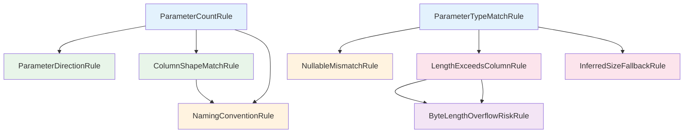

**Nhóm Song Song / Parallel Groups**:
```
Level 1 (Parallel): [ParameterCountRule, ParameterTypeMatchRule]
Level 2 (Parallel): [ParameterDirectionRule, ColumnShapeMatchRule] 
Level 3 (Parallel): [NullableMismatchRule, NamingConventionRule]
Level 4 (Parallel): [LengthExceedsColumnRule, InferredSizeFallbackRule]
Level 5 (Sequential): [ByteLengthOverflowRiskRule]
Level 6 (Parallel - Independent): [Dialect Rules: DG010-DG014]
```

---

## Tương Tác Bảo Mật / Security Interactions / Tương Tác Bảo Mật

### Zero-Trust Credential Flow

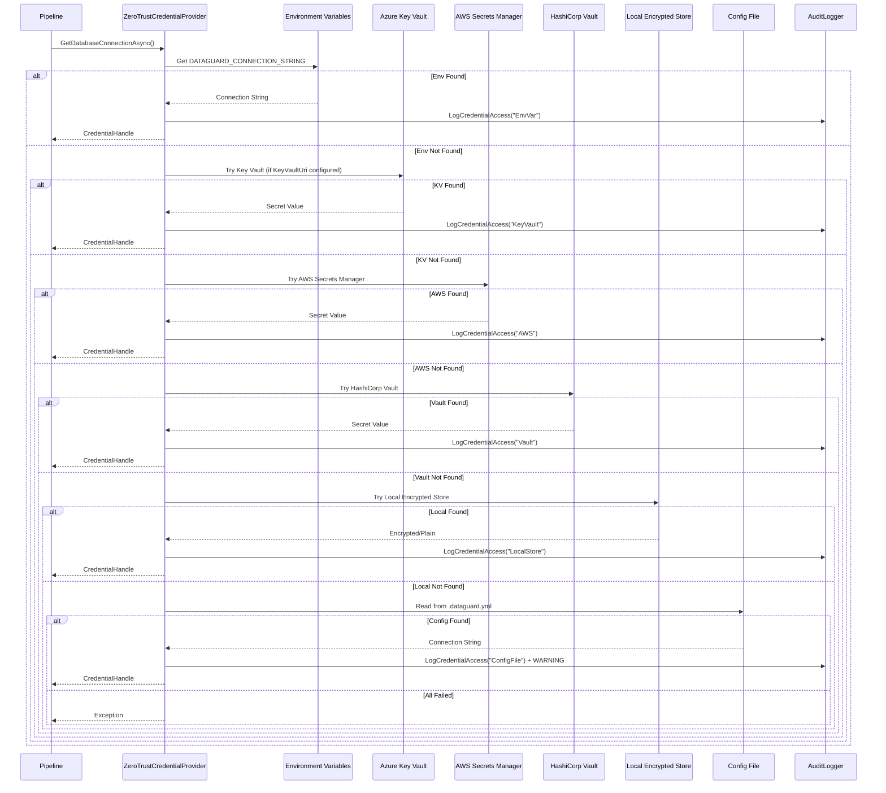

### Credential Rotation Detection

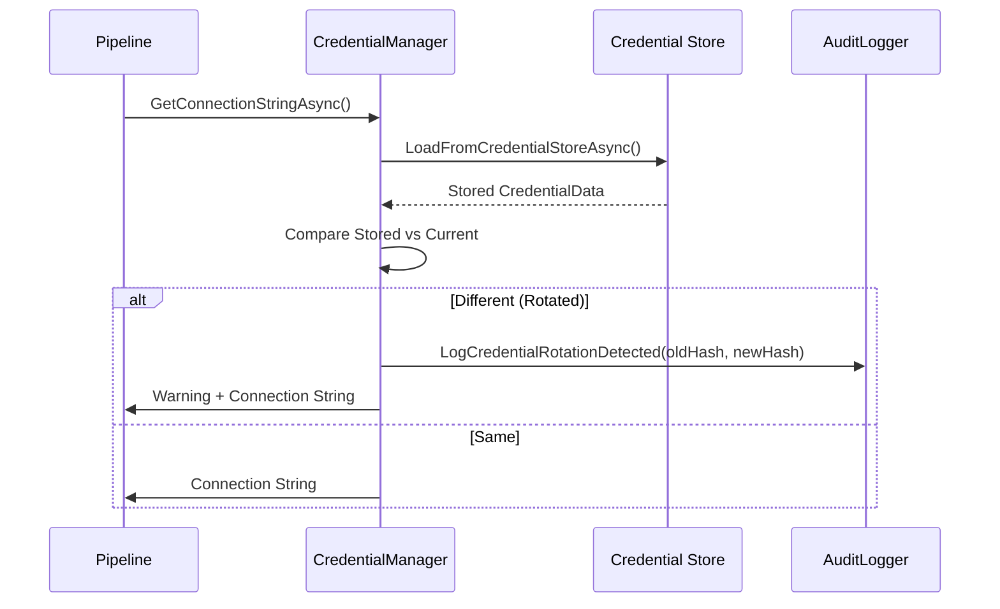

---

## Tương Tác Supply Chain / Supply Chain Interactions

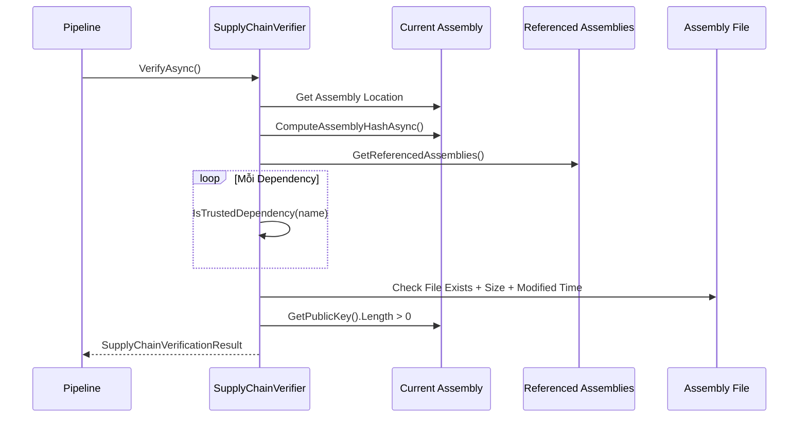

---

## Tương Tác Plugin / Plugin Interactions

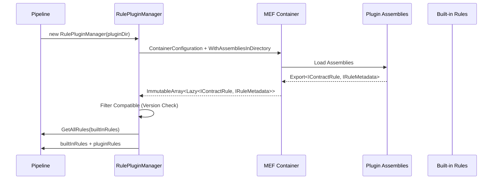

---

## Tương Tác Telemetry / Telemetry Interactions

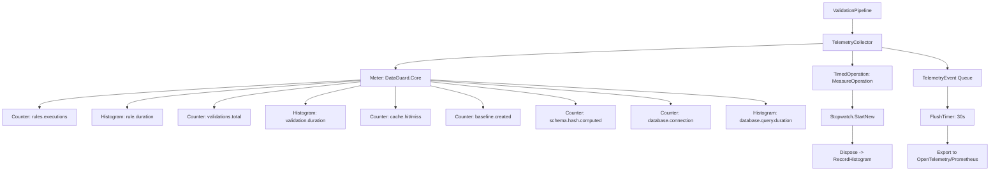

---

## Tương Tác Health Check / Health Check Interactions

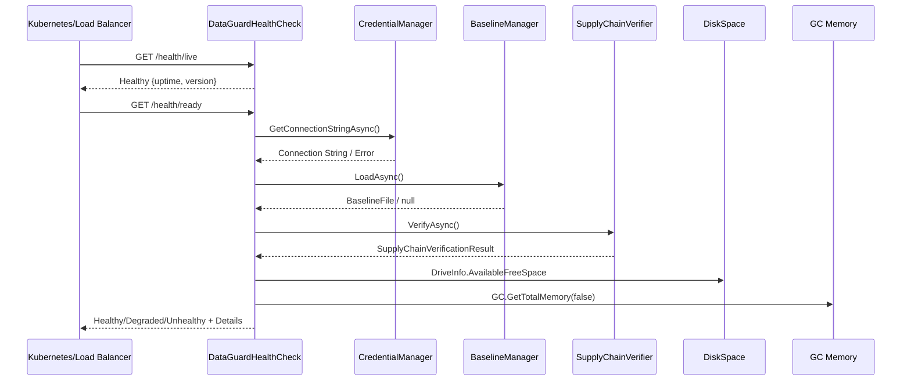

---

## Tương Tác CI/CD / CI/CD Interactions

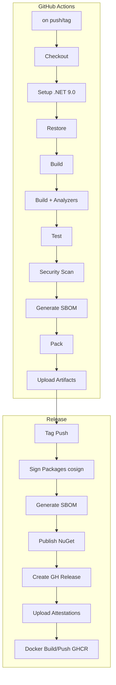

---

## Tóm Tắt Ma Trận / Interaction Summary Matrix

| Layer / Lớp | Components / Thành Phần | Primary Interactions / Tương Tác Chính |
|------|------|------|
| **CLI** | `DataGuard.Cli`, `PreCommitHookInstaller` | → Pipeline, HookInstaller, Config, Hooks |
| **Core Pipeline** | `ValidationPipeline`, `RuleDependencyGraph`, `ConcurrentValidationEngine`, `DiagnosticEmitter` | ← CLI, CI, Analyzers → Sources, Rules, Baseline, Emitter, Security, Telemetry, Health, Plugins, AutoDetect |
| **Sources** | `EfModelSource`, `SqlServerStoredProcedureParser`, `RawSqlParser`, `OracleAdapter` | → Pipeline (Contracts), → DB (Queries), → AuditLogger |
| **Adapters** | `SqlServer.Adapter`, `Oracle.Adapter` | ← Sources, → DB, → AuditLogger |
| **Rules** | 6 Built-in + Dialect + Plugins | ← Engine (ValidateAsync) → Violations |
| **Engine** | `ConcurrentValidationEngine` | ← Pipeline (ValidateAllAsync) → Partitioner, Semaphore, Rules |
| **Baseline** | `BaselineManager v2` | ← Pipeline (FilterNewViolations, CreateBaseline) → File, Cache, Hash |
| **Emitter** | `DiagnosticEmitter`, `SarifSink`, `ConsoleSink`, `StreamingSarifSink` | ← Pipeline (EmitAsync) → SARIF/Console/Markdown |
| **Security** | `CredentialManager`, `ZeroTrustCredentialProvider`, `FileAuditLogger`, `SupplyChainVerifier` | ← Pipeline, CredMgr, ZTProvider → Vault, Audit, Assembly, File |
| **Infrastructure** | `TelemetryCollector`, `HealthChecks`, `RulePluginManager`, `AutoDetectionEngine` | ← Pipeline → Meter, HealthChecks, MEF, FileSystem, Roslyn |
| **Analyzers** | `UnvalidatedSqlCallGenerator`, `ContractValidationAnalyzer`, `CodeFixProviders` | ↔ IDE (Syntax, Semantic, CodeFixes), ↔ Fixes |
| **CI/CD** | `ci.yml`, `release.yml` | GitHub Actions → .NET, Cosign, SBOM, NuGet, Docker, GHCR |

---

## Tóm Tắt Tương Tác Quan Trọng / Key Interaction Summary

| Interaction | Pattern / Mô Hình | Performance / Hiệu Năng | Reliability / Độ Tin Cậy |
|------|--------|------------|-----------|
| Pipeline → Sources | Async Parallel | O(sources) | Retry logic in sources |
| Engine → Rules | Parallel + Semaphore | O(contracts * rules / cores) | CancellationToken support |
| Pipeline → Baseline | Sync + Async | O(violations) lookup | Atomic write, memory-mapped |
| Pipeline → Emitter | Sequential Sinks | O(violations) serialize | All sinks must succeed |
| Pipeline → Security | Async Priority Chain | O(1) env var, O(net) vault | Fallback chain, audit log |
| Analyzers → IDE | Incremental Generator | O(changed files) | Roslyn incremental |
| CI → Pipeline | Sequential Jobs | ~5-10 min total | Retry on transient failures |
| Release → NuGet | Signed + Attested | ~2 min | Sigstore keyless, SBOM |

---

*Generated from DataGuard source code. Last updated: 2025-01-19*