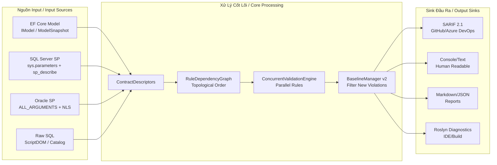
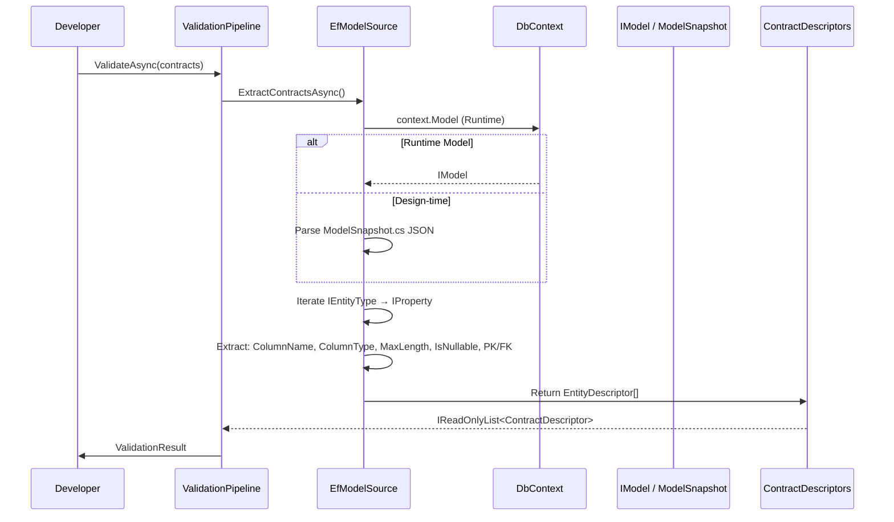
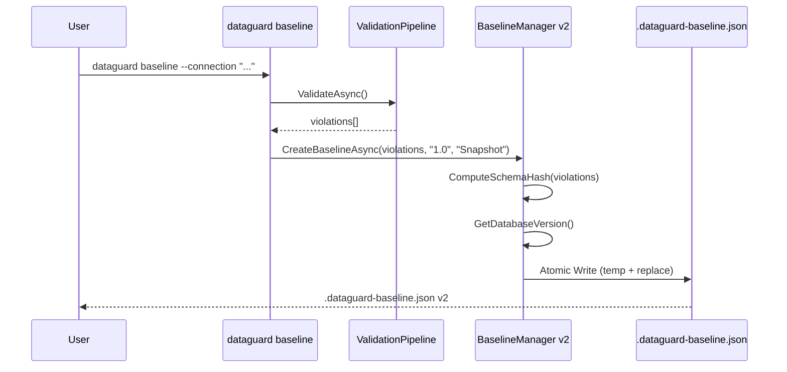
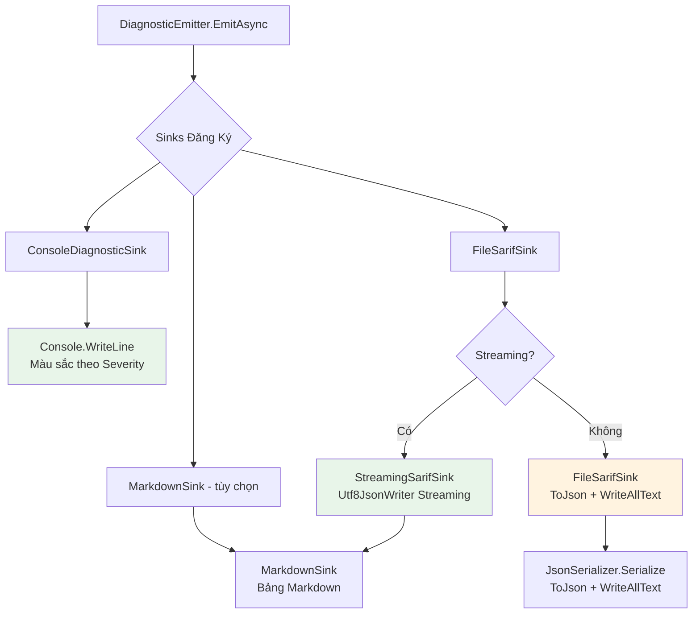
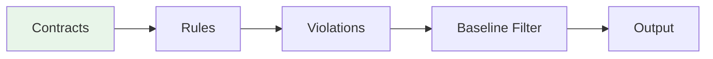
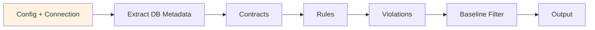
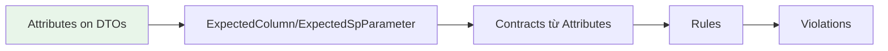

# Luồng Dữ Liệu DataGuard / DataGuard Data Flow / Luồng Dữ Liệu DataGuard

## Tổng Quan Luồng Dữ Liệu / Data Flow Overview / Tổng Quan Luồng Dữ Liệu



---

## Chi Tiết Luồng Dữ Liệu / Detailed Data Flow / Chi Tiết Luồng Dữ Liệu

### 1. Trích Xuất EF Core Model / EF Core Model Extraction



**Nguồn Dữ Liệu / Data Sources**:
| Nguồn / Source | Phương Pháp / Method | Trích Xuất / Extracted |
|----------|-------------|--------------|
| Runtime IModel | `DbContext.Model` | Real-time, reflects current state / Thời gian thực, phản ánh trạng thái hiện tại |
| ModelSnapshot.cs | Parse JSON | Design-time, stable / Thiết kế, ổn định |
| IDesignTimeServices | EF Core DI | Build-time, no runtime / Build-time, không cần runtime |

**Trường Trích Xuất / Extracted Fields**:
```csharp
EntityDescriptor {
    Id, Name, ClrTypeName, TableName,
    Properties: PropertyDescriptor[] {
        Name, ClrTypeName, ColumnName, ColumnType,
        IsNullable, MaxLength, IsPrimaryKey, IsForeignKey,
        Annotations
    }
}
```

---

### 2. Trích Xuất Stored Procedure SQL Server

```mermaid
sequenceDiagram
    participant Pipeline
    participant Parser as SqlServerStoredProcedureParser
    participant DB as SQL Server
    participant Contracts as ContractDescriptors

    Pipeline->>Parser: ExtractContractsAsync()
    Parser->>DB: SELECT FROM sys.procedures (non-ms-shipped)
    DB-->>Parser: procedure_id, name, schema
    loop Mỗi Procedure
        Parser->>DB: SELECT FROM sys.parameters JOIN sys.types
        DB-->>Parser: name, type, max_length, precision, scale, nullable, position, is_output
        Parser->>DB: EXEC sp_describe_first_result_set
        DB-->>Parser: column_ordinal, is_nullable, system_type_name, max_length, precision, scale
    end
    Parser->>Contracts: StoredProcedureDescriptor[]
    Contracts-->>Pipeline
```

**Truy Vấn Tham Số / Parameter Query**:
```sql
SELECT p.name, t.name AS DataType, p.max_length, p.precision, p.scale,
       p.is_nullable, p.parameter_id, p.is_output
FROM sys.parameters p
JOIN sys.types t ON p.user_type_id = t.user_type_id
WHERE p.object_id = @ObjectId
ORDER BY p.parameter_id
```

**Mô Tả Kết Quả / Result Set Description**:
```sql
EXEC sp_describe_first_result_set N'schema.proc', NULL, 1
-- Returns: column_ordinal, is_nullable, system_type_name, max_length, precision, scale
```

---

### 3. Trích Xuất Stored Procedure Oracle

```mermaid
sequenceDiagram
    participant Pipeline
    participant Reader as AllArgumentsReader
    participant DB as Oracle DB
    participant Contracts as ContractDescriptors

    Pipeline->>Reader: GetParametersAsync(owner, package, proc)
    Reader->>DB: SELECT FROM all_arguments
    Note right of Reader: INCLUDES sequence + overload<br/>cho overloaded procedures
    DB-->>Reader: argument_name, in_out, data_type,<br/>data_length, precision, scale, position,<br/>sequence, overload, type_owner, type_name
    Reader->>Contracts: ParameterDescriptor[] (có overload info)
    Contracts-->>Pipeline
```

**Truy Vấn ALL_ARGUMENTS / ALL_ARGUMENTS Query**:
```sql
SELECT argument_name, in_out, data_type, data_length,
       data_precision, data_scale, position,
       sequence, overload, type_owner, type_name, type_subname
FROM all_arguments
WHERE owner = :owner
  AND package_name = :packageName
  AND object_name = :procedureName
ORDER BY sequence, position
```

**Xử Lý Overload / Overload Handling**:
```csharp
// Key = package.procedure(sequence:overload)
var signatureKey = $"{package}.{procedure}({sequence}:{overload})";
```

**ALL_TAB_COLUMNS (Length Mismatch)**:
```sql
SELECT column_name, data_type, data_length, char_length,
       data_precision, data_scale, nullable, char_used  -- 'B'=BYTE, 'C'=CHAR
FROM all_tab_columns
WHERE owner = :owner AND table_name = :tableName
ORDER BY column_id
```

**NLS_LENGTH_SEMANTICS**:
```sql
SELECT value FROM nls_session_parameters
WHERE parameter = 'NLS_LENGTH_SEMANTICS'
-- Returns: 'BYTE' or 'CHAR'
```

---

### 4. Parser Raw SQL

```mermaid
sequenceDiagram
    participant Pipeline
    participant Parser as RawSqlParser
    participant DOM as ScriptDOM
    participant Contracts as ContractDescriptors

    Pipeline->>Parser: ExtractContractsAsync()
    Parser->>DOM: TSql160Parser.Parse(sqlText)
    DOM-->>Parser: TSqlFragment + ParseErrors
    Parser->>Parser: SqlParameterVisitor.Visit(ProcedureParameter)
    Parser->>Contracts: RawSqlDescriptor
    Contracts-->>Pipeline
```

**Visitor Pattern cho Tham Số / Parameter Visitor**:
```csharp
internal class SqlParameterVisitor : TSqlFragmentVisitor {
    public List<SqlParameterInfo> Parameters { get; } = new();
    
    public override void Visit(ProcedureParameter parameter) {
        var dataTypeName = parameter.DataType?.Name?.Value ?? "unknown";
        var maxLength = ExtractMaxLength(parameter.DataType);
        var precision = ExtractPrecision(parameter.DataType);
        var scale = ExtractScale(parameter.DataType);
        
        Parameters.Add(new SqlParameterInfo(
            parameter.VariableName.Value,
            dataTypeName, maxLength, precision, scale,
            Parameters.Count + 1
        ));
        base.Visit(parameter);
    }
}
```

**Trích Xuất Độ Dài / Length Extraction từ ScriptDOM**:
```csharp
// ScriptDOM lưu độ dài trong Parameters collection
if (parameter.DataType is SqlDataTypeReference sqlDataType) {
    var literals = sqlDataType.Parameters; // Literal[]
    if (literals.Count > 0 && literals[0] is IntegerLiteral maxLenLit) {
        maxLength = int.Parse(maxLenLit.Value);
    }
    if (literals.Count > 1 && literals[1] is IntegerLiteral precLit) {
        precision = byte.Parse(precLit.Value);
    }
}
```

---

### 5. Xử Lý Quy Tắc / Rule Processing

```mermaid
graph TD
    A[Contracts: IReadOnlyList<ContractDescriptor>] --> B[RuleDependencyGraph]
    B --> C[GetExecutionOrder<br/>Topological Sort]
    C --> D[ConcurrentValidationEngine]
    D --> E[Partitioner.Create<br/>Chunk Size = N/(cores*4)]
    E --> F[Parallel.ForEachAsync<br/>SemaphoreSlim(maxParallelism)]
    F --> G[Rule.ValidateAsync<br/>Từng Contract]
    G --> H[ContractViolation[]]
    H --> I[ConcurrentQueue<ContractViolation>]
    I --> J[BaselineManager.FilterNewViolations]
    J --> K[DiagnosticEmitter.EmitAsync]
    K --> L[SARIF / Console / Markdown]
```

**Thứ Tự Thực Thi / Execution Order** (Topological):
```mermaid
graph TD
    L1[ParameterCountRule]
    L2[ParameterTypeMatchRule]
    L3[ParameterDirectionRule] --> L1
    L4[ColumnShapeMatchRule] --> L1
    L5[NullableMismatchRule] --> L2
    L6[NamingConventionRule] --> L1, L4
    L7[LengthExceedsColumnRule] --> L2, L4
    L8[ByteLengthOverflowRiskRule] --> L7
    L9[InferredSizeFallbackRule] --> L2
    L10[OracleSyntaxInNonOracleRule]
    L11[NonOracleFunctionInOracleRule]
    L12[ProviderOptionMismatchRule]
    L13[SqlServerSyntaxLeakRule]
    L14[RawSqlUnmappedTypeUsageRule]

    classDef l1 fill:#e3f2fd;
    classDef l2 fill:#e8f5e9;
    classDef l2 fill:#fff3e0;
    classDef l3 fill:#fce4ec;
    classDef l4 fill:#f3e5f5;
    classDef l5 fill:#e0e0e0;

    class L1,L2 level1;
    class L3,L4 level2;
    class L5,L6 level3;
    class L7,L9 level4;
    class L8 level5;
    class L10,L11,L12,L13,L14 level6;
```

**Nhóm Song Song / Parallel Groups** (Có thể chạy cùng lúc):
```
Group 1: [ParameterCountRule, ParameterTypeMatchRule]
Group 2: [ParameterDirectionRule, ColumnShapeMatchRule]
Group 3: [NullableMismatchRule, NamingConventionRule]
Group 4: [LengthExceedsColumnRule, InferredSizeFallbackRule]
Group 5: [ByteLengthOverflowRiskRule]
Group 6: [Dialect Rules - independent]
```

---

### 6. Quản Lý Baseline / Baseline Management



**Cấu Trúc Baseline v2 / Baseline v2 Structure**:
```json
{
  "Version": 2,
  "CreatedAt": "2025-01-19T10:30:00Z",
  "SchemaVersion": "1.0",
  "GroundTruthMode": "Snapshot",
  "DatabaseVersion": "Oracle Database 19c Enterprise Edition Release 19.0.0.0.0",
  "SchemaHash": "a1b2c3d4e5f67890",
  "Violations": [
    {
      "RuleId": "DG007",
      "Message": "Entity 'Customer.Name' MaxLength=200 exceeds column 'NAME' length=100",
      "Severity": "Error",
      "Location": {"FilePath": "Entities/Customer.cs", "StartLine": 15},
      "Properties": {"entityMaxLength": 200, "columnLength": 100}
    }
  ]
}
```

**Kiểm Tra Mismatch Phiên Bản / Version Mismatch Check**:
```csharp
// Chỉ so sánh major.minor
var baselineMajorMinor = ExtractMajorMinor(baseline.DatabaseVersion); // "19.0"
var currentMajorMinor = ExtractMajorMinor(current.DatabaseVersion);   // "21.0"
if (baselineMajorMinor != currentMajorMinor) {
    // WARNING: Phiên bản DB khác biệt - có thể false positive/negative
}
```

**Kiểm Tra Schema Hash / Schema Hash Check**:
```csharp
var currentHash = ComputeSchemaHash(currentViolations);
if (baseline.SchemaHash != currentHash) {
    // WARNING: Schema đã drift kể từ baseline
    // Gợi ý: chạy 'dataguard snapshot refresh'
}
```

---

### 6. Phát Sinh Output / Output Emission



**Ví Dụ Output Console / Console Output Example**:
```
🔍 DataGuard Validation Results
=====================================
❌ DG007 [Error] Entity 'Customer.Name' MaxLength=200 exceeds column 'FULL_NAME' length=100 (File: Entities/Customer.cs:15)
⚠️ DG008 [Warning] Byte overflow risk: 'FullName' may exceed 100 bytes in BYTE semantics
⚠️ DG009 [Warning] EF Core will infer NVARCHAR2(2000) for 'Description' - may cause ORA-12899

Summary: 26 contracts validated, 3 violations (1 error, 2 warnings)
❌ Validation FAILED - CI gate will block
```

**Ví Dụ SARIF / SARIF Example**:
```json
{
  "version": "2.1.0",
  "$schema": "https://schemastore.org/schemas/json/sarif-2.1.0.json",
  "runs": [{
    "tool": {
      "driver": {
        "name": "DataGuard",
        "version": "1.0.0",
        "informationUri": "https://github.com/DataGuard/DataGuard",
        "rules": [{"id": "DG007", "name": "Entity Length Exceeds Column Length"}]
      }
    },
    "results": [{
      "ruleId": "DG007",
      "message": {"text": "Entity 'Customer.Name' MaxLength=200 exceeds column 'FULL_NAME' length=100"},
      "level": "error",
      "locations": [{
        "physicalLocation": {
          "artifactLocation": {"uri": "Entities/Customer.cs", "uriBaseId": "%SRCROOT%"},
          "region": {"startLine": 15, "startColumn": 10, "endLine": 15, "endColumn": 25}
        }
      }],
      "properties": {"entityMaxLength": 200, "columnLength": 100}
    }]
  }]
}
```

---

## Tóm Tắt Luồng Dữ Liệu / Data Flow Summary Table / Bảng Tóm Tắt Luồng Dữ Liệu

| Stage / Giai Đoạn | Input / Đầu Vào | Processing / Xử Lý | Output / Đầu Ra | Parallel / Song Song |
|----------|-------------|-------------|----------|----------|
| **1. Trích Xuất** | EF Model, SP, Raw SQL | Trích xuất metadata | ContractDescriptors[] | Theo nguồn (EF/SP/Raw) |
| **2. Đồ Thị Quy Tắc** | Rules + Dependencies | Topological Sort (Kahn) | Execution Order[] | Không (graph nhỏ) |
| **3. Xác Thực** | Contracts + Rules | Parallel Validation | Violations[] | ✅ Partitioner + Semaphore |
| **4. Baseline** | Violations + Baseline | Filter New + Hash Compare | New Violations[] | O(N) lookup |
| **5. Phát Sinh** | Filtered Violations | Serialize SARIF/Console/MD | Files/Console | Sequential |

---

## Biến Thể Luồng Dữ Liệu / Data Flow Variants

### Chế Độ Offline / Offline Mode

- Không kết nối DB / No DB connection
- Sử dụng baseline/snapshot đã commit / Uses committed baseline/snapshot
- Dưới 1 giây / Sub-second

### Chế Độ Full / Full Mode

- Kết nối DB thật / Live DB connection
- Tự động refresh snapshot / Auto-refresh snapshot
- Phút / Minutes

### Chế Độ Manual / Manual Mode

- Zero DB / Không cần DB
- Developer khai báo schema mong đợi / Developer declares expected schema
- Phù hợp môi trường bảo mật cao / Suitable for high-security env

---

## Tóm Tắt Ma Trận Luồng Dữ Liệu / Data Flow Matrix Summary

| Stage | Input | Processing | Output | Parallel | Latency Target |
|----------|-------|------------|--------|----------|----------------|
| Extract | EF/SP/Raw SQL | Metadata extraction | ContractDescriptors | Per source | < 500ms |
| Graph | Rules + Deps | Kahn's Algorithm | Execution Order | No (small graph) | < 10ms |
| Validate | Contracts + Rules | Parallel Validation | Violations | ✅ Yes | < 5s (typical) |
| Baseline | Violations + File | Filter + Hash | New Violations | O(N) lookup | < 100ms |
| Emit | Filtered Violations | Serialize SARIF/Console | Files/Console | Sequential | < 500ms |

---

*Generated from DataGuard source code. Last updated: 2025-01-19*