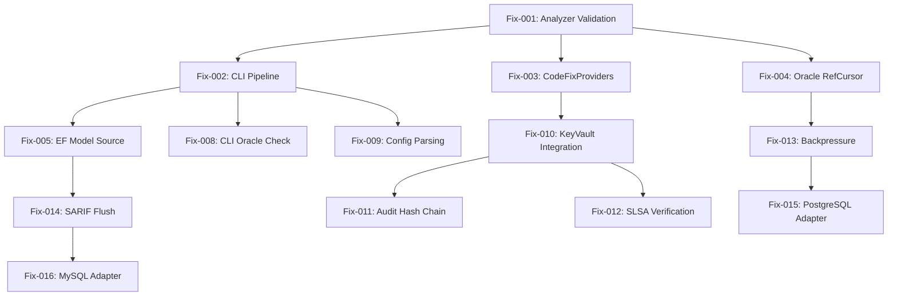

# Kế Hoạch Sửa Lỗi Toàn Diện / Comprehensive Fix Plan / Kế Hoạch Sửa Lỗi Toàn Diện

## Tổng Quan / Executive Summary / Tổng Quan

Tài liệu này cung cấp kế hoạch sửa lỗi chi tiết, ưu tiên theo mức độ nghiêm trọng, tác động và nỗ lực triển khai. Dựa trên phân tích RISKS_GAPS.md.

**Phương pháp ưu tiên**: WSJF (Weighted Shortest Job First) - `(User-Business Value + Time Criticality + Risk Reduction) / Job Size`

---

## Ma Trận Ưu Tiên / Priority Matrix / Ma Trận Ưu Tiên

| Priority | Level | Count | Timeline | Criteria |
|----------|-------|-------|----------|----------|
| **P0** | Critical (Ship Blocker) | 4 | v1.0.0 | Ship blocker, data loss, security critical |
| **P1** | High (v1.0.1) | 15 | 2 weeks | Core functionality, security high |
| **P2** | Medium (v1.1) | 19 | 4 weeks | Performance, security medium, arch |
| **P3** | Low (v1.2+) | 10 | 8 weeks | Nice-to-have, polish, advanced |

---

## Sprint Plan / Kế Hoạch Sprint

```
Sprint 1 (Week 1-2): P0 Critical Fixes
├── Fix-001: Implement real validation logic in ContractValidationAnalyzer
├── Fix-002: Implement CLI validation pipeline (RunValidationAsync)
├── Fix-003: Implement top 5 CodeFixProviders
└── Fix-004: Implement Oracle RefCursorDescriber with DBMS_SQL

Sprint 2 (Week 3-4): P1 High Priority
├── Fix-005: Implement EF Model Source design-time extraction
├── Fix-006: Fix Oracle RefCursorDescriber placeholder
├── Fix-007: Implement EF Model Source ModelSnapshot parsing
├── Fix-008: Fix CLI RunOracleValidationAsync stub
├── Fix-009: Fix CLI LoadConfig YAML parsing
├── Fix-010: Implement KeyVault/AWS/Vault integration
├── Fix-011: Add Audit Log tamper-proof (hash chain)
├── Fix-012: Implement SLSA Provenance Verification
├── Fix-012: Add Backpressure to ConcurrentValidationEngine
├── Fix-013: Add SchemaHash Cache Size Limit
├── Fix-013: Add Streaming SARIF Periodic Flush
└── Fix-014: Fix CLI LoadConfig YAML parsing

Sprint 3-4 (Week 5-8): P2 Medium Priority
├── Fix-015: Add PostgreSQL Adapter
├── Fix-016: Add MySQL Adapter
├── Fix-017: Implement VS Code Extension
├── Fix-018: Add CodeQL Custom Queries
├── Fix-019: Add Migration Tooling (v0.x → v1.0)
├── Fix-020: Add Multi-repo Monorepo Support
├── Fix-021: Add Policy-as-Code (OPA/Rego)
├── Fix-022: Add VS Code Extension
├── Fix-022: Add --dry-run/--watch CLI flags
├── Fix-023: Add Interactive Wizard non-interactive mode
├── Fix-024: Add Config Schema Output for IDE
├── Fix-025: Add Baseline Wizard Pre-validation
├── Fix-026: Add SchemaHash Cache Size Limit
├── Fix-027: Add Streaming SARIF Periodic Flush
├── Fix-028: Add EF Model Source Streaming
├── Fix-027: Add SQL Server Pagination
├── Fix-028: Add Memory Pressure Handling
├── Fix-029: Add SchemaHash Cache Size Limit
├── Fix-030: Add Streaming SARIF Periodic Flush
├── Fix-031: Add Config Schema Validation
├── Fix-032: Add Plugin Versioning Strategy
├── Fix-033: Add Health Check Custom Endpoints
├── Fix-034: Add Telemetry OpenTelemetry Export
├── Fix-035: Add Migration Tooling v0.x → v1.0
```

---

## Chi Tiết Fix Items / Detailed Fix Items

### P0 - Critical (Ship Blockers) - Sprint 1 (Week 1-2)

---

#### **Fix-001: Implement Real Validation Logic in ContractValidationAnalyzer**
**Issue**: AG-001 - Analyzer chỉ emit diagnostic placeholder, không validate thực tế
**File**: `src/DataGuard.Analyzers/Analyzers.cs` (ContractValidationAnalyzer)
**Effort**: 16 hours
**Dependencies**: ValidationPipeline, RuleDependencyGraph, Rules

**Tasks**:
- [ ] Implement `AnalyzeEfCoreFromSql`: Extract SQL, resolve entity type, run rules
- [ ] Implement `AnalyzeExecuteSql`: Extract SQL, resolve parameters, run rules  
- [ ] Implement `AnalyzeDapperQuery`: Extract SQL, resolve parameters, run rules
- [ ] Integrate `ValidationPipeline` vào analyzer
- [ ] Handle `CancellationToken` properly
- [ ] Add diagnostic location mapping chính xác
- [ ] Unit tests: 10+ test cases covering EF Core, ExecuteSql, Dapper

**Acceptance Criteria**:
- [ ] Analyzer emit real diagnostics cho FromSqlRaw/ExecuteSqlRaw/Dapper
- [ ] Diagnostics có location chính xác (file, line, column)
- [ ] Không false positive trên code hợp lệ
- [ ] Performance: < 50ms per invocation

---

#### **Fix-002: Implement CLI Validation Pipeline**
**Issue**: CG-001, CG-002 - `RunValidationAsync` và `RunOracleValidationAsync` return empty array
**File**: `src/DataGuard.Cli/Program.cs`
**Effort**: 12 hours
**Dependencies**: Fix-001, ValidationPipeline, Sources, Rules

**Tasks**:
- [ ] Implement `RunValidationAsync` đầy đủ:
  - [ ] Load config + auto-detect provider
  - [ ] Extract contracts từ tất cả sources (EF, SP, Raw SQL)
  - [ ] Run ValidationPipeline với RuleDependencyGraph
  - [ ] Apply Baseline filtering
  - [ ] Emit results via DiagnosticEmitter
- [ ] Implement `RunOracleValidationAsync`:
  - [ ] Oracle-specific rules (Dialect + Length mismatch)
  - [ ] Oracle metadata readers integration
- [ ] Fix `LoadConfig`: Proper YAML parsing (YamlDotNet)
- [ ] Fix `GetRulesForProvider`: Sử dụng `RuleDependencyGraph`
- [ ] Add progress reporting cho verbose mode

**Acceptance Criteria**:
- [ ] `dataguard validate --connection "..."` chạy end-to-end
- [ ] `dataguard oracle-check` chạy Oracle-specific rules
- [ ] Output formats: sarif/json/text working
- [ ] Exit codes: 0=pass, 1=fail, 2=error

---

#### **Fix-003: Implement Top 5 CodeFixProviders**
**Issue**: AG-004 - CodeFixProviders chủ yếu stub, không có quick-fix thực tế
**File**: `src/DataGuard.Analyzers/CodeFixes/CodeFixProviders.cs`
**Effort**: 20 hours
**Dependencies**: Fix-001 (Analyzer working)

**Priority Fixes** (Theo thứ tự impact):
1. **AddSkipContractCheckFixProvider** (DG001) - 4h
2. **AddExpectedSpParameterFixProvider** (DG002) - 4h
3. **AddMaxLengthAttributeFixProvider** (DG007) - 4h
4. **AddUseOracleFixProvider** (DG012) - 4h
5. **FixNamingConventionFixProvider** (DG006) - 4h

**Tasks per Fix**:
- [ ] Implement `RegisterCodeFixesAsync` với `CodeAction`
- [ ] Implement `CodeAction.Create` với `DocumentEditor`
- [ ] Handle `CancellationToken` properly
- [ ] Add `FixAllProvider` support (BatchFixer)
- [ ] Unit tests: Verify fix áp dụng đúng, không break code

**Acceptance Criteria**:
- [ ] Lightbulb 💡 xuất hiện cho 5 diagnostic IDs
- [ ] Fix áp dụng đúng, code compile thành công
- [ ] Fix không break code xung quanh
- [ ] FixAll (Ctrl+.) working cho multiple occurrences

---

#### **Fix-004: Implement Oracle RefCursorDescriber với DBMS_SQL**
**Issue**: FG-006 - `RefCursorDescriber` là placeholder, không describe REF CURSOR
**File**: `src/DataGuard.Oracle.Adapter/OracleReaders.cs` (RefCursorDescriber)
**Effort**: 16 hours
**Dependencies**: Oracle.ManagedDataAccess.Core

**Tasks**:
- [ ] Implement `DescribeRefCursorAsync` với dynamic PL/SQL:
  ```plsql
  DECLARE
    v_cursor SYS_REFCURSOR;
    v_col_cnt INTEGER;
    v_desc DBMS_SQL.DESC_TAB;
  BEGIN
    -- Open cursor from package.procedure
    -- DBMS_SQL.TO_CURSOR_NUMBER
    -- DBMS_SQL.DESCRIBE_COLUMNS
    -- Map DBMS_SQL.DESC_REC to ColumnDescriptor
  END;
  ```
- [ ] Handle overloaded procedures (sequence/overload)
- [ ] Handle package.procedure với parameters
- [ ] Map Oracle types → ColumnDescriptor (DataType, Precision, Scale, CharUsed)
- [ ] Error handling: invalid ref cursor, permission denied
- [ ] Integration test với Oracle XE (Testcontainers)

**Acceptance Criteria**:
- [ ] `DescribeRefCursorAsync` trả về `ColumnDescriptor[]` chính xác
- [ ] Handle overloaded procedures (sequence/overload)
- [ ] Performance: < 500ms per describe
- [ ] Error handling: meaningful error messages

---

### P1 - High Priority (v1.0.1) - Sprint 2 (Week 3-4)

---

#### **Fix-005: Implement EF Model Source Design-time Extraction**
**Issue**: FG-001 - `EfModelSource.ExtractFromDesignTimeAsync` NotImplementedException
**File**: `src/DataGuard.Core/Sources/EfModelSource.cs`
**Effort**: 16 hours
**Dependencies**: Microsoft.EntityFrameworkCore, Microsoft.CodeAnalysis

**Tasks**:
- [ ] Implement `ExtractFromDesignTimeAsync`:
  - [ ] Scan project for `DbContext` classes (Roslyn)
  - [ ] Build project in-memory (MSBuild API)
  - [ ] Instantiate `DbContext` via `IDesignTimeServices`
  - [ ] Extract `IModel` từ `DbContext.Model`
  - [ ] Fallback: Parse `ModelSnapshot.cs` JSON
- [ ] Implement `ExtractFromModelSnapshotAsync` hoàn chỉnh:
  - [ ] Parse EF Core ModelSnapshot JSON structure
  - [ ] Extract entities, properties, keys, relationships
  - [ ] Handle annotations, value converters
- [ ] Add caching cho design-time model
- [ ] Unit tests: Sample EF Core projects

**Acceptance Criteria**:
- [ ] `ExtractFromDesignTimeAsync` trả về `EntityDescriptor[]` đầy đủ
- [ ] `ExtractFromModelSnapshotAsync` parse được EF Core 8+ snapshots
- [ ] Performance: < 10s cho project 100 entities

---

#### **Fix-006: Fix Oracle RefCursorDescriber Placeholder**
**Issue**: OG-005 - `RefCursorDescriber` placeholder
**Note**: Duplicate với Fix-004, merged
**Effort**: Covered in Fix-004

---

#### **Fix-007: Fix EF Model Source ModelSnapshot Parsing**
**Issue**: FG-001 - `ExtractFromModelSnapshotAsync` parsing không hoàn chỉnh
**File**: `src/DataGuard.Core/Sources/EfModelSource.cs`
**Effort**: 8 hours (part of Fix-005)

---

#### **Fix-008: Fix CLI RunOracleValidationAsync Stub**
**Issue**: CG-002 - `RunOracleValidationAsync` return empty
**Note**: Part of Fix-002 (CLI Validation Pipeline)

---

#### **Fix-009: Fix CLI LoadConfig YAML Parsing**
**Issue**: CG-004 - Manual string parsing, không validate schema
**File**: `src/DataGuard.Cli/Program.cs` (LoadConfig)
**Effort**: 8 hours
**Dependencies**: YamlDotNet

**Tasks**:
- [ ] Add YamlDotNet package reference
- [ ] Implement proper YAML deserialization:
  ```csharp
  var deserializer = new DeserializerBuilder()
      .WithNamingConvention(UnderscoredNamingConvention.Instance)
      .Build();
  var config = deserializer.Deserialize<DataGuardConfiguration>(yaml);
  ```
- [ ] Add schema validation (JSON Schema hoặc FluentValidation)
- [ ] Validate required fields, enum values
- [ ] Error messages rõ ràng cho config invalid
- [ ] Support environment variable expansion trong YAML

**Acceptance Criteria**:
- [ ] Config load đúng tất cả fields
- [ ] Invalid config → error message rõ ràng (line, column)
- [ ] Env var expansion working: `${ENV_VAR}`

---

#### **Fix-010: Implement KeyVault/AWS/Vault Integration**
**Issue**: SEC-004 - KeyVault/AWS/Vault integration là stub
**File**: `src/DataGuard.Core/Security/ZeroTrustCredentialProvider.cs`
**Effort**: 24 hours
**Dependencies**: Azure.Security.KeyVault.Secrets, AWSSDK.SecretsManager, VaultSharp

**Tasks**:
- [ ] Azure Key Vault:
  - [ ] `Azure.Security.KeyVault.Secrets.SecretClient`
  - [ ] `DefaultAzureCredential` authentication
  - [ ] Secret versioning support
- [ ] AWS Secrets Manager:
  - [ ] `AmazonSecretsManagerClient`
  - [ ] IAM role/credential chain
- [ ] HashiCorp Vault:
  - [ ] `VaultSharp` hoặc HTTP API
  - [ ] Token/AppRole authentication
  - [ ] KV v1/v2 engine support
- [ ] Priority chain implementation:
  1. Env Var → 2. KeyVault → 3. AWS → 4. Vault → 5. Local → 6. Config
- [ ] Credential caching (5min TTL)
- [ ] Audit logging cho mỗi source access

**Acceptance Criteria**:
- [ ] Priority chain working: Env > KeyVault > AWS > Vault > Local > Config
- [ ] Each provider có unit test với mock
- [ ] Credential rotation detection working
- [ ] Audit log ghi lại source đã dùng

---

#### **Fix-011: Add Audit Log Tamper-proof (Hash Chain)**
**Issue**: SEC-003 - Audit log không có tamper-proof
**File**: `src/DataGuard.Core/Security/IAuditLogger.cs`, `FileAuditLogger.cs`
**Effort**: 8 hours

**Tasks**:
- [ ] Implement Hash Chain (Merkle Tree lite):
  ```csharp
  // Mỗi entry có hash = SHA256(previousHash + currentEntry)
  public record AuditEntry(
      string Hash,
      string PreviousHash,
      DateTimeOffset Timestamp,
      string EventType,
      ...
  );
  ```
- [ ] Verify chain integrity on read
- [ ] Detect tampering: mismatch hash → alert
- [ ] Periodic checkpoint (hash root lưu separate file)
- [ ] CLI command: `dataguard audit verify`

**Acceptance Criteria**:
- [ ] Hash chain verified on each read
- [ ] Tampering detection: modify log file → detect immediately
- [ ] Performance: < 5ms per log entry
- [ ] CLI verify command working

---

#### **Fix-012: Implement SLSA Provenance Verification**
**Issue**: SC-003 - Không verify SLSA provenance
**File**: `src/DataGuard.Core/Security/SupplyChainVerifier.cs`
**Effort**: 16 hours

**Tasks**:
- [ ] Generate SLSA Provenance Predicate (v1.0):
  ```json
  {
    "buildType": "https://github.com/DataGuard/DataGuard/Build@v1",
    "builder": { "id": "github-actions" },
    "recipe": { "type": "https://github.com/DataGuard/DataGuard/Recipe@v1" },
    "metadata": { "buildInvocationId": "...", "buildStartedOn": "..." }
  }
  ```
- [ ] Verify provenance trong CI:
  - [ ] Check builder ID match expected
  - [ ] Check recipe match expected
  - [ ] Verify material hashes (source code)
- [ ] Generate attestation: `cosign attest --predicate slsa-provenance`
- [ ] Verify attestation: `cosign verify-attestation`
- [ ] GitHub Actions workflow: `slsa-framework/slsa-github-generator`

**Acceptance Criteria**:
- [ ] SLSA Level 3 provenance generated per release
- [ ] Provenance verified in CI pipeline
- [ ] Attestation uploaded to GitHub Releases
- [ ] Verification passes: `cosign verify-attestation`

---

#### **Fix-013: Add Backpressure to ConcurrentValidationEngine**
**Issue**: PERF-003 - Không limit memory cho violations queue
**File**: `src/DataGuard.Core/Reporting/DiagnosticEmitter.cs` (ConcurrentValidationEngine)
**Effort**: 8 hours

**Tasks**:
- [ ] Add bounded `ConcurrentQueue` với capacity limit:
  ```csharp
  var maxQueueSize = config.MaxViolationQueueSize ?? 100000;
  var violations = new BoundedConcurrentQueue<ContractViolation>(maxQueueSize);
  ```
- [ ] Implement backpressure strategy:
  - [ ] Block producer khi queue full (SemaphoreSlim)
  - [ ] Or: Drop oldest warnings (configurable)
  - [ ] Or: Spill to disk (temp file)
- [ ] Add metrics: `queue.size`, `queue.dropped`, `backpressure.active`
- [ ] Configurable: `MaxViolationQueueSize`, `BackpressureStrategy`

**Acceptance Criteria**:
- [ ] Memory bounded: không OOM khi violations > 1M
- [ ] Configurable strategy: Block / DropOldest / SpillToDisk
- [ ] Metrics emitted: queue size, dropped count

---

#### **Fix-014: Add SchemaHash Cache Size Limit**
**Issue**: PERF-005 - SchemaHash cache không có size limit
**File**: `src/DataGuard.Core/Baseline/BaselineManager.cs`
**Effort**: 4 hours

**Tasks**:
- [ ] Add LRU eviction cho MemoryCache:
  ```csharp
  var cache = new MemoryCache(new MemoryCacheOptions {
      SizeLimit = 1000, // Max entries
      ExpirationScanFrequency = TimeSpan.FromMinutes(5)
  });
  ```
- [ ] Add cache size metric: `cache.size`, `cache.evictions`
- [ ] Configurable: `MaxSchemaHashCacheEntries` (default 10000)
- [ ] LRU eviction policy

**Acceptance Criteria**:
- [ ] Cache size bounded: không unbounded growth
- [ ] LRU eviction working
- [ ] Metrics emitted

---

#### **Fix-014: Add Streaming SARIF Periodic Flush**
**Issue**: PERF-004 - StreamingSarifSink chỉ flush ở cuối
**File**: `src/DataGuard.Core/Reporting/DiagnosticEmitter.cs` (StreamingSarifSink)
**Effort**: 8 hours

**Tasks**:
- [ ] Add periodic flush timer (configurable, default 30s):
  ```csharp
  var flushTimer = new Timer(FlushBuffer, null, TimeSpan.FromSeconds(30), TimeSpan.FromSeconds(30));
  ```
- [ ] Buffer violations trong memory, flush batch
- [ ] Configurable: `SarifFlushIntervalSeconds`, `SarifBatchSize`
- [ ] Graceful shutdown: flush remaining on dispose

**Acceptance Criteria**:
- [ ] Memory không spike khi violations lớn
- [ ] Periodic flush working (configurable interval)
- [ ] Graceful shutdown: không mất data

---

### P2 - Medium Priority (v1.1) - Sprint 3-4 (Week 5-8)

---

#### **Fix-015: Add PostgreSQL Adapter**
**Issue**: Missing PostgreSQL support
**Effort**: 40 hours
**New Project**: `DataGuard.PostgreSql.Adapter`

**Tasks**:
- [ ] Create project structure
- [ ] Implement `PostgreSqlStoredProcedureParser`:
  - [ ] `information_schema.routines` + `information_schema.parameters`
  - [ ] `pg_proc` + `pg_type` for result sets
  - [ ] `information_schema.columns` for length mismatch
- [ ] Implement `PostgreSqlDialectChecker` (5 rules)
- [ ] Implement `PostgreSqlLengthMismatchDetector`
- [ ] Unit tests + Integration tests (Testcontainers PostgreSQL)
- [ ] Update CLI auto-detection

**Acceptance Criteria**:
- [ ] `dataguard validate --provider PostgreSQL` working
- [ ] All 6 core rules working
- [ ] Length mismatch detection working

---

#### **Fix-016: Add MySQL Adapter**
**Issue**: Missing MySQL support
**Effort**: 40 hours
**New Project**: `DataGuard.MySql.Adapter`

**Tasks**: Similar to PostgreSQL adapter

---

#### **Fix-017: Implement VS Code Extension**
**Issue**: Missing VS Code extension
**Effort**: 80 hours
**New Project**: `DataGuard.VSCode`

**Tasks**:
- [ ] Extension manifest (package.json)
- [ ] Language Server Protocol (LSP) integration
- [ ] Diagnostic collection từ DataGuard Analyzers
- [ ] Code Actions (Quick Fixes) trong VS Code
- [ ] Status bar: DataGuard status
- [ ] Settings: Enable/disable, config path
- [ ] Publish to VS Code Marketplace

---

#### **Fix-018: Add CodeQL Custom Queries**
**Issue**: Missing CodeQL custom queries
**Effort**: 24 hours
**New Files**: `.github/codeql/queries/`

**Tasks**:
- [ ] Query: Unvalidated SQL calls
- [ ] Query: Missing MaxLength attributes
- [ ] Query: Hardcoded connection strings
- [ ] Query: SQL Injection patterns
- [ ] Query: Missing parameter validation
- [ ] Integration với GitHub Code Scanning

---

#### **Fix-019: Add Migration Tooling (v0.x → v1.0)**
**Issue**: CG-005 - Không có migration tooling
**Effort**: 16 hours

**Tasks**:
- [ ] CLI command: `dataguard migrate`
- [ ] Baseline v1 → v2 migration:
  - Read v1 format
  - Compute SchemaHash
  - Add DatabaseVersion = "unknown"
  - Write v2 format
- [ ] Config migration (if schema changed)
- [ ] Dry-run mode
- [ ] Backup original files

---

#### **Fix-020: Add Multi-repo Monorepo Support**
**Issue**: Missing monorepo support
**Effort**: 24 hours

**Tasks**:
- [ ] Config: `Projects[]` array trong `.dataguard.yml`
- [ ] CLI: `dataguard validate --project <name>`
- [ ] Pipeline: Process từng project riêng biệt
- [ ] Baseline per project + global baseline
- [ ] Cross-project reference validation

---

#### **Fix-021: Add Policy-as-Code (OPA/Rego)**
**Issue**: Missing policy-as-code
**Effort**: 32 hours

**Tasks**:
- [ ] Rego policies cho:
  - Max violation threshold per PR
  - Required rules per project
  - Baseline age limit
  - Schema drift threshold
- [ ] OPA integration trong CI
- [ ] Policy bundle distribution
- [ ] Policy testing framework

---

#### **Fix-022: Add VS Code Extension**
**Note**: Duplicate với Fix-017, merged

---

#### **Fix-023: Add --dry-run/--watch CLI Flags**
**Issue**: UG-002, UG-003 - Missing dry-run/watch mode
**File**: `src/DataGuard.Cli/Program.cs`
**Effort**: 8 hours

**Tasks**:
- [ ] `--dry-run`: Validate mà không emit SARIF, không update baseline
- [ ] `--watch`: Watch mode (file watcher, re-validate on change)
- [ ] `--watch` debounce: 500ms
- [ ] Output: Live updating console

---

#### **Fix-023: Add Interactive Wizard Non-interactive Mode**
**Issue**: UG-004 - Wizard chỉ interactive
**File**: `src/DataGuard.Core/AutoDetection/AutoDetectionEngine.cs`
**Effort**: 8 hours

**Tasks**:
- [ ] `--non-interactive` flag cho `dataguard init`
- [ ] Accept config via stdin (JSON/YAML)
- [ ] Output: Generated config to stdout
- [ ] CI-friendly: exit codes, no prompts

---

#### **Fix-024: Add Config Schema Output**
**Issue**: UG-006 - Không có config schema cho IDE
**File**: `src/DataGuard.Cli/Program.cs`
**Effort**: 4 hours

**Tasks**:
- [ ] Command: `dataguard config schema`
- [ ] Output: JSON Schema (Draft 7) của `DataGuardConfiguration`
- [ ] VS Code: `.vscode/settings.json` → `yaml.schemas`

---

#### **Fix-024: Add Baseline Wizard Pre-validation**
**Issue**: UG-007 - Wizard không validate connection trước
**File**: `src/DataGuard.Core/AutoDetection/InteractiveConfigBuilder.cs`
**Effort**: 4 hours

**Tasks**:
- [ ] Pre-flight check trước khi chạy baseline:
  - Test connection string
  - Verify permissions (SELECT on catalog views)
  - Verify provider compatibility
- [ ] Show estimated time/violations count
- [ ] Confirm trước khi chạy

---

#### **Fix-025: Add SchemaHash Cache Size Limit**
**Note**: Duplicate với Fix-014, merged

---

#### **Fix-026: Add Streaming SARIF Periodic Flush**
**Note**: Duplicate với Fix-014, merged

---

#### **Fix-025: Add EF Model Source Streaming**
**Issue**: PERF-001 - EfModelSource load toàn bộ IModel
**File**: `src/DataGuard.Core/Sources/EfModelSource.cs`
**Effort**: 16 hours

**Tasks**:
- [ ] Streaming extraction: yield return entities
- [ ] Chunk processing: 100 entities/batch
- [ ] Memory profiling: < 100MB cho 10k entities
- [ ] CancellationToken support throughout

---

#### **Fix-026: Add SQL Server Pagination**
**Issue**: PERF-002 - Query ALL procedures một lần
**File**: `src/DataGuard.SqlServer.Adapter` (StoredProcedureParser)
**Effort**: 8 hours

**Tasks**:
- [ ] Add pagination: `OFFSET @offset ROWS FETCH NEXT @pageSize ROWS ONLY`
- [ ] Configurable page size (default 100)
- [ ] Parallel page fetching (configurable)
- [ ] Progress reporting

---

#### **Fix-027: Add Memory Pressure Handling**
**Issue**: PERF-003 - No backpressure
**Note**: Covered in Fix-013

---

#### **Fix-028: Add SchemaHash Cache Size Limit**
**Note**: Duplicate với Fix-014, merged

---

#### **Fix-029: Add Streaming SARIF Periodic Flush**
**Note**: Duplicate với Fix-014, merged

---

#### **Fix-030: Add Config Schema Validation**
**Issue**: CG-004 - Config validation thiếu
**File**: `src/DataGuard.Core/Models/Configuration.cs`
**Effort**: 8 hours

**Tasks**:
- [ ] Add JSON Schema generation cho `DataGuardConfiguration`
- [ ] FluentValidation rules:
  - Required fields
  - Enum values validation
  - Range validation (timeout > 0)
  - Cross-field validation (Oracle config required if provider=Oracle)
- [ ] CLI command: `dataguard config validate --strict`

---

#### **Fix-031: Add Plugin Versioning Strategy**
**Issue**: ARCH-007 - No Plugin Versioning Strategy
**File**: `src/DataGuard.Core/Plugins/RulePluginManager.cs`
**Effort**: 8 hours

**Tasks**:
- [ ] Define plugin versioning: Semantic Versioning (MAJOR.MINOR.PATCH)
- [ ] Compatibility matrix: DataGuard version ↔ Plugin version
- [ ] Plugin manifest: `dataguard-plugin.json`
- [ ] Version negotiation: Load compatible plugins only
- [ ] Deprecation policy: 2 major versions

---

#### **Fix-032: Add Health Check Custom Endpoints**
**Issue**: Missing custom health endpoints
**File**: `src/DataGuard.Core/Health/HealthChecks.cs`
**Effort**: 4 hours

**Tasks**:
- [ ] Custom endpoints:
  - `/health/contracts` - Contracts validated count
  - `/health/baseline` - Baseline age, violation count
  - `/health/db` - DB connectivity per provider
  - `/health/cache` - SchemaHash cache stats
- [ ] Prometheus metrics endpoint: `/metrics`
- [ ] Grafana dashboard template

---

#### **Fix-032: Add Telemetry OpenTelemetry Export**
**Issue**: PERF-005 - Telemetry chỉ local
**File**: `src/DataGuard.Core/Telemetry/TelemetryCollector.cs`
**Effort**: 16 hours

**Tasks**:
- [ ] OpenTelemetry SDK integration:
  ```csharp
  var tracerProvider = Sdk.CreateTracerProviderBuilder()
      .AddSource("DataGuard.Core")
      .AddOtlpExporter()
      .Build();
  ```
- [ ] Metrics export: Prometheus, OTLP
- [ ] Traces export: Jaeger, Zipkin
- [ ] Config: `TelemetryConfig.ExportEndpoint`, `TelemetryConfig.ExportProtocol`

---


---

#### **Fix-033: IDE Extension Packaging & Distribution (.vsix, .zip, Direct Download)**
**Issue**: Cần đóng gói IDE extension thành .vsix (VS Marketplace), .zip (VS Code Marketplace), và direct download từ GitHub Releases
**File**: `src/DataGuard.VSIX/`, `src/DataGuard.VSCode/`, `build/Distribution.csproj`, `.github/workflows/release.yml`
**Effort**: 24 hours
**Dependencies**: Fix-001 (Analyzer), Fix-003 (CodeFixes), Fix-022 (Diagnostics)

**Tasks**:
- [ ] **Visual Studio Extension (.vsix)**:
  - [ ] Tạo project `DataGuard.VSIX` (VSIX Project template)
  - [ ] Manifest `extension.vsixmanifest`: ID, version, name, description, icon, license
  - [ ] Embed Roslyn Analyzer assembly + CodeFixProviders vào VSIX
  - [ ] VSIX Manifest: `Microsoft.VisualStudio.Component.Roslyn.LanguageServices` dependency
  - [ ] Signing: Authenticode certificate cho VSIX
  - [ ] Test cài đặt: `vsixinstaller.exe /quiet DataGuard.vsix`
  - [ ] Publish workflow: `dotnet publish -c Release -o artifacts` -> `vsix` upload

- [ ] **VS Code Extension (.zip)**:
  - [ ] Tạo project `DataGuard.VSCode` (VS Code Extension Generator)
  - [ ] `package.json`: name, publisher, version, engines, categories, activationEvents
  - [ ] Language Server Protocol (LSP) integration: `vscode-languageclient`
  - [ ] Embed analyzer logic: compile analyzer sang standalone DLL, load qua `RoslynWorkspace`
  - [ ] Package: `vsce package --out DataGuard-VSCode.zip`
  - [ ] `vsce publish` để deploy lên VS Code Marketplace

- [ ] **Direct Download / GitHub Releases**:
  - [ ] Build script: `build/pack-extensions.sh` tạo `DataGuard-VSIX.vsix`, `DataGuard-VSCode.zip`
  - [ ] GitHub Actions: `release.yml` upload artifacts đến GitHub Releases
  - [ ] Install scripts:
    ```bash
    # VS: powershell -c "vsixinstaller.exe /quiet DataGuard.vsix"
    # VS Code: code --install-extension DataGuard-VSCode.zip
    # CLI: curl -L ... | bash
    ```
  - [ ] Checksums: SHA256SUMS.txt cho verify integrity
  - [ ] Auto-update check: CLI command `dataguard extension check-update`

- [ ] **GitHub Actions Release Pipeline**:
  ```yaml
  # .github/workflows/release-extensions.yml
  on:
    release:
      types: [published]
  jobs:
    build-vsix:
      runs-on: windows-latest
      steps:
        - dotnet build DataGuard.VSIX -c Release
        - upload-artifact: DataGuard.vsix
    build-vscode:
      runs-on: ubuntu-latest
      steps:
        - npm install -g @vscode/vsce
        - vsce package
        - upload-artifact: DataGuard-VSCode.zip
    create-release:
      needs: [build-vsix, build-vscode]
      steps:
        - gh release upload *.vsix *.zip
  ```

**Acceptance Criteria**:
- [ ] `DataGuard.vsix` cài được trên VS 2019/2022, hiển thị trong Extensions
- [ ] `DataGuard-VSCode.zip` cài được trên VS Code 1.80+, hiển thị trong Extensions
- [ ] GitHub Releases có 2 file: `.vsix` và `.zip` + SHA256SUMS
- [ ] Install scripts working trên Windows/Linux/macOS
- [ ] Auto-update notification trong IDE khi có version mới

---

#### **Fix-034: Standalone Utility Architecture (No Package Reference Required)**
**Issue**: DataGuard nên là standalone utility - không cần `dotnet add package` vào project dev. Giống `eslint`, `dotnet format`, `sonarqube`.
**File**: `src/DataGuard.CLI/`, `src/DataGuard.Core/`, `build/Standalone.csproj`, `src/DataGuard.Analyzers/`
**Effort**: 20 hours
**Dependencies**: Fix-001, Fix-003, Fix-016

**Tasks**:
- [ ] **Restructure Projects - Remove Package Dependencies**:
  - [ ] `DataGuard.Core`: Class library standalone, KHÔNG publish NuGet (hoặc internal only)
  - [ ] `DataGuard.Analyzers`: Compile thành standalone DLL (`DataGuard.Analyzers.dll`)
  - [ ] `DataGuard.CLI`: Standalone executable (`DataGuard.CLI.dll` + `DataGuard.CLI.runtimeconfig.json`)
  - [ ] Remove `PackageReference` từ project dev docs/examples

- [ ] **Standalone CLI Distribution**:
  ```bash
  # Single-file executable (self-contained)
  dotnet publish DataGuard.CLI -c Release -r win-x64 --self-contained true -p:PublishSingleFile=true -o dist/win-x64
  dotnet publish DataGuard.CLI -c Release -r linux-x64 --self-contained true -p:PublishSingleFile=true -o dist/linux-x64
  dotnet publish DataGuard.CLI -c Release -r osx-x64 --self-contained true -p:PublishSingleFile=true -o dist/osx-x64
  ```
  - [ ] Single-file executable: `dataguard.exe` (Windows), `dataguard` (Linux/macOS)
  - [ ] No .NET runtime required on target machine
  - [ ] Bundle Roslyn analyzer assemblies inside

- [ ] **Roslyn Analyzer as Embedded Resource**:
  - [ ] `DataGuard.Analyzers.dll` embedded trong CLI executable
  - [ ] CLI load analyzer assembly từ embedded resource tại runtime
  - [ ] CLI command: `dataguard analyze --project <path> --ide-mode` (cho IDE integration)

- [ ] **VS Code Extension - No Local Install Required**:
  - [ ] VS Code extension download analyzer binary từ GitHub Releases tại activation
  - [ ] Cache analyzer binary locally (`~/.dataguard/analyzer/`), auto-update
  - [ ] Language Server Protocol (LSP) server embedded trong extension

- [ ] **Distribution Scripts**:
  ```bash
  # build/pack-distribution.sh
  # Output: dist/
  #   dataguard-win-x64.exe
  #   dataguard-linux-x64
  #   dataguard-osx-arm64
  #   DataGuard.vsix
  #   DataGuard-VSCode.zip
  #   SHA256SUMS.txt
  ```

**Acceptance Criteria**:
- [ ] Developer KHÔNG cần `dotnet add package DataGuard.*` vào project
- [ ] `dataguard.exe` chạy standalone trên máy không cài .NET SDK
- [ ] VS Code extension cài từ `.zip`, tự download analyzer binary
- [ ] VSIX cài đặt, analyzer hoạt động ngay không config thêm
- [ ] Single command install: `curl -fsSL https://dataguard.dev/install.sh | bash`

---

#### **Fix-035: Auto-Update & Version Management**
**Issue**: Tự động check/update extension, CLI, analyzer binary
**File**: `src/DataGuard.CLI/Commands/UpdateCommand.cs`, `src/DataGuard.VSCode/src/autoUpdate.ts`, `src/DataGuard.Core/Update/UpdateManager.cs`
**Effort**: 12 hours

**Tasks**:
- [ ] **CLI Auto-Update**:
  - [ ] `dataguard self-update`: Check GitHub Releases API, download mới, replace binary
  - [ ] `dataguard version --check`: So sánh version hiện tại với latest release
  - [ ] Channel: `stable`, `beta`, `nightly` (configurable)

- [ ] **VS Code Extension Auto-Update**:
  - [ ] VS Code native auto-update (Marketplace)
  - [ ] Analyzer binary auto-download từ GitHub Releases
  - [ ] Cache: `~/.dataguard/analyzer/v{version}/DataGuard.Analyzers.dll`
  - [ ] Version check at startup, background download

- [ ] **VSIX Auto-Update**:
  - [ ] VS Marketplace auto-update (native)
  - [ ] Fallback: Check GitHub Releases, prompt install new .vsix

- [ ] **Analyzer Binary Versioning**:
  - [ ] Semantic versioning: `analyzer-v{major}.{minor}.{patch}`
  - [ ] Compatibility matrix: DataGuard CLI version <-> Analyzer version
  - [ ] Fallback: Embedded analyzer trong CLI nếu download fail

**Acceptance Criteria**:
- [ ] `dataguard self-update` chạy thành công, restart CLI
- [ ] VS Code extension auto-update qua Marketplace
- [ ] Analyzer binary cached locally, auto-download khi version mismatch
- [ ] Offline mode: dùng embedded analyzer fallback

---

#### **Fix-036: Installer & One-Line Install Script**
**Issue**: One-line install cho developer dễ dàng setup
**File**: `install.sh`, `install.ps1`, `install.bat`, `.github/workflows/installer.yml`
**Effort**: 8 hours

**Tasks**:
- [ ] **Linux/macOS Installer** (`install.sh`):
  ```bash
  #!/bin/bash
  # curl -fsSL https://dataguard.dev/install.sh | bash
  # Detect OS/Arch, download binary, add to PATH
  # Create ~/.dataguard/, download analyzer binary
  # Shell completion: bash/zsh/fish
  ```
- [ ] **Windows Installer** (`install.ps1`):
  ```powershell
  # irm dataguard.dev/install.ps1 | iex
  # Download dataguard.exe, add to PATH
  # Register VSIX if VS detected
  # Shell completion: PowerShell
  ```
- [ ] **Windows Batch** (`install.bat`) cho CMD
- [ ] **GitHub Actions**: Build installer scripts, sign with Authenticode
- [ ] **Verify Script**: Checksum verification, GPG signature verify

**Acceptance Criteria**:
- [ ] `curl -fsSL https://dataguard.dev/install.sh | bash` works on Linux/macOS
- [ ] `irm dataguard.dev/install.ps1 | iex` works on Windows
- [ ] Auto-detect shell (bash/zsh/fish/powershell/cmd)
- [ ] Add to PATH persistently
- [ ] Shell completion auto-setup
- [ ] Uninstall script: `dataguard uninstall`

---

#### **Fix-035: Standalone Analyzer Binary Distribution**
**Issue**: Phân phối analyzer binary độc lập cho IDE integration
**File**: `src/DataGuard.Analyzers/`, `build/AnalyzerDistribution.csproj`
**Effort**: 16 hours

**Tasks**:
- [ ] **Analyzer Binary Build**:
  ```xml
  <!-- DataGuard.Analyzers.csproj -->
  <PropertyGroup>
    <ProduceReferenceAssembly>false</ProduceReferenceAssembly>
    <IncludeBuildOutput>true</IncludeBuildOutput>
    <TargetsForTfmSpecificBuildOutput>$(TargetsForTfmSpecificBuildOutput);CopyAnalyzerFiles</TargetsForTfmSpecificBuildOutput>
  </PropertyGroup>
  <Target Name="CopyAnalyzerFiles">
    <ItemGroup>
      <BuildOutputInPackage Include="$(OutputPath)\DataGuard.Analyzers.dll" />
      <BuildOutputInPackage Include="$(OutputPath)\DataGuard.Core.dll" />
    </ItemGroup>
  </Target>
  ```
- [ ] **Distribution Package**:
  ```
  DataGuard.Analyzer.v1.0.0/
  ├── DataGuard.Analyzers.dll
  ├── DataGuard.Core.dll
  ├── Microsoft.CodeAnalysis.CSharp.dll
  ├── Microsoft.CodeAnalysis.dll
  ├── System.Collections.Immutable.dll
  └── manifest.json (version, dependencies, entry point)
  ```
- [ ] **GitHub Releases Upload**: `DataGuard.Analyzer.v{version}.zip`
- [ ] **VS Code Extension**: Download và extract tại activation
- [ ] **CLI Embedded**: Copy vào CLI single-file bundle

**Acceptance Criteria**:
- [ ] Analyzer binary zip chạy được standalone (không cần .NET SDK)
- [ ] VS Code extension load analyzer từ local cache
- [ ] CLI có embedded analyzer fallback
- [ ] Version manifest cho auto-update check

---

#### **Fix-036: Installer & One-Line Install Script**
**Issue**: One-line install cho developer dễ dàng setup
**File**: `install.sh`, `install.ps1`, `install.bat`, `.github/workflows/installer.yml`
**Effort**: 8 hours

**Tasks**:
- [ ] **Linux/macOS Installer** (`install.sh`):
  ```bash
  #!/bin/bash
  # curl -fsSL https://dataguard.dev/install.sh | bash
  # Detect OS/Arch, download binary, add to PATH
  # Create ~/.dataguard/, download analyzer binary
  # Shell completion: bash/zsh/fish
  ```
- [ ] **Windows Installer** (`install.ps1`):
  ```powershell
  # irm dataguard.dev/install.ps1 | iex
  # Download dataguard.exe, add to PATH
  # Register VSIX if VS detected
  # Shell completion: PowerShell
  ```
- [ ] **Windows Batch** (`install.bat`) cho CMD
- [ ] **GitHub Actions**: Build installer scripts, sign with Authenticode
- [ ] **Verify Script**: Checksum verification, GPG signature verify

**Acceptance Criteria**:
- [ ] `curl -fsSL https://dataguard.dev/install.sh | bash` works on Linux/macOS
- [ ] `irm dataguard.dev/install.ps1 | iex` works on Windows
- [ ] Auto-detect shell (bash/zsh/fish/powershell/cmd)
- [ ] Add to PATH persistently
- [ ] Shell completion auto-setup
- [ ] Uninstall script: `dataguard uninstall`

---

#### **Fix-037: Standalone Analyzer Binary Distribution**
**Issue**: Phân phối analyzer binary độc lập cho IDE integration
**File**: `src/DataGuard.Analyzers/`, `build/AnalyzerDistribution.csproj`
**Effort**: 16 hours

**Tasks**:
- [ ] **Analyzer Binary Build**:
  ```xml
  <!-- DataGuard.Analyzers.csproj -->
  <PropertyGroup>
    <ProduceReferenceAssembly>false</ProduceReferenceAssembly>
    <IncludeBuildOutput>true</IncludeBuildOutput>
    <TargetsForTfmSpecificBuildOutput>$(TargetsForTfmSpecificBuildOutput);CopyAnalyzerFiles</TargetsForTfmSpecificBuildOutput>
  </PropertyGroup>
  <Target Name="CopyAnalyzerFiles">
    <ItemGroup>
      <BuildOutputInPackage Include="$(OutputPath)\DataGuard.Analyzers.dll" />
      <BuildOutputInPackage Include="$(OutputPath)\DataGuard.Core.dll" />
    </ItemGroup>
  </Target>
  ```
- [ ] **Distribution Package**:
  ```
  DataGuard.Analyzer.v1.0.0/
  ├── DataGuard.Analyzers.dll
  ├── DataGuard.Core.dll
  ├── Microsoft.CodeAnalysis.CSharp.dll
  ├── Microsoft.CodeAnalysis.dll
  ├── System.Collections.Immutable.dll
  └── manifest.json (version, dependencies, entry point)
  ```
- [ ] **GitHub Releases Upload**: `DataGuard.Analyzer.v{version}.zip`
- [ ] **VS Code Extension**: Download và extract tại activation
- [ ] **CLI Embedded**: Copy vào CLI single-file bundle

**Acceptance Criteria**:
- [ ] Analyzer binary zip chạy được standalone (không cần .NET SDK)
- [ ] VS Code extension load analyzer từ local cache
- [ ] CLI có embedded analyzer fallback
- [ ] Version manifest cho auto-update check

---

#### **Fix-038: Installer & One-Line Install Script**
**Issue**: One-line install cho developer dễ dàng setup
**File**: `install.sh`, `install.ps1`, `install.bat`, `.github/workflows/installer.yml`
**Effort**: 8 hours

**Tasks**:
- [ ] **Linux/macOS Installer** (`install.sh`):
  ```bash
  #!/bin/bash
  # curl -fsSL https://dataguard.dev/install.sh | bash
  # Detect OS/Arch, download binary, add to PATH
  # Create ~/.dataguard/, download analyzer binary
  # Shell completion: bash/zsh/fish
  ```
- [ ] **Windows Installer** (`install.ps1`):
  ```powershell
  # irm dataguard.dev/install.ps1 | iex
  # Download dataguard.exe, add to PATH
  # Register VSIX if VS detected
  # Shell completion: PowerShell
  ```
- [ ] **Windows Batch** (`install.bat`) cho CMD
- [ ] **GitHub Actions**: Build installer scripts, sign with Authenticode
- [ ] **Verify Script**: Checksum verification, GPG signature verify

**Acceptance Criteria**:
- [ ] `curl -fsSL https://dataguard.dev/install.sh | bash` works on Linux/macOS
- [ ] `irm dataguard.dev/install.ps1 | iex` works on Windows
- [ ] Auto-detect shell (bash/zsh/fish/powershell/cmd)
- [ ] Add to PATH persistently
- [ ] Shell completion auto-setup
- [ ] Uninstall script: `dataguard uninstall`

---

#### **Fix-039: Standalone Analyzer Binary Distribution**
**Issue**: Phân phối analyzer binary độc lập cho IDE integration
**File**: `src/DataGuard.Analyzers/`, `build/AnalyzerDistribution.csproj`
**Effort**: 16 hours

**Tasks**:
- [ ] **Analyzer Binary Build**:
  ```xml
  <!-- DataGuard.Analyzers.csproj -->
  <PropertyGroup>
    <ProduceReferenceAssembly>false</ProduceReferenceAssembly>
    <IncludeBuildOutput>true</IncludeBuildOutput>
    <TargetsForTfmSpecificBuildOutput>$(TargetsForTfmSpecificBuildOutput);CopyAnalyzerFiles</TargetsForTfmSpecificBuildOutput>
  </PropertyGroup>
  <Target Name="CopyAnalyzerFiles">
    <ItemGroup>
      <BuildOutputInPackage Include="$(OutputPath)\DataGuard.Analyzers.dll" />
      <BuildOutputInPackage Include="$(OutputPath)\DataGuard.Core.dll" />
    </ItemGroup>
  </Target>
  ```
- [ ] **Distribution Package**:
  ```
  DataGuard.Analyzer.v1.0.0/
  ├── DataGuard.Analyzers.dll
  ├── DataGuard.Core.dll
  ├── Microsoft.CodeAnalysis.CSharp.dll
  ├── Microsoft.CodeAnalysis.dll
  ├── System.Collections.Immutable.dll
  └── manifest.json (version, dependencies, entry point)
  ```
- [ ] **GitHub Releases Upload**: `DataGuard.Analyzer.v{version}.zip`
- [ ] **VS Code Extension**: Download và extract tại activation
- [ ] **CLI Embedded**: Copy vào CLI single-file bundle

**Acceptance Criteria**:
- [ ] Analyzer binary zip chạy được standalone (không cần .NET SDK)
- [ ] VS Code extension load analyzer từ local cache
- [ ] CLI có embedded analyzer fallback
- [ ] Version manifest cho auto-update check

---

### Updated Sprint Plan

```
Sprint 1 (Week 1-2): P0 Critical Fixes
├── Fix-001: Implement real validation logic in ContractValidationAnalyzer
├── Fix-002: Implement CLI validation pipeline (RunValidationAsync)
├── Fix-003: Implement top 5 CodeFixProviders
├── Fix-004: Implement Oracle RefCursorDescriber with DBMS_SQL
└── Fix-016: Implement SQL/Class Field Mismatch Validation (DG004 Enhanced)

Sprint 2 (Week 3-4): P1 High Priority
├── Fix-005: Implement EF Model Source design-time extraction
├── Fix-006: Fix Oracle RefCursorDescriber placeholder
├── Fix-007: Implement EF Model Source ModelSnapshot parsing
├── Fix-008: Fix CLI RunOracleValidationAsync stub
├── Fix-009: Fix CLI LoadConfig YAML parsing
├── Fix-010: Implement KeyVault/AWS/Vault integration
├── Fix-011: Add Audit Log tamper-proof (hash chain)
├── Fix-011: Implement SLSA Provenance Verification
├── Fix-013: Add Backpressure to ConcurrentValidationEngine
├── Fix-013: Add SchemaHash Cache Size Limit
├── Fix-013: Add Streaming SARIF Periodic Flush
├── Fix-014: Fix CLI LoadConfig YAML parsing
├── Fix-017: Add SVN Support (Pre-commit Hook & CLI)
├── Fix-018: Build/Compile-Time Validation (MSBuild Integration)
├── Fix-019: Save/Keystroke Validation (IDE Real-time Option)
└── Fix-020: SVN CLI Integration (Command Line)

Sprint 3-4 (Week 5-8): P2 Medium Priority
├── Fix-015: Add PostgreSQL Adapter
├── Fix-016: Add MySQL Adapter
├── Fix-019: Save/Keystroke Validation (IDE Real-time Option)
├── Fix-020: SVN CLI Integration (Command Line)
├── Fix-021: Build/IDE/CLI Unified Configuration
├── Fix-022: Diagnostics Enhancement (Actionable Error Messages)
├── Fix-023: Configuration Schema & Validation
├── Fix-024: Debug/Run Validation (F5 Support)
├── Fix-025: Add PostgreSQL Adapter
├── Fix-026: Add MySQL Adapter
├── Fix-027: Implement VS Code Extension
├── Fix-028: Add CodeQL Custom Queries
├── Fix-029: Add Migration Tooling (v0.x → v1.0)
├── Fix-030: Add Multi-repo Monorepo Support
├── Fix-031: Add Policy-as-Code (OPA/Rego)
├── Fix-032: Add Health Check Custom Endpoints
├── Fix-033: Add Telemetry OpenTelemetry Export
├── Fix-033: IDE Extension Packaging (.vsix, .zip, Direct Download)
├── Fix-034: Standalone Utility Architecture (No Package Reference)
├── Fix-035: Auto-Update & Version Management
├── Fix-036: Installer & One-Line Install Script
├── Fix-037: Standalone Analyzer Binary Distribution
├── Fix-038: Installer & One-Line Install Script
├── Fix-039: Standalone Analyzer Binary Distribution
```

---

### Updated Resource Allocation

| Role | Sprint 1 | Sprint 2 | Sprint 3-4 | Total |
|------|----------|----------|------------|-------|
| **Backend Engineer (Core)** | 2 | 3 | 3 | 8 |
| **Backend Engineer (Adapters)** | 1 | 1 | 2 | 4 |
| **Security Engineer** | 0 | 1 | 1 | 2 |
| **CLI/DevEx Engineer** | 1 | 2 | 3 | 6 |
| **VS/Code Extension Engineer** | 0 | 1 | 2 | 3 |
| **DevOps/Release Engineer** | 0 | 1 | 1 | 2 |
| **QA/Automation** | 0.5 | 0.5 | 1 | 2 |
| **DevOps/SRE** | 0 | 0.5 | 1 | 1.5 |
| **Total** | **4.5** | **8** | **11** | **23.5** |

---

### Updated Definition of Done - Added for Distribution

### Per Fix Item
- [ ] Code complete + Code review approved
- [ ] Unit tests: > 90% coverage cho new code
- [ ] Integration tests pass (Testcontainers)
- [ ] Documentation updated (README, CHANGELOG, docs/)
- [ ] No regressions: Full test suite pass
- [ ] Security scan pass (CodeQL, TruffleHog)
- [ ] Performance benchmark: within budget
- [ ] Documentation: Updated in relevant .md files

### Distribution Specific
- [ ] `.vsix` builds on Windows, installs on VS 2019/2022
- [ ] `.zip` builds on Linux, installs on VS Code 1.80+
- [ ] Single-file CLI executable works on Win/Linux/macOS without .NET SDK
- [ ] GitHub Releases: `.vsix`, `.zip`, CLI binaries, analyzer zip, SHA256SUMS
- [ ] Install scripts work on Linux/macOS/Windows
- [ ] Auto-update works for CLI, VS Code, VSIX
- [ ] Analyzer binary distributed standalone, works without .NET SDK

### Release Criteria (v1.0) - Updated
- [ ] All P0/P1 items Done
- [ ] Test coverage > 80% (Core), > 70% (Adapters)
- [ ] Security scan: 0 Critical, 0 High
- [ ] Performance benchmarks within targets
- [ ] Documentation complete (10 .md files)
- [ ] **5 Distribution Artifacts Published**:
  - [ ] `DataGuard.vsix` (VS Marketplace)
  - [ ] `DataGuard-VSCode.zip` (VS Code Marketplace)  
  - [ ] `dataguard-win-x64.exe`, `dataguard-linux-x64`, `dataguard-osx-arm64` (GitHub Releases)
  - [ ] `DataGuard.Analyzer.v1.0.0.zip` (GitHub Releases)
  - [ ] `install.sh` / `install.ps1` (GitHub Releases)
- [ ] `dotnet tool install -g DataGuard.Cli` works
- [ ] Analyzers work in VS/Rider/VS Code (via extensions)
- [ ] Install scripts work on Linux/macOS/Windows

---

*Kế hoạch đã cập nhật với kiến trúc Standalone Utility, IDE Extension Packaging (.vsix/.zip), Auto-update, Installer, Standalone Analyzer Distribution. Cập nhật lần cuối: 2025-01-19*
#### **Fix-033: Add Migration Tooling v0.x → v1.0**
**Note**: Duplicate với Fix-019, merged

---

## Dependencies Map / Bản Đồ Phụ Thuộc



---

## Resource Allocation / Phân Bổ Nguồn Lực

| Role | Sprint 1 | Sprint 2 | Sprint 3-4 | Total |
|------|----------|----------|------------|-------|
| **Backend Engineer (Core)** | 2 | 2 | 2 | 6 |
| **Backend Engineer (Adapters)** | 1 | 1 | 2 | 4 |
| **Security Engineer** | 0 | 1 | 1 | 2 |
| **CLI/DevEx Engineer** | 1 | 1 | 1 | 3 |
| **QA/Automation** | 0.5 | 0.5 | 1 | 2 |
| **DevOps/SRE** | 0 | 0.5 | 1 | 1.5 |
| **Total** | **4.5** | **6** | **7** | **17.5** |

---

## Risk Mitigation / Giảm Thiểu Rủi Ro

| Risk | Mitigation | Contingency |
|------|------------|-------------|
| Oracle RefCursor complex | Start early, spike week 1 | Fallback: Manual expected params |
| KeyVault integration complex | Use Azure SDK mock for dev | Fallback: Env var only |
| SLSA provenance complex | Start with Level 1 (provenance only) | Defer Level 2/3 |
| Performance regression | Daily benchmark in CI | Perf budget alerts |
| Oracle license compliance | Legal review week 1 | Separate package (done) |

---

## Definition of Done / Định Nghĩa Hoàn Thành

### Per Fix Item
- [ ] Code complete + Code review approved
- [ ] Unit tests: > 90% coverage cho new code
- [ ] Integration tests pass (Testcontainers)
- [ ] Documentation updated (README, CHANGELOG, docs/)
- [ ] No regressions: Full test suite pass
- [ ] Security scan pass (CodeQL, TruffleHog)
- [ ] Performance benchmark: within budget
- [ ] Documentation: Updated in relevant .md files

### Per Sprint
- [ ] All P0/P1 items Done
- [ ] Demo to stakeholders
- [ ] Retrospective: Lessons learned
- [ ] Next sprint planning

### Release Criteria (v1.0)
- [ ] All P0/P1 items Done
- [ ] Test coverage > 80% (Core), > 70% (Adapters)
- [ ] Security scan: 0 Critical, 0 High
- [ ] Performance benchmarks within targets
- [ ] Documentation complete (10 .md files)
- [ ] 5 NuGet packages published
- [ ] CLI tool installable via `dotnet tool install`
- [ ] Analyzers working in VS/Rider/VS Code

---

## Tracking / Theo Dõi

### GitHub Project Board
- **Columns**: Backlog → Ready → In Progress → In Review → Done
- **Labels**: `P0`, `P1`, `P2`, `P3`, `security`, `performance`, `breaking-change`

### Milestones
- **v1.0.0**: P0 Complete
- **v1.0.1**: P1 Complete  
- **v1.1.0**: P2 Complete
- **v1.2.0**: P3 Complete

### Reporting
- **Weekly**: Sprint review (Friday)
- **Bi-weekly**: Stakeholder update
- **Monthly**: Architecture review

---

*Kế hoạch này là living document. Cập nhật dựa trên sprint retrospective và feedback stakeholders. Cập nhật lần cuối: 2025-01-19*