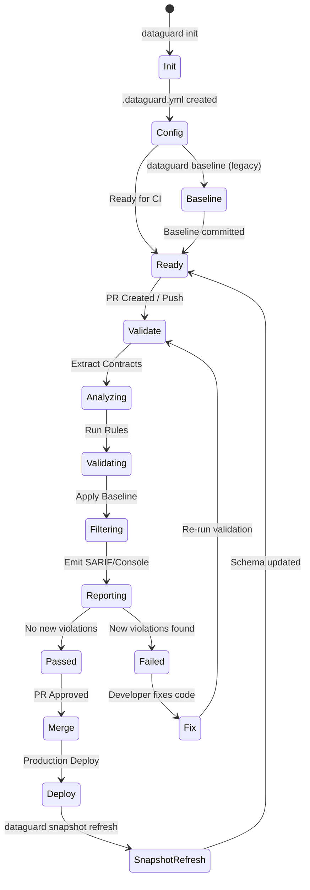
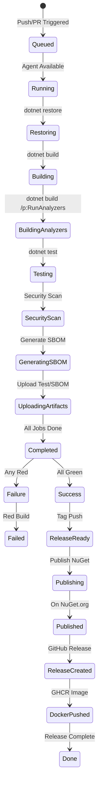
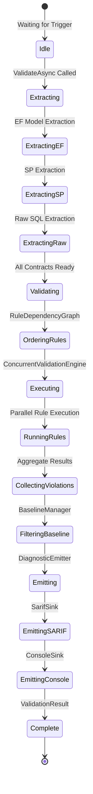
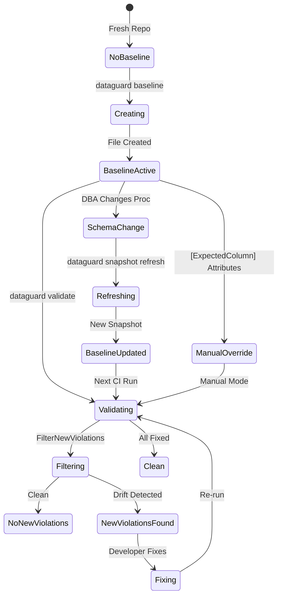
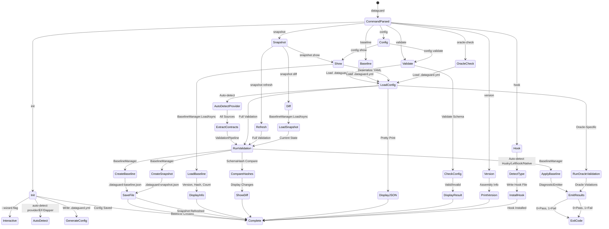
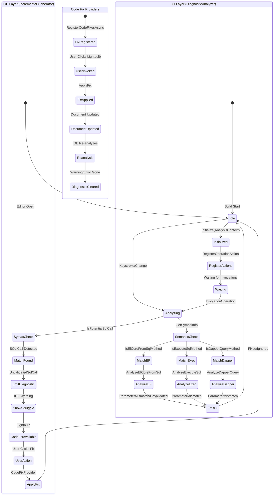
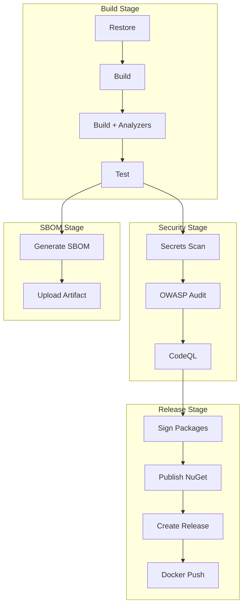
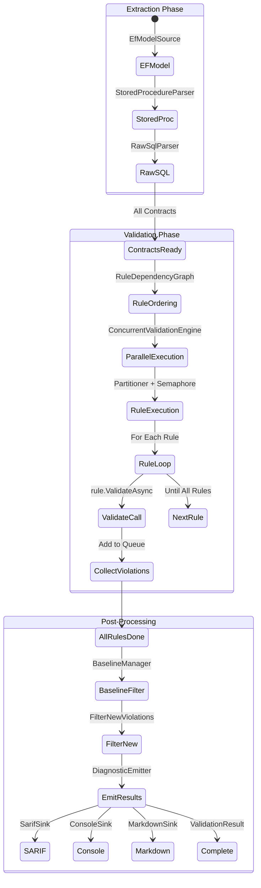
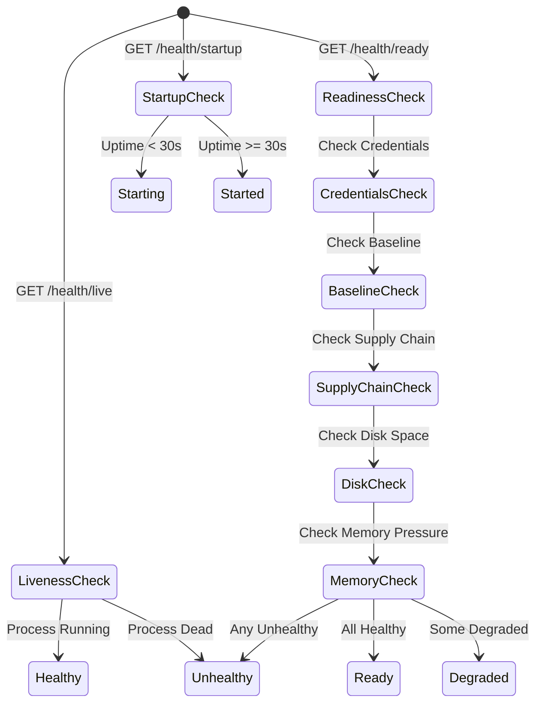

# Luồng Giai Đoạn & Trạng Thái / Stage & Status Flow / Luồng Giai Đoạn & Trạng Thái

## Tổng Quan Vòng Đời / Lifecycle Overview / Tổng Quan Vòng Đời

---

## Trạng Thái Pipeline CI / CI Pipeline States / Trạng Thái Pipeline CI

---

## Trạng Thái Xác Thực / Validation States / Trạng Thái Xác Thực

---

## Trạng Thái Baseline / Baseline States / Trạng Thái Baseline

---

## Trạng Thái CLI / CLI Command States / Trạng Thái CLI

---

## Trạng Thái Analyzer / Analyzer States (IDE vs CI)

---

## Trạng Thái CI/CD Pipeline / CI/CD Pipeline States

---

## Ma Trạng Thái / State Transition Matrix / Ma Trạng Thái

| Current State / Trạng Thái Hiện Tại | Trigger / Kích Hoạt | Next State / Trạng Thái Tiếp Theo | Condition / Điều Kiện |
|------|--------|---------|--------|
| Idle | Push/PR | Queued | GitHub Action Triggered |
| Queued | Agent Free | Running | Runner Available |
| Restoring | Restore Done | Building | `dotnet restore` success |
| Building | Build Done | BuildingAnalyzers | `dotnet build` success |
| BuildingAnalyzers | Analyzers Done | Testing | `dotnet build /p:RunAnalyzers` success |
| Testing | Tests Pass | SecurityScan | All Tests Pass |
| Testing | Tests Fail | Failed | Any Test Fail |
| SecurityScan | Scan Pass | GeneratingSBOM | No High/Critical |
| SecurityScan | Scan Fail | Failed | High/Critical Found |
| GeneratingSBOM | SBOM Done | UploadingArtifacts | SBOM Generated |
| UploadingArtifacts | Upload Done | Completed | Artifacts Uploaded |
| Completed | All Green | Success | All Jobs Green |
| Completed | Any Red | Failed | Any Job Red |
| Success | Tag Pushed | ReleaseReady | Git Tag `v*` |
| ReleaseReady | Publish Done | Published | NuGet Push Success |
| Published | Release Created | ReleaseCreated | GitHub Release Created |
| ReleaseCreated | Docker Push Done | DockerPushed | GHCR Push Success |
| DockerPushed | All Done | Done | All Release Steps Done |

---

## Trạng Thái Xác Thực Chi Tiết / Validation Sub-States

---

## Ma Trạng Thái Lệnh CLI / CLI Command State Matrix

| Command / Lệnh | Sub-Commands / Sub-lệnh | Flags / Cờ | Exit Codes / Mã Thoát |
|----------|----------------|---------|-------------|
| `validate` | - | `--connection`, `--config`, `--output`, `--format`, `--offline`, `--verbose`, `--provider`, `--schema`, `--package` | 0=Pass, 1=Fail |
| `baseline` | - | `--connection`, `--config`, `--output`, `--verbose`, `--provider`, `--schema`, `--package` | 0=Success, 1=Error |
| `snapshot` | `refresh`, `show`, `diff` | `--connection`, `--config`, `--verbose`, `--provider`, `--schema`, `--package` | 0=Success, 1=Error |
| `init` | - | `--output`, `--provider` | 0=Success, 1=Error |
| `config` | `show`, `validate` | `--config` | 0=Valid, 1=Invalid |
| `oracle-check` | - | `--connection`, `--config`, `--output`, `--format`, `--verbose`, `--schema`, `--package` | 0=Pass, 1=Fail |
| `version` | - | - | 0=Success |
| `hook` | `install`, `uninstall`, `status` | `--repo-root`, `--type`, `--force` | 0=Success, 1=Error |

---

## Trạng Thái Health Check / Health Check States

---

## Ma Trạng Thái Health Check / Health Check State Matrix

| Check / Kiểm Tra | Healthy / Khỏe | Degraded / Giảm Sức | Unhealthy / Bệnh | Unknown / Không Xác Định |
|--------|----------|----------------|-----------|----------------|
| Liveness / Sống | Process Running | - | Process Dead | - |
| Credentials / Thông Tin Đăng Nhập | Connection String Available | - | Missing/Invalid | Error Getting |
| Baseline / Cơ Sở | Loaded Successfully | File Missing | Corrupt/Unreadable | Error Reading |
| Supply Chain / Cung Ứng | All Checks Pass | 1+ Warnings | Any Failure | Error Running |
| Disk Space / Đĩa | > 10% Free | 5-10% Free | < 5% Free | Error Checking |
| Memory / Bộ Nhớ | < 500MB | 500MB - 1GB | > 1GB | Error Reading |
| Startup / Khởi Động | Uptime >= 30s | - | Uptime < 30s | - |

---

## Bảng Chuyển Trạng Thái CLI / CLI Command Transition Table

| Current Command / Lệnh Hiện Tại | Next Valid Commands / Lệnh Tiếp Theo Hợp Lệ | Notes / Ghi Chú |
|----------|----------------|--------|
| `init` | `validate`, `baseline`, `config show`, `hook install` | Creates `.dataguard.yml` |
| `validate` | `baseline`, `snapshot refresh`, `config show` | Requires config + connection |
| `baseline` | `validate`, `snapshot refresh`, `snapshot diff` | Creates/updates baseline file |
| `snapshot refresh` | `validate`, `snapshot diff`, `snapshot show` | Updates snapshot file |
| `snapshot show` | `snapshot diff`, `validate` | Read-only |
| `snapshot diff` | `snapshot refresh`, `validate` | Shows drift |
| `config show` | `config validate`, `validate` | Read-only |
| `config validate` | `validate`, `init` | Validates current config |
| `oracle-check` | `validate`, `snapshot refresh` | Oracle-specific rules |
| `hook install` | `validate`, `hook status` | Installs pre-commit hook |
| `hook uninstall` | `hook install`, `hook status` | Removes hooks |
| `hook status` | `hook install`, `hook uninstall` | Read-only status |

---

*Generated from DataGuard source code. Last updated: 2025-01-19*