# Kiến Trúc DataGuard / DataGuard Architecture

## Tổng Quan / Overview

DataGuard là **Roslyn Analyzer phân phối qua NuGet** để xác thực hợp đồng (contract validation) giữa Entity ↔ Stored Procedure/Raw SQL, phục vụ các .NET developer sử dụng EF Core/Dapper với Oracle và SQL Server.

**Triết lý cốt lõi**: "Tách IDE khỏi CI" - Phân tích cú pháp nhẹ trong IDE, diff-engine nặng trong CI pipeline.

---

## Kiến Trúc Cấp Cao / High-Level Architecture

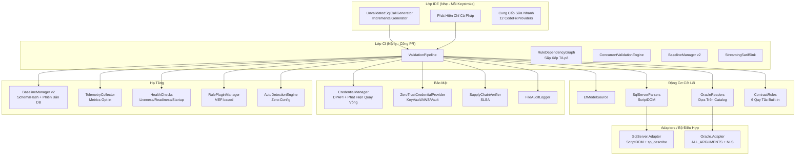

---

## Đồ Thị Phụ Thuộc Module / Module Dependency Graph

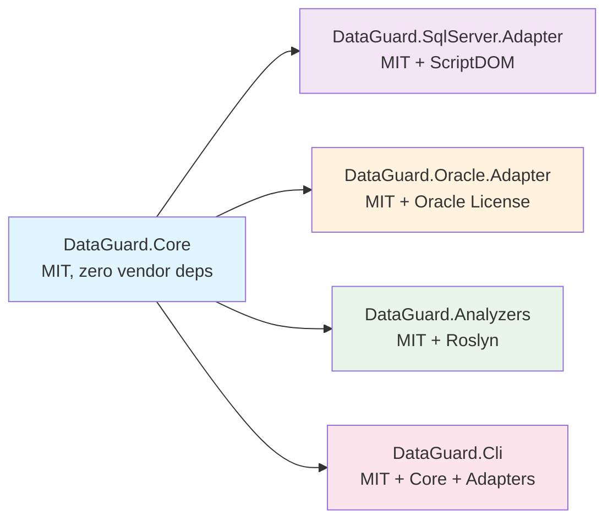

---

## Các Thành Phần Cốt Lõi / Core Components

### 1. Incremental Generator (Lớp IDE Nhẹ)

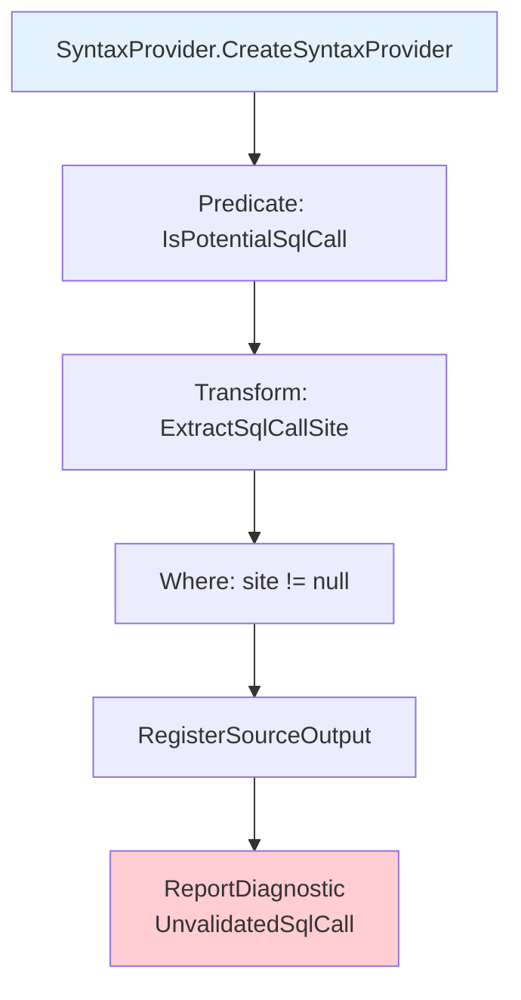

**Tối Ưu Hóa**:
- Predicate không cấp phát (static methods, ReadOnlySpan<char>)
- HashSet<string> tính trước cho tên phương thức
- SyntaxProvider đơn lẻ cho mọi loại gọi SQL
- Phát sinh trực tiếp (không tập trung trung gian)

### 2. Pipeline Xác Thực Hợp Đồng (Lớp CI Nặng)

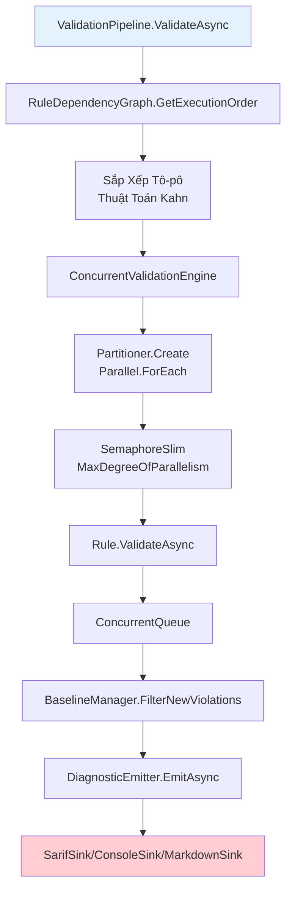

### 3. Đồ Thị Phụ Thuộc Quy Tắc / Rule Dependency Graph

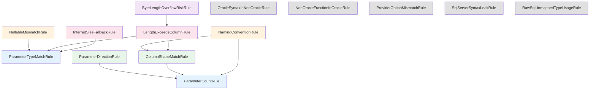

---

## Kiến Trúc Adapter Oracle / Oracle Adapter Architecture

```mermaid
graph TD
    A[AllArgumentsReader] --> B[ALL_ARGUMENTS<br/>SEQUENCE + OVERLOAD]
    C[AllTabColumnsReader] --> D[ALL_TAB_COLUMNS<br/>CHAR_USED B/C]
    E[NlsSessionReader] --> F[NLS_LENGTH_SEMANTICS<br/>Phiên Bản DB]
    G[RefCursorDescriber] --> H[DBMS_SQL.DESCRIBE_COLUMNS]
    I[LengthMismatchDetector] --> J[3 Loại Mismatch]
    J --> J1[Entity MaxLength > Column CharLength]
    J --> J2[Tràn Byte Semantics]
    J --> J3[Fallback NVARCHAR2(2000)<br/>#33218]

    style A fill:#fff3e0
    style C fill:#fff3e0
    style E fill:#fff3e0
    style G fill:#fff3e0
    style I fill:#ffcdd2
```

---

## Kiến Trúc Bảo Mật / Security Architecture

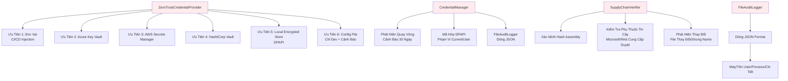

---

## Kiến Trúc Baseline v2 / Baseline v2 Architecture

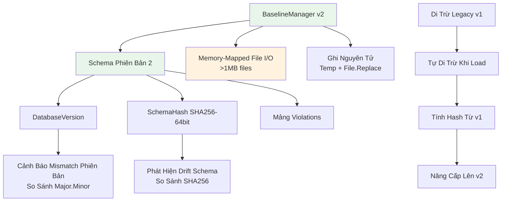

---

## Kiến Trúc SARIF Streaming / Streaming SARIF Architecture

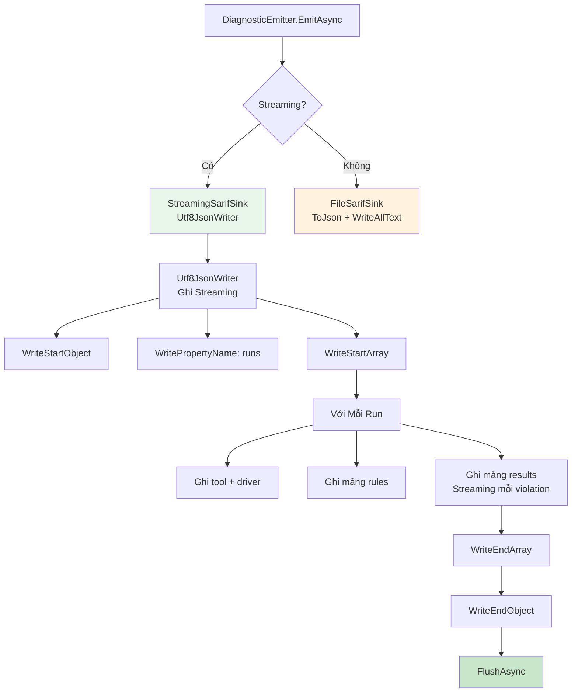

---

## Luồng Tự Động Phát Hiện / Auto-Detection Engine Flow

```mermaid
graph TD
    A[AutoDetectionEngine.DetectAsync] --> B[DetectProviderFromConfigAsync]
    B --> C[appsettings.json]
    B --> D[appsettings.Development.json]
    B --> E[.dataguard.yml]
    B --> F[DATAGUARD_PROVIDER env]

    A --> G[DetectEfCoreAsync]
    G --> G1[Quét *.csproj gói EF Core]
    G --> G2[Quét *.cs cho DbContext]

    A --> H[DetectDapperAsync]
    H --> H1[Quét *.csproj gói Dapper]
    H --> H2[Quét *.cs cho Query/Execute]

    A --> I[DetectConnectionStringAsync]
    I --> I1[Env: DATAGUARD_CONNECTION_STRING]
    I --> I2[appsettings.json ConnectionStrings]
    I --> I3[.dataguard.yml]

    A --> J[DetectNamingConventionAsync]
    J --> J1[Parse *.cs PropertyDeclarationSyntax]
    J --> J2[Đếm snake_case vs PascalCase]

    A --> K[DetectEfCoreContextAsync]
    K --> K1[Tìm DbContext class trong *.cs]

    style A fill:#e3f2fd
```

---

## Luồng Wizard Tương Tác / Interactive Wizard Flow

```mermaid
sequenceDiagram
    participant User
    participant Wizard as InteractiveConfigBuilder
    participant AutoDetect as AutoDetectionEngine
    participant Config as DataGuardConfiguration
    participant File as .dataguard.yml

    User->>Wizard: dotnet dataguard init --wizard
    Wizard->>User: 🔧 DataGuard Interactive Setup Wizard
    Wizard->>AutoDetect: DetectProviderInteractiveAsync
    AutoDetect->>Wizard: Detected: SQL Server
    Wizard->>User: Detected: SQL Server
    Wizard->>User: 🔗 Enter connection string
    User->>Wizard: Server=...;Database=...;
    Wizard->>AutoDetect: DetectEfCoreAsync + DetectDapperAsync
    AutoDetect->>Wizard: EF Core: ✅, Dapper: ❌
    Wizard->>User: EF Core: ✅, Dapper: ❌
    Wizard->>User: 📝 Naming convention choice
    User->>Wizard: 1 (snake_case ↔ PascalCase)
    Wizard->>User: 📋 Baseline mode choice
    User->>Wizard: 1 (Snapshot - recommended)
    Wizard->>Config: Generate config
    Config->>File: Save .dataguard.yml
    Wizard->>User: ✅ Saved to .dataguard.yml
    Wizard->>User: Next: dataguard baseline → dataguard validate
```

---

## Cài Đặt Pre-Commit Hook

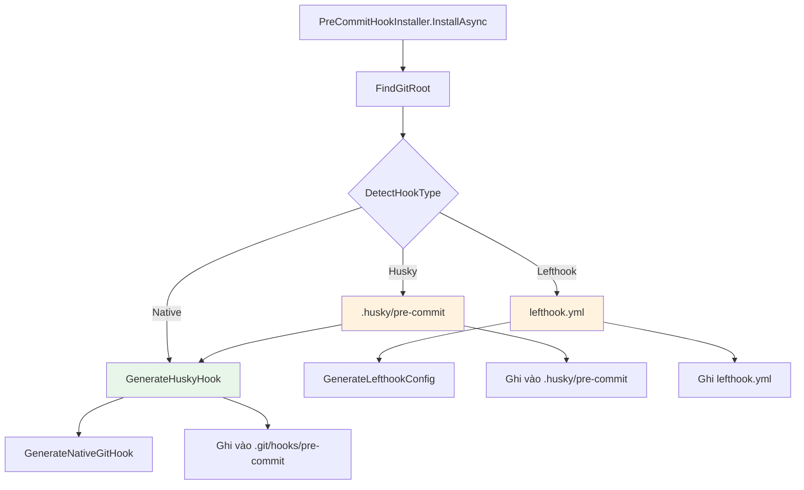

**Nội Dung Hook Sinh Ra**:
```bash
#!/bin/sh
# DataGuard pre-commit hook
echo "🔍 Running DataGuard pre-commit validation..."

if command -v dataguard &> /dev/null; then
    dataguard validate --offline --format text
    exit_code=$?
    
    if [ $exit_code -ne 0 ]; then
        echo "❌ DataGuard validation failed. Fix issues before committing."
        exit 1
    fi
    echo "✅ DataGuard validation passed."
else
    echo "⚠ DataGuard CLI not found. Skipping validation."
fi
exit 0
```

---

## Endpoint Health Check

```mermaid
graph TD
    A[DataGuardHealthCheck] --> B[/health/live<br/>Liveness]
    A --> C[/health/ready<br/>Readiness]
    A --> D[/health/startup<br/>Startup]

    B --> B1[Process Alive<br/>Uptime > 0]
    C --> C1[Credentials Available]
    C --> C2[Baseline Loadable]
    C --> C3[Supply Chain OK]
    C --> C4[Disk Space > 10%]
    C --> C5[Memory < 1GB]
    D --> D1[Startup > 30s or Ready]

    style A fill:#e3f2fd
```

---

## Kiến Trúc Plugin / Plugin Architecture

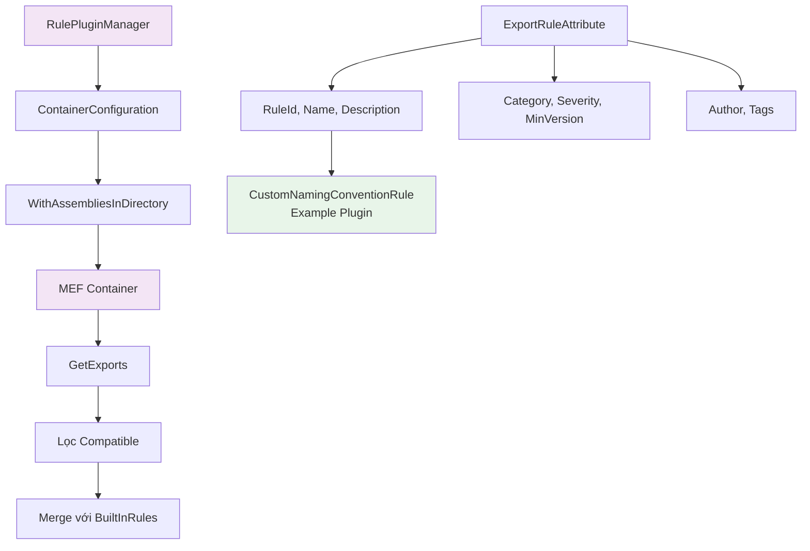

---

## Tóm Tắt Luồng Dữ Liệu / Data Flow Summary

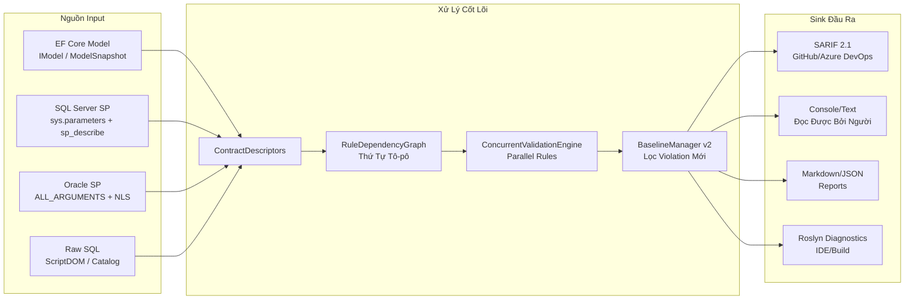

---

## Ngăn Xếp Công Nghệ / Technology Stack

| Layer / Lớp | Technology / Công Nghệ | Version / Phiên Bản |
|-------|------------|---------|
| Runtime | .NET | 9.0 |
| Analyzers | Roslyn | 4.11.0 |
| SQL Server Parser | ScriptDOM | 170.3.0 |
| Oracle Driver | Oracle.ManagedDataAccess.Core | 23.6.0 |
| SQL Client | Microsoft.Data.SqlClient | 5.2.0 |
| EF Core | Microsoft.EntityFrameworkCore | 8.0.0 |
| JSON | System.Text.Json | 8.0.5 |
| MEF | System.Composition.Hosting | 8.0.0 |
| Telemetry | System.Diagnostics.Metrics | Built-in |
| Health Checks | Microsoft.Extensions.Diagnostics.HealthChecks | Built-in |
| Logging | Microsoft.Extensions.Logging | Built-in |

---

## Mục Triển Khai / Deployment Targets

| Target / Mục Tiêu | Method / Phương Pháp | Artifacts / Sản Phẩm |
|--------|-----------|---------|
| NuGet.org | `dotnet nuget push` | 5 packages (Core, SqlServer, Oracle, Analyzers, Cli) |
| Docker | `docker build` | `ghcr.io/org/dataguard:tag` |
| dotnet tool | `dotnet tool install -g` | DataGuard.Cli nupkg |
| GitHub Actions | CI/CD Pipeline | Signed packages + SBOM + Attestations |

---

## Ma Trận License / License Matrix

| Package / Gói | License / Giấy Phép | Vendor Deps / Phụ Thuộc Vendor |
|---------|---------|-------------|
| DataGuard.Core | MIT | None |
| DataGuard.SqlServer.Adapter | MIT | ScriptDOM (MIT) |
| DataGuard.Oracle.Adapter | MIT + Oracle License | Oracle.ManagedDataAccess.Core |
| DataGuard.Analyzers | MIT | Roslyn (MIT) |
| DataGuard.Cli | MIT | Core + Adapters |

---

## Chiến Lược Versioning / Versioning Strategy

```
MAJOR.MINOR.PATCH
│    │    └─ Sửa lỗi, không thay đổi API
│    └───── Tính năng mới, tương thích ngược
└────────── Thay đổi phá vỡ (breaking changes)
```

Hiện Tại: **1.0.0** (Phiên bản ổn định đầu tiên)

---

*Được tạo từ mã nguồn DataGuard. Cập nhật lần cuối: 2025-01-19*